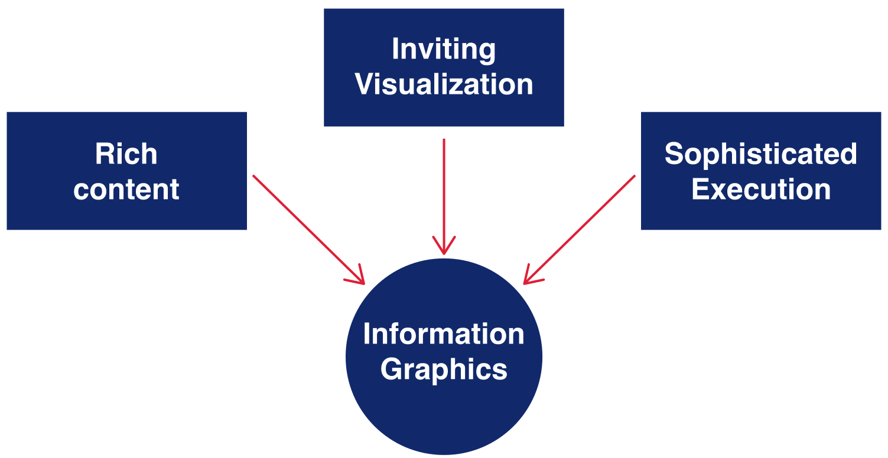
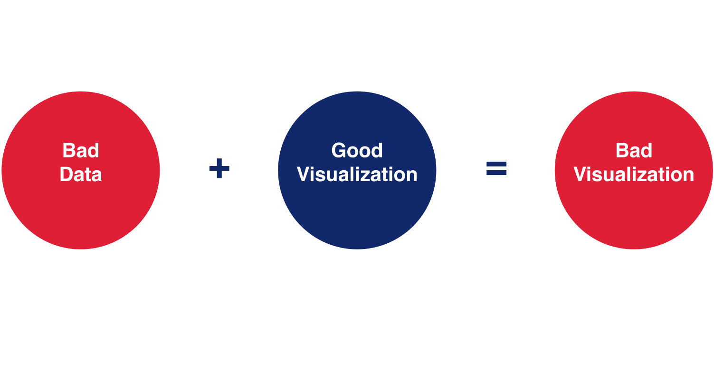
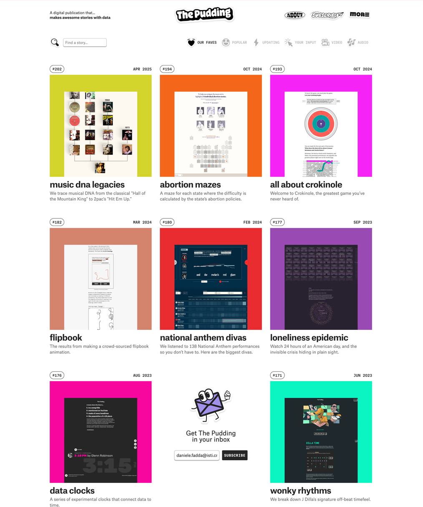

<!-- _class: cover -->
<!-- _paginate: skip -->

  <h1>1 •  Introduction</h1>
  <h2>Data Visualization and Visual Analytics</h2>
  <!-- 
A subtitle
 -->

  

    
teacher

    
Salvatore Rinzivillo

    
Daniele Fadda

     
    
tutor

    
Eleonora Cappuccio

  

  

    <strong>University of Pisa</strong> 
    Department of Computer Science 
    Course: Data Visualization & Visual Analytics 
    Academic Year: 2025    
  

---

<!-- _class: all-image -->

<!-- 
An image is worth a thousand words. This cat paw print in the snow tells us that a cat went outside during the night when it was cold, then decided to come back inside. Without words, we understand the whole story just from this visual information.
We aim to achieve this clarity with our data visualizations - communicating complex information at a glance.
-->

<h1>AN IMAGE IS WORTH A 1000 WORDS</h1>

---

<!-- _footer: '' -->
<!-- _class: big-text -->

# DATA VISUALIZATION

## Convey Information through graphical representation of data 

<!-- 
Data visualization is about conveying information through graphical representation of data.
It's a form of visual communication that bridges the gap between raw data and human understanding.
We are mapping information from the data space to the visual space, which inherently involves some compression and potential loss of information.
-->

---

<!-- _class: big-text -->

<!-- 
Data is everywhere but often overwhelming. There's no value in raw data until we extract insights.
Having too much information consumes our attention, creating attention poverty.
Information overload occurs when data is irrelevant, improperly processed, or poorly presented.
The visualization challenge is to allocate attention efficiently among abundant information sources.
-->

# MOTIVATIONS

- Data everywhere
- No value for raw data
  - Need to extract valuable information
  - Get access to complex phenomena
  - Make complexity understandable and usable
- **Information overload:**
  - Irrelevant for current task
  - Processed in an inappropriate way
  - Presented in an inappropriate way

---

<!-- 
Herb Simon's quote perfectly captures the challenge of modern information management.
Information consumes attention, and with so much information available, we have a scarcity of attention.
The key challenge is allocating attention efficiently among abundant information sources.
-->

<!-- _class: big-text -->

# DATA EVERYWHERE

"What information consumes is rather obvious: it consumes the **attention** of its recipients. Hence a wealth of information creates a poverty attention, and a **need to allocate that attention efficiently** among the overaboundance of information sources that might consume it"

-- Herb Simon 

---

<!-- 
Visualization serves multiple purposes:
1. Recording information (like sketches or ECGs)
2. Analyzing data for exploration - creating and verifying hypotheses, identifying patterns and outliers
3. Communicating findings to share insights or persuade audiences
Each purpose requires different design considerations.
-->

# VISUALIZATION GOAL

- Record Information
  - Sketches, photographs, ECG,...
- Analyze data to support decisions (**exploration**)
  - Create and verify hypotheses
  - Identify Patterns
  - Identify Outliers
- Communicate (**explanation**)
  - Share or highlight insights on data
  - Persuade 

---

<!-- 
Historical example of recording information through visualization.
Early astronomers used tables and diagrams to record celestial observations.
These records helped scientists track patterns over time and build understanding.
-->

# RECORD INFORMATION

---

<!-- 
Anscombe's quartet is a classic example showing why visualization is crucial for data analysis.
Four datasets have nearly identical statistical properties (mean, variance, correlation, etc.)
Looking only at statistics would suggest they're essentially the same datasets.
-->

<h1>ANALYZE: ANSCOMBE'S QUARTET <mark>DATASETS</mark></h1>

  

  **Data Set A**

  | X    | Y    |
  |------|------|
  | 10.0 | 8.04 |
  | 8.0  | 6.95 |
  | 13.0 | 7.58 |
  | 9.0  | 8.81 |
  | 11.0 | 8.33 |
  | 14.0 | 9.96 |
  | 6.0  | 7.24 |
  | 4.0  | 4.26 |
  | 12.0 | 10.84|
  | 7.0  | 4.82 |
  | 5.0  | 5.68 |

  

  

  **Data Set B**

  | X    | Y    |
  |------|------|
  | 10.0 | 9.14 |
  | 8.0  | 8.14 |
  | 13.0 | 8.74 |
  | 9.0  | 8.77 |
  | 11.0 | 9.26 |
  | 14.0 | 8.10 |
  | 6.0  | 6.13 |
  | 4.0  | 3.10 |
  | 12.0 | 9.13 |
  | 7.0  | 7.26 |
  | 5.0  | 4.74 |

  

  

  **Data Set C**

  | X    | Y     |
  |------|-------|
  | 10.0 | 7.46  |
  | 8.0  | 6.77  |
  | 13.0 | 12.74 |
  | 9.0  | 7.11  |
  | 11.0 | 7.81  |
  | 14.0 | 8.84  |
  | 6.0  | 6.08  |
  | 4.0  | 5.39  |
  | 12.0 | 8.15  |
  | 7.0  | 6.42  |
  | 5.0  | 5.73  |

  

  

  **Data Set D**

  | X    | Y     |
  |------|-------|
  | 8.0  | 6.58  |
  | 8.0  | 5.76  |
  | 8.0  | 7.71  |
  | 8.0  | 8.84  |
  | 8.0  | 8.47  |
  | 8.0  | 7.04  |
  | 8.0  | 5.25  |
  | 19.0 | 12.50 |
  | 8.0  | 5.56  |
  | 8.0  | 7.91  |
  | 8.0  | 6.89  |

  

---

<!-- 
These four datasets share identical statistical properties:
- Same mean of x (9) and y (7.5)
- Same variance of x (11) and y (4.12)
- Same correlation between x and y (0.816)
- Same linear regression line (y = 3.00 + 0.500x)
But as we'll see, they're fundamentally different when visualized.
-->

<h1>ANALYZE: ANSCOMBE'S QUARTET <mark>PROPERTIES</mark></h1>

 

| Property | Value |
|----------|-------|
| **Mean** of x in each case | 9 (exact) |
| Sample **variance** of x in each case | 11 (exact) |
| Mean of y in each case | 7.50 (to 2 decimal places) |
| Sample variance of y in each case | 4.122 or 4.127 (to 3 decimal places) |
| **Correlation** between x and y in each case | 0.816 (to 3 decimal places) |
| **Linear regression** line in each case | y = 3.00 + 0.500x (to 2 and 3 decimal places, respectively) |

---

<!-- 
When visualized, the four datasets reveal completely different patterns:
1. First dataset shows a typical linear relationship
2. Second dataset shows a clear non-linear (quadratic) relationship
3. Third dataset shows a perfect linear relationship with one outlier
4. Fourth dataset shows a vertical line with one outlier determining the regression line
This demonstrates why visual analysis is essential alongside statistical analysis.
-->

<h1>ANALYZE: ANSCOMBE'S QUARTET <mark>GRAPHICS</mark></h1>

---

<!-- _paginate: hide -->
<!-- footer: '' -->

# COMMUNICATE: HIERARCHICAL STRUCTURES

http://www.stefanieposavec.co.uk/entangled-word-bank/

https://atlas.cid.harvard.edu/

<!-- 
Hierarchical data structures present unique visualization challenges.
Left: A tree visualization showing Darwin's Origin of Species book structure, showing how paragraphs were added/removed across editions.
Right: A treemap showing US exports in 2011, using nested rectangles to represent hierarchical data.
Both represent parent-child relationships, but in very different ways.
-->

---

<!-- _paginate: hide -->

# COMMUNICATE: NETWORKS

https://www.flickr.com/photos/blprnt/sets/72157614008027965

https://atlas.cid.harvard.edu/

<!-- 
Network visualizations show relationships between entities.
Left: A network visualization showing connections between entities without clear hierarchy.
Right: The Product Space visualization from Harvard's Atlas of Economic Complexity showing relationships between products.
Network visualizations often face challenges with visual clutter (spaghetti effect) when there are many connections.
-->

---
<!-- _paginate: hide -->

# COMMUNICATE: TEMPORAL STRUCTURES

Cubism And Abstract Art (Alfred H. Barr 1936)

http://www.nytimes.com/interactive/2012/10/15/us/politics/swing-history.html

<!-- 
Temporal structures show changes over time.
Left: Alfred Barr's famous diagram of Cubism and abstract art showing evolution of art movements.
Right: NY Times visualization showing how US states shifted political alignment over decades.
Temporal visualizations help reveal patterns of change, evolution, and trends that might be invisible in static data.
-->

---

<!-- _paginate: hide -->

# COMMUNICATE: MAPS

https://www.flickr.com/photos/walkingsf/sets/72157624209158632/

"ElectoralCollege2008" by Gage - Own work. Licensed under Public Domain via Wikimedia Commons

<!-- 
Maps are powerful for visualizing spatial data.
Left: Eric Fischer's visualization of locals vs. tourists in San Francisco (blue dots for locals, red for tourists)
Right: 2008 US Electoral College map showing election results.
Maps provide an intuitive spatial framework that people already understand, serving as a shortcut for data design.
-->

---

# COMMUNICATE: SPATIO-TEMPORAL DATA

"Minard" by Charles Minard (1781-1870) - Licensed under Public Domain via Wikimedia Commons

Visual Analytics of Movement.
G. Andrienko, N. Andrienko, P. Bak, D. Keim, S. Wrobel
Springer, 2013

<!-- 
Visualizing spatio-temporal data combines both space and time dimensions.
Left: Minard's famous visualization of Napoleon's Russian campaign showing army size, direction, temperature, and geography.
Right: Modern visualization of movement patterns in a city.
These visualizations effectively show how things move or change across both space and time, revealing patterns that wouldn't be visible otherwise.
-->

---

# COMMUNICATE: TEXT

http://benfry.com/writing/archives/529

<!-- 
Text data can also be visualized in meaningful ways.
Left: Visualization of edits to Darwin's Origin of Species across editions, showing which parts remained stable vs. changed.
Right: Word cloud showing frequency of music-related terms (though word clouds have limitations for serious analysis).
Text visualizations help reveal patterns in large text corpora that would be difficult to see through reading alone.
-->

---

# VISUAL ANALYTICAL PROCESS

<!-- 
The visual analytical process connects data, models, and visualization to produce knowledge.
The left side (exploration) involves transforming data, building models, refining parameters, and visualizing both data and models.
The right side (explanation) focuses on communicating findings to others.
This process is cyclical and interactive, with user interaction at multiple points.
-->

---

<!-- 
Good visualization combines three key elements:
1. Rich content - substantive, meaningful data and insights
2. Inviting visualization - approachable design that draws viewers in
3. Sophisticated execution - technical excellence and attention to detail
All three must work together to create effective information graphics.
-->

# ELEMENTS OF GOOD VISUALIZATION

---

<!-- 
The quality of data is foundational to good visualization.
No matter how well-designed a visualization is, if the underlying data is flawed, the result will be misleading.
Bad data + good visualization = bad visualization
This is the visual equivalent of "garbage in, garbage out" in computing.
-->

# IMPORTANCE OF VALID DATA

---

<!-- 
These recommended textbooks can help deepen your understanding of data visualization.
"Design for Information" by Isabel Meirelles provides accessible examples and techniques.
"Visual Analytics for Data Scientists" by Andrienko et al. offers more technical and structured approach.
These resources help build both theoretical understanding and practical skills.
-->

# TEXTBOOKS

**Design for Information**
Isabel Meirelles

**Visual Analytics for Data Scientists**
Andrienko et al.

---

<!-- 
Additional reading recommendations:
"Information Visualization" by Colin Ware focuses on perception and cognitive aspects.
"The Visual Display of Quantitative Information" by Edward Tufte is a classic work on visualization principles.
These books delve deeper into the theories and principles that make visualizations effective.
-->

# INTERESTING READINGS

**Information Visualization**
Colin Ware

**The Visual Display of Quantitative Information**
Edward R. Tufte

---

<!-- 
Online resources can provide inspiration and examples of effective visualizations:
- datavisualization.ch
- informationisbeautiful.net
- infosthetics.com
Studying how others solve design problems is valuable for developing your own visualization skills.
Like learning to ride a bicycle, visualization requires both theoretical knowledge and hands-on practice.
-->

# OTHER RESOURCES

**Observe how others resolved design problems**

[thepudding.com](https://pudding.cool/)

[informationisbeautiful.net](https://informationisbeautiful.net/)

[infosthetics.com](https://nightingaledvs.com/)

---

<!-- _class: all-image -->
<!-- _paginate: skip -->

# EXAMPLE: INTERACTIVE VISUALIZATION

## [NYC School Districts](https://web.archive.org/web/20220308001913/http://itisaasta.com/nycs/) 

<!-- 
Interactive visualizations add another dimension to data exploration.
The New York City Schools visualization combines multiple view types:
- Parallel coordinates plot for comparing schools across metrics
- Geographic map for location context
- Bullet charts for comparing against distribution
Interaction allows filtering, selection, and linking between these views.
-->

---

<!-- _class: all-image -->
<!-- _paginate: skip -->

<!-- 
Another excellent interactive visualization example:
The Boston MBTA transit visualization combines:
- Animated system diagram showing trains moving in real-time
- Marey diagram showing train schedules and delays
- Multiple linked views showing different aspects of the system
This demonstrates how temporal data can be visualized effectively through multiple coordinated perspectives.
-->

# BOSTON SUBWAY SYSTEM

## [Boston MBTA](https://mbtaviz.github.io/)

http://mbtaviz.github.io/

---

# DAL WEB AL CARRELLO

https://masterbigdata.it/project-files/2018-2019/coop/index.html

---

# TECNOFILI O TECNOFOBI?

https://masterbigdata.it/project-files/2018-2019/coop/index.html
