<!-- _class: cover -->
<!-- _paginate: hide -->

  <h1>2 •  Vision and Perception</h1>
  <h2>Data Visualization and Visual Analytics</h2>
  <!-- 
A subtitle
 -->

  

    
teacher

    
Salvatore Rinzivillo

    
Daniele Fadda

     
    
tutor

    
Eleonora Cappuccio

  

  

    <strong>University of Pisa</strong> 
    Department of Computer Science 
    Course: Data Visualization & Visual Analytics 
    Academic Year: 2025    
  

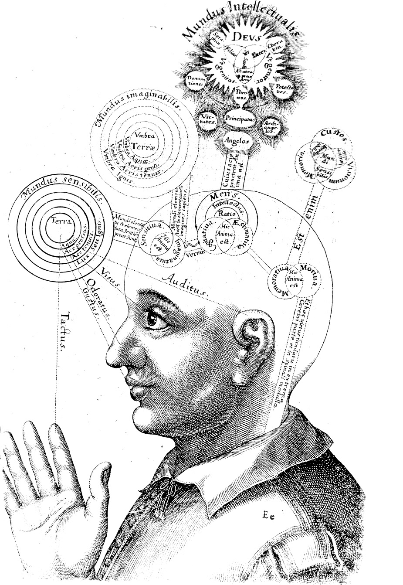

---

<!-- 
The human sensory system is heavily dominated by vision. About 70% of our sensory receptors are located in our eyes, and approximately 50% of our brain's cortex is devoted to processing visual information.
This highlights why visual representations of data are so powerful - we're naturally equipped to process visual information.
-->

# VISUAL DOMINANCE

**70% of human sensors are located in the eyes**

**50% of brain processes are devoted to image processing**

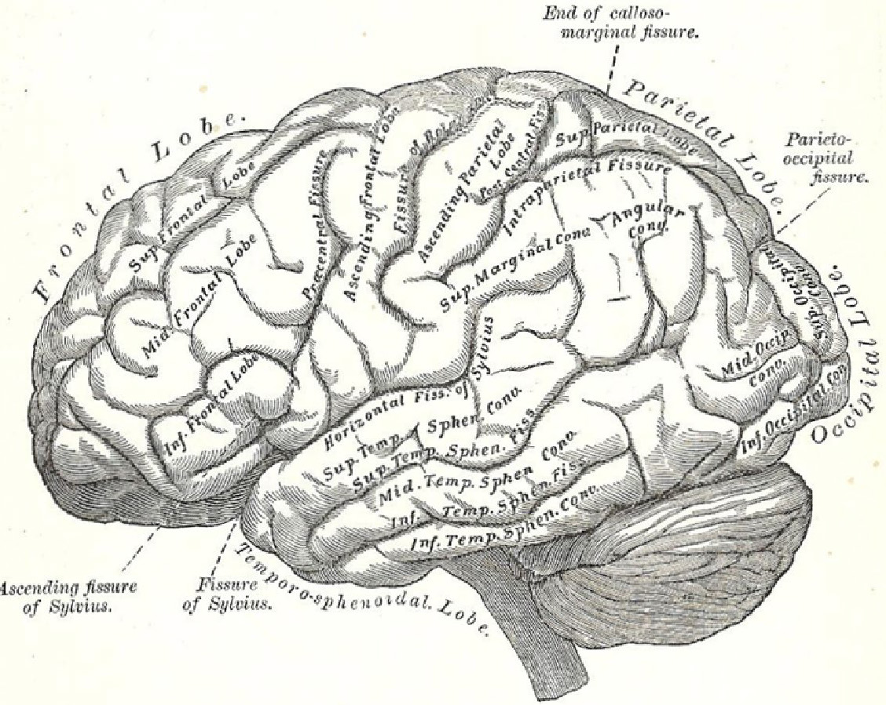

---

<!-- 
The human eye is a complex organ with multiple parts that work together to process visual information.
The key part for our discussion is the retina, which contains photoreceptors that convert light into neural signals.
Only a small area called the fovea provides high-resolution color vision - this has important implications for visualization design.
-->

# HUMAN EYE

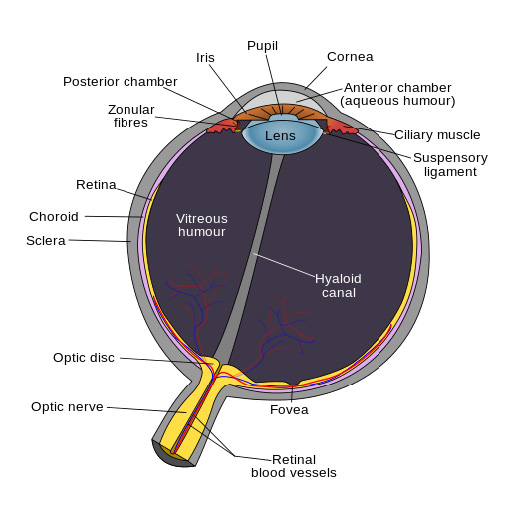

---

<!-- 
There are two main types of photoreceptor cells in the retina:
1. Rod cells (about 120 million) handle peripheral and low-light vision, but not color
2. Cone cells (only about 6 million) provide color vision and are concentrated in the fovea
This uneven distribution means we only see high resolution and color in a small part of our visual field.
-->

# PHOTO RECEPTOR CELLS

- Two types of light sensitive cells
  - Rod Cells (~120M)
    - Provide low-light vision
    - Peripheral vision
    - Almost no role in color vision
  - Cone cells (~6M)
    - Provide normal vision
    - Three sub-types of cells
    - Sensitivity to different light wavelengths
    - Used for colored vision

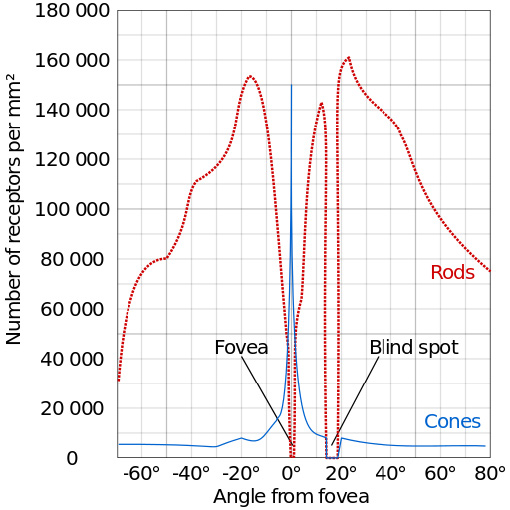

---

<!-- paginate: false -->
<!-- 
Our visual resolution is not uniform across our field of vision. This XKCD comic illustrates how our visual field works:
- High resolution vision only in the center (fovea)
- The rest is lower resolution and primarily for detecting motion and changes
- Our brain combines these inputs to create the illusion of seeing everything in high detail
We're constantly moving our eyes to build a mental model of what we're seeing.
-->

# VISION RESOLUTION

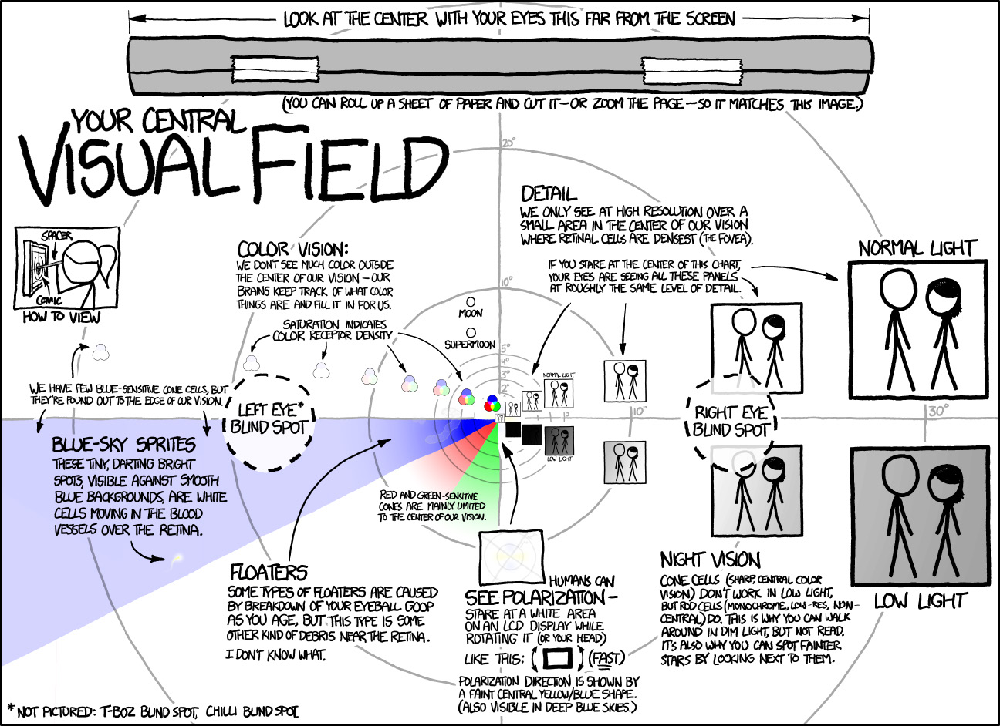

http://xkcd.com/1080/

---

<!-- paginate: true -->

<!-- 
The high-resolution area of our vision is limited to about 1-2 degrees at the center of our gaze, with reasonable detail extending to about 15 degrees.
Different visual tasks require different viewing angles:
- Text reading: 5-10 degrees
- Shape recognition: 5-30 degrees
- Color discrimination: 30-60 degrees
We need to move our eyes to "scan" a scene in order to see it in detail, and this scanning is not linear or regular.
-->

# VISION RESOLUTION

- Fovea yields the highest resolution (normal light)
- Fovea occupies around 15° of visual field
- Highest resolution is provided by fovea centralis (around 1°)

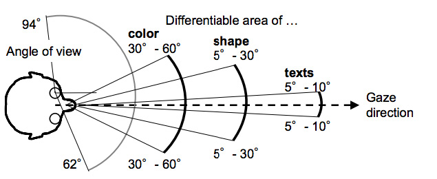

---

<!-- 
This is different from a camera, which captures everything in its field of view at the same resolution.
Our visual system is actively scanning and processing, combining high-resolution snapshots from the fovea with peripheral information.
The brain fills in details and creates a coherent whole from these inputs - this is perception, which is different from just vision (capturing light).
-->

# PERCEPTION AND COGNITION

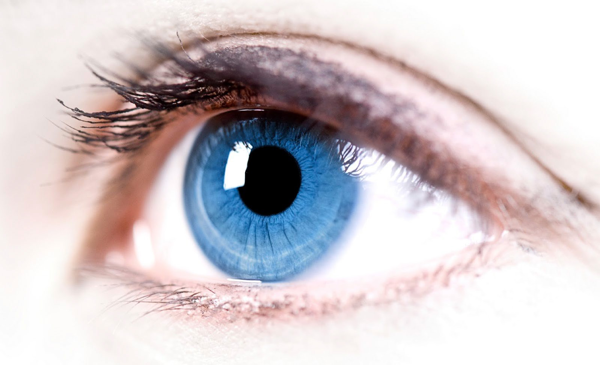

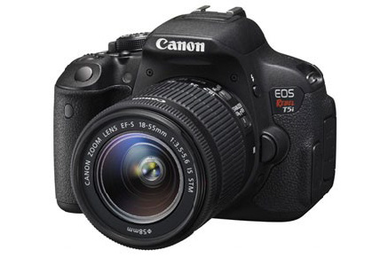

---

<!-- _class: all-image-right -->

# WHERE IS WALDO?

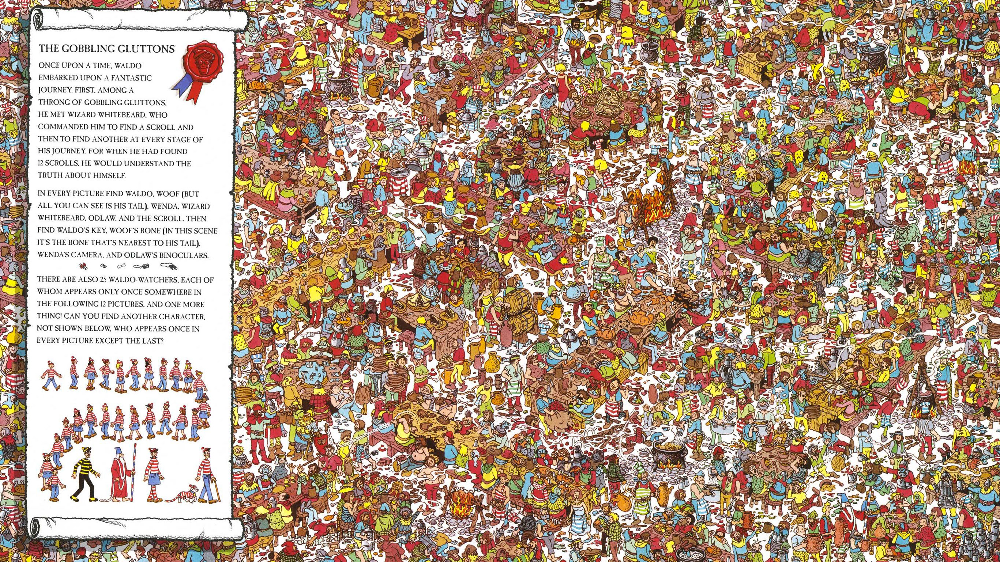

<!-- 
This "Where's Waldo?" image illustrates the limitations of our visual system.
With this cluttered scene, we're forced to use serial scanning (looking at each part of the image sequentially) to find Waldo.
We can't use parallel processing because there's too much competing visual information and Waldo doesn't have distinctive enough features to "pop out" from the background.
This is why it's important to design visualizations that highlight key information.
-->

---

<!-- paginate: false -->

<!-- 
When we look at a complex scene, we don't see it all at once. Our eyes move to focus the fovea on different parts sequentially.
This image shows eye tracking data - the circles show where the person's gaze fixed, and the numbers show the sequence.
These movements (called saccades) are not random - they're guided by what catches our attention and what we're looking for.
For visualization, this means we need to guide the viewer's eye to the most important information first.
-->

# HIGH RESOLUTION VISION

- HiRes vision is limited to a narrow angle of field vision
- Eyes move to scan an object in order to expose the image on the fovea
- The movement of eyes is not regular or linear

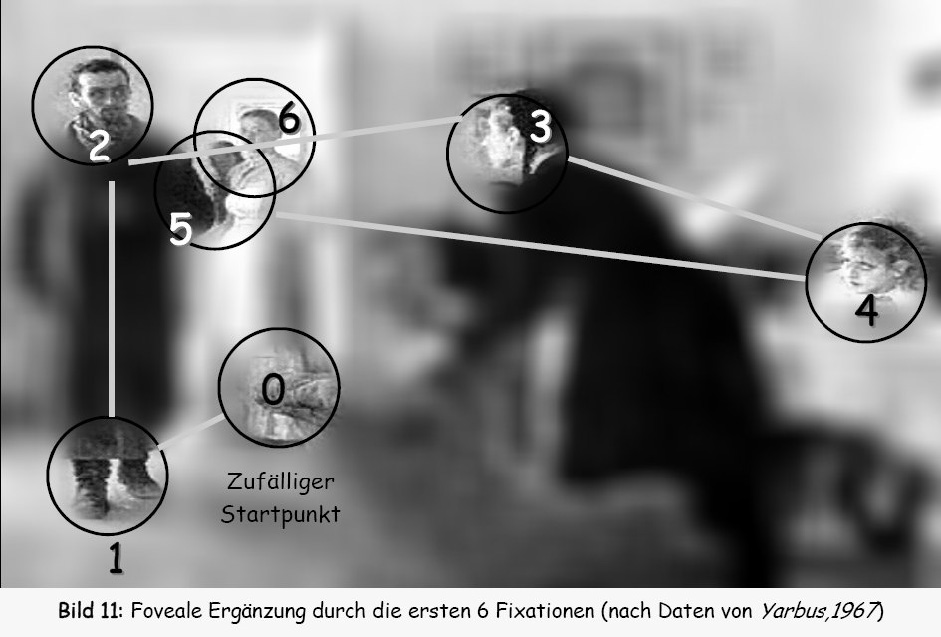

---

<!-- paginate: true -->
<!-- 
Eye tracking is used in design to understand how people view and interact with visual content.
This example shows a heatmap of where people looked when viewing an advertisement.
Areas with more attention (red/yellow) indicate where viewers focused most.
This information helps designers place important elements where they're most likely to be seen.
-->

# EYE TRACKING FOR DESIGN

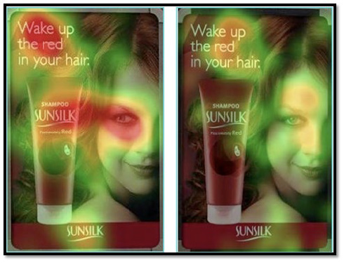

---

<!-- 
Humans are naturally very good at detecting patterns. We've evolved to recognize patterns because it helped us survive.
This is why graphs and charts are powerful - they convert abstract data into patterns that our visual system can quickly process.
Early astronomical records, like this example, used basic data visualization to track celestial patterns over time.
-->

# PATTERNS, PATTERNS EVERYWHERE

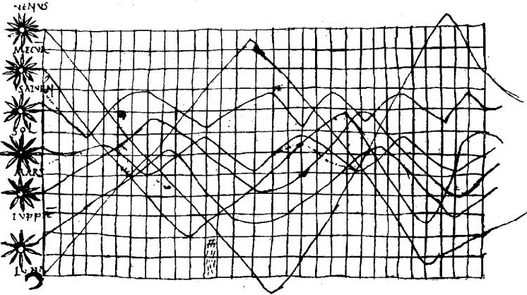

---

<!-- 
Here's a simple visual task to demonstrate how our different processing modes work.
Finding the number "3" in this string requires sequential scanning - a slow, effortful process.
This is similar to trying to find specific data points in a table of numbers.
The first row shows the original task, while the second shows how highlighting (using color) makes the task much easier.
-->

# TEST- HOW MANY 3S?

<pre class="table-numbers" >
1258965168765132168943213
5463479654321320354968413
2068798417184529529287149
2174953178195293926546831
3546516509898554684982984
</pre>

---

<!-- 
Here's a simple visual task to demonstrate how our different processing modes work.
Finding the number "3" in this string requires sequential scanning - a slow, effortful process.
This is similar to trying to find specific data points in a table of numbers.
The first row shows the original task, while the second shows how highlighting (using color) makes the task much easier.
-->

# TEST- HOW MANY 3S?

<pre class="table-numbers" >
1258965168765132168943213
5463479654321320354968413
2068798417184529529287149
2174953178195293926546831
3546516509898554684982984
</pre>

<pre class="table-numbers">
12589651687651<strong>3</strong>216894<strong>3</strong>21<strong>3</strong>
546<strong>3</strong>479654<strong>3</strong>21<strong>3</strong>2035496841<strong>3</strong>
2068798417184529529287149
217495<strong>3</strong>17819529<strong>3</strong>9265468<strong>3</strong>1
<strong>3</strong>546516509898554684982984
</pre>

---

<!-- 
Visual perception happens in stages, moving from automatic parallel processing to more effortful sequential analysis:
Stage 1: Rapid parallel processing of basic features (color, movement, basic shapes)
Stage 2: Serial processing to identify patterns and structures
Stage 3: Sequential, conscious interpretation of visual information
The first stage happens pre-attentively - before we consciously focus. Good visualizations leverage this to make key patterns immediately obvious.
-->

# VISUAL PERCEPTION

- Early visual processing takes places without our conscious intervention
- Graphs that convey information at this level allow the observer to be more efficient in decoding

 
 

**Stage 1 →**
Rapid parallel processing to extract basic features

**Stage 2 →**
Slow serial processing to extract patterns and structures

**Stage 3**
Sequential scan to perform task-oriented interpretation of visual information

---

<!-- 
At the second stage of visual perception, we begin to consciously analyze what we're seeing.
This is where we make comparisons and judgments - "this bar is taller than that one," "this line is trending upward."
This processing requires more mental effort than stage 1, but is still more efficient than reading tables of numbers.
Good visualizations make these comparisons easy and intuitive.
-->

# VISUAL COGNITION

- At second stage, the observer is required to consciously analyze the image/scene
- At this level, the observer can perform higher level reasoning
  - This object is larger than the other one
  - This street slope is lower than the previous

---

<!-- 
Let's look at a practical example. This table shows cholesterol levels across different demographic groups.
Looking at the raw numbers, it's difficult to spot patterns or trends.
The task is to understand the relationships between gender, age, income level, and cholesterol levels.
Try to identify any patterns before we move to the next slide.
-->

# TEST - CHOLESTEROL, AGE, AND GENDER

Which relation between gender or income level groups?

| | Males | | Females | |
|------------|---------|----------|---------|----------|
| **Income Group** | **Under 65** | **65 and Over** | **Under 65** | **65 and Over** |
| 0 – 24,999$ | 250 | 200 | 375 | 550 |
| 25,000$ + | 430 | 300 | 700 | 500 |

---

<!-- 
Here's the same data visualized as a bar chart.
With the visual representation, it becomes easier to see patterns:
- Females generally have higher cholesterol levels than males
- Higher income is associated with higher cholesterol for younger people
- For older people, lower income females have the highest cholesterol
However, this visualization still requires comparing multiple bars, which is a Stage 2 process.
-->

# GAME - VISUAL SOLUTION (1)

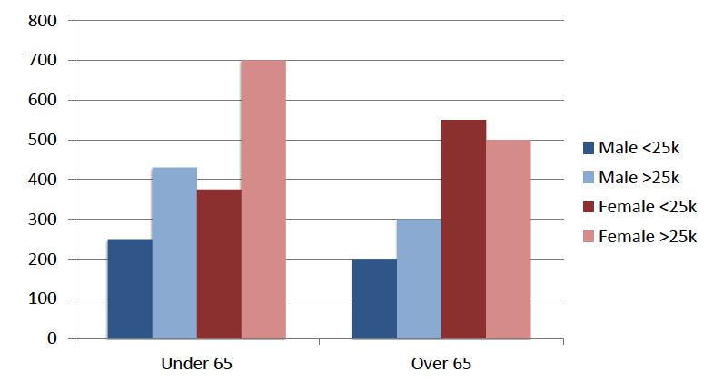

---

<!-- 
Here's another visualization of the same data, this time using a line chart.
This format makes trends across age groups immediately apparent:
- Most groups show decreasing cholesterol with age
- But remarkably, low-income women show INCREASING cholesterol with age
This pattern immediately "pops out" visually because the slope direction is different - it's the only line going up while others go down.
This demonstrates how different chart types can highlight different aspects of the same data.
-->

# GAME - VISUAL SOLUTION (2)

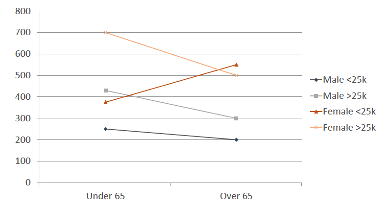

---
<!-- _class: big-text -->

<!-- 
To summarize what we've learned about vision and perception for data visualization:
1. The human visual system has limitations - we only see high detail in a small area and must scan to build a complete picture
2. Early-stage visual perception processes certain features automatically and in parallel - we should use these for key insights
3. We need to be aware of potential biases in how we present information visually
Understanding these principles helps us create visualizations that work with our visual system rather than against it.
-->

# TAKEAWAY MESSAGES

→ Limitations of human vision system

→ Exploits message broadcast at early stage of perception: preattentive perception

→ Avoid possible causes of biases

---
<!-- header: "" -->

<!-- _class: chapter -->
<!-- _paginate: hide -->

# NEXT: GRAMMAR OF GRAPHICS

## Using the structure of visualization to effectively communicate data