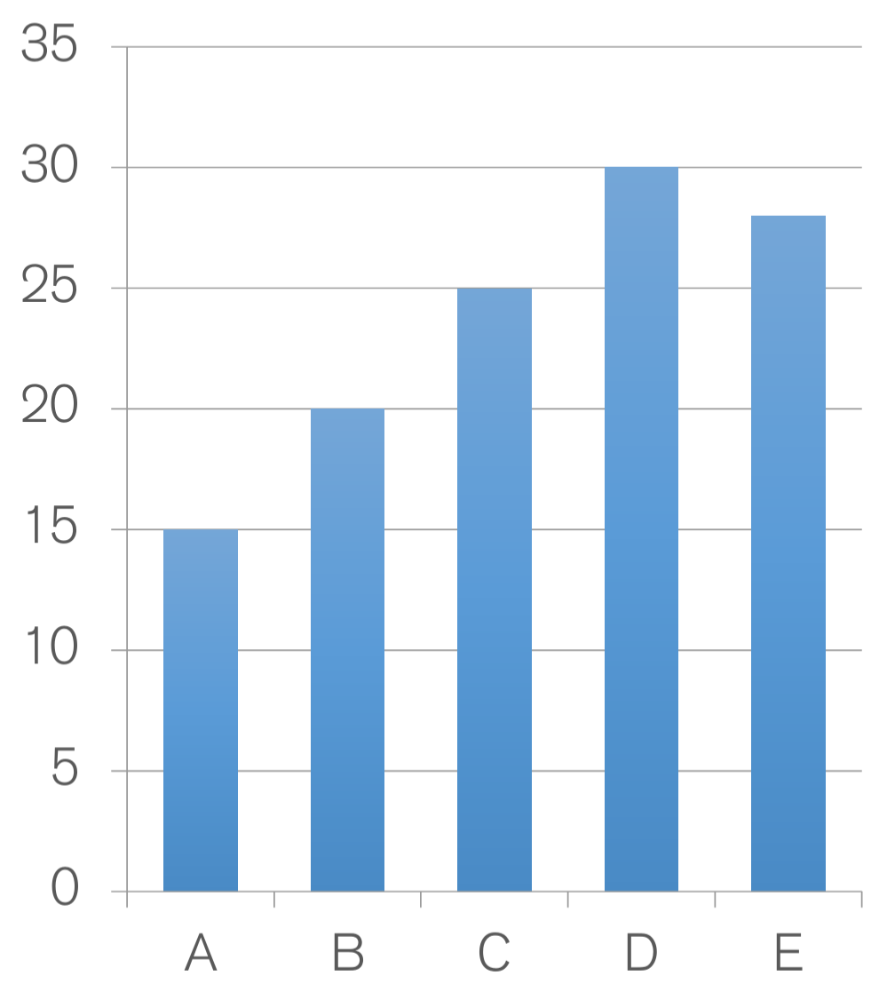

<!-- _class: cover -->
<!-- _paginate: skip -->

  <h1>3 •  Visual Variables</h1>
  <!-- 
A subtitle
 -->

  

    
teacher

    
Salvatore Rinzivillo

    
Daniele Fadda

     
    
tutor

    
Eleonora Cappuccio

  

  

    <strong>University of Pisa</strong> 
    Department of Computer Science 
    Course: Visual Analytics (602AA) 
    Academic Year: 2024/2025    
  

<!-- 
This lesson explores the theory of visual variables, which allows us to make effective visualizations based on best practices. These theories help us create correct and effective visualizations.

The theory of visual variables, also called scales theory, dates back to 1946 and provides a schematic way to represent information visually. It helps us map our data to appropriate visual representations.
-->

---

# Data Types

- **Nominal (N)**
  - Equality relation
  - Apples, bananas, pears...
- **Ordinal (O)**
  - Ordering relation 
  - Small, medium, large, darker, light...

  
  - **Quantitative (Q)**
    - Arithmetic relations
    - 10m, 32 degrees, 2 bars...

    - **Quantitative Interval** (no reference point)
      - Dates, Location
      - Distances: A is 3 degrees hotter than B
    - **Quantitative Ratio** (reference point)
      - Length, mass
      - Proportions: A is twice as large as B

  

<!-- 
We can divide our data into three different types:

1. Nominal/qualitative data types - Data where we can only apply the relationship of equality. We can determine if two things are the same or not, like different fruits.

2. Ordinal data types - Data where we can apply ordering relationships. We can determine if an element comes before or after another, like sizes or intensities.

3. Quantitative data types - Data represented by numbers, like length, temperature, or pressure. These can be further divided into interval and ratio types.
-->

---

# Data Types - Operators

- **Nominal**
  - ≠, =
- **Ordinal**
  - ≠, =, >, <
- **Quantitative Interval** (no reference point)
  - ≠, =, >, <, +, -
- **Quantitative Ratio** (reference point)
  - ≠, =, >, <, +, -, ×, ÷

<!-- 
Each data type supports different operators:

- Nominal data only supports equality operators (= or ≠)
- Ordinal data supports equality and ordering operators (>, <)
- Quantitative interval data (without a reference point) supports equality, ordering, and arithmetic sum/subtraction
- Quantitative ratio data supports all of the above plus multiplication and division

Interval data, like timestamps or dates, allows us to measure distances between values but not ratios. For ratio data, like length or mass, we can say one value is twice or three times another.
-->

---

# From Data to Conceptual Model

- **Data Model**: low-level representation of data and operations
- **Conceptual Model**: mental and semantic construction

| Data | Concept |
|------|---------|
| 1D number | Temperature |
| 2D numbers | Geographic Coordinate |
| 3D numbers | Spatio-temporal position |

<!-- 
When working with data, we go from the raw data model to a conceptual model, which gives meaning to the data. For example, a set of numbers might represent temperatures, or a pair of coordinates might represent a geographic position.

The conceptual model is our mental interpretation of what the data represents in the real world. It helps us understand what operations make sense to perform on the data.
-->

---

# From Data to Conceptual Model

- From **data model**...
  - 70.8, 27.2, -10.2...
- ...using **conceptual model**...
  - Temperature
- ...to **data type**
  - Continuous variation
  - Warm, hot, cold
  - Burned vs not burned

<!-- 
We start with raw numerical data, then apply a conceptual model like "temperature," and finally determine the appropriate data type for visualization.

For example, temperature can be represented as a continuous quantitative value, an ordinal scale (hot, warm, cold), or even as a nominal category (burned vs. not burned) depending on our needs.

This process of translation from raw data to meaningful visualization is key to effective data representation.
-->

---
# Visual Variables

  

  

  
  - Jacques Bertin (1918-2010), cartographer
- Theoretical principles of visual encodings
- Semiology of Graphics (1967)

  

  
  

  

  

  

<!-- 
Now we'll discuss visual variables that we can use to encode our data. Jacques Bertin was a cartographer who developed theoretical principles of visual encoding in his 1967 book "Semiology of Graphics."

Bertin was studying how to visually encode elements in space, particularly for geographic maps. His work has been hugely influential in data visualization and provides a systematic approach to representing data visually.

This allows us to map our data types to appropriate visual representations in a methodical way.
-->

---

<!-- _class: columns-2 -->

# Bertin's Visual Variables
This is a visual summary of Bertin's classification of visual variables

<!-- 

- Position: The location of marks in 2D space
- Size: The dimension of marks
- Shape: The form of marks
- Value/Intensity: The lightness or darkness
- Color/Hue: Different colors
- Orientation: The angle or direction
- Texture: The pattern

Each of these variables can be used to encode different types of data, and they have different properties that make them more or less suitable for different tasks.
-->

---

# Characteristics of Visual Variables

  

  - **Selective**
    - May I distinguish a symbol from the others?
  - **Associative**
    - May I identify groups?
  - **Quantitative**
    - May I quantify the difference of two values?
  - **Order**
    - May I identify an ordering?

  

  

    
  

<!-- 
Visual variables have different characteristics that make them suitable for different tasks:

1. Selectivity - Allows us to distinguish one element from others. For example, we can easily spot differences in shapes or colors.

2. Associative - Allows us to identify groups of similar elements, like all squares or all blue elements.

3. Quantitative - Allows us to estimate the difference between values, like comparing the height of bars.

4. Order - Allows us to identify a sequence or ranking, like darker shades representing higher values.

Each visual variable may be strong in some of these characteristics and weak in others.
-->

---

# Characteristics of Visual Variables

  

<!-- 
This chart summarizes how different visual variables perform across the characteristics we just discussed:

- Position is the strongest variable, performing well for all four characteristics
- Size works well for creating order and representing quantities
- Shape is strong for associative tasks but not for ordering or quantitative tasks
- Value (lightness/darkness) works well for ordering and somewhat for quantitative tasks
- Hue (color) is good for identifying groups but poor for ordering or quantities
- Orientation and texture have more limited uses

The effectiveness of each variable depends on what task we're trying to support in our visualization.
-->

---

# VV: Position

- Strongest visual variable
- Compatible for all data types
- **Cons**:
  - Not always applicable (e.g. nD data)
  - Cluttering

  

<!-- 
Position is the most powerful visual variable. It works well for all data types and supports all four tasks (selective, associative, ordered, and quantitative).

This is why position is used extensively in scientific applications, like the x and y axes in charts. However, it has limitations:

1. It doesn't work well for high-dimensional data (more than 2-3 dimensions)
2. There can be cluttering when many points overlap, causing some information to be hidden
-->

---

# VV: Size and Length

- Easy to compare dimensions
- Grouping
- Estimate differences
  - Quantitative encoding
  - Changes in lengths
  - Worse for change in area

  

<!-- 
Size is another effective visual variable, especially for representing quantitative data. 

We're generally better at comparing lengths than areas. When comparing bar heights (length), we can more accurately estimate the ratio between them than when comparing circles (area). 

This gets even better when we align elements with the same reference line, which is the basis for bar charts. We can combine variables - like using both length and position - to make comparisons easier.
-->

---

# VV: Shapes

- Strong for nominal encoding
- No ordering
- No grouping

  

<!-- 
Shapes are effective for nominal data types. They help us distinguish between different categories of data.

However, shapes don't naturally convey ordering (we can't say that a triangle comes "before" a square), and they don't support quantitative comparisons well.

Shapes are primarily used to differentiate categories or types of data points, not to show relationships between them.
-->

---

# VV: Value (Intensity)

- Quantitative representation (when size and length are used)
- Limited number of shades
- Support grouping

  

<!-- 
Value or intensity (lightness/darkness) can be used to represent quantities. For example, darker colors might indicate higher values.

The main limitation is that we can only distinguish a limited number of shades reliably - usually around 7-9 different levels.

Value works well for showing groups of similar items and can support ordering (light to dark), though not as well as position or length.
-->

---

# VV: Color (Tint)

- Good for qualitative data
- Limited number of classes (!!!)
- Not good for quantitative data
- Be careful!!

  

<!-- 
Color or tint works well for qualitative (nominal) data. Different colors can represent different categories.

However, there are important limitations:
- We can only reliably distinguish about 12 different colors
- Color is not naturally ordered (is red "more than" blue?)
- Color is not good for representing quantities

We should be careful when using color and consider cultural associations and accessibility issues like color blindness.
-->

---

# Bertin Visual Variables

<table>
  <thead>
    <tr>
      <th style="background-color: white;"></th>
      <th>Nominal</th>
      <th>Ordinal</th>
      <th>Quantitative</th>
    </tr>
  </thead>
  <tbody>
    <tr>
      <td>Position</td>
      <td class="check-green">✓</td>
      <td class="check-green">✓</td>
      <td class="check-darkgray">✓</td>
    </tr>
    <tr>
      <td>Size</td>
      <td class="check-gray">✓</td>
      <td class="check-light">✓</td>
      <td class="tilde-orange">~</td>
    </tr>
    <tr>
      <td>Value (intensity)</td>
      <td class="check-darkgray">✓</td>
      <td class="check-green">✓</td>
      <td class="tilde-green">~</td>
    </tr>
    <tr>
      <td>Texture</td>
      <td class="check-gray">✓</td>
      <td class="tilde-light">~</td>
      <td class="x-pink">✗</td>
    </tr>
    <tr>
      <td>Color</td>
      <td class="check-green">✓</td>
      <td class="x-orange">✗</td>
      <td class="x-orange">✗</td>
    </tr>
    <tr>
      <td>Orientation</td>
      <td class="check-gray">✓</td>
      <td class="x-pink">✗</td>
      <td class="x-pink">✗</td>
    </tr>
    <tr>
      <td>Shape</td>
      <td class="check-green">✓</td>
      <td class="x-red">✗</td>
      <td class="x-red">✗</td>
    </tr>
  </tbody>
</table>

<!-- 
This table summarizes which data types can be effectively represented by each visual variable:

- Position works well for all data types
- Size and Value can work for all types, though they're less effective for quantitative data
- Texture can work for nominal and somewhat for ordinal data
- Color, Orientation, and Shape are best for nominal data only

When designing visualizations, we should match the visual variable to the data type. For example, using color for categories but not for quantities.
-->

---

# Visual Encoding/Decoding

- A graph encodes a set of information as a set of graphical attributes
- The observer has to decode the graphical attributes to extract the original information

 

    
  

<!-- 
The process of visualization involves two steps:

1. Encoding - Transforming data into visual elements (like converting numbers into bar heights)
2. Decoding - The observer extracting information from the visual elements

For example, we might take a table of values and encode it as a bar chart. Then viewers decode the chart to understand things like "C is greater than B, which is greater than D, which is greater than A" and approximate values for each.

The effectiveness of a visualization depends on how easily and accurately people can decode the information.
-->

---

<!-- _class: chapter -->
<!-- _paginate: skip -->

# Taxonomy of Visual Variables

<!-- This slide will be followed by Cleveland & McGill's research on graphical perception -->

<!-- 
We've looked at Bertin's taxonomy of visual variables. Now we'll examine another important perspective on visual encoding from Cleveland and McGill, who conducted empirical research on graphical perception.

Their work helps us understand which encodings are most effective for different tasks based on how humans perceive visual information.
-->

---

# Cleveland McGill [1984]

William S. Cleveland; Robert McGill, "Graphical Perception: Theory, Experimentation, and Application to the Development of Graphical Methods." 1984

  

    
  

  
  

    
  

<!-- 
Cleveland and McGill conducted experiments to determine how accurately people could decode different visual encodings. Their 1984 paper is a foundational work in visualization.

They tested how well people could extract quantitative information from different visual representations, such as comparing lengths, angles, areas, and more.

These experiments led to an empirical ranking of visual encodings based on perceptual accuracy.
-->

---

# Cleveland & McGill: Graphical Encodings

- Angle
- Area
- Color Hue
- Color Saturation
- Density
- Length
- Position on a common scale
- Position on non-aligned scale
- Slope
- Volume

<!-- 
Cleveland and McGill tested these graphical encodings to determine which ones people could decode most accurately.

They found significant differences in how well people could extract quantitative information from different visual representations.

This research led to guidelines about which encodings to use for different tasks, particularly when accuracy is important.
-->

---

# Angle Decoding

- It is difficult to compare angles
  - Underestimation of acute angles
  - Overestimation of obtuse angles
  - Easier if bisectors are aligned
- Area estimation helps

  

<!-- 
Angles are difficult for people to decode accurately:

- We tend to underestimate acute angles (less than 90°)
- We tend to overestimate obtuse angles (more than 90°)
- Comparing angles is easier if the bisectors are aligned
- Area can sometimes help with angle estimation

This explains why pie charts can be difficult to read precisely, especially when comparing slices that are close in size.
-->

---

# Angle Decoding

- It is difficult to compare angles
  - Underestimation of acute angles
  - Overestimation of obtuse angles
  - Easier if bisectors are aligned

  

<!-- 
Angles are difficult for people to decode accurately:

- We tend to underestimate acute angles (less than 90°)
- We tend to overestimate obtuse angles (more than 90°)
- Comparing angles is easier if the bisectors are aligned
- Area can sometimes help with angle estimation

This explains why pie charts can be difficult to read precisely, especially when comparing slices that are close in size.
-->

---

# Slopes Decoding

- Same difficulties as angles
- Easier task since one branch is aligned with x-axis

  

<!-- 
Slopes present similar challenges to angles, but with some advantages:

- They have the same perceptual issues as angles
- However, they're somewhat easier to interpret because one reference line (the x-axis) is fixed

Line charts use slopes to show trends, and while they're not perfect for precise value comparisons, they work well for seeing patterns over time.
-->

---

# Area Decoding

- Area is not well decoded
- Different regular shapes
- Irregular shapes
- Context influences (thin area within compact thick area)

  

<!-- 
Area is one of the more difficult visual encodings for people to decode accurately:

- Different regular shapes (circles vs. squares) are hard to compare
- Irregular shapes are even more difficult
- Context can influence perception (an area surrounded by larger areas may appear smaller)

This is why bubble charts and area-based visualizations need to be designed carefully, often with additional reference points or labels.
-->

---

# Length Decoding

- Straight forward to encode numerical values
- Difficulties with relative lengths

  

<!-- 
Length is a relatively effective way to encode numerical values:

- It's straightforward and intuitive
- However, there can still be difficulties when comparing relative lengths, especially if they're not aligned

Bar charts take advantage of length encoding and add the benefit of a common baseline to make comparisons easier.
-->

---

# Position on a Common Scale

- Widely used in statistical charts

  

<!-- 
Position on a common scale is one of the most effective visual encodings:

- Items are placed along a shared axis or reference line
- This makes comparisons very accurate
- It's widely used in statistical charts like bar charts and scatterplots

This is why many standard statistical charts use this encoding - it leads to accurate decoding of quantitative information.
-->

---

# Position on Non-Aligned Scale

- Not as good as common scale
- Still acceptable

  

<!-- 
Position on non-aligned scales is less effective than a common scale, but still reasonably good:

- Items are positioned along different reference lines
- Comparisons are more difficult than with a common scale
- However, it's still better than many other encodings

Examples include stacked bar charts where the baseline for upper segments isn't aligned.
-->

---

# Designing Effective Visualizations

- If possible, use graphical encoding that is easily decoded
- Graphical Attributes ordered (Cleveland & McGill):
  1. Position along a common scale
  2. Position on non-aligned scales
  3. Length
  4. Angle and Slope
  5. Area
  6. Volume, density, color saturation
  7. Color Hue

  

<!-- 
Based on Cleveland and McGill's research, we can rank visual encodings from most to least effective for quantitative data:

1. Position on a common scale (best)
2. Position on non-aligned scales
3. Length
4. Angle and slope
5. Area
6. Volume, density, color saturation
7. Color hue (worst for quantities)

When designing visualizations, we should try to use encodings from higher in this list, especially when accurate perception is important.
-->

---

# Most Efficient to Least Efficient

  

<!-- 
This chart shows different visual variables organized by their effectiveness for different data types:

- Position, length, and slope work well for quantitative data
- Area and intensity work well for ordinal data
- Color and shape work well for nominal data

The chart also shows the declining effectiveness as we move from position (most efficient) to color/shape (least efficient for quantitative data).
-->

---

# Suggested Readings

 

  

  

<!-- 
For further exploration of these topics, I recommend:

1. "Data Visualization: A Practical Introduction" by Kieran Healy
2. "Fundamentals of Data Visualization" by Claus O. Wilke

These books provide deeper coverage of visual variables, perception principles, and practical guidance for creating effective visualizations.
-->

---

# Example

  

<!-- 
Let's look at a practical example. This table shows temperature data for different locations over time.

While the raw data contains all the information, it's difficult to see patterns, trends, or make comparisons in this format.

This is where visualization comes in - by encoding this data visually, we can make these patterns much more apparent.
-->

---

# Visual Solution (1)

 

  

<!-- 
Here's one visualization solution - a line chart showing temperature over time for different locations.

This visualization uses position on a common scale (both x and y axes) to encode time and temperature.

The different locations are encoded using color (a nominal variable).

Notice how much easier it is to see patterns, like seasonal variations and the relative temperatures of different locations.
-->

---

# Visual Solution (2)

 

  

<!-- 
Here's an alternative visualization - a heatmap using color intensity to represent temperature.

Locations are shown on the y-axis, months on the x-axis, and temperature is encoded using color intensity.

This visualization makes it easy to see seasonal patterns across all locations simultaneously and compare temperatures across locations for any given month.

This demonstrates how different visual encodings can highlight different aspects of the same dataset.
-->
