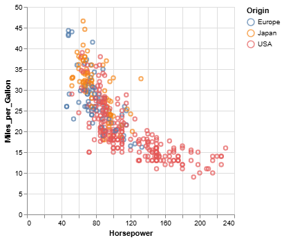
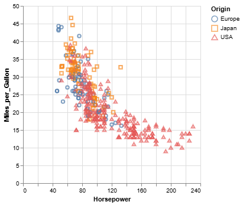
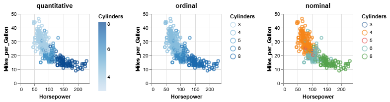
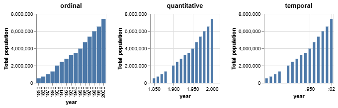

<!-- <script src="vega-loader.js"></script> -->
<script src="https://cdn.jsdelivr.net/npm/vega@5.30.0"></script>
<script src="https://cdn.jsdelivr.net/npm/vega-lite@5.21.0"></script>
<script src="https://cdn.jsdelivr.net/npm/vega-embed@6.26.0"></script>
<script src="https://cdn.jsdelivr.net/gh/koaning/justcharts/justcharts.js"></script>
<script src="js/vega-chart.js"></script>


<!-- _class: cover -->
<!-- _paginate: skip -->

<div>
  <h1>4 • Altair<br>Introduction</h1>
  <!-- <div class="subtitle">A subtitle</div> -->

  <div class="authors">
    <div class="author-label">teacher</div>
    <div class="author-name">Salvatore Rinzivillo</div>
    <div class="author-name">Daniele Fadda</div>
    <br>
    <div class="author-label">tutor</div>
    <div class="author-name">Eleonora Cappuccio</div>
  </div>

  <div class="university">
    <strong>University of Pisa</strong><br>
    Department of Computer Science<br>
    Course: Visual Analytics (602AA)<br>
    Academic Year: 2024/2025    
  </div>

</div>


<div class="cover-image">

</div>

<!-- 
This lesson is about the use of Vega and Altair libraries for visualization.
Vega is the base library, implemented in JavaScript, that implements the Visual Grammar we introduced in the previous lesson. Vega exploits the power of the D3 library to render the visualizations. It simplifies the creation of complex visualizations by providing a high-level grammar that abstracts the low-level details of the rendering process. 

This abstraction is formalized as a JSON specification that can be used to describe the visualization. The JSON specification is then compiled into a JavaScript object that is used to render the visualization.

Altair is a Python library that provides a Python interface to the Vega library. It allows the creation of Vega visualizations using a Python API. Altair is a declarative statistical visualization library that is based on the Vega grammar. Altair is designed to work with Pandas DataFrames and provides a simple and intuitive API for creating visualizations. -->

---

<!-- _class: columns-1 -->
# Vega-Altair and Vega-Lite

- **Vega** is a visualization grammar, a declarative format for creating, saving, and sharing interactive visualization designs. 

- **Vega-Lite** is a high-level grammar of interactive graphics. It provides a concise JSON syntax for rapidly generating visualizations to support analysis.

- **Altair** is a declarative statistical visualization library for Python, based on Vega and Vega-Lite. 


<!--
- **Vega** is a visualization grammar, a declarative format for creating, saving, and sharing interactive visualization designs. With Vega, you can describe the visual appearance and interactive behavior of a visualization in a JSON format, and generate web-based views using SVG.

- **Vega-Lite** is a high-level grammar of interactive graphics. It provides a concise JSON syntax for rapidly generating visualizations to support analysis. Vega-Lite specifications describe visualizations as mappings from data to properties of graphical marks (e.g., points or bars). It supports many types of plots, including bar charts, line charts, and scatter plots.

- **Altair** is a declarative statistical visualization library for Python, based on Vega and Vega-Lite. Altair’s API is simple, friendly, and consistent and built on top of the powerful Vega-Lite visualization grammar. This elegant simplicity produces beautiful and effective visualizations with a minimal amount of code.
-->
---

# First Example in Altair

<div class="columns-2">
<div>
    
```python
# import altair with an abbreviated alias
import altair as alt

# load a sample dataset as a pandas DataFrame
from vega_datasets import data
cars = data.cars()

# make the chart
alt.Chart(cars).mark_point().encode(
    x='Horsepower',
    y='Miles_per_Gallon',
    color='Origin',
    tooltip=['Name']
)
```

</div>
<div>


<div class="interactive-chart" id="basic-chart">
</div>

<div class="img-chart">

</div>

</div>
<script>
insertChart('basic-chart', './chart/basic-vega.json', '100%', '500px');
</script>

<!--
The key concept in Altair is the Chart object. The Chart object is created by calling the alt.Chart() function and passing in a Pandas DataFrame as an argument. The Chart object has a number of methods that can be used to customize the appearance of the visualization. In this example, we are creating a scatter plot of the cars dataset, with Horsepower on the x-axis, Miles_per_Gallon on the y-axis, and Origin as the color. The tooltip property is used to visualize the Name of the car when the mouse hovers over the point.
-->

---
<!-- _class: columns-1 -->
# Altair Basic Concepts

- **The Data**: The data to be visualized is passed to the Chart object as a Pandas DataFrame.
- **Encodings and Marks**: The visual appearance of the data is specified using encodings and marks. 
    - Encodings map data fields to visual properties, such as position, color, size, and shape. 
    - Marks are the basic building blocks of a visualization, such as points, lines, bars, and areas.
- **Data Transformation**: Altair provides a number of methods for transforming the data before it is visualized.
- **Interaction**: Altair provides a number of methods for adding interactivity to the visualization.

<!--
- **The Data**: The data to be visualized is passed to the Chart object as a Pandas DataFrame. The data can be loaded from a file, a URL, or a Python object.
- **Encodings and Marks**: The visual appearance of the data is specified using encodings and marks. Encodings map data fields to visual properties, such as position, color, size, and shape. Marks are the basic building blocks of a visualization, such as points, lines, bars, and areas.
- **Data Transformation**: Altair provides a number of methods for transforming the data before it is visualized. These methods can be used to filter, aggregate, and sort the data.
- **Interaction**: Altair provides a number of methods for adding interactivity to the visualization. These methods can be used to add tooltips, zooming, panning, and other interactive features to the visualization.
-->

---
<!-- paginate: false -->
# Altair - Specifying Data

<div class="columns-2">
<div>

- **Data**: Altair uses tabular data as its basic data model.Individual rows represent individual data points, and columns represent attributes of the data points.
xx- **Data Source**: The data to be visualized is passed to the Chart object as a ```Pandas DataFrame```.
- **Data Types**: Altair supports a number of data types, including quantitative, ordinal, nominal, and temporal data. These data types are inferred from the ```DataFrame``` columns.
- **```Data``` Object**: Altair provides a dedicated class to represent the data, which can be used to specify the data types and formats.
</div>

<div>

```python
import altair as alt

data = alt.Data(values=[{'x': 'A', 'y': 5},
                        {'x': 'B', 'y': 3},
                        {'x': 'C', 'y': 6},
                        {'x': 'D', 'y': 7},
                        {'x': 'E', 'y': 2}])
alt.Chart(data).mark_bar().encode(
    x='x:N',  # specify nominal data
    y='y:Q',  # specify quantitative data
)
```
</div>
</div>


<!--
- **Data**: Explain that Altair uses tabular data, where rows represent data points and columns represent attributes.
- **Data Source**: Mention that data is passed to the Chart object as a Pandas DataFrame.
- **Data Types**: Highlight the different data types supported by Altair, such as quantitative, ordinal, nominal, and temporal.
- **Data Object**: Describe the dedicated class Altair provides to represent data, allowing specification of data types and formats.
- **Example**: Walk through the provided code example, explaining how to create a simple bar chart using the Data object and specifying data types for the x and y axes.
- **Key Points**: Emphasize the importance of correctly specifying data types to ensure accurate visualizations.

-->

---
<!-- paginate: true -->
<!-- footer: '' -->
# Long-form data and Wide-form data

- **Long-form data**: Each row represents a single observation, and each column represents a variable. 
- **Wide-form data**: it has one row per independent variable and metadata encoded in columns and rows names. 

<div class="columns-2">
<div>

## Wide-form data
```
             Date    AAPL   AMZN    GOOG
    0  2007-10-01  189.95  89.15  707.00
    1  2007-11-01  182.22  90.56  693.00
    2  2007-12-01  198.08  92.64  691.48
```
</div>

<div>

## Long-form data
```
             Date company   price
    0  2007-10-01    AAPL  189.95
    1  2007-11-01    AAPL  182.22
    2  2007-12-01    AAPL  198.08
    3  2007-10-01    AMZN   89.15
    4  2007-11-01    AMZN   90.56
    5  2007-12-01    AMZN   92.64
    ...
```
</div>

</div>

<!--
There are two common conventions for storing data in a dataframe, sometimes called long-form and wide-form. Both are sensible patterns for storing data in a tabular format; briefly, the difference is this:

- wide-form data has one row per independent variable, with metadata recorded in the row and column labels.

- long-form data has one row per observation, with metadata recorded within the table as values.

Altair’s grammar works best with long-form data, in which each row corresponds to a single observation along with its metadata.

A concrete example will help in making this distinction more clear. Consider a dataset consisting of stock prices of several companies over time. The wide-form version of the data might be arranged as follows:


Notice that each row corresponds to a single time-stamp (here time is the independent variable), while metadata for each observation (i.e. company name) is stored within the column labels.

Notice here that each row contains a single observation (i.e. price), along with the metadata for this observation (the date and company name). Importantly, the column and index labels no longer contain any useful metadata.

As mentioned above, Altair works best with this long-form data, because relevant data and metadata are stored within the table itself, rather than within the labels of rows and columns:

-->

---

<!-- paginate: false -->
# Altair - Encodings (or Channels)

- **Encodings**: Encodings map data fields to visual properties, such as position, color, size, and shape. 
- Encodings represent the visual properties of the marks in the visualization.

<div class="columns-2">
<div>

```python
from vega_datasets import data

cars = data.cars()

alt.Chart(cars).mark_point().encode(
    x='Horsepower',
    y='Miles_per_Gallon',
    color='Origin',
    shape='Origin'
)
```

</div>
<div>

</div>
</div>


<!--
The key to creating visualizations in Altair is the concept of encodings. Encodings map data fields to visual properties, such as position, color, size, and shape. Encodings are specified using the encode() method of the Chart object. The encode() method takes a number of keyword arguments, each of which specifies a visual property and the data field that should be mapped to it. For example, the x argument specifies the x-position of the marks in the visualization, and the y argument specifies the y-position. Other arguments can be used to specify the color, size, shape, and other visual properties of the marks.
-->

---
<!-- paginate: true -->
# Channel Options

The **channel options** are the parameters to customize the visual mappings. The new version introduces a new style for options, with the following syntax:

<div class="columns-2">
<div>

## Method-based Syntax
```python
alt.Chart(cars).mark_point().encode(
    alt.X('Horsepower').axis(tickMinStep=50),
    alt.Y('Miles_per_Gallon').title('Miles per Gallon'),
    color='Origin',
    shape='Origin'
)
```
</div>
<div>

## Attribute-based Syntax
```python
alt.Chart(cars).mark_point().encode(
    alt.X('Horsepower', axis=alt.Axis(tickMinStep=50)),
    alt.Y('Miles_per_Gallon', title="Miles per Gallon"),
    color='Origin',
    shape='Origin'
)
```
</div>
</div>

<!--
The method-based syntax replaces keyword arguments with methods. For example, an axis option of the x channel encoding would traditionally be set using the axis keyword argument: x=alt.X('Horsepower', axis=alt.Axis(tickMinStep=50)). To define the same X object using the method-based syntax, we can instead use the more succinct x=alt.X('Horsepower').axis(tickMinStep=50).

The same technique works with all encoding channels and all channel options. For example, notice how we make the analogous change with respect to the title option of the y channel. The following produces the same chart as the previous example.

These option-setter methods can also be chained together, as in the following, in which we set the axis, bin, and scale options of the x channel by using the corresponding methods (axis, bin, and scale). We can break the x definition over multiple lines to improve readability. (This is valid syntax because of the enclosing parentheses from encode.)

For specs making extensive use of channel options, the attribute-based syntax can become quite verbose:


-->


---

<!-- paginate: false -->
# Altair Encodings Data Types


Data Type | Shorthand Code | Description
--- | --- | ---
quantitative | Q | a continuous real-valued quantity
ordinal | O | a discrete ordered quantity
nominal | N | a discrete unordered category
temporal | T | a time or date value
geojson | G | a geographic shape

<div class="columns-2">
<div>

```python
alt.Chart(cars).mark_point().encode(
    x='Acceleration:Q',
    y='Miles_per_Gallon:Q',
    color='Origin:N'
)
```
</div>
<div>

```python
alt.Chart(cars).mark_point().encode(
    alt.X('Acceleration', type='quantitative'),
    alt.Y('Miles_per_Gallon', type='quantitative'),
    alt.Color('Origin', type='nominal')
)
```
</div>
</div>

<!--
For data specified as a DataFrame, Altair can automatically determine the correct data type for each encoding, and creates appropriate scales and legends to represent the data.

If types are not specified for data input as a DataFrame, Altair defaults to quantitative for any numeric data, temporal for date/time data, and nominal for string data, but be aware that these defaults are by no means always the correct choice!

The types can either be expressed in a long-form using the channel encoding classes such as X and Y, or in short-form using the Shorthand Syntax discussed below. For example, the following two methods of specifying the type will lead to identical plots

The shorthand form, ```x="name:Q"```, is useful for its lack of boilerplate when doing quick data explorations. The long-form, ```alt.X('name', type='quantitative')```, is useful when doing more fine-tuned adjustments to the encoding using channel options such as binning, axis, and scale.

Specifying the correct type for your data is important, as it affects the way Altair represents your encoding in the resulting plot.
-->

---
# Choosing the correct data type (colors)

<div>
<div class="columns-1">

```python
base = alt.Chart(cars).mark_point().encode(
    x='Horsepower:Q',
    y='Miles_per_Gallon:Q',
).properties(width=140, height=140)

alt.hconcat(
   base.encode(color='Cylinders:Q').properties(title='quantitative'),
   base.encode(color='Cylinders:O').properties(title='ordinal'),
   base.encode(color='Cylinders:N').properties(title='nominal'),
)
```
</div>
<div>

</div>

</div>


<!--
As an example of this, here we will represent the same data three different ways, with the color encoded as a quantitative, ordinal, and nominal type, using three horizontally-concatenated charts (see Horizontal Concatenation):

The type specification influences the way Altair, via Vega-Lite, decides on the color scale to represent the value, and influences whether a discrete or continuous legend is used. In the first chart, the color is encoded as a quantitative value, leading to a continuous color scale. In the second chart, the color is encoded as an ordinal value, leading to a discrete color scale. In the third chart, the color is encoded as a nominal value, leading to a nominal color scale.

-->

---
# Choosing the correct data type (axis)

<div>
<div class="columns-1">

```python
base = alt.Chart(pop).mark_bar().encode(
    alt.Y('mean(people):Q').title('Total population')
).properties(width=140, height=140)

alt.hconcat(
    base.encode(x='year:O').properties(title='ordinal'),
    base.encode(x='year:Q').properties(title='quantitative'),
    base.encode(x='year:T').properties(title='temporal')
)
```
</div>
<div>

</div>

</div>


<!--
Similarly, for x and y axis encodings, the type used for the data will affect the scales used and the characteristics of the mark. For example, here is the difference between a ordinal, quantitative, and temporal scale for an column that contains integers specifying a year:


Similarly, for x and y axis encodings, the type used for the data will affect the scales used and the characteristics of the mark. For example, here is the difference between a ordinal, quantitative, and temporal scale for an column that contains integers specifying a year:


-->

---
# Encodings Shorthands

The shorthand syntax is a convenient way to specify encodings in Altair. The shorthand syntax uses a colon to separate the field name from the data type.

Shorthand Syntax | Equivalent long-form (Attribute-based Syntax)
--- | ---
```x='name'``` | ```alt.X('name')```
```x='name:Q'``` | ```alt.X('name', type='quantitative')```
```x='sum(name)'``` | ```alt.X('name', aggregate='sum')```
```x='sum(name):Q'``` | ```alt.X('name', aggregate='sum', type='quantitative')```
```x='count():Q'``` | ```alt.X(aggregate='count', type='quantitative')```


<!--
The shorthand syntax is a convenient way to specify encodings in Altair. The shorthand syntax uses a colon to separate the field name from the data type. For example, the shorthand syntax x='name:Q' specifies that the x-axis should represent the field name as a quantitative data type. The equivalent long-form syntax for this shorthand is alt.X('name', type='quantitative'). The shorthand syntax can also be used to specify aggregate functions, such as sum and count. For example, the shorthand syntax x='sum(name):Q' specifies that the x-axis should represent the sum of the field name as a quantitative data type. The equivalent long-form syntax for this shorthand is alt.X('name', aggregate='sum', type='quantitative'). The shorthand syntax can also be used to specify aggregate functions without specifying a field name. For example, the shorthand syntax x='count():Q' specifies that the x-axis should represent the count of the data as a quantitative data type. The equivalent long-form syntax for this shorthand is alt.X(aggregate='count', type='quantitative').
-->