<!-- _class: cover -->
<!-- _paginate: skip -->

  <h1>5 • Scales Functions</h1>
  <!-- 
A subtitle
 -->

  

    
teacher

    
Salvatore Rinzivillo

    
Daniele Fadda

     
    
tutor

    
Eleonora Cappuccio

  

  

    <strong>University of Pisa</strong> 
    Department of Computer Science 
    Course: Visual Analytics (602AA) 
    Academic Year: 2024/2025    
  

<!-- Scale functions are the basic foundation of the theory of visual variables. They are responsible for transforming data into visual characteristics like size, shape, position, length, angles, and other visual elements we've seen. Formally, they transform a value from an input domain and return a corresponding value in the output range. -->

---

# Map Data to Visual Variables

- We specify a scaling function to map data values to the visual representation
- A **scale** is a unique mapping between data and visual representation
- Scales are **functions** that map from an *input* domain to an *output* range 

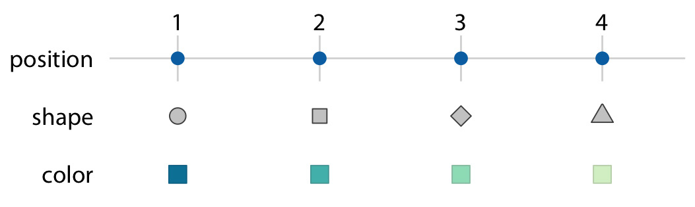

<!-- The domain is linked to the world of data, which could be the min and max values of an attribute or a set of categorical values. The output range is linked to the visual world - characteristics of the visual representation we want to create. In this example, we have three different scale functions mapping the values 1-4 to position, shape, and color. -->

---

# Positional Scales: Axis

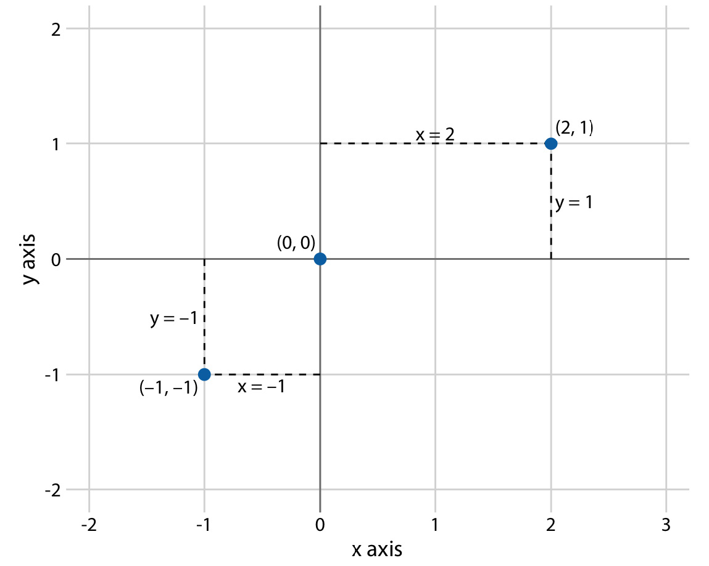

- Axis are at the base of many scientific plots
- Cartesian coordinate systems are composed of two orthogonal axis
- Values are positioned proportionally on the axes 

<!-- Position scales are probably the most commonly used visual variables we have at our disposal. They're used for mapping and positioning elements within the visual space. Axes are directed lines that work as a grid, helping the parser understand how to interpret the distances on the visual space as distances in the world of data. -->

---

# Cartesian Diagram with Different Scales

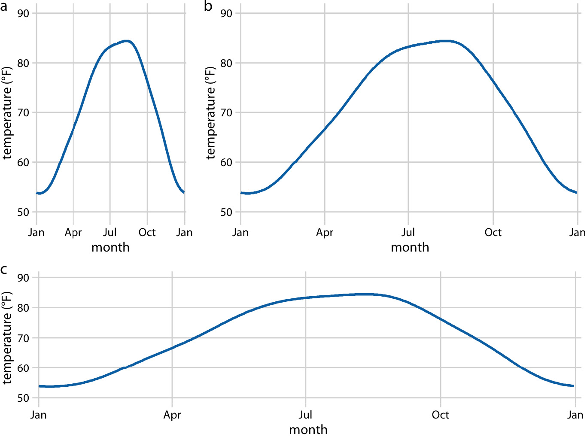

<!-- Here we have the same diagram using different combinations of scales. The first two charts share the same scale function for the Y axis, as we can see that the vertical subdivisions are the same. However, the X axis has two different mappings. In the first chart, the quarters or months are horizontally more compressed than in the second chart. By changing how the scales are defined, you can see how the final result changes - the peak is more accentuated in the first chart than in the second. -->

---

# Cartesian Diagram with Different Scales

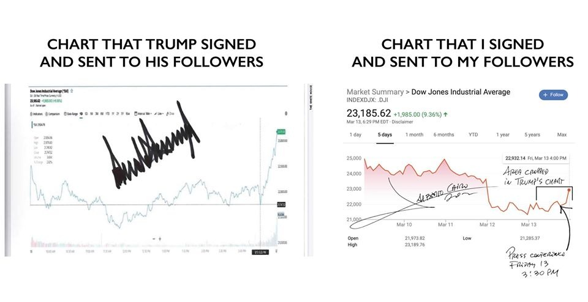

<!-- This example shows how changing the scales can dramatically affect the perception of the data. The chart on the left signed by Trump shows a different time scale than the one on the right, which affects how the data trend appears. This demonstrates how we can use scales to emphasize or de-emphasize certain aspects of the data. -->

---

# Cartesian Axes with Same Scale

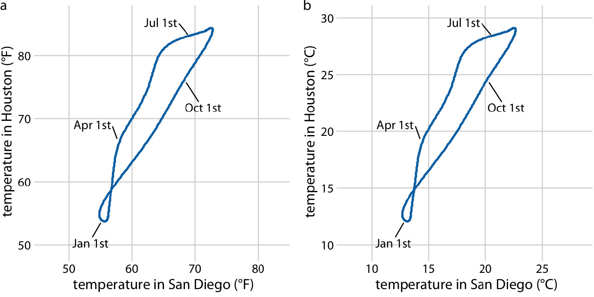

<!-- In these charts, we have temperature expressed in Fahrenheit on the left and Celsius on the right. The two units have a linear dependency, and there's a formula to convert from one to the other. Even though the input domains are different, the shapes appear similar because there's a linear transformation between Fahrenheit and Celsius. When mapping a domain linearly on the visual space, if two domains have a relationship, that relationship is maintained in the visual world. -->

---

# Non Linear Axes

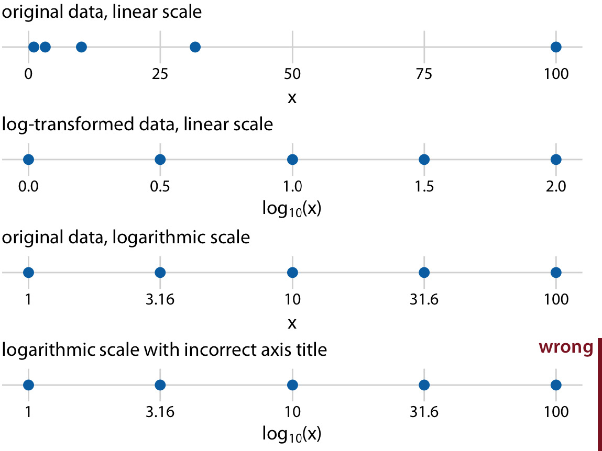

<!-- Sometimes we need to use different types of scales, particularly when data distribution is skewed. If many values are concentrated close to zero with a few far away values, using a linear scale would compress most of the visualization into a small space. In these cases, we often use log scales or other transformations. Log scales can be tricky because it may be difficult for the observer to notice it's a log scale, so it's important to make this evident through proper labeling. -->

---

# Non Linear Axes

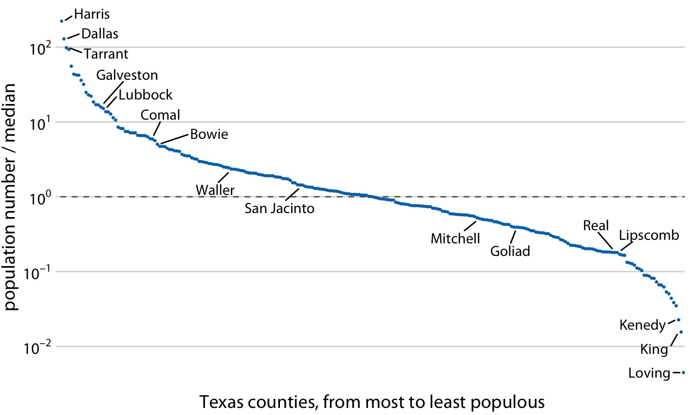

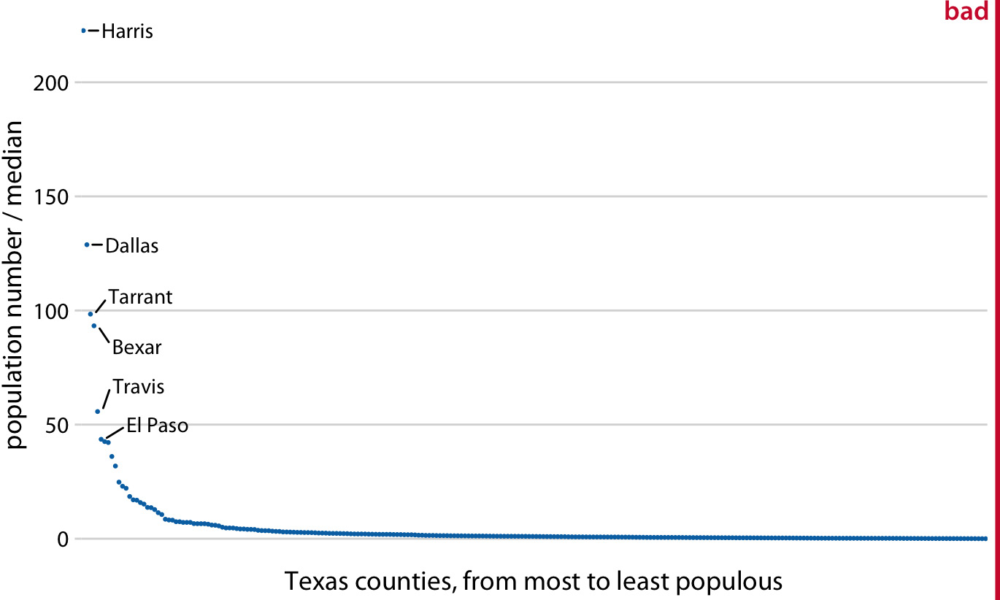 

<!-- Here we can see how different scale functions can provide different views of the same data. The chart on the left uses a logarithmic scale that allows us to see the distribution more clearly, especially for counties with widely varying populations. The chart on the right uses a linear scale, which compresses most of the data at the bottom, losing resolution for smaller values. For certain data distributions, non-linear scales can be much more useful. -->

---

# Curved Axes

 

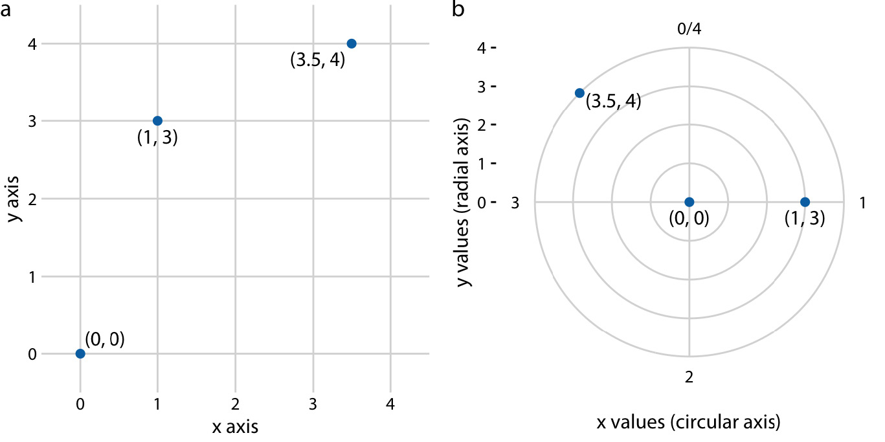

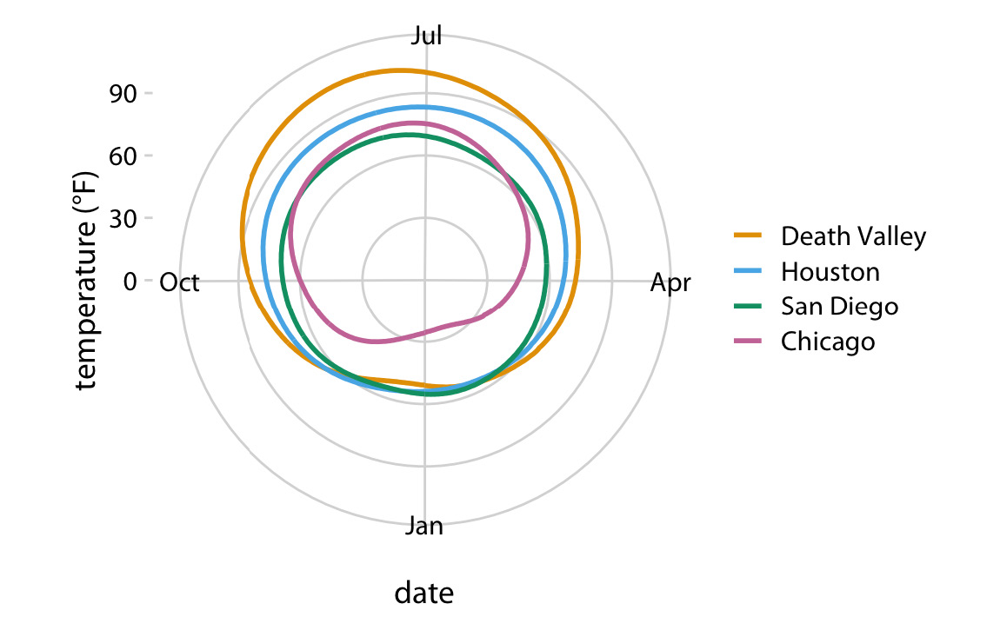

<!-- For domains that have cyclic behavior, like time, we may use curved axes. This is a special scale function for position where the input domain is mapped to an output range given in the range between 0 and 2π (0 and 360 degrees), transforming a linear space into a polar coordinate space. This can help visualize cyclic relationships, like how December and January are actually close to each other in time despite being far apart in a linear representation. -->

---
<!-- paginate: false -->

# Example

Adapted from: Fundamental of Data Visualization, Claus O. Wilke, O'Reilly editor

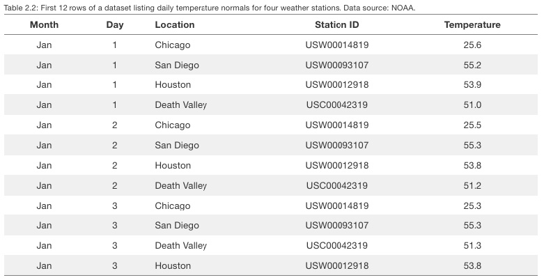

Ordinal     Ordinal     Nominal     Nominal     Quantitative

<!-- In this dataset, we have different types of data: month and day are ordinal data types, location and station ID are nominal data types, and temperature is a quantitative data type. When visualizing this data, we need to choose appropriate scale functions for each type. -->

---
<!-- paginate: true -->

# Example

- Temperature (quantitative) on a linear axis (y)
- Month and day (ordinal) on a linear axis (x)
- City (nominal) on a color hue scale

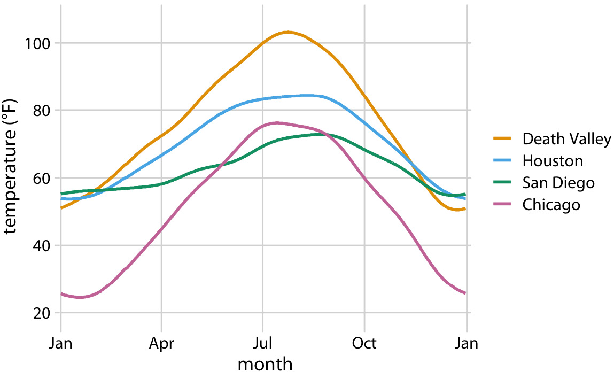

<!-- In this example, we have a chart with a quantitative data type (temperature) mapped to a linear Y axis. On the X axis, we have a quantitative data type (months) mapped using a linear axis. The color is mapping the city, which is a nominal data type. The legend helps us understand how each color corresponds to different cities. -->

---

# Example

- Month (ordinal) on a ordinal axis (x)
- City (nominal) on a ordinal axis (y) (order determined on sum of temperatures on the line)
- Temperature (quantitative) on a color scale
 

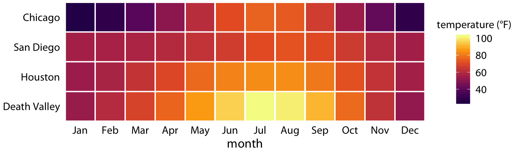

<!-- This is an alternative representation of the same data. Here, months are mapped to the X axis as before, but cities are now mapped to the Y axis in an order determined by the sum of temperatures. Temperature values are mapped to colors. This heatmap provides a different view of the temperature patterns across cities and months. -->

---
<!-- paginate: false -->

# Example

- Displacement (quantitative) on linear axis (x)
- Fuel efficiency (quantitative) on linear axis (y)
- Power (quantitative) on lineal color scale 
- Weight (quantitative -> ordinal) on linear squared size scale
- Cylinders (ordinal -> nominal) on shape scale

<!-- This chart is mapping multiple dimensions. The two quantitative dimensions (displacement and fuel efficiency) are mapped using positioning on X and Y axes. Power is mapped using a color scale. Weight has been discretized from quantitative to ordinal and is mapped to the size of symbols. Cylinders, which is ordinal, has been downgraded to nominal and is mapped to different shapes. This allows us to study relationships between multiple variables simultaneously. -->

---

# Size Scale Issues

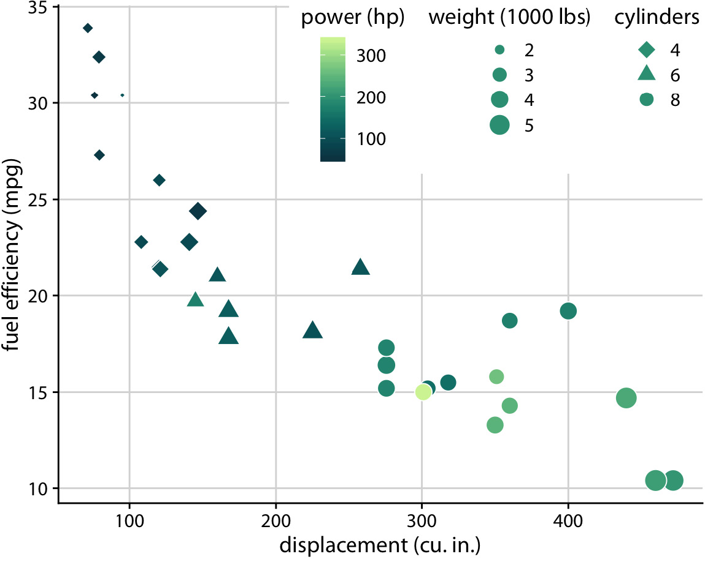

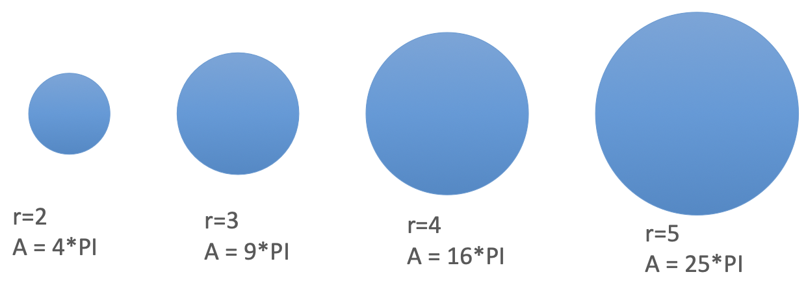

<!-- There's a common problem when mapping values to the size of circles. If we double the diameter, the area grows by four times, not twice. In the legend shown here, the relationship between values and circle size is incorrect - the area of circles should grow proportionally to the values. The correct solution would be to map values to the square root of the radius to maintain a proportional relationship. This is a common issue in many charts and libraries. -->

---

# Non Linear Axes

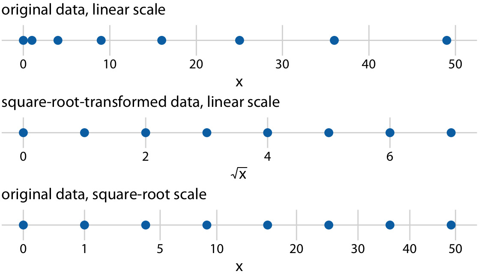

<!-- Here we see three different ways of representing the same data. The top shows the original data on a linear scale, where points are clustered near the beginning. The middle shows the data with a square root transformation but still displayed on a linear scale - now the points are more evenly spaced. The bottom shows the original data but displayed using a square root scale - this achieves the same visual effect. This demonstrates how we can either transform the data or transform the scale to achieve different visual representations. -->

---

# ObservableHQ – Introduction to D3.js Scales
https://observablehq.com/@d3/introduction-to-d3s-scales

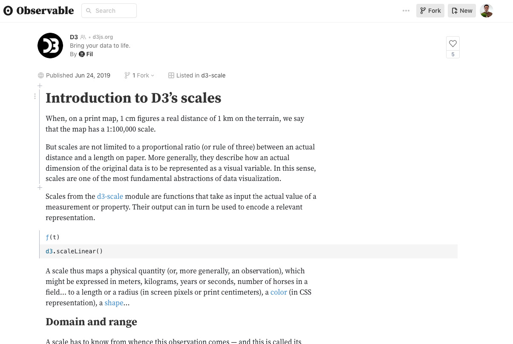

<!-- D3.js provides a rich set of scale functions that implement the theory of visual variables. Instead of reinventing the mapping for every visualization, D3 offers functions that help us find and learn this mapping in an easy and controlled way. The scale.linear() function creates a linear mapping from an input domain to an output range, and can be used as a function to map any value from the domain to the range. -->

---

# ObservableHQ – Discrete Scales
https://observablehq.com/@d3/quantile-quantize-and-threshold-scales

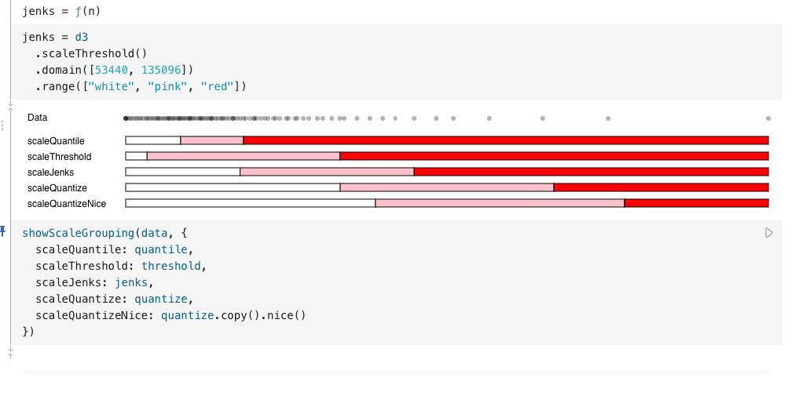

<!-- D3 provides several types of discrete scales for transforming continuous data into discrete bins. For example, quantile scales divide data into bins with equal numbers of elements, while threshold scales use specific breakpoints. These are particularly useful when transforming continuous data into ordinal or nominal data types, which we need to pay special attention to in order to process all parts of the information correctly. -->

---

# ObservableHQ – Sequential Scales
https://observablehq.com/@d3/sequential-scales

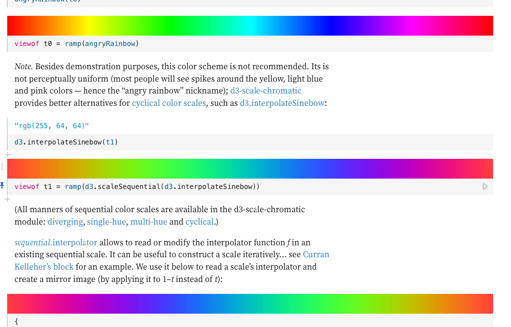

<!-- Sequential scales are useful for continuous data ranges where we want a smooth progression between values, often used with color scales. Here we see examples of color ramps that map continuous domains to color ranges. D3 provides special interpolators for color spaces to ensure perceptually uniform color scales, which are better than simple RGB interpolation. -->

---

# ObservableHQ – Diverging Scales
https://observablehq.com/@d3/diverging-scales

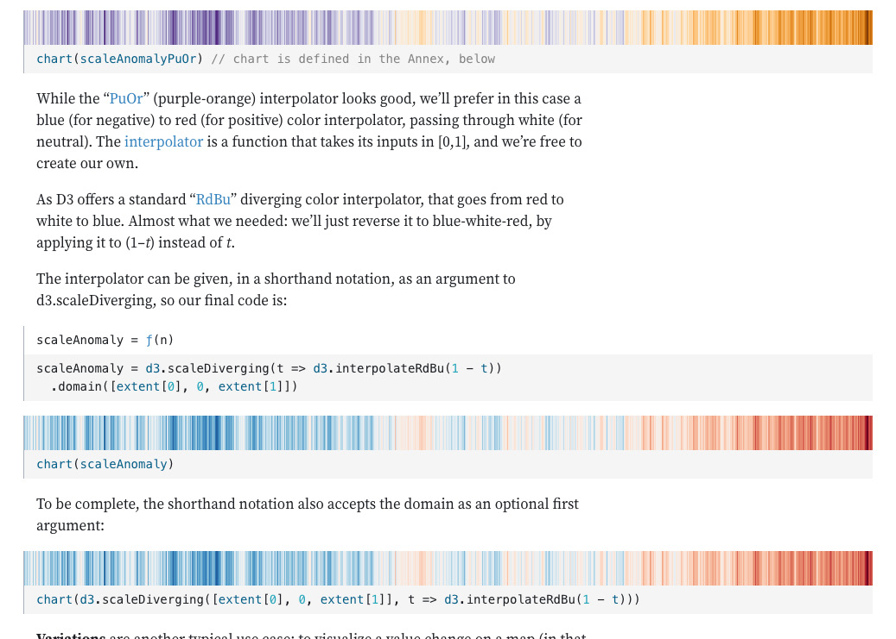

<!-- Diverging scales are useful when data has a meaningful midpoint and we want to emphasize deviations in two directions. For example, temperature anomalies where zero represents no change, negative values show cooling, and positive values show warming. These scales typically use two different color progressions meeting at a neutral middle point. -->

---

# ObservableHQ – Qualitative Scales
https://observablehq.com/@d3/d3-scaleordinal

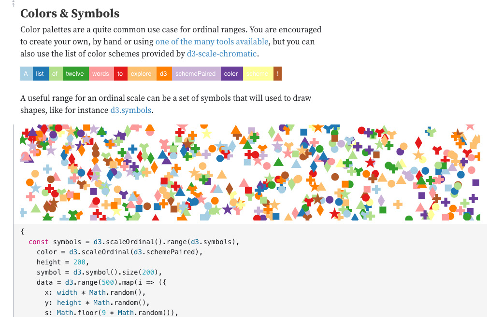

<!-- For categorical or nominal data, D3 provides ordinal scales that map discrete domains to discrete ranges. These are commonly used with color palettes or symbol sets to represent categories. D3.scaleOrdinal() has a useful behavior where it automatically assigns new values to the next available range item and maintains consistent assignments for values it has seen before. This is particularly helpful when data arrives incrementally. -->
