<!--  -->

<!-- _class: cover -->
<!-- _paginate: skip -->

  <h1>5 • Scales Functions</h1>
  <!-- 
A subtitle
 -->

  

    
teacher

    
Salvatore Rinzivillo

    
Daniele Fadda

     
    
tutor

    
Eleonora Cappuccio

  

  

    <strong>University of Pisa</strong> 
    Department of Computer Science 
    Course: Visual Analytics (602AA) 
    Academic Year: {{ACADEMIC_YEAR}}    
  

<!-- Le funzioni di scala sono il fondamento della teoria delle variabili visive. 
Sono le funzioni responsabili della trasformazione dei dati in caratteristiche visive come dimensione, forma, posizione, lunghezza, angoli e altri elementi visivi che abbiamo già visto. 
Trasformano un valore dato in input in un output visivo -->

---

# Map Data to Visual Variables

- We specify a scaling function to map data values to the visual representation
- A **scale** is a unique mapping between data and visual representation
- Scales are **functions** that map from an *input* domain to an *output* range 

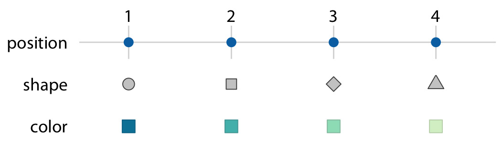

<!-- Parliamo del DOMINIO quando ci riferiamo ai dati veri e propri. 
Un dominio può essere rappresentato:
- dai valori minimo e massimo di un attributo, ad esempio nel caso di temperature: la temperatura minima e massima, 
- da un insieme di valori ordinati (ad esempio i mesi dell'anno).
- da un insieme di valori categorici.

Il RANGE di output è legato invece allo spazio della visualizzazione, alle caratteristiche della rappresentazione visiva che vogliamo creare. 
È legato al supporto fisico in cui viene visualizzata l'informazione, ad esempio:
- lo spazio disponibile su una pagina, 
- lo spazio disponibile su uno schermo, 
- l'estensione della gamma di colori che possiamo usare.
Se stiamo lavorando per il web avremo a disposizione 16 milioni di colori, 
mentre se stiamo impaginando un libro che deve essere letto su un ebook reader, avremo a disposizione solo 2 colori: bianco e nero.
In questo esempio, abbiamo tre diverse funzioni di scala che mappano i valori Dominio(1-4) su posizione (0 100px 200px 300px), forma (cerchio, quadrato, rombo, triangolo) e colore. -->

---

# Positional Scales: Axis

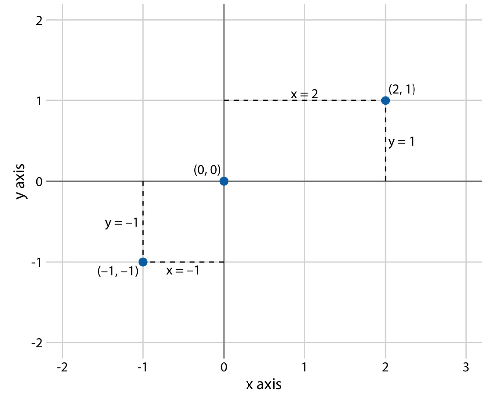

- Axis are at the base of many scientific plots
- Cartesian coordinate systems are composed of two orthogonal axis
- Values are positioned proportionally on the axes 

<!-- Le scale di posizione sono probabilmente le variabili visive più comunemente utilizzate. 
Vengono usate per mappare e posizionare gli elementi all'interno dello spazio visivo.

Gli ASSI sono linee orientate che fungono da griglia e aiutano l'osservatore a interpretare le distanze nello spazio visivo come distanze nel dominio dei dati. 

Riprendendo quanto detto ieri sulla percezione e il confronto tra gli elmenenti, la GRIGLIA degli assi aiuta a interpretare le distanze tra i punti come differenze nei valori dei dati. 

Affronteremo più avanti il concetto di data-ink ratio, che in poche parole è il rapporto tra l'informazione trasmessa da una visualizzazione e l'inchiostro usato per disegnarla.

È importante notare che gli assi, pur essendo fondamentali per la comprensione dei dati, non contengono dati in sé. 
Quindi possono essere considerati come "ink" che non trasmette informazione, pertanto quando vi apprestate a progettare una visualizzazione, considerate attentamente se gli assi e la griglia sono necessari o se possono essere rimossi, ridotti per aumentare il data-ink ratio. 

Plus di Altair rispetto a Matplotlib nel default.

-->

---

# Cartesian Diagram with Different Scales

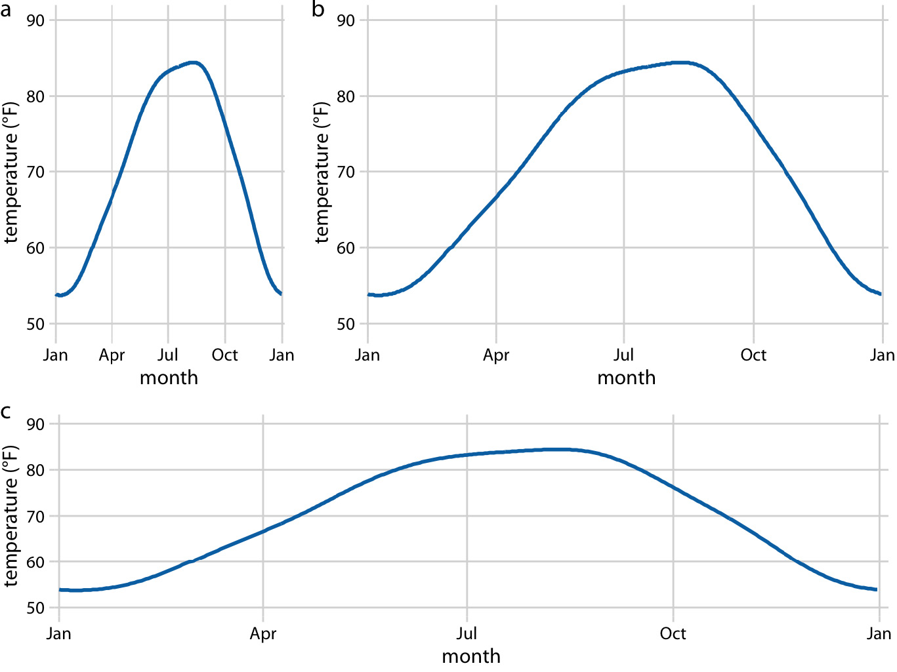

<!-- Qui abbiamo lo stesso diagramma (stesso dominio) con diverse scale. I tre grafici condividono la stessa funzione di scala per l'asse Y. Tuttavia, l'asse X ha tre mappature diverse. 

Nel primo grafico, i trimestri o mesi sono compressi orizzontalmente rispetto al secondo e al terzo. Modificando la definizione delle scale, si vede come cambia il risultato finale: il picco è più accentuato nel primo grafico rispetto al secondo.

Questa è un esempio di come le scale possano influenzare la percezione dei dati. Ed è un esempio di potenziale uso malevolo che può essere fatto delle visualizzazioni, per distorcere un fenomeno. -->

---

# Cartesian Diagram with Different Scales

- 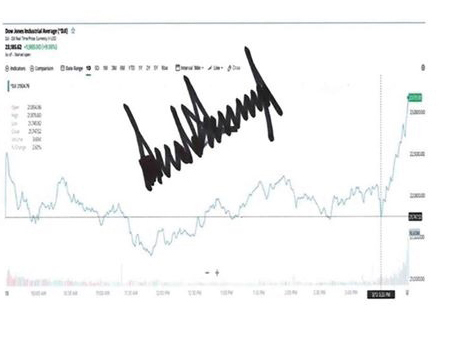
* CHART THAT TRUMP SIGNED  AND SENT TO HIS FOLLOWERS 

* 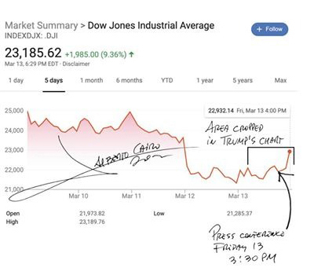 
* CHART THAT ALBERTO CAIRO SIGNED  AND SENT TO HIS FOLLOWERS

<!-- 

Questo grafico mostra l'andamento dell'indice Dow Jones.

- Qual è il messaggio immediato che estraete da questo andamento? 
- Come descrivereste il trend?

Svelamento: Mostrare il grafico originale completo fornito da Cairo

- Perché il ritaglio dell'asse altera così drasticamente la percezione, pur utilizzando dati reali? 

Il grafico a sinistra, firmato da Trump, utilizza una scala temporale diversa rispetto a quello a destra, il che incide sull'aspetto del trend dei dati. Ciò dimostra come le scale possano essere usate per enfatizzare o minimizzare determinati aspetti dei dati. 

Alberto Cairo è un visulization designer e art director che si è occupato molto di divulgazione scientifica su questi temi.  The Functional Art è un libro in cui Cairo mostra come utilizzare grafici statistici, mappe e diagrammi per individuare le STORIE nei dati. (libro poco tecnico, molto interessante per l'approccio alla progettazione della visualizzazione)
-->

---

# Cartesian Axes with Same Scale

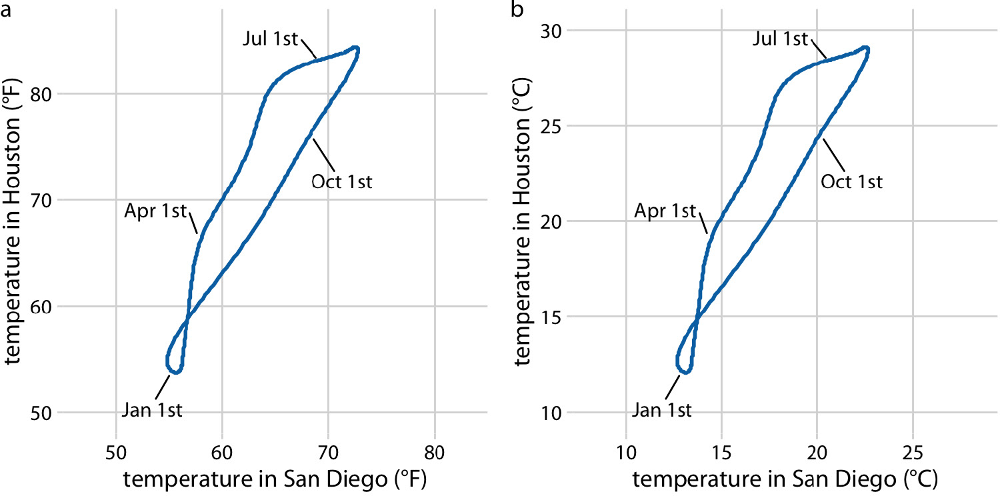

<!-- In questi grafici abbiamo la temperatura espressa in Fahrenheit a sinistra e in Celsius a destra. 

Le due unità hanno una dipendenza lineare, ed esiste una formula per convertire l'una nell'altra. 

Sebbene i domini di input siano diversi, le forme appaiono simili perché la trasformazione tra Fahrenheit e Celsius è lineare. Bisogna ricordare che:

Quando si mappa un dominio linearmente sullo spazio visivo, se due domini hanno una relazione tra loro, quella relazione viene mantenuta nello spazio visivo. 
-->

---

# Non Linear Axes

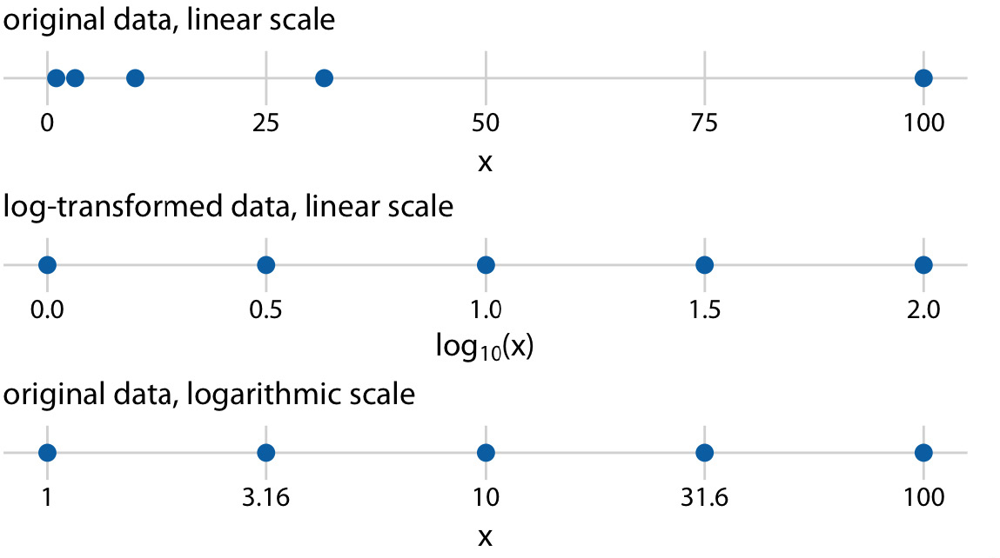

<!-- A volte è utile se non necessario utilizzare TIPI DI SCALE DIVERSE da quella lineare.
In particolare quando la distribuzione dei dati è asimmetrica. 
Se molti valori sono concentrati vicino allo zero con pochi valori molto distanti, una scala lineare comprimerebbe la maggior parte della visualizzazione in uno spazio ridotto. 

In questi casi si usano spesso le scale logaritmiche o altre trasformazioni. Le scale logaritmiche possono essere insidiose perché l'osservatore potrebbe non accorgersene facilmente: è quindi importante rendere evidente l'uso di queste scale con un'etichettatura appropriata e magari ribadendo questa cosa nel titolo del grafico. 

Quanto più avete consapevolezza dell'utente che andrà a vedere la visualizzazione, tanto più semplice sarà scegliere la visualizzazione più adatta. Se l'utente è un esperto di dati, potrebbe essere abituato ad interpretare correttamente una scala logaritmica, mentre un pubblico generale potrebbe non capire la differenza e trarre conclusioni errate.
 -->

---

# Non Linear Axes

- 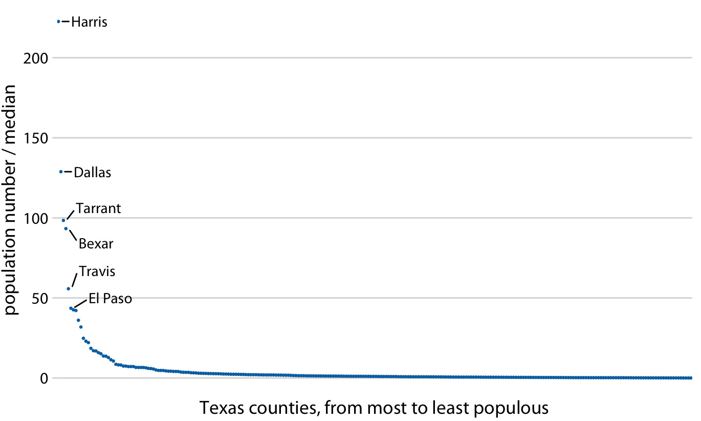 

* 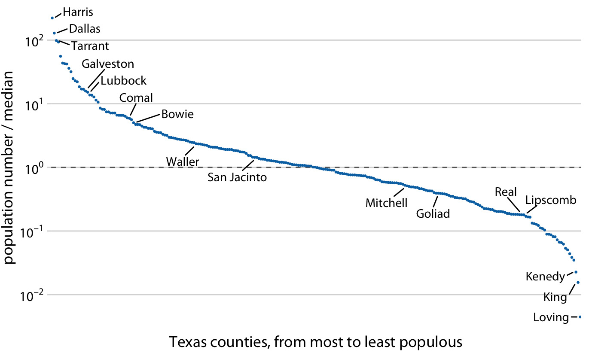

<!-- 
In questa immagine è stata visualizzata la popolazione delle contee del Texas.

Domanda: Dal punto di vista dell'Information Design, perché questo grafico lineare è inefficace? Cosa ci impedisce di leggere?

Reveal: "Quando è obbligatorio passare a una scala non lineare? Come cambia la percezione della magnitudo nei visual mark da parte dell'utente finale?"

Qui possiamo vedere come diverse funzioni di scala possano offrire viste differenti degli stessi dati. Il grafico a destra utilizza una scala logaritmica che permette di vedere la distribuzione in modo più chiaro, specialmente per le contee con popolazioni molto variabili. 

Il grafico a sinistra usa una scala lineare, che comprime la maggior parte dei dati nella parte bassa, perdendo risoluzione per i valori più piccoli. Per certe distribuzioni di dati, le scale non lineari possono essere molto più utili. -->

---

<!-- paginate: false -->

# Example

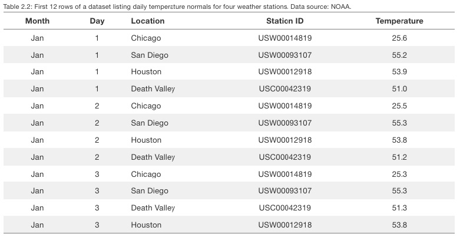

<!-- 
Riprendiamo l'esempio 
In questo dataset abbiamo diversi tipi di dati: 
mese e giorno sono di tipo *ordinale*, posizione e ID della stazione sono di tipo *nominale*, e la temperatura è di tipo *quantitativo*. Quando si visualizzano questi dati, è necessario scegliere funzioni di scala appropriate per ciascun tipo. -->

---
<!-- paginate: true -->

# Example

- Temperature (quantitative) on a linear axis (y)
- Month and day (ordinal) on a linear axis (x)
- City (nominal) on a color hue scale

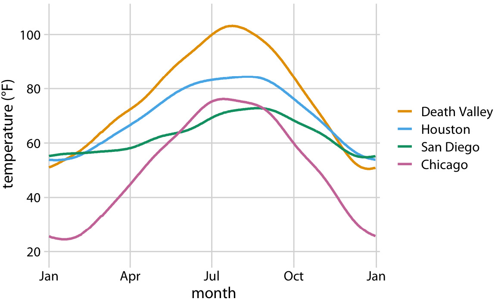

<!-- In questo esempio abbiamo un grafico in cui il tipo di dato quantitativo (temperatura) è mappato su un asse Y lineare.

Sull'asse X abbiamo i mesi, anch'essi mappati con un asse lineare. 
Il colore mappa la città, che è un tipo di dato nominale. 
La legenda aiuta a capire a quale città corrisponde ciascun colore. -->

---

# Example

- Month (ordinal) on a ordinal axis (x)
- City (nominal) on a ordinal axis (y) (order determined on sum of temperatures on the line)
- Temperature (quantitative) on a color scale
 

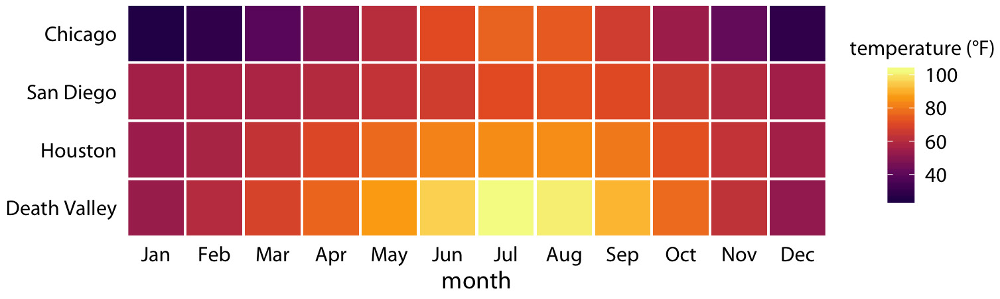

<!-- Questa è una rappresentazione alternativa degli stessi dati. 
Qui i mesi sono mappati sull'asse X come prima, ma le città sono ora mappate sull'asse Y in un ordine determinato dalla somma delle temperature. 
I valori di temperatura sono mappati sui colori. 

Questa heatmap offre una vista diversa dei pattern di temperatura tra città e mesi. -->

---

# Curved Axes

 

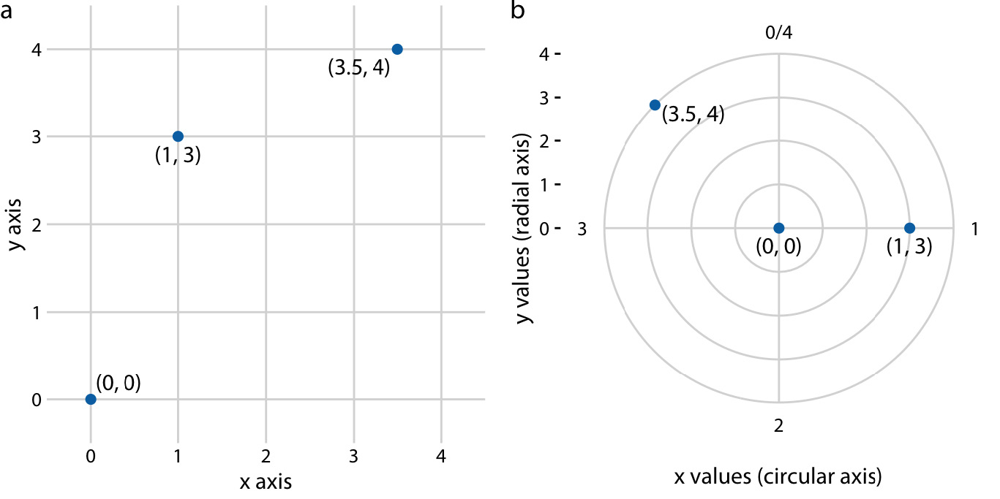

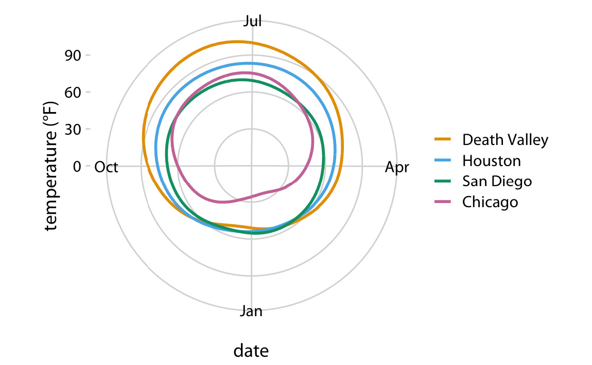

<!-- Per domini con comportamento ciclico, come il tempo, si possono usare assi curvi. 

Si tratta di una funzione di scala speciale per la posizione in cui il dominio di input viene mappato su un range di output compreso tra 0 360 gradi.
Così facendo si trasforma uno spazio lineare in uno spazio di coordinate polari. 

Questo può aiutare a visualizzare RELAZIONI CICLICHE, ad esempio il fatto che dicembre e gennaio siano temporalmente vicini, nonostante siano lontani in una rappresentazione lineare come quelle viste nei grafici precedenti. 

-->

---

# Radar Chart (Don't use it)

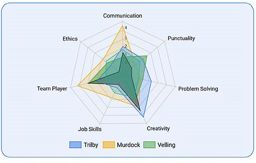

<!-- Un esempio di visualizzazione con assi curvi è il radar chart, in cui più variabili sono mappate su assi che partono da un punto centrale e si estendono radialmente. Ogni asse rappresenta una variabile diversa, e i valori vengono mappati lungo questi assi. Questo tipo di grafico è utile per confrontare più variabili contemporaneamente.

- Questa forma crea l'illusione di EQUILIBRIO o simmetria, ma non sempre corrisponde alla realtà. Le categorie possono avere pesi diversi e la scala può esagerare le piccole variazioni. 
- Attenzione! l'ORDINE degli assi può influenzare la percezione del grafico. 
- Il grafico a radar è molto utilizzato per confrontare elementi: prodotti, persone, team. 
- Sembra elegante, ma confrontare CATEGORIE che NON HANNO LO STESSO SIGNIFICATO può essere fuorviante. 
- Se una categoria presenta valori molto più alti delle altre, può distogliere l'attenzione da aree più rilevanti. 
- Il concetto stesso di "area" in un radar chart è fuorviante, poiché l'area non è proporzionale ai valori rappresentati. Per questi motivi, il radar chart è spesso sconsigliato per la visualizzazione dei dati.

Se proprio dovete usarlo... meglio una versione a linee, senza area, e con un numero limitato di categorie. (Parallel plot)
-->

---

# Size Scale Issues

If you double the data, how much does it increase visually?

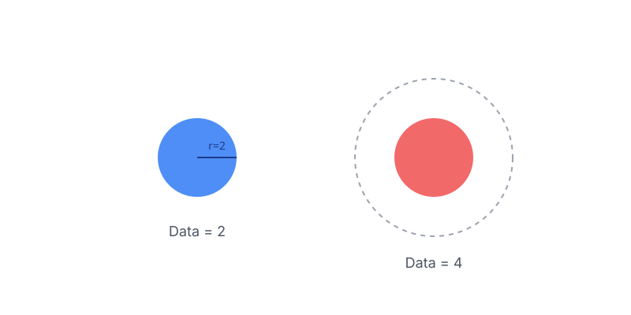

<!-- DOMANDA: "Se mappiamo un valore quantitativo sul raggio di un cerchio e raddoppiamo il valore del dato (da 2 a 4), di quanto ci appare più grande il cerchio visivamente?" -->

---

# Size Scale Issues

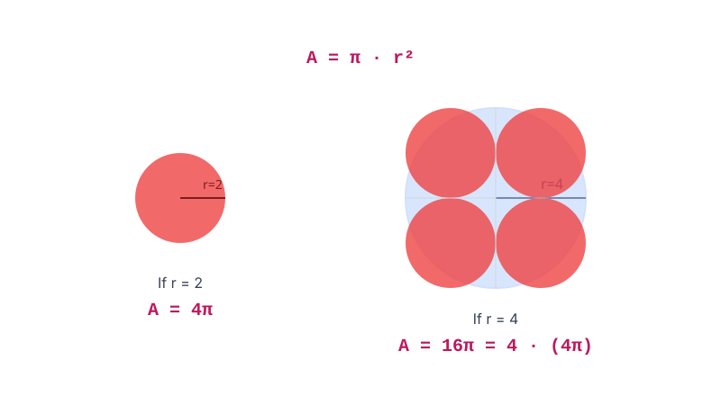

<!--  l'area non raddoppia, ma quadruplica ($16 \cdot \pi$) rispetto a $r=2$ ($4 \cdot \pi$). -->

---

# Size Scale Issues

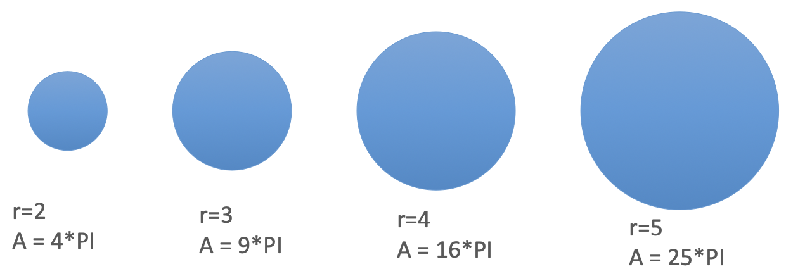

<!-- Esiste un problema comune quando si mappano valori sulla dimensione dei cerchi. Se si raddoppia il diametro, l'area cresce di quattro volte, non di due. Nella legenda mostrata qui, la relazione tra i valori e la dimensione dei cerchi è errata: l'area dei cerchi dovrebbe crescere proporzionalmente ai valori. La soluzione corretta è mappare i valori sulla radice quadrata del raggio per mantenere una relazione proporzionale. Si tratta di un errore frequente in molti grafici e che le librerie più smart vi aiutano ad evitare (ma non tutte, ad esempio in D3.js questa proprietà deve essere gestita manualmente) -->

---

<!-- paginate: false -->

# Example

- Displacement (quantitative) on linear axis (x)
- Fuel efficiency (quantitative) on linear axis (y)
- Power (quantitative) on lineal color scale 
- Weight (quantitative -> ordinal) on linear squared size scale
- Cylinders (ordinal -> nominal) on shape scale

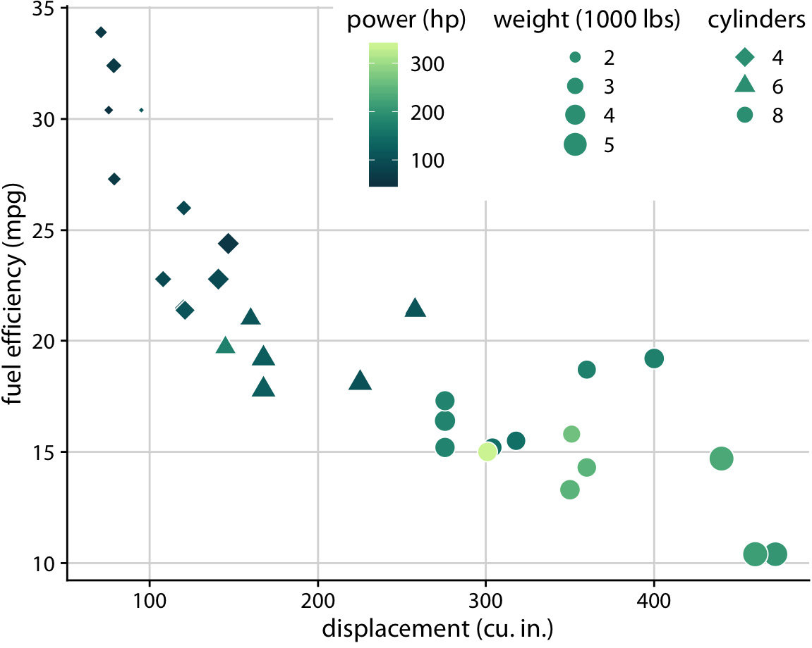

<!-- È utile soffermarci su questo grafico comunque perché è interessante:
Possiamo vedere una mappa più dimensioni contemporaneamente.

Le due dimensioni quantitative (cilindrata e consumo di carburante) sono mappate usando la posizione sugli assi X e Y. 

La potenza è mappata con una scala di colori. 

Il peso è stato discretizzato da quantitativo a ordinale ed è mappato sulla dimensione dei simboli.

I cilindri, che sono ordinali, sono stati degradati a nominali e mappati su forme diverse. 

Questo permette di studiare le relazioni tra più variabili simultaneamente. -->

---

# ObservableHQ – Introduction to D3.js Scales
https://observablehq.com/@d3/introduction-to-d3s-scales

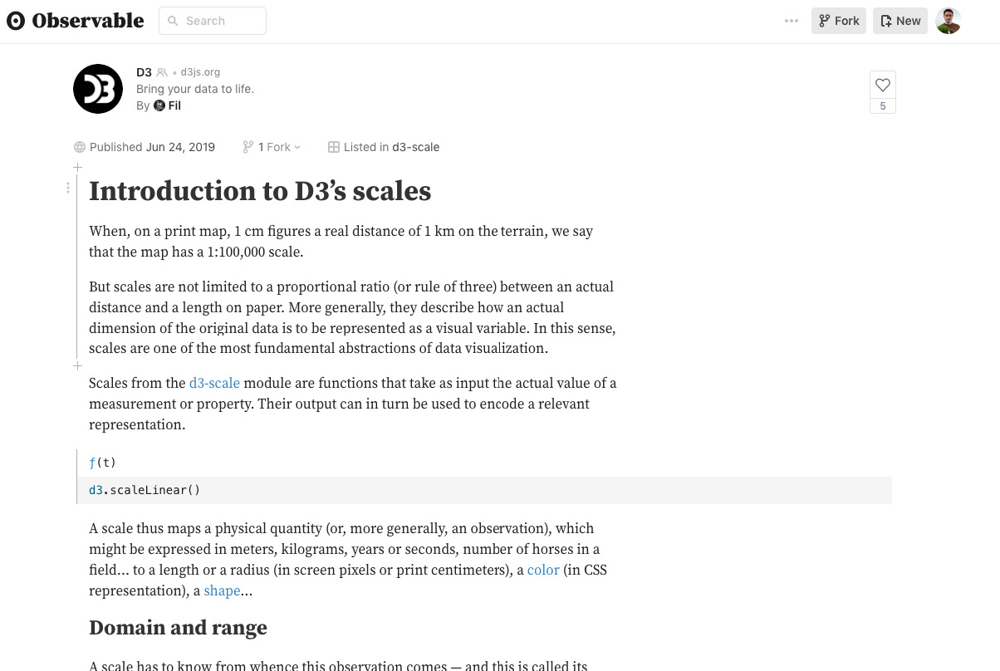

<!-- Altair si basa su D3.js per il rendering e varie proprietà.

Dal momento che esistono molti esempi di documentazione interattiva su D3, vi abbiamo lasciato alcuni link per approfondire le funzioni di scala. Chiaramente ci sono delle differenze tra D3 e Altair dal punto di vista dell'implementazione, ma i concetti di base sono gli stessi.

queste librerie forniscono un ricco insieme di funzioni di scala che implementano la teoria delle variabili visive. 

Invece di implementare manualmente le scale per ogni visualizzazione, offrono funzioni che ci aiutano a definire e gestire questa mappatura in modo semplice e controllato. 

La funzione di scala lineare crea una mappatura lineare da un dominio di input a un range di output e può essere usata come funzione per mappare qualsiasi valore dal domain al range. -->

---
# ObservableHQ – Discrete Scales
https://observablehq.com/@d3/quantile-quantize-and-threshold-scales

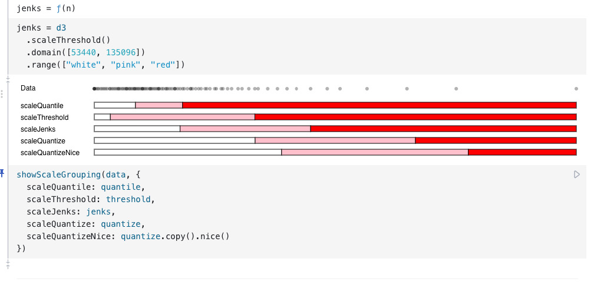

<!-- Altair (o d3) fornisce diversi tipi di scale discrete per trasformare dati continui in intervalli discreti. 

Ad esempio, le scale quantile dividono i dati in intervalli con lo stesso numero di elementi, mentre le scale threshold usano punti di interruzione specifici. Sono particolarmente utili quando si trasformano dati continui in tipi ordinali o nominali.

Ricordiamo in questo contesto che i dati quantitativi possono essere trasformati in dati ordinali o nominali, ma non viceversa. Ad esempio, possiamo prendere un intervallo di temperature e suddividerlo in categorie come "basso", "medio" e "alto", ma non possiamo prendere queste categorie e trasformarle indietro in valori quantitativi precisi. 

Le scale discrete ci aiutano a fare questa trasformazione da continuo a discreto. 
 -->

---

# ObservableHQ – Sequential Scales
https://observablehq.com/@d3/sequential-scales

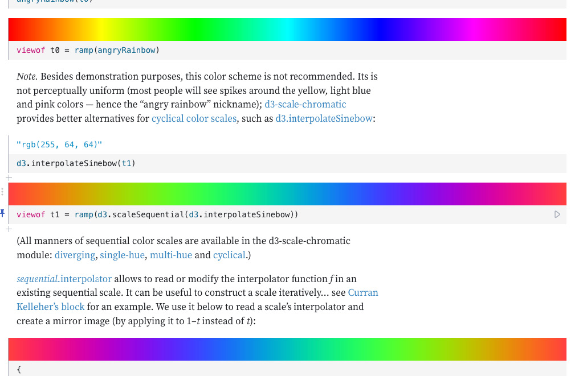

<!-- Le scale sequenziali sono utili per intervalli di dati continui in cui si vuole una progressione fluida tra i valori, spesso usate con scale di colore. 

Qui vediamo esempi di rampe di colore che mappano domini continui su range di colori. Ne esistono di standard ma c'è anche la possibilità di utilizzare degli interpolatori speciali per gli spazi colore, che garantiscono scale di colore percettivamente uniformi, superiori alla semplice interpolazione RGB. 

(Questo sarà approfondito nella prossima lezione quando parleremo di colori)

-->

---

# ObservableHQ – Diverging Scales
https://observablehq.com/@d3/diverging-scales

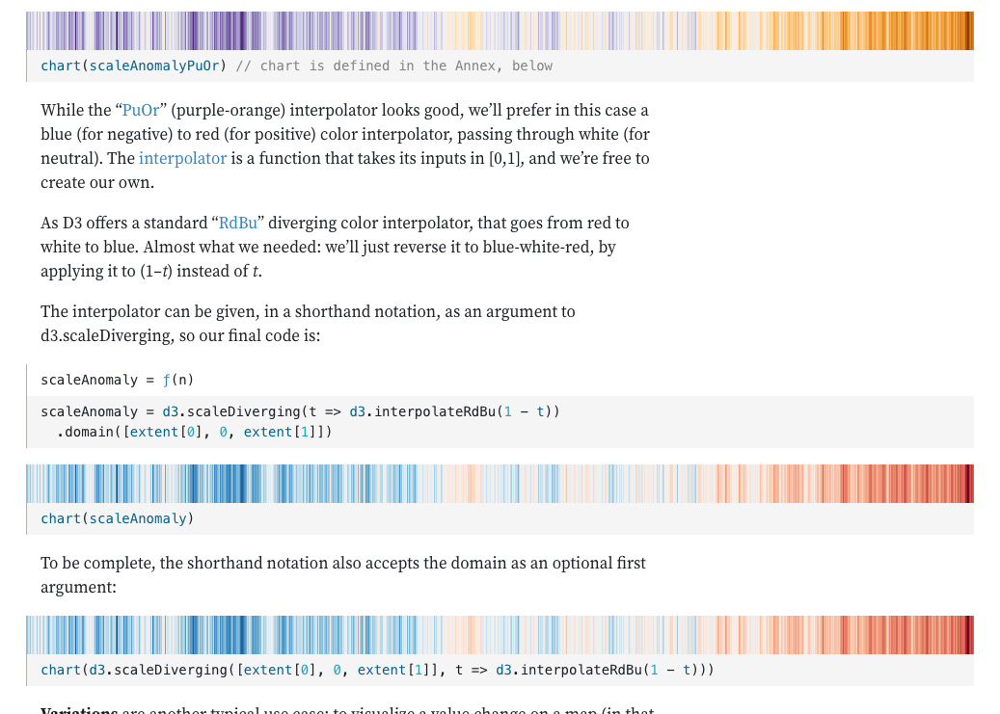

<!-- Le scale divergenti sono utili quando i dati hanno un punto medio significativo e si vogliono enfatizzare le deviazioni in due direzioni. Ad esempio, le anomalie di temperatura in cui zero rappresenta nessuna variazione, i valori negativi indicano raffreddamento e quelli positivi riscaldamento. Queste scale usano tipicamente due progressioni di colore diverse che si incontrano in un punto centrale neutro. 

Come abbiamo già detto ieri, l'uomo è molto bravo a quantificare partendo da un punto di riferimento, quindi le scale divergenti sono molto efficaci. 

È una buona prassi prediligere queste scale (anche trasformando opportunamente i dati) perché veicolano messaggi più chiari e dove si suggerisce un'interpretazione, piuttsto che lasciare il lavoro all'utente (come avviene con le scale sequenziali)

-->

---

# ObservableHQ – Qualitative Scales
https://observablehq.com/@d3/d3-scaleordinal

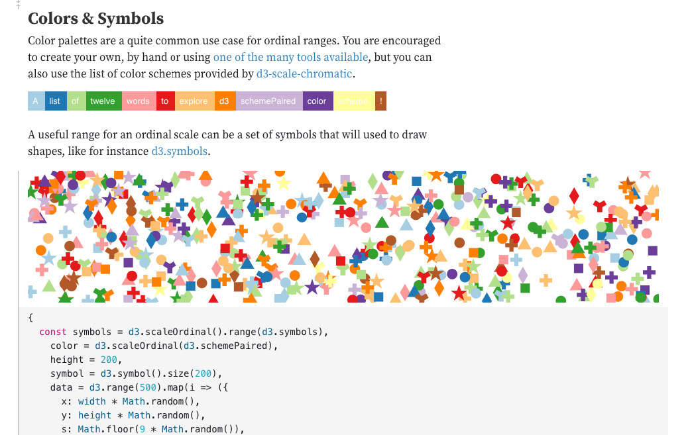

<!-- Per dati categorici o nominali, D3 fornisce scale ordinali che mappano domini discreti su range discreti. Vengono comunemente usate con palette di colori o set di simboli per rappresentare categorie. Queste scale normalmente assegnano automaticamente i nuovi valori al successivo elemento disponibile del range e mantiene assegnazioni coerenti per i valori già incontrati. Questo è particolarmente utile quando i dati arrivano in modo incrementale. 

Il limite dell'assegnazione automatica è che non c'è controllo su quale categoria viene mappata a quale colore o simbolo, il che può essere problematico se si desidera una mappatura specifica. In questi casi, è possibile definire manualmente la mappatura specificando esplicitamente quali valori del dominio corrispondono a quali elementi del range.

Inoltre è utile effettuare una mappatura coerente soprattutto quando si hanno più visualizzazioni che condividono le stesse categorie, in modo che lo stesso colore o simbolo rappresenti la stessa categoria in tutte le visualizzazioni.

-->
