<!-- _class: cover -->
<!-- _paginate: skip -->

  <h1>6 • Colors</h1>
  <!-- 
A subtitle
 -->

  

    
teacher

    
Salvatore Rinzivillo

    
Daniele Fadda

     
    
tutor

    
Eleonora Cappuccio

  

  

    <strong>University of Pisa</strong> 
    Department of Computer Science 
    Course: Visual Analytics (602AA) 
    Academic Year: 2024/2025    
  

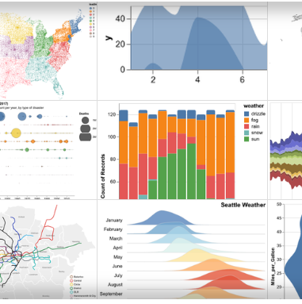

<!-- Scale functions are the basic foundation of the theory of visual variables. They are responsible for transforming data into visual characteristics like size, shape, position, length, angles, and other visual elements we've seen. Formally, they transform a value from an input domain and return a corresponding value in the output range. -->

---

# PHOTO RECEPTOR CELLS

- Two types of light sensitive cells
  - **Rod Cells (~120M)**
    - Provide low-light vision
    - Peripheral vision
    - Almost no role in color vision
  - **Cone cells (~6M)**
    - Provide normal vision
    - Three sub-types of cells
    - Sensitivity to different light wavelengths
    - Used for colored vision

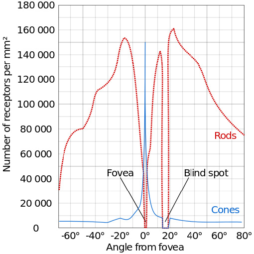

<!-- Slide explaining the two main types of photoreceptors in the human eye with their characteristics -->

---
# PHOTO RECEPTOR CELLS

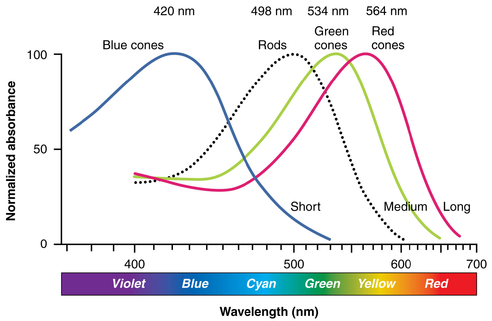

<!-- Slide showing the spectral sensitivity curves of different photoreceptors -->

---
# TEST YOUR COLOR PERCEPTION

http://color.method.ac

<!-- Slide with a color wheel tool for testing color perception -->

---
# COLOR OF THE YEAR: 2016

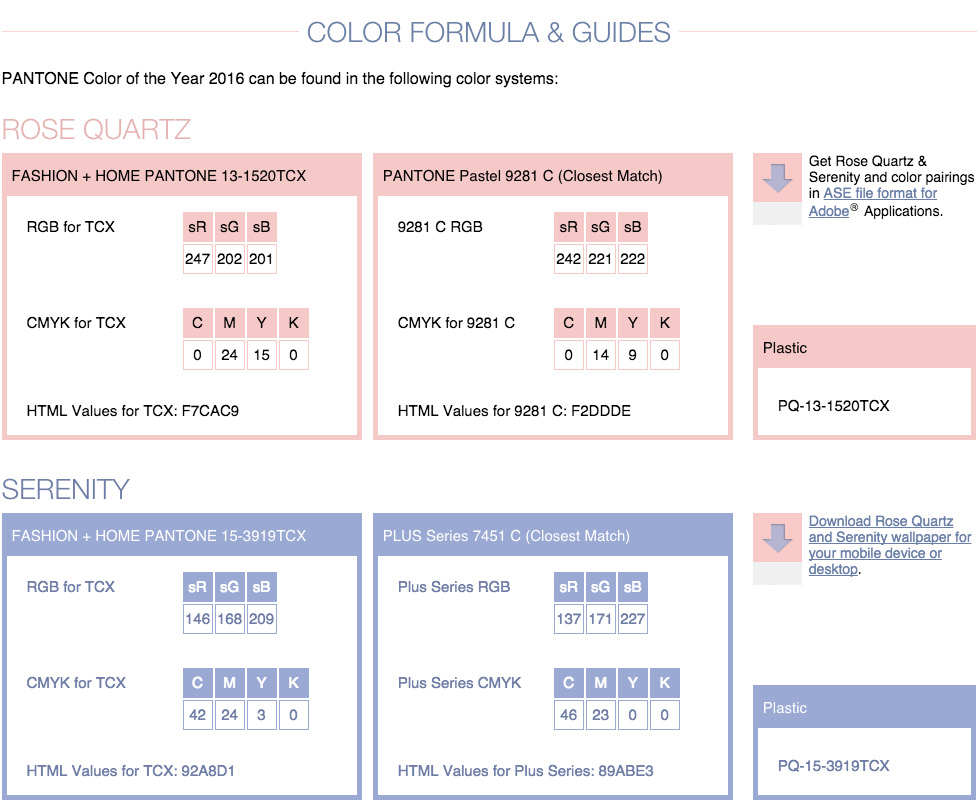

<!-- Pantone color of the year 2016 featuring Rose Quartz and Serenity -->

---
# COLOR OF THE YEAR 2017

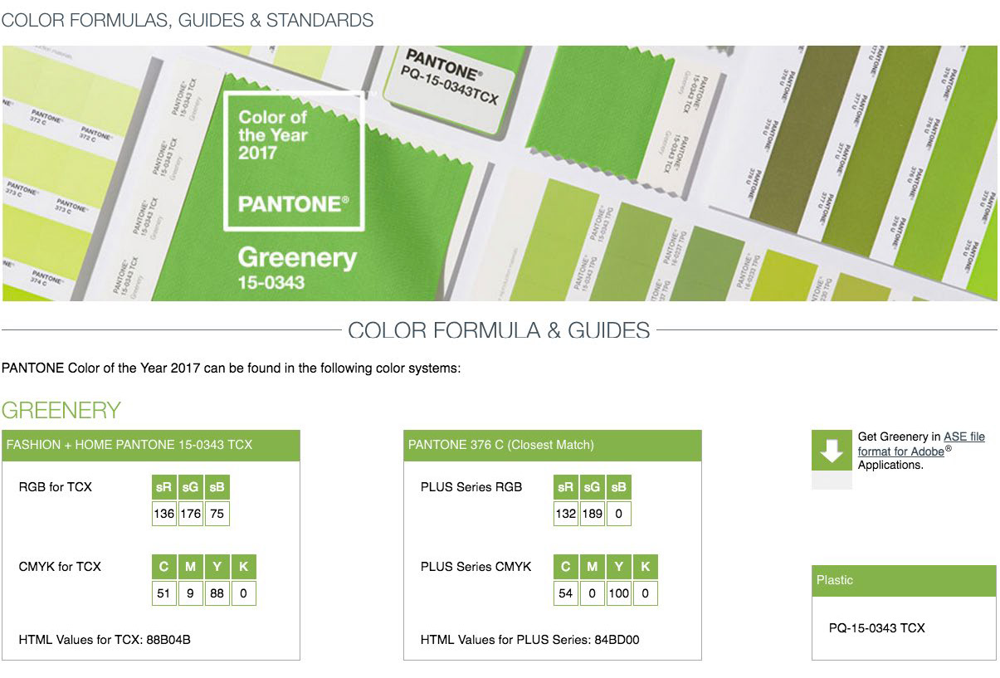

<!-- Pantone color of the year 2017 featuring Greenery -->

---
# COLOR OF THE YEAR 2019

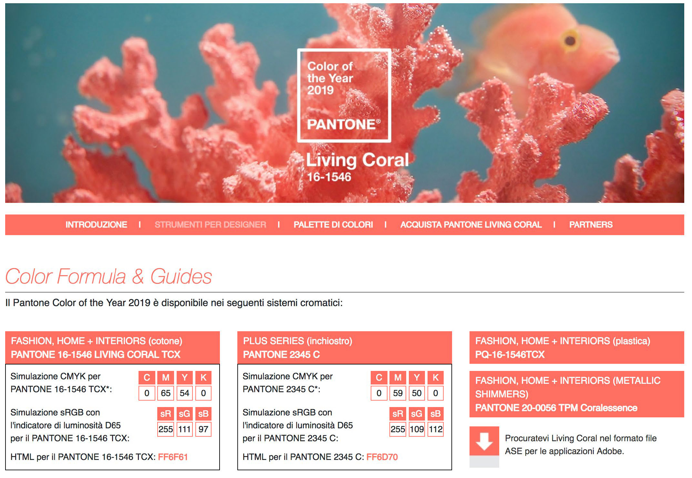

<!-- Pantone color of the year 2019 featuring Living Coral -->

---
# COLOR MODEL - NEWTON (OPTICKS, 1704)

- White light is a combination of all colors
- Could recombine colors back to white light
- Wrapping basic colors around a circle

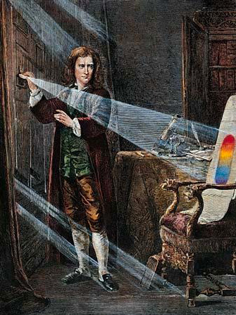

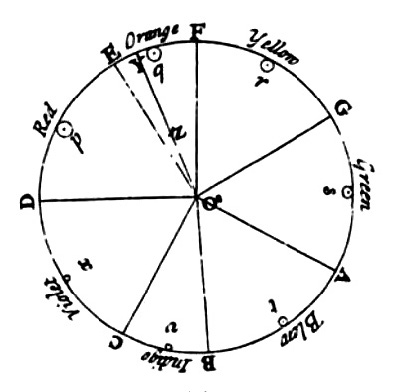

<!-- Explanation of Newton's color model and his experiments with light -->

---
# COLOR MODEL - COLOR CIRCLE (GOETHE, 1810)

- Measures of eye's response to color
- Three primary colors:
  - Magenta, yellow, blue

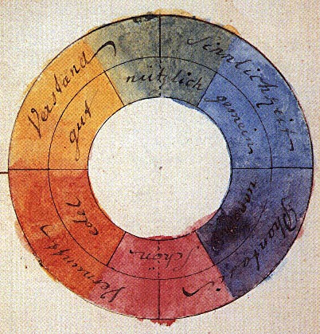

<!-- Goethe's color theory focusing on the psychological aspects of color perception -->

---

# COLOR MODELS - ADDITIVE AND SUBTRACTIVE MODELS

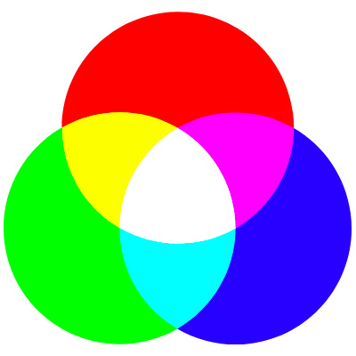
RGB additive model 

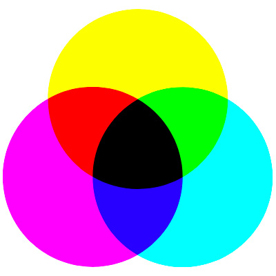
CMY subtractive model

<!-- Comparison of RGB additive and CMY subtractive color models -->

---
# COLOR MODELS - 3D SPACE MODELS (MAYER, 1775)

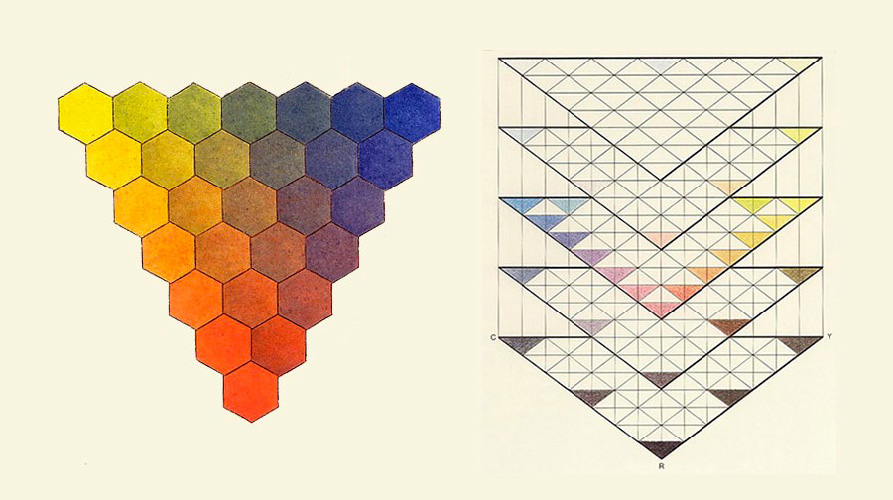

Problem: steps are not perceptually uniform

<!-- Early 3D color space model with explanation of its limitations -->

---
# COLOR MODELS - MUNSELL (EARLY 1900'S)

- Introduction of three new dimensions
  - HUE (red, blue, etc)
  - Value (light or dark)
  - Chroma (saturation)
- Irregular shape of solid
  - Low brightness implies fewer visible colors
- Introduction of a mathematical definition of colors (not names)

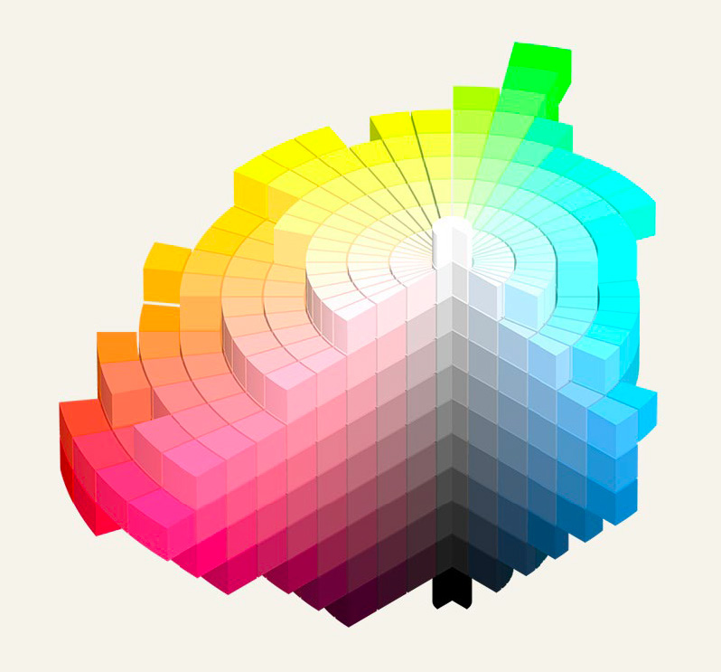

<!-- Explanation of the Munsell color system and its three-dimensional representation -->

---
# COLOR MODEL

- Young-Helmotz Theory (19th century)
  - Separate Red, Green, Blue receptors
  - Actually, three receptors type exist
    - Red and Green are located mainly in green-yellow zone
    - Sometimes named as Long, Medium, Short wavelength receptors
  - Eye present different proportions of R,G,B receptors (40:20:1)

<!-- Description of the Young-Helmholtz theory of trichromatic color vision -->

---
# OPPONENT COLOR THEORY

- Based on estimation of opposite readings
  - red-green comparison
  - blue-yellow comparison
  - dark-light comparison

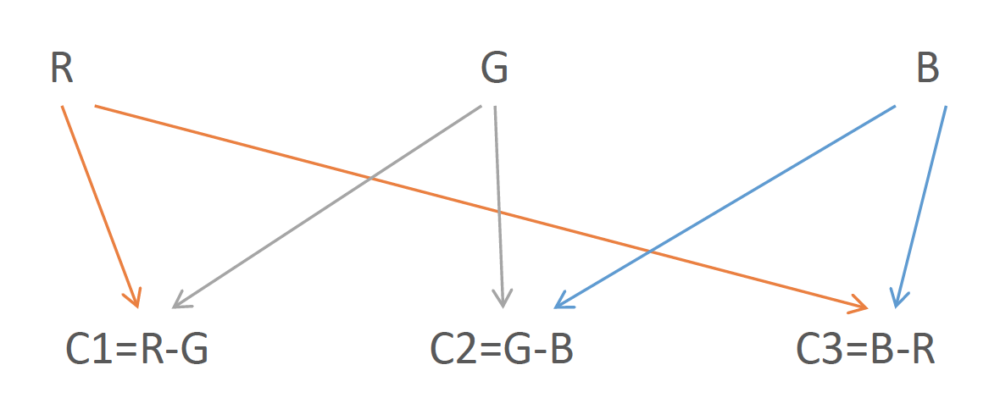

C1+C2+C3=0
C1=R-G &nbsp;&nbsp;&nbsp;&nbsp; C3-C2=B-R-G+B=2B-(R+G) &nbsp;&nbsp;&nbsp;&nbsp; A = 2R+G+B/20

<!-- Explanation of the Opponent Color Theory with the mathematical relationships -->

---
# RGB COLOR MODEL

- Based on direct specification of three primary colors
- Additive model, each component is summed with the others

 

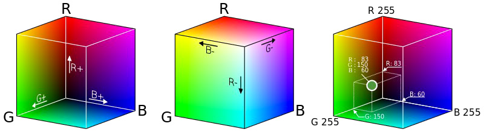

<!-- Detailed explanation of the RGB color model with visualizations -->

---
# RGB COLOR MODEL

- R,G,B values may be expressed in range [0,1]
- Some applications use the range [0,255]
- Usually a hexadecimal notation is used for range [0,ff]
- Not really intuitive: how to define brown?

<!-- Further explanation of RGB color model specifications and limitations -->

---
# HSV COLOR MODEL

- Based on the intuitive concepts of
  - Hue
  - Saturation
  - Value (or brightness: 0% implies black; 100% implies pure color)
  - Lightness (or luminosity: 0% implies black; 50% implies pure color; 100% implies white)
- Component values are expressed in ranges [0,1] or [0,255]

"Hsl-hsvmodels" by Jacob Rus-Ownwork. Licensedunder CC BY-SA 3.0 via WikimediaCommons-http://commons.wikimedia.org/wiki/File:Hsl-hsv_models.svg#/media/File:Hsl-hsv_models.svg

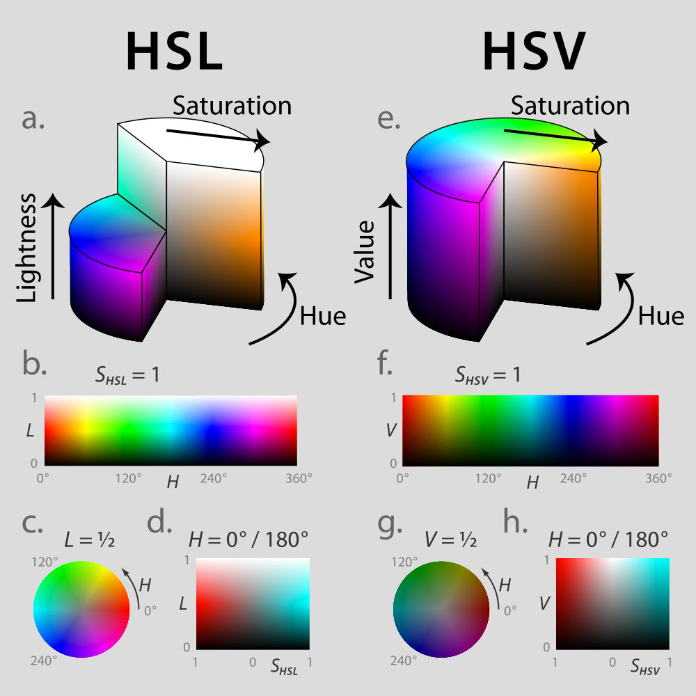

<!-- Explanation of the HSV color model and its components -->

---
# RGB AND HSV

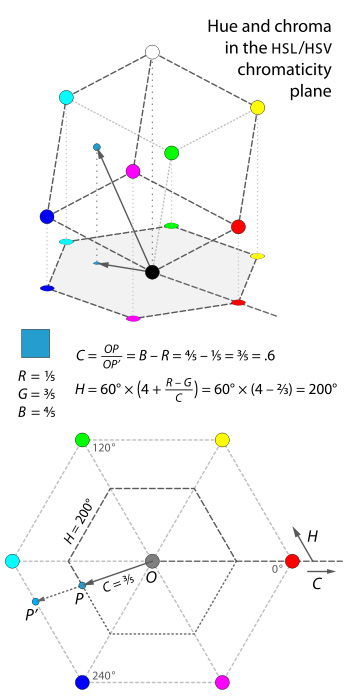

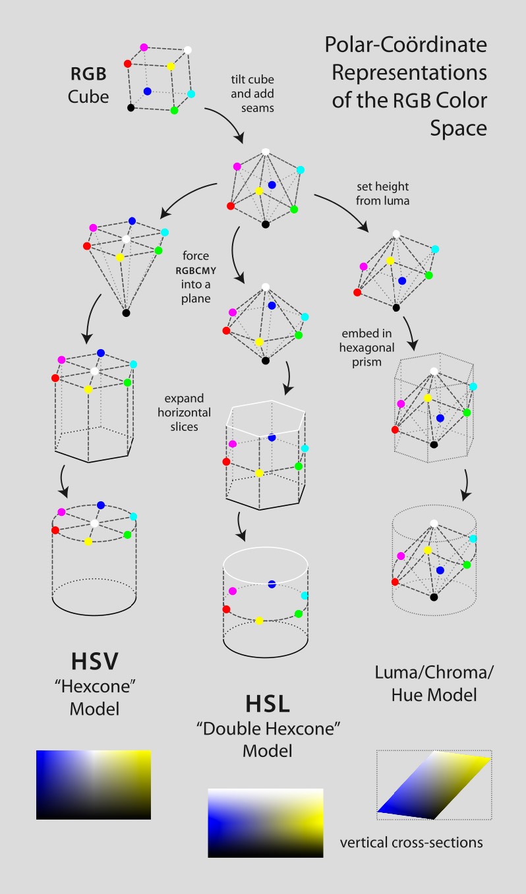

<!-- Comparison between RGB and HSV color models with diagrams -->

---

<!-- header: "" -->
<!-- _class: chapter -->
<!-- _paginate: skip -->

# COLOR SPACES

<!-- Section separator slide for Color Spaces -->

---
# CIE STANDARD OBSERVER

- CIE: International Commission on Illumination
- Definition of an objective color-mapping function:
  - Standard colorimetric observer
- Experiment
  - An observer is positioned in front of a bipartite screen
  - Observer can manipulate intensities of three primary color beams
  - Task: match the reference color

<!-- Explanation of the CIE standard observer experiment -->

---
# STANDARD OBSERVER EXPERIMENT

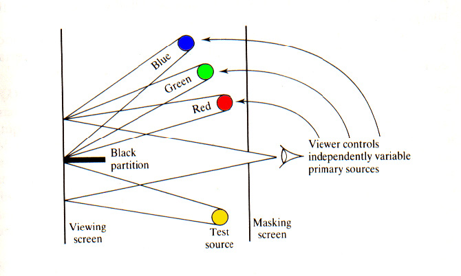

<!-- Visual representation of the standard observer experiment setup -->

---
# CHROMATICITY DIAGRAM

- A mixture of two colors lies on the line connecting the two colors
- Chromaticity Diagram (gamut) is convex
- All visible colors are non-negative combination of x, y, and z
- An equal combination of two colors does not lie in the mid-point

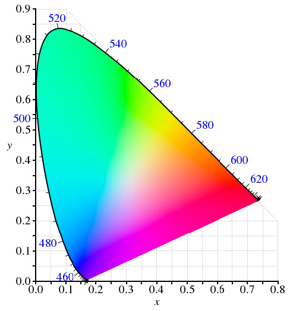

<!-- Explanation of the CIE chromaticity diagram properties -->

---
# COMPARING COLOR SPACES

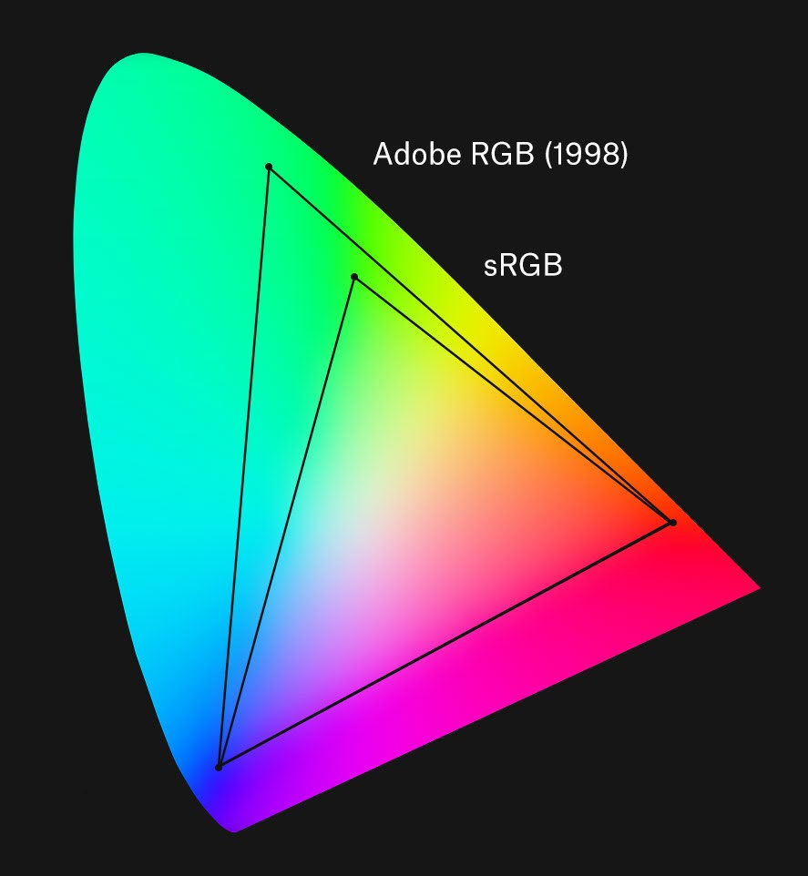

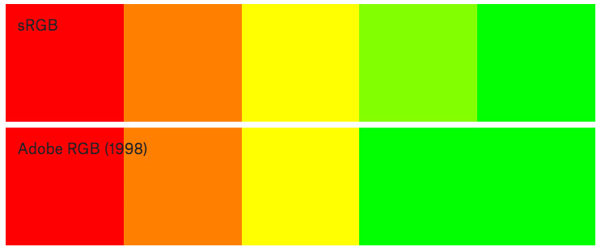

<!-- Comparison of different color spaces with visual examples -->

---

# COLOR MIXING

- Given three primary colors, the corresponding triangle cannot cover the whole gamut

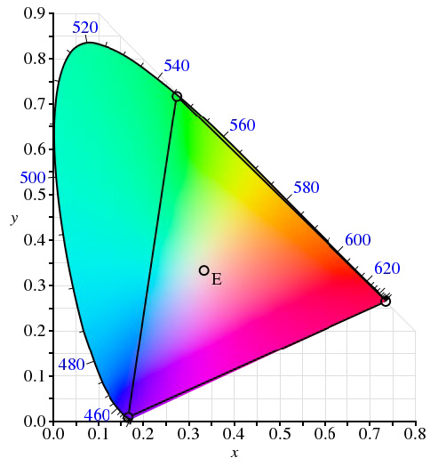

<!-- Explanation of color mixing limitations within a specific gamut -->

---

<!-- _class: chapter -->
<!-- _paginate: skip -->

# PALETTE

<!-- Section separator slide for Color Palette -->

---
# MAPPING VALUES TO COLOR SCHEMES

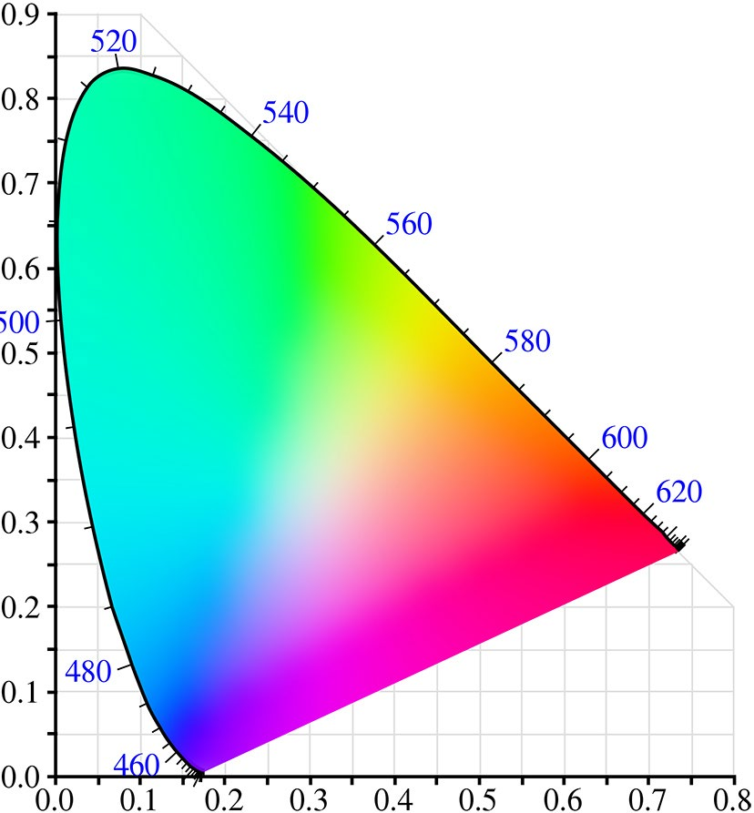

sRGB interpolation

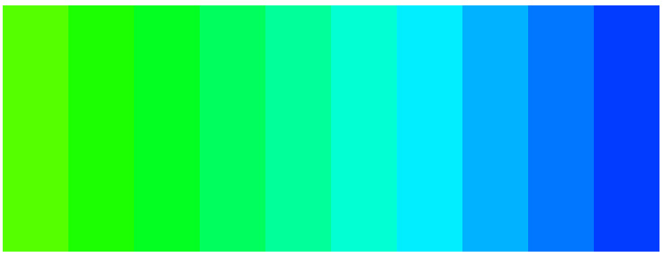

Perceptually uniform color space

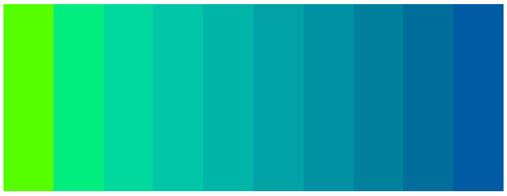

HSLuv project provides utilities to colors among different color spaces

<!-- Explanation of different approaches to mapping values to color schemes -->

---

# CATEGORIES OF COLORS

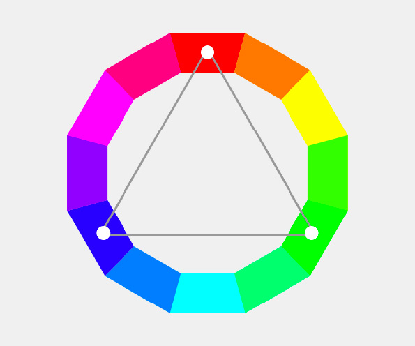

Triadic colors

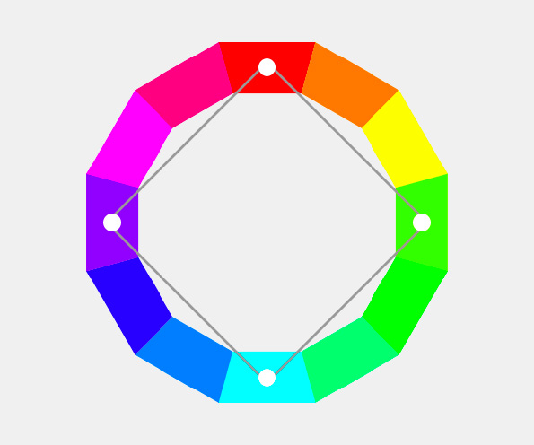

Tetradic colors

<!-- Examples of color harmony categories: triadic and tetradic color schemes -->

---

# COLOR SCHEMES

Cold colors

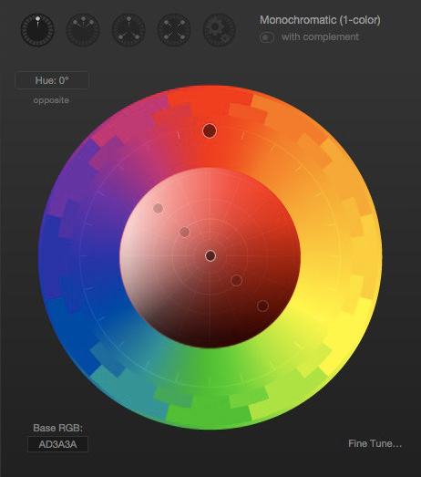

Warm colors

http://paletton.com/

<!-- Explanation of color schemes with examples of cold and warm colors -->

---
# COLOR BLINDNESS

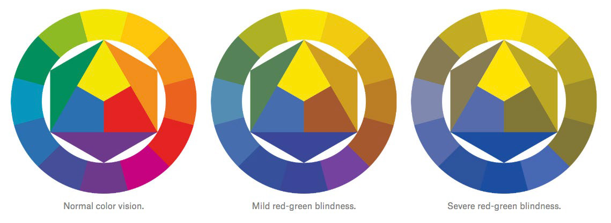

<!-- Visualization of how color blindness affects color perception -->

---
# COLOR SCHEMES FOR CARTOGRAPHY

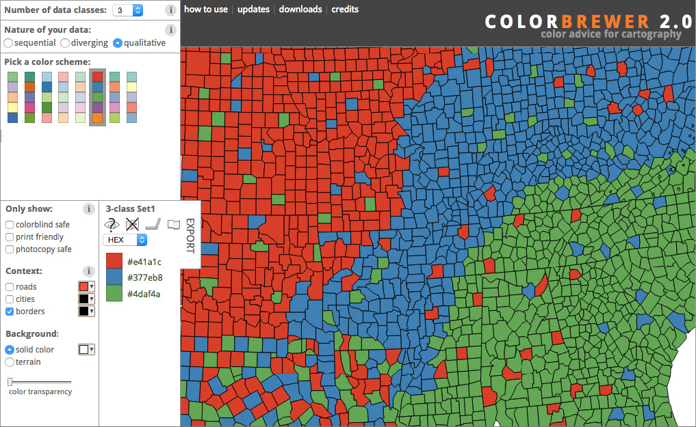

http://colorbrewer2.org/

<!-- Color schemes specifically designed for cartography with ColorBrewer tool -->

---
# COLOR SCHEME EXAMPLE (NOMINAL)

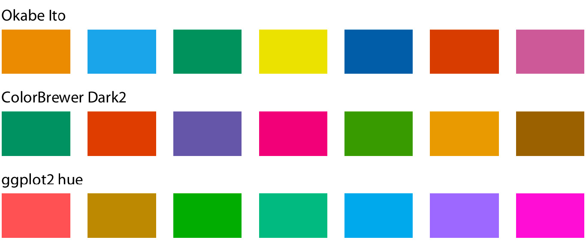

<!-- Example of nominal color schemes for categorical data -->

---
# COLOR SCHEME EXAMPLE (SEQUENTIAL)

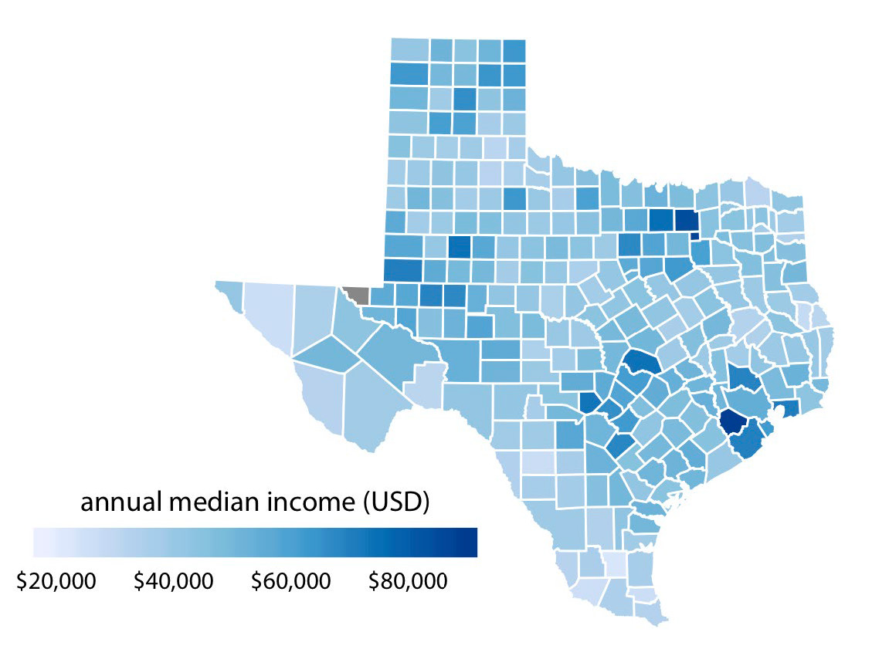

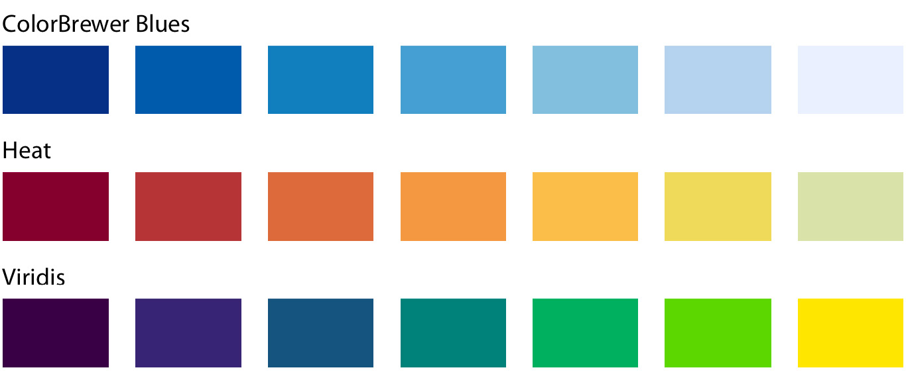

<!-- Example of sequential color schemes for ordered data -->

---
# COLOR SCHEME EXAMPLE (DIVERGENT)

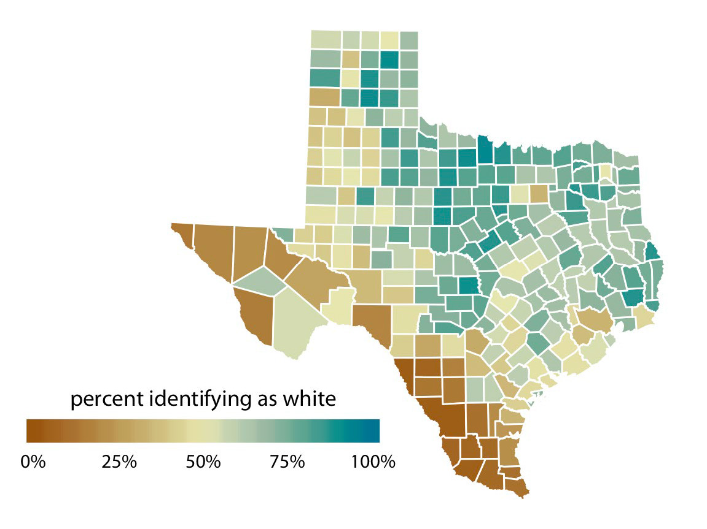

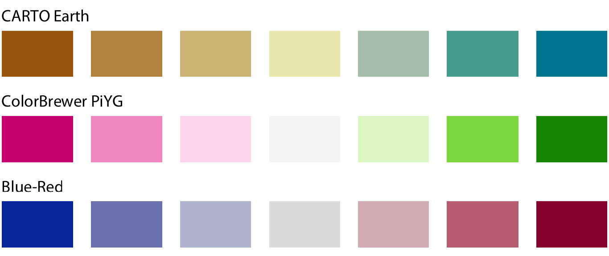

<!-- Example of divergent color schemes for data with a meaningful midpoint -->

---
# D3.JS COLOR SCHEMES

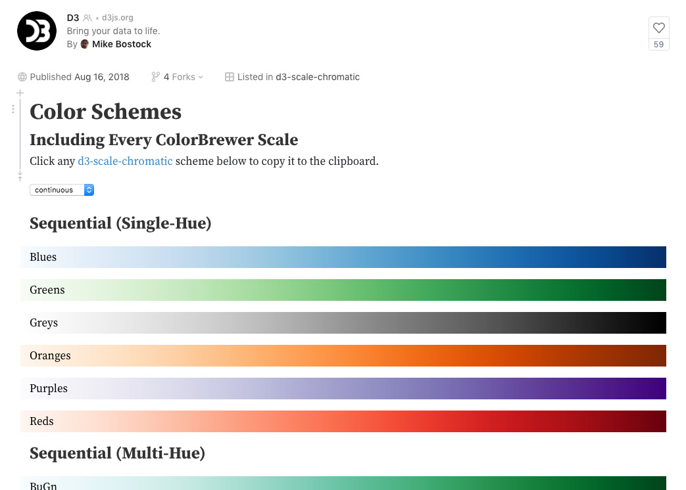

https://observablehq.com/@d3/color-schemes

<!-- Color schemes available in the D3.js visualization library -->

---
# TAKEAWAY MESSAGES

- Different color models and color spaces
- Color palettes to effectively represent scales of values

<!-- Summary of key points from the lecture -->
