<!-- _class: cover -->
<!-- _paginate: skip -->

  <h1>6 • Colors</h1>
  <!-- 
A subtitle
 -->

  

    
teacher

    
Salvatore Rinzivillo

    
Daniele Fadda

     
    
tutor

    
Eleonora Cappuccio

  

  

    <strong>University of Pisa</strong> 
    Department of Computer Science 
    Course: Visual Analytics (602AA) 
    Academic Year: {{ACADEMIC_YEAR}}    
  

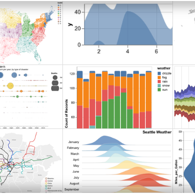

<!-- Questa lezione esplora i fondamenti della teoria del colore e la sua applicazione nella visualizzazione dei dati. Esamineremo la percezione del colore nell'essere umano, i modelli di colore, gli spazi colore e come creare palette efficaci per diversi tipi di dati. I colori sono tra le variabili visive più importanti, che ci aiutano a trasformare i valori dei dati in rappresentazioni visive. -->

---

# PHOTO RECEPTOR CELLS

- Two types of light sensitive cells
  - **Rod Cells (~120M)**
    - Provide low-light vision
    - Peripheral vision
    - Almost no role in color vision
  - **Cone cells (~6M)**
    - Provide normal vision
    - Three sub-types of cells
    - Sensitivity to different light wavelengths
    - Used for colored vision

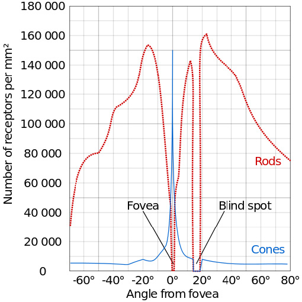

<!-- Questa slide introduce le basi biologiche della visione dei colori nell'essere umano. L'occhio umano contiene due tipi principali di fotorecettori: circa 120 milioni di cellule bastoncellari, responsabili della visione periferica e in condizioni di scarsa illuminazione, e circa 6 milioni di cellule coniche che abilitano la visione a colori. I tre tipi di cellule coniche (S, M, L) rispondono a diverse lunghezze d'onda della luce, costituendo il fondamento del nostro sistema di visione tricromatica. Comprendere questi meccanismi biologici ci aiuta a progettare visualizzazioni più efficaci. -->

---
# PHOTO RECEPTOR CELLS

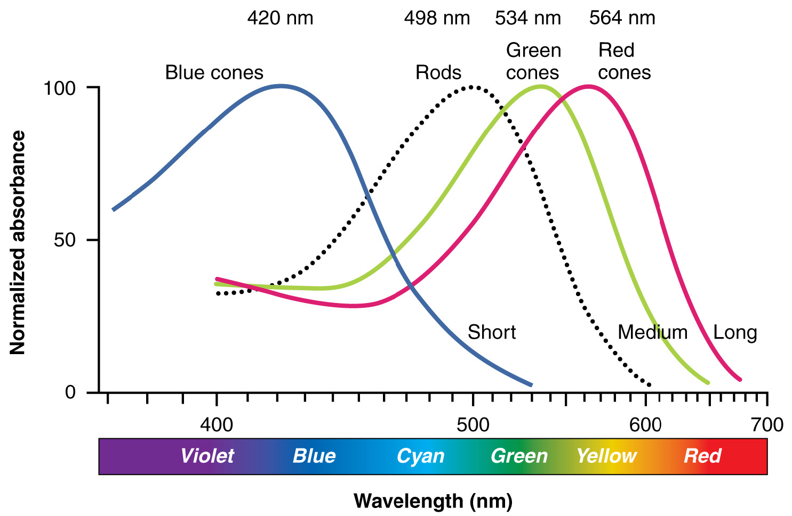

<!-- Questa slide mostra le curve di sensibilità spettrale dei tre tipi di cellule coniche presenti nell'occhio umano. Ogni tipo di cono risponde a un intervallo diverso di lunghezze d'onda: i coni S (lunghezza d'onda corta) sono più sensibili alla luce blu, i coni M (lunghezza d'onda media) alla luce verde, e i coni L (lunghezza d'onda lunga) alla luce rossa. Si noti la significativa sovrapposizione tra le curve M e L, che spiega alcune delle complessità nella percezione del colore. Queste curve di risposta influenzano direttamente il modo in cui dovremmo progettare gli schemi di colore nelle visualizzazioni. -->

---
# TEST YOUR COLOR PERCEPTION

http://color.method.ac

<!-- Questa slide presenta uno strumento basato sulla ruota dei colori che può essere utilizzato per testare e migliorare le capacità di percezione del colore. Il sito linkato (color.method.ac) offre esercizi interattivi per allenare l'occhio nel riconoscere e abbinare i colori con precisione. Le differenze individuali nella percezione del colore possono essere significative, il che è un aspetto importante da considerare nella progettazione di visualizzazioni. Testare la propria percezione del colore può rendere più consapevoli dei potenziali problemi nelle scelte cromatiche per la visualizzazione dei dati. -->

---
# COLOR OF THE YEAR: 2016

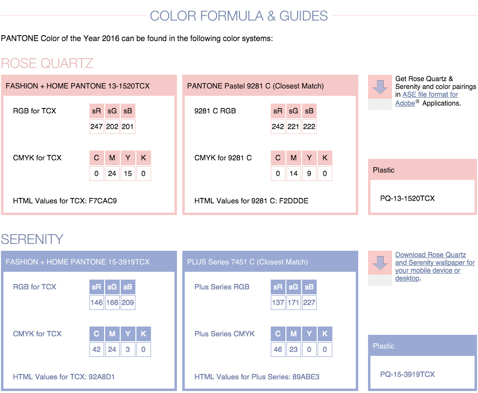

<!-- Questa slide mostra il Colore dell'Anno Pantone per il 2016: Rose Quartz e Serenity. Le selezioni annuali di Pantone riflettono le tendenze e le influenze culturali. Nella visualizzazione, è importante tenere conto di questi aspetti culturali e temporali della percezione del colore, poiché possono influenzare il modo in cui il pubblico interpreta le nostre scelte cromatiche. La selezione di Rose Quartz e Serenity è stata notevole in quanto è stata la prima volta che Pantone ha scelto una combinazione di due colori, rappresentando un cambiamento culturale verso la fluidità e l'uguaglianza di genere. -->

---
# COLOR OF THE YEAR 2017

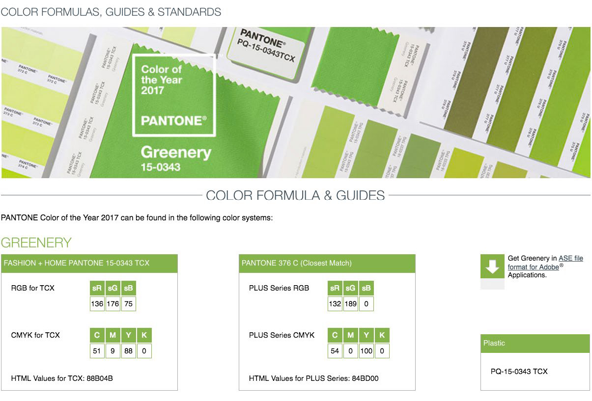

<!-- Questa slide presenta il Colore dell'Anno Pantone per il 2017: Greenery. Questa tonalità giallo-verde fresca e vivace simboleggiava nuovi inizi e consapevolezza ambientale. Nella visualizzazione dei dati, comprendere le associazioni emotive e culturali dei colori come questo può essere prezioso quando si progettano visualizzazioni che devono evocare sentimenti specifici o quando si lavora con dati a tema ambientale. Le scelte cromatiche non sono mai neutrali; portano sempre un significato culturale ed emotivo. -->

---
# COLOR OF THE YEAR 2019

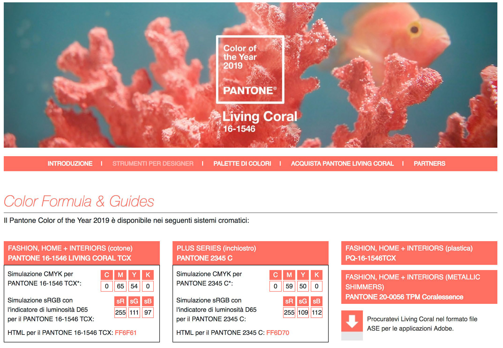

<!-- Questa slide mostra il Colore dell'Anno Pantone per il 2019: Living Coral. Questo colore vivace ma morbido è stato scelto per rappresentare calore e nutrimento in un mondo sempre più digitale. Per i designer di visualizzazioni, essere aggiornati sulle tendenze cromatiche contemporanee può aiutare a creare visualizzazioni più coinvolgenti e rilevanti. La selezione di Living Coral ha anche evidenziato la crescente consapevolezza sulla conservazione delle barriere coralline, mostrando come i colori possano collegarsi a importanti questioni ambientali. -->

---
# COLOR MODEL - NEWTON (OPTICKS, 1704)

- White light is a combination of all colors
- Could recombine colors back to white light
- Wrapping basic colors around a circle

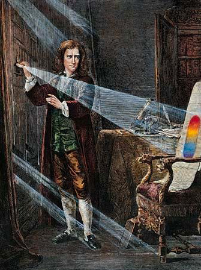

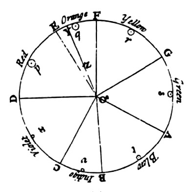

<!-- Questa slide introduce il lavoro rivoluzionario di Isaac Newton sulla teoria del colore, contenuto nel suo libro "Opticks" (1704). Newton dimostrò che la luce bianca poteva essere scomposta in uno spettro di colori tramite un prisma e poi ricombinata in luce bianca. La sua disposizione dei colori in un cerchio gettò le basi delle moderne ruote dei colori. Questo contesto storico è importante perché rappresenta il primo approccio scientifico alla comprensione del colore, andando oltre la prospettiva puramente artistica. Il lavoro di Newton ha stabilito principi fondamentali che ancora oggi influenzano il modo in cui comprendiamo e utilizziamo il colore nella visualizzazione. -->

---
# COLOR MODEL - COLOR CIRCLE (GOETHE, 1810)

- Measures of eye's response to color
- Three primary colors:
  - Magenta, yellow, blue

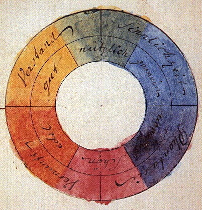

<!-- Questa slide tratta la teoria del colore di Goethe del 1810, che adottava un approccio più psicologico alla percezione del colore rispetto all'approccio puramente fisico di Newton. Sebbene criticato scientificamente, il lavoro di Goethe è stato influente nella comprensione dell'esperienza soggettiva del colore. Si è concentrato su come i colori influenzano le emozioni e la percezione umana, introducendo concetti come l'armonia e il contrasto cromatico. Nella visualizzazione dei dati, questa prospettiva psicologica è fondamentale: non dobbiamo comprendere solo la fisica del colore, ma anche come gli utenti percepiscono e rispondono emotivamente alle diverse combinazioni di colori. -->

---

# COLOR MODELS - ADDITIVE AND SUBTRACTIVE MODELS

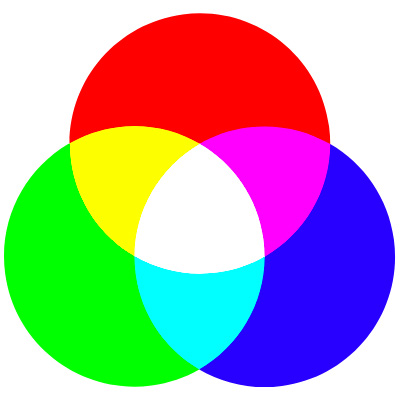
RGB additive model 

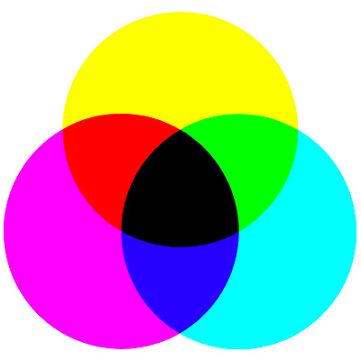
CMY subtractive model

<!-- Questa slide mette a confronto i due approcci fondamentali alla mescolanza dei colori: il modello additivo RGB (usato negli schermi e nei display digitali), in cui la luce rossa, verde e blu si combinano per creare altri colori e il bianco risulta dalla combinazione di tutti i colori alla massima intensità; e il modello sottrattivo CMY (usato nella stampa), in cui i pigmenti ciano, magenta e giallo sottraggono lunghezze d'onda dalla luce bianca, con la combinazione di tutti i colori che teoricamente produce il nero. Comprendere questi modelli è essenziale per i designer di visualizzazioni che devono creare grafiche efficaci su diversi supporti, dagli schermi ai materiali stampati. -->

---
# COLOR MODELS - 3D SPACE MODELS (MAYER, 1775)

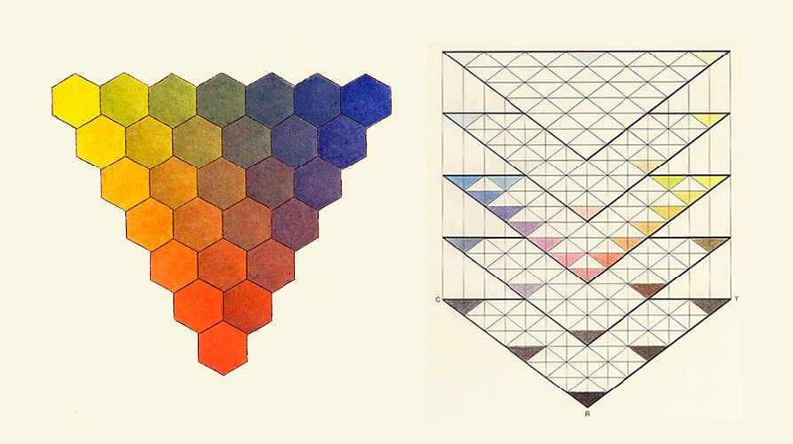

Problem: steps are not perceptually uniform

<!-- Questa slide presenta il primo tentativo di Tobias Mayer di creare un modello di colore tridimensionale nel 1775. Sebbene innovativo per l'epoca, questo modello evidenzia un problema critico dei primi sistemi di colore: i passi tra i colori non sono percettivamente uniformi. Ciò significa che passi matematicamente uguali nel modello non corrispondono a differenze percepite uguali dagli osservatori umani. Questo problema è rimasto una sfida per secoli ed è ancora rilevante nella visualizzazione dei dati odierna, dove l'uniformità percettiva è essenziale per un'interpretazione accurata dei valori codificati con il colore. -->

---
# COLOR MODELS - MUNSELL (EARLY 1900'S)

- Introduction of three new dimensions
  - HUE (red, blue, etc)
  - Value (light or dark)
  - Chroma (saturation)
- Irregular shape of solid
  - Low brightness implies fewer visible colors
- Introduction of a mathematical definition of colors (not names)

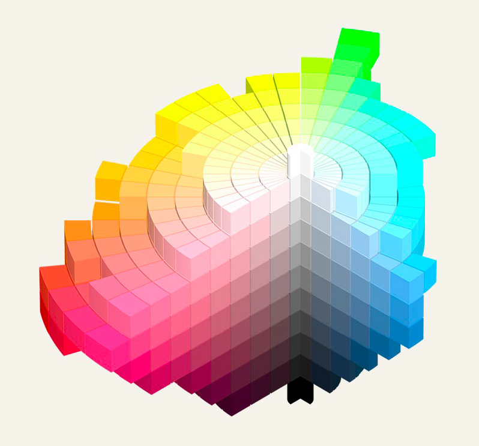

<!-- Questa slide tratta l'influente sistema di colori di Albert Munsell degli inizi del '900, che ha rappresentato un importante progresso nella creazione di spazi colore percettivamente uniformi. Il sistema di Munsell ha introdotto tre dimensioni: tonalità (il colore stesso), valore (chiarezza/scurezza) e croma (saturazione/intensità). La forma irregolare del solido di Munsell riflette un'osservazione importante: a bassi livelli di luminosità, gli esseri umani riescono a distinguere meno colori. Il sistema di Munsell è stato significativo anche per aver fornito definizioni matematiche dei colori anziché fare affidamento su nomi soggettivi. Questo approccio sistematico lo ha reso ideale per applicazioni scientifiche e di design, inclusa la moderna visualizzazione dei dati. -->

---
# COLOR MODEL

- Young-Helmotz Theory (19th century)
  - Separate Red, Green, Blue receptors
  - Actually, three receptors type exist
    - Red and Green are located mainly in green-yellow zone
    - Sometimes named as Long, Medium, Short wavelength receptors
  - Eye present different proportions of R,G,B receptors (40:20:1)

<!-- Questa slide spiega la teoria tricromatica di Young-Helmholtz sulla visione dei colori del XIX secolo, che propose correttamente che l'occhio contenga tre tipi di recettori del colore. La scienza moderna lo conferma con l'identificazione dei recettori L (lunghezza d'onda lunga), M (media) e S (corta). È importante sottolineare che questi recettori non sono distribuiti uniformemente: l'occhio ha circa 40 coni L per ogni 20 coni M e solo 1 cono S. Questa realtà biologica ha implicazioni dirette per la progettazione di visualizzazioni: siamo più sensibili alle variazioni nel rosso-verde che nel blu. Questo spiega perché il blu è spesso una scelta inadeguata per codificare informazioni quantitative importanti nelle visualizzazioni. -->

---
# OPPONENT COLOR THEORY

- Based on estimation of opposite readings
  - red-green comparison
  - blue-yellow comparison
  - dark-light comparison

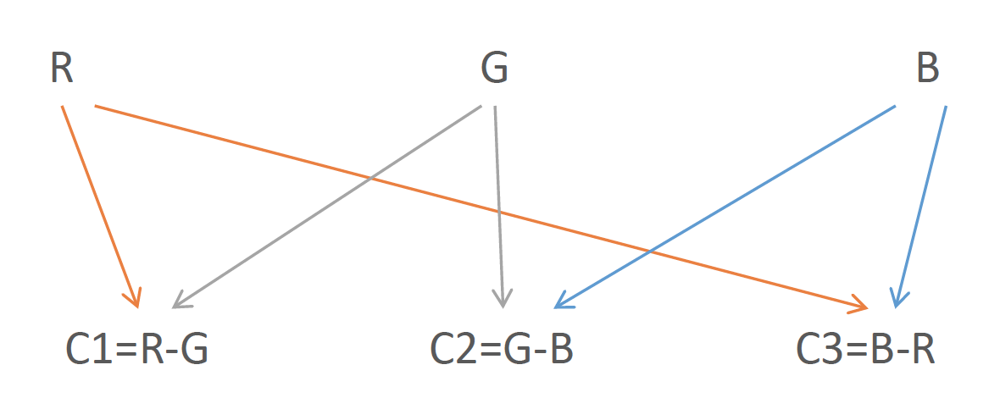

C1+C2+C3=0
C1=R-G &nbsp;&nbsp;&nbsp;&nbsp; C3-C2=B-R-G+B=2B-(R+G) &nbsp;&nbsp;&nbsp;&nbsp; A = 2R+G+B/20

<!-- Questa slide introduce la Teoria dei Colori Opponenti, che integra la teoria tricromatica spiegando alcuni aspetti della percezione del colore che quest'ultima da sola non riesce a spiegare. Questa teoria propone che le informazioni visive vengano elaborate in coppie opposte: rosso vs. verde, blu vs. giallo, e scuro vs. chiaro. Le relazioni matematiche mostrate rappresentano come questi segnali opponenti vengono calcolati a partire dagli input dei recettori. Questa teoria spiega fenomeni come le immagini residue cromatiche e il motivo per cui non percepiamo mai un "verde rossastro" o un "blu giallastro". Per i designer di visualizzazioni, questa comprensione orienta le scelte cromatiche che massimizzano il contrasto e la leggibilità, specialmente per gli utenti con deficit della visione dei colori. -->

---
# RGB COLOR MODEL

- Based on direct specification of three primary colors
- Additive model, each component is summed with the others

 

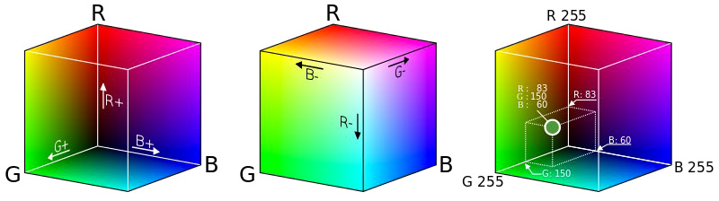

<!-- Questa slide fornisce una panoramica dettagliata del modello di colore RGB, fondamentale per la visualizzazione digitale. Come modello additivo, funziona combinando diverse intensità di luce rossa, verde e blu. Il diagramma mostra come questi colori primari si combinano per creare i colori secondari (ciano, magenta, giallo) e infine il bianco quando tutti sono alla massima intensità. Il modello RGB è lo standard per i display digitali, rendendolo il modello di colore principale per gli strumenti di visualizzazione dei dati. Tuttavia, è importante capire che RGB è un modello dipendente dal dispositivo: gli stessi valori RGB possono essere visualizzati in modo diverso su schermi diversi, creando sfide per una visualizzazione coerente. -->

---
# RGB COLOR MODEL

- R,G,B values may be expressed in range [0,1]
- Some applications use the range [0,255]
- Usually a hexadecimal notation is used for range [0,ff]
- Not really intuitive: how to define brown?

<!-- Questa slide approfondisce gli aspetti pratici del lavoro con il modello di colore RGB. I valori RGB possono essere rappresentati in diversi intervalli: [0,1], [0,255] o con notazione esadecimale [00-FF]. L'ultimo punto evidenzia un limite significativo dell'RGB per la progettazione di visualizzazioni: non è intuitivo da usare per gli esseri umani. Creare colori specifici come il marrone richiede combinazioni di valori RGB poco intuitive. Questo divario tra la rappresentazione tecnica e l'intuizione umana crea difficoltà nella progettazione di schemi di colori per la visualizzazione dei dati, ed è per questo che sono stati sviluppati modelli di colore di livello superiore come l'HSV. -->

---
# HSV COLOR MODEL

- Based on the intuitive concepts of
  - Hue
  - Saturation
  - Value (or brightness: 0% implies black; 100% implies pure color)
  - Lightness (or luminosity: 0% implies black; 50% implies pure color; 100% implies white)
- Component values are expressed in ranges [0,1] or [0,255]

"Hsl-hsvmodels" by Jacob Rus-Ownwork. Licensedunder CC BY-SA 3.0 via WikimediaCommons-http://commons.wikimedia.org/wiki/File:Hsl-hsv_models.svg#/media/File:Hsl-hsv_models.svg

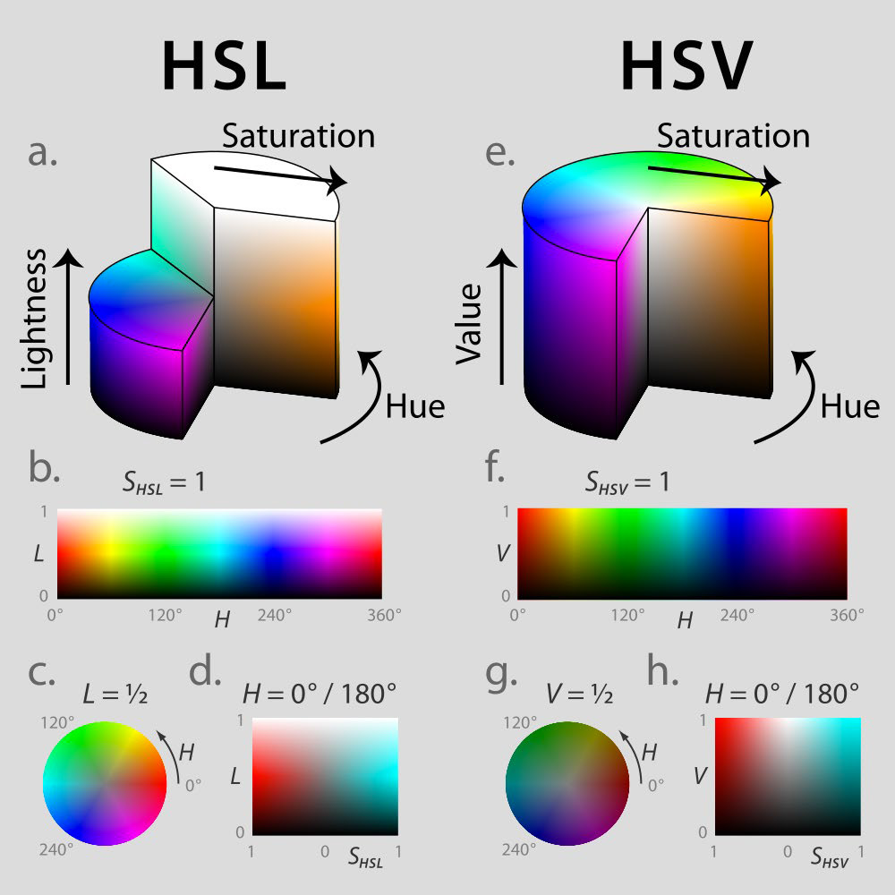

<!-- Questa slide introduce il modello di colore HSV (Tonalità, Saturazione, Valore), sviluppato per essere più intuitivo per gli esseri umani rispetto all'RGB. La tonalità rappresenta il tipo di colore (rosso, blu, ecc.), la saturazione rappresenta l'intensità del colore e il valore rappresenta la luminosità. La slide menziona anche il modello correlato HSL, in cui la luminosità sostituisce il valore. Questi modelli sono rappresentati come coordinate cilindriche attorno a una ruota dei colori, risultando più allineati con il modo in cui gli esseri umani pensano al colore. Per i designer di visualizzazioni, HSV/HSL è spesso più facile da usare nella creazione di schemi di colori, specialmente per dati che richiedono scale di colori sequenziali o divergenti. -->

---
# RGB AND HSV

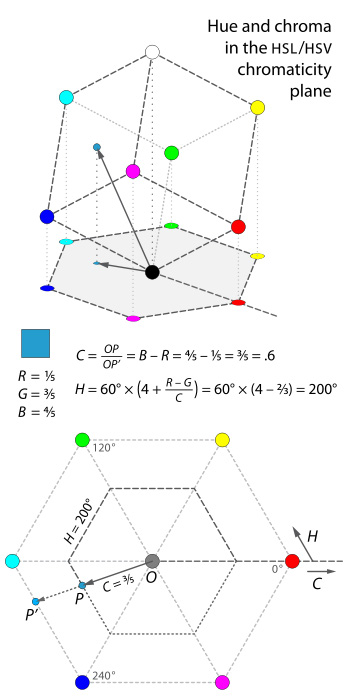

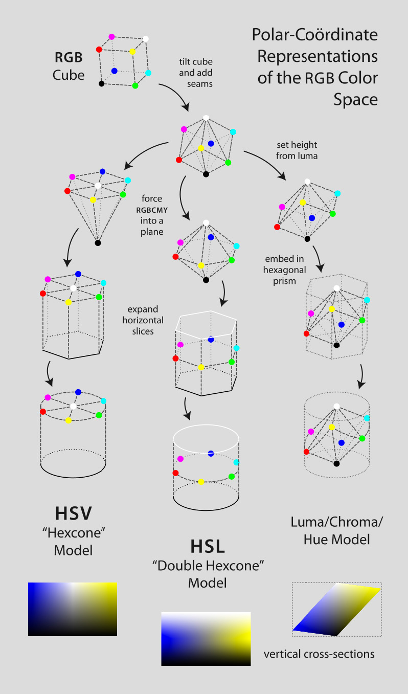

<!-- Questa slide confronta i modelli di colore RGB e HSV attraverso rappresentazioni visive. Il modello RGB è mostrato come un cubo in cui i tre assi rappresentano le componenti rossa, verde e blu. Il modello HSV è rappresentato come un cilindro, dove la dimensione angolare rappresenta la tonalità, la distanza dal centro rappresenta la saturazione e l'altezza rappresenta il valore. Queste diverse geometrie riflettono le differenze concettuali fondamentali tra i modelli. Per i designer di visualizzazioni, comprendere entrambi i modelli è importante: RGB per l'implementazione tecnica e HSV per la selezione e la manipolazione intuitiva del colore nella progettazione di schemi di colori efficaci. -->

---

<!-- header: "" -->
<!-- _class: chapter -->
<!-- _paginate: skip -->

# COLOR SPACES

<!-- Questa slide di capitolo introduce il concetto di spazi colore, che sono implementazioni matematiche specifiche dei modelli di colore. Mentre i modelli di colore sono concetti astratti, gli spazi colore forniscono mappature specifiche dei colori su valori numerici. Comprendere gli spazi colore è fondamentale per creare visualizzazioni che appaiano coerenti su diversi dispositivi e supporti. Le slide successive spiegheranno spazi colore standardizzati come CIE XYZ e le loro applicazioni pratiche nella visualizzazione. -->

---
# CIE STANDARD OBSERVER

- CIE: International Commission on Illumination
- Definition of an objective color-mapping function:
  - Standard colorimetric observer
- Experiment
  - An observer is positioned in front of a bipartite screen
  - Observer can manipulate intensities of three primary color beams
  - Task: match the reference color

<!-- Questa slide introduce il concetto di Osservatore Standard CIE, uno sviluppo cruciale nella scienza del colore da parte della Commissione Internazionale sull'Illuminazione (CIE). Questo lavoro mirava a creare un modo oggettivo e standardizzato per misurare e descrivere i colori in base alla percezione umana. La configurazione sperimentale prevedeva che i partecipanti abbinassero i colori regolando tre fasci di luce primari. Questa ricerca ha portato alla creazione dello spazio colore CIE XYZ nel 1931, che è diventato il fondamento della maggior parte degli spazi colore moderni. Per i designer di visualizzazioni, comprendere questo contesto storico aiuta a spiegare perché certi spazi colore sono più adatti per scale di colori percettivamente uniformi. -->

---
# STANDARD OBSERVER EXPERIMENT

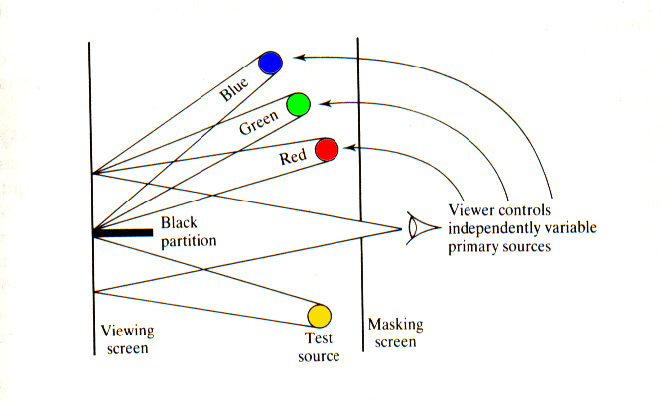

<!-- Questa slide illustra la configurazione sperimentale utilizzata per sviluppare il modello dell'osservatore standard CIE. In questo esperimento, i soggetti osservavano uno schermo diviso in cui una metà mostrava un colore di riferimento e l'altra una miscela di tre colori primari. Regolando le intensità dei colori primari fino a farli corrispondere al colore di riferimento, i ricercatori potevano mappare come gli esseri umani percepiscono e abbinano i colori. Questo approccio sperimentale ha stabilito le basi della colorimetria moderna e degli spazi colore CIE. Comprendere i fondamenti empirici della scienza del colore aiuta i designer di visualizzazioni ad apprezzare perché certe scelte cromatiche funzionano meglio di altre per la codifica dei dati. -->

---
# CHROMATICITY DIAGRAM

- A mixture of two colors lies on the line connecting the two colors
- Chromaticity Diagram (gamut) is convex
- All visible colors are non-negative combination of x, y, and z
- An equal combination of two colors does not lie in the mid-point

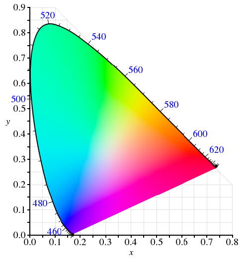

<!-- Questa slide spiega il Diagramma di Cromaticità CIE, una rappresentazione bidimensionale di tutti i colori visibili. Il bordo a forma di ferro di cavallo (detto luogo spettrale) rappresenta i colori spettrali puri, mentre la linea retta in basso (la linea viola) rappresenta i viola non spettrali. Il diagramma illustra alcune proprietà importanti: le miscele di due colori si trovano sulla retta che li congiunge; l'intero gamut visibile è convesso; e, cosa importante, miscele fisicamente uguali di colori non producono miscele percettivamente uguali, un'osservazione critica per la progettazione di visualizzazioni. Questo spiega perché l'interpolazione lineare tra colori in RGB spesso produce risultati scadenti per la visualizzazione dei dati. -->

---
# COMPARING COLOR SPACES

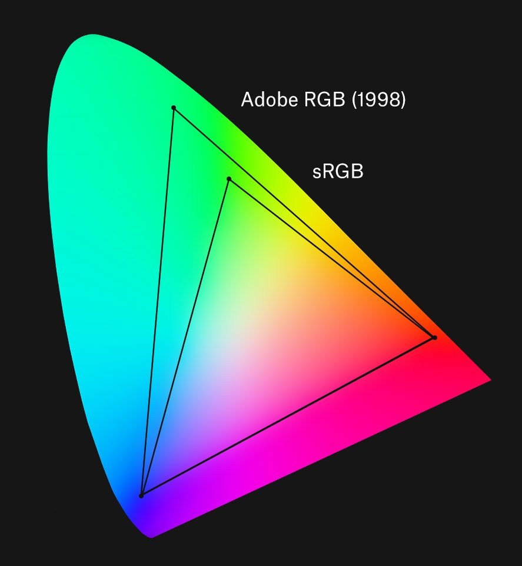

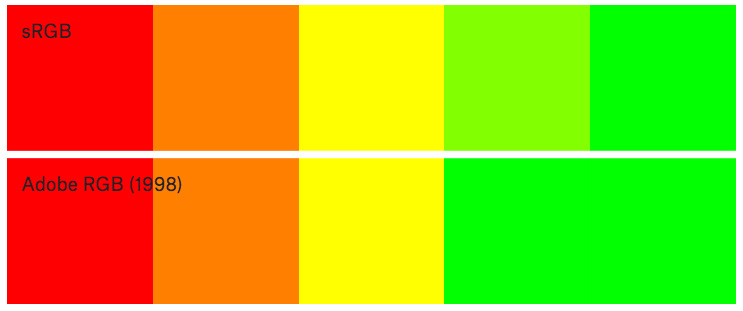

<!-- Questa slide confronta diversi spazi colore attraverso rappresentazioni visive. I diagrammi mostrano come gli stessi colori vengono mappati in spazi colore diversi, evidenziando le caratteristiche uniche di ciascuno. Alcuni spazi colore privilegiano l'uniformità percettiva (come CIELAB), mentre altri sono progettati per applicazioni specifiche come i display digitali (sRGB) o la stampa (CMYK). Per i designer di visualizzazioni, scegliere lo spazio colore appropriato è fondamentale. Gli spazi percettivamente uniformi come CIELAB o CIELUV sono particolarmente importanti per la visualizzazione dei dati perché garantiscono che passi uguali nello spazio colore rappresentino differenze percepite uguali, portando a un'interpretazione più accurata dei dati. -->

---

# COLOR MIXING

- Given three primary colors, the corresponding triangle cannot cover the whole gamut

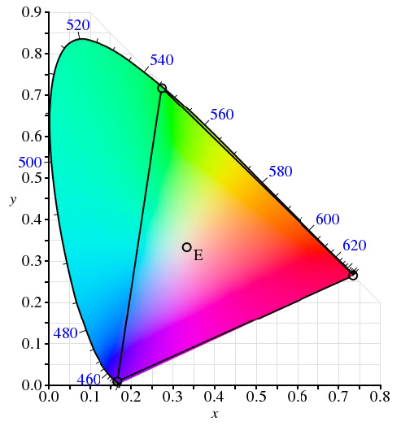

<!-- Questa slide illustra un limite fondamentale della riproduzione del colore: nessun insieme di tre colori primari reali può riprodurre tutti i colori visibili. Il triangolo nel diagramma di cromaticità rappresenta il gamut dei colori che possono essere creati mescolando tre colori primari. Qualsiasi colore al di fuori di questo triangolo non può essere riprodotto con quei primari. Questo spiega perché dispositivi diversi (monitor, stampanti, proiettori) hanno capacità di riproduzione del colore diverse. Per i designer di visualizzazioni, ciò significa essere consapevoli dei limiti del gamut quando si progetta per diversi supporti di visualizzazione, specialmente quando si creano visualizzazioni che devono funzionare sia in formato digitale che stampato. -->

---

<!-- _class: chapter -->
<!-- _paginate: skip -->

# PALETTE

<!-- Questa slide di capitolo introduce il concetto di palette di colori nella visualizzazione dei dati. Una palette di colori è un insieme di colori selezionati con cura per specifici compiti di visualizzazione. Le slide successive esploreranno come creare palette efficaci per diversi tipi di dati e obiettivi di visualizzazione, mostrando esempi di schemi di colori categorici, sequenziali e divergenti. Comprendere la progettazione delle palette è essenziale per creare visualizzazioni che comunichino i dati in modo efficace e siano accessibili a tutti gli utenti. -->

---
# MAPPING VALUES TO COLOR SCHEMES

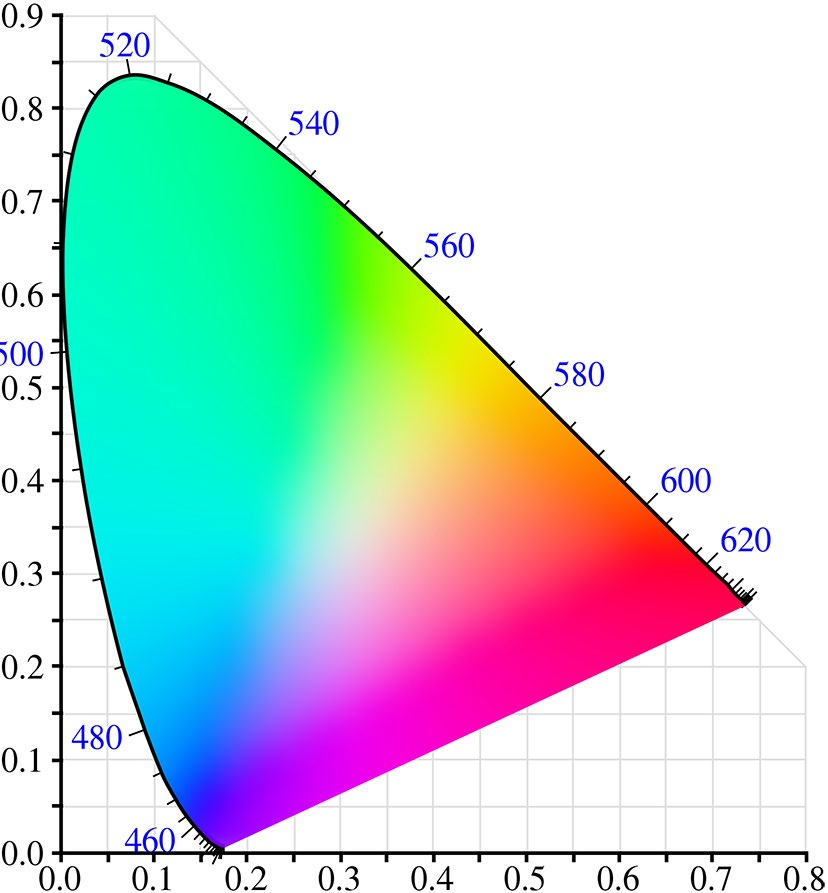

sRGB interpolation

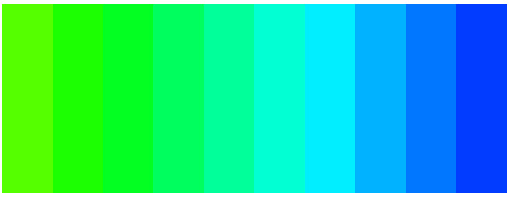

Perceptually uniform color space

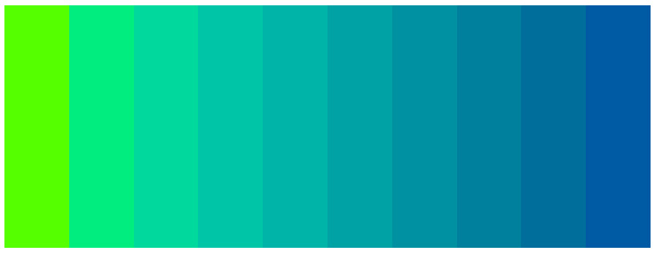

HSLuv project provides utilities to colors among different color spaces

<!-- Questa slide dimostra la differenza critica tra l'interpolazione ingenua dei colori nello spazio RGB standard e l'interpolazione in spazi colore percettivamente uniformi. L'immagine in alto mostra l'interpolazione diretta in sRGB, che crea passi percettivi irregolari con un calo artificiale della luminosità nella fascia centrale. L'immagine centrale mostra l'interpolazione in uno spazio colore percettivamente uniforme, che crea transizioni visivamente omogenee. Questa differenza è cruciale per la visualizzazione dei dati, dove passi percettivi irregolari possono portare a un'errata interpretazione dei dati. Il progetto HSLuv menzionato fornisce strumenti per lavorare con spazi colore percettivamente uniformi, aiutando i designer a creare scale di colori più accurate ed efficaci per la visualizzazione dei dati. -->

---

# CATEGORIES OF COLORS

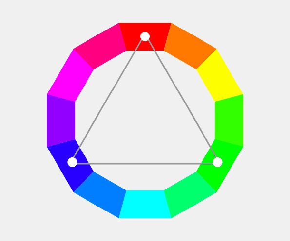

Triadic colors

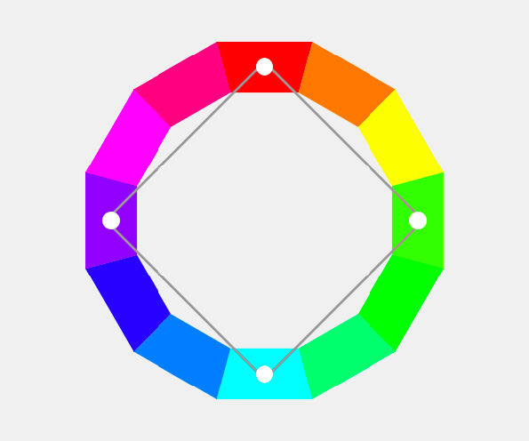

Tetradic colors

<!-- Questa slide introduce il concetto di armonia cromatica attraverso gli schemi di colori triadici e tetradici. Gli schemi triadici utilizzano tre colori equidistanti sulla ruota dei colori (distanziati di 120°), mentre gli schemi tetradici usano quattro colori (formando un rettangolo sulla ruota dei colori). Queste relazioni armoniche creano combinazioni visivamente piacevoli che funzionano bene insieme. Per la visualizzazione di dati categorici, l'utilizzo delle armonie cromatiche può creare set di colori esteticamente gradevoli ma chiaramente distinguibili. Tuttavia, è importante notare che, sebbene questi schemi siano visivamente attraenti, non massimizzano necessariamente la distinzione percettiva, che potrebbe essere più importante per alcune attività di visualizzazione. -->

---

# COLOR SCHEMES

Cold colors

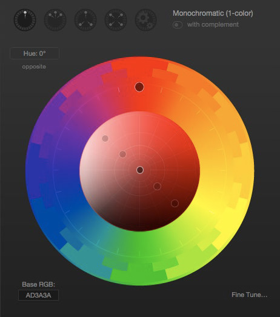

Warm colors

http://paletton.com/

<!-- Questa slide illustra il concetto di colori caldi e freddi sulla ruota dei colori. I colori caldi (rossi, arancioni, gialli) sono spesso associati a energia, eccitazione e urgenza, mentre i colori freddi (blu, verdi, viola) trasmettono tipicamente calma, stabilità e distanza. Questa dimensione emotiva e percettiva del colore è molto rilevante per la visualizzazione dei dati, poiché queste associazioni possono potenziare o interferire con l'interpretazione dei dati. La slide fa anche riferimento a Paletton.com, un utile strumento online per creare schemi di colori basati sui principi della teoria del colore. Comprendere l'impatto emotivo delle scelte cromatiche aiuta i designer di visualizzazioni a creare palette di colori più efficaci e intenzionali. -->

---
# COLOR BLINDNESS

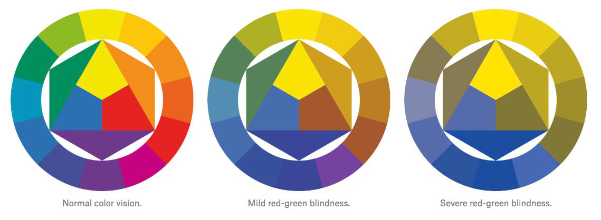

<!-- Questa slide affronta il tema cruciale del daltonismo e le sue implicazioni per la progettazione di visualizzazioni. Le immagini mostrano come le visualizzazioni appaiono alle persone con diversi tipi di deficit della visione dei colori: deuteranopia (ridotta sensibilità al verde), protanopia (ridotta sensibilità al rosso) e tritanopia (ridotta sensibilità al blu). Circa l'8% dei maschi e lo 0,5% delle femmine presenta qualche forma di daltonismo, il che lo rende un'importante considerazione di accessibilità. Per i designer di visualizzazioni, ciò significa evitare combinazioni rosso-verde per distinzioni importanti, garantire un contrasto di luminanza sufficiente e testare i design con simulatori di daltonismo. Creare visualizzazioni accessibili ai daltonici non riguarda solo l'accessibilità, ma spesso produce visualizzazioni più chiare per tutti. -->

---
# COLOR SCHEMES FOR CARTOGRAPHY

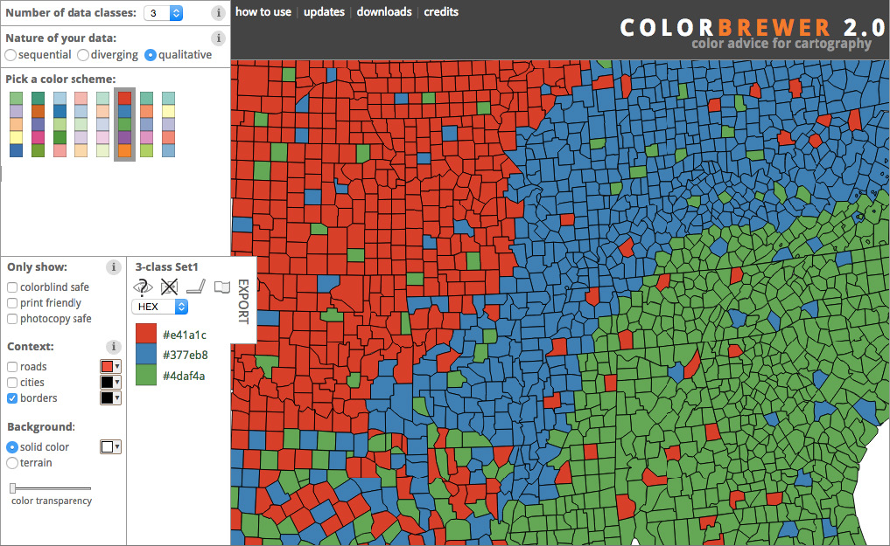

http://colorbrewer2.org/

<!-- Questa slide introduce ColorBrewer, uno strumento ampiamente utilizzato e progettato specificamente per creare schemi di colori efficaci per mappe e altre visualizzazioni. Creato da Cynthia Brewer, questo strumento offre palette di colori scientificamente validate e ottimizzate per diversi tipi di dati (sequenziali, divergenti e categorici) e considerazioni di accessibilità. ColorBrewer consente ai designer di selezionare le palette in base al numero di classi necessarie e se la palette deve essere sicura per i daltonici, adatta alla stampa o alla fotocopiatura. Sebbene originariamente sviluppate per la cartografia, queste palette sono diventate strumenti standard nella visualizzazione dei dati in molti domini. L'approccio scientifico alla base di ColorBrewer esemplifica le migliori pratiche nella progettazione del colore per le visualizzazioni. -->

---
# COLOR SCHEME EXAMPLE (NOMINAL)

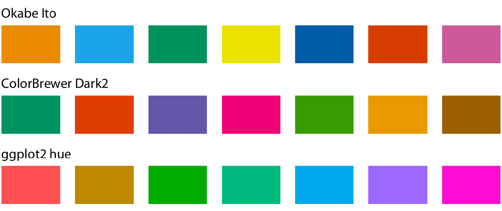

<!-- Questa slide dimostra gli schemi di colori nominali (categorici), progettati per dati qualitativi in cui le categorie non hanno un ordine intrinseco. Gli esempi mostrano come gli schemi di colori categorici utilizzino tonalità massimamente distinte l'una dall'altra. L'applicazione su mappa mostra diverse regioni chiaramente differenziate dal colore. Per la visualizzazione di dati categorici, gli obiettivi principali sono rendere le categorie facilmente distinguibili mantenendo livelli simili di saturazione e luminosità per evitare di implicare gerarchie di importanza. L'efficacia degli schemi categorici diminuisce all'aumentare del numero di categorie: generalmente, più di 7-10 categorie distinte diventano difficili da differenziare, suggerendo che per insiemi di categorie più grandi si dovrebbero considerare altre strategie di codifica. -->

---
# COLOR SCHEME EXAMPLE (SEQUENTIAL)

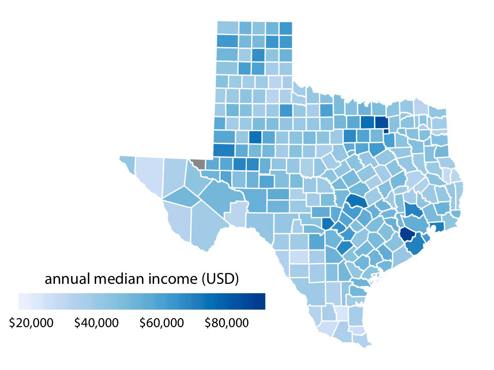

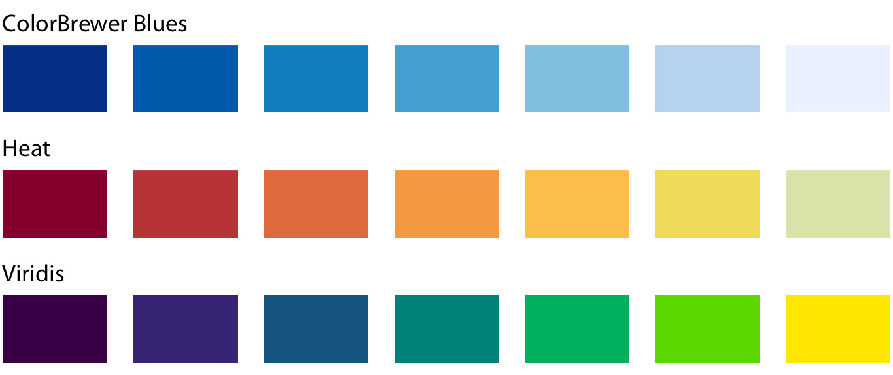

<!-- Questa slide illustra gli schemi di colori sequenziali, progettati per dati ordinati in cui i valori variano da bassi ad alti. Questi schemi progrediscono tipicamente da colori chiari a scuri o variano la saturazione lungo una singola tonalità. Le mappe mostrano come gli schemi di colori sequenziali rappresentino efficacemente la densità di popolazione o altri dati graduati. Per i designer di visualizzazioni, gli schemi sequenziali sono essenziali per mostrare dati quantitativi in cui la progressione dai valori bassi a quelli alti è il messaggio principale. L'utilizzo di schemi sequenziali percettivamente uniformi garantisce che la differenza percepita tra i colori rifletta accuratamente le differenze nei dati sottostanti, portando a un'interpretazione più accurata. -->

---
# COLOR SCHEME EXAMPLE (DIVERGING)

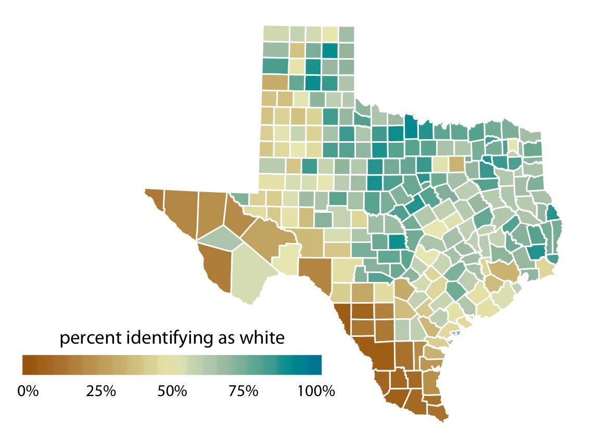

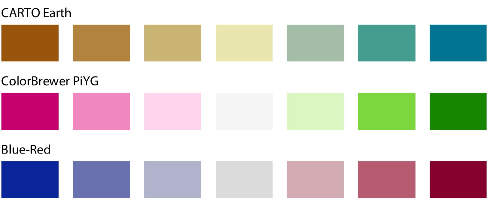

<!-- Questa slide dimostra gli schemi di colori divergenti, progettati per dati con un punto medio o un valore zero significativo. Questi schemi utilizzano tipicamente due tonalità diverse che divergono da un colore centrale neutro, spesso bianco o grigio chiaro. Le mappe mostrano applicazioni per dati come anomalie di temperatura o risultati elettorali, dove le deviazioni positive e negative da un valore centrale sono ugualmente importanti. Per i designer di visualizzazioni, gli schemi divergenti sono potenti per evidenziare le deviazioni da un punto di riferimento, mostrare correlazioni o enfatizzare gli estremi a entrambe le estremità di una scala. Gli schemi divergenti efficaci mantengono l'equilibrio percettivo in modo che distanze uguali dal centro in entrambe le direzioni siano percepite come ugualmente importanti. -->

---
# D3.JS COLOR SCHEMES

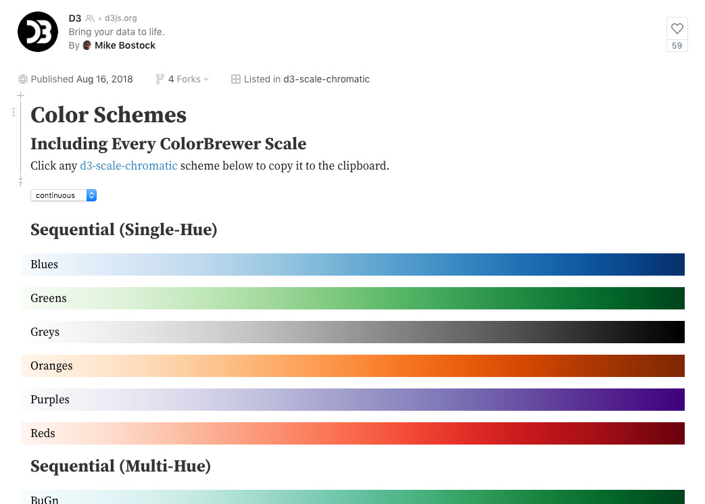

https://observablehq.com/@d3/color-schemes

<!-- Questa slide mostra le complete librerie di schemi di colori disponibili in D3.js, una delle librerie di visualizzazione dei dati più popolari. D3 implementa molti schemi di colori scientificamente validati, tra cui le palette ColorBrewer e interpolatori progettati specificamente per la visualizzazione dei dati. L'immagine mostra esempi di schemi di colori categorici, sequenziali e divergenti. Per i professionisti della visualizzazione, gli schemi di colori integrati in D3 forniscono opzioni pronte all'uso e ben progettate che seguono le migliori pratiche in termini di percezione e accessibilità. Il link a Observable fornisce esempi interattivi e documentazione per utilizzare questi schemi di colori nei progetti di visualizzazione. -->

---
# TAKEAWAY MESSAGES

- Different color models and color spaces
- Color palettes to effectively represent scales of values

<!-- Questa slide finale riassume i punti chiave della lezione. Comprendere i diversi modelli di colore (RGB, HSV, ecc.) e gli spazi colore (CIE, Lab, ecc.) fornisce le basi per lavorare con il colore nella visualizzazione. Tuttavia, il punto più pratico da ricordare riguarda come creare palette di colori efficaci per diversi tipi di dati: schemi categorici per dati nominali, schemi sequenziali per dati ordinati e schemi divergenti per dati con un punto medio significativo. Questi principi, combinati con le considerazioni sull'uniformità percettiva, l'accessibilità e le associazioni emotive dei colori, costituiscono la base per un uso efficace del colore nella visualizzazione dei dati. -->
