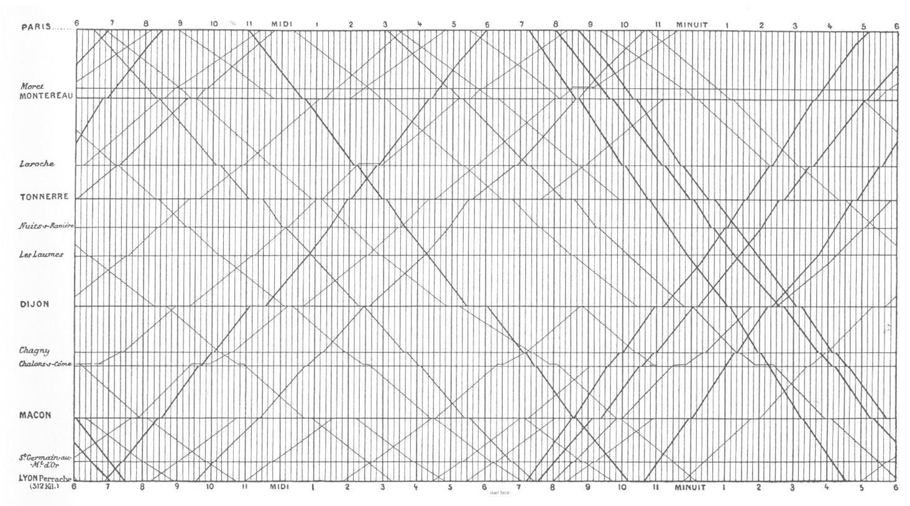

<!-- _class: cover -->
<!-- _paginate: skip -->

  <h1>7 •  Charting Taxonomy</h1>
  <h2>Data Visualization and Visual Analytics</h2>
  <!-- 
A subtitle
 -->

  

    
teacher

    
Salvatore Rinzivillo

    
Daniele Fadda

     
    
tutor

    
Eleonora Cappuccio

  

  

    <strong>University of Pisa</strong> 
    Department of Computer Science 
    Course: Data Visualization & Visual Analytics 
    Academic Year: 2025    
  

<!-- This lecture covers charting taxonomy, building on our previous introduction to visual variables. We'll explore different chart types, their appropriate uses, and common pitfalls to avoid when visualizing data. -->

---

# Crash Course on Effective Charting

  

    
  

  

    Dona M. Wong 
    <strong>Guide to Information Graphics</strong> 
    The Dos and Don'ts of Presenting Data, Facts, and Figures • W. W. Norton & Company 
  

<!-- These materials are drawn from Dona Wong's guide to information graphics, which provides excellent examples of good and bad visualization practices. The book focuses on best practices for effectively communicating data through charts. -->

---

# Charting Examples

<!-- This is an example of a misleading bar chart. The problem is that it lacks a zero baseline, showing only a portion of the data (like an iceberg with most of it hidden). When the zero line is missing, it creates a visual distortion that exaggerates the differences between values. -->

---

# Charting Examples

<!-- This is the correct version of the previous chart, starting from zero. Bar charts should always include the zero baseline because the height of each bar should be proportional to the value it represents. Otherwise, the visual representation doesn't match the actual data proportions. -->

---

# Charting Examples

<!-- This is another problematic example - an area chart without a zero baseline. Similar to bar charts, area charts suggest the area under the curve represents the quantity, so missing the zero line creates a distorted view of the data. The slope here encodes the variation of price, but the filled area delivers another message in parallel about the total value. -->

---

# Charting Examples

<!-- The correct version includes the full chart with a zero baseline. Alternatively, if we're primarily interested in trends rather than absolute values, a line chart without fill might be more appropriate, as it would focus on the rate of change without implying anything about the area underneath. -->

---

# Charting Examples

<!-- Another approach would be to transform the data to show changes from an initial reference point. This makes it easier to focus on relative changes over time rather than absolute values. The zero line then represents "no change" from the reference point. -->

---

# Charting Examples

  

    
  

  

    
  

May these charts be improved? Why? How?

<!-- Pie charts encode quantitative data by angle, which humans aren't very good at decoding accurately. The 3D pie chart on the left is even worse - the perspective distorts the angles further, making it practically impossible to accurately judge the proportions. The height of the cylinder also adds no information but increases visual clutter. -->

---

# Charting Examples

  

    
  

  

    
  

<!-- Here we see a comparison between a pie chart and a bar chart showing the same data. The bar chart makes it much easier to compare values and see the distribution. For the pie chart, it's difficult to assess whether one slice is bigger than another unless the difference is substantial. The bar chart allows for more precise visual comparison. -->

---
<!-- header: "" -->

<!-- _class: chapter -->
<!-- _paginate: hide -->
# Fonts
---

  

    <h1>Font Anatomy</h1>
    
  

  

    
  

  Typographic parts of a glyph: 1) x-height; **2) ascender line;** 3) apex; **4) baseline;** 5) ascender; 6) crossbar; 7) stem; **8) serif;** 9) leg; 10) bowl; 11) counter; 12) collar; 13) loop; 14) ear; 15) tie; 16) horizontal bar; 17) arm; 18) vertical bar; 19) cap height; **20) descenderline.**

  

  **Font size = (1) + (2) + (20) = (19) + (20)**
  

<!-- Understanding font anatomy is important when arranging text in visualizations. Font sizes are measured from the descender line to the ascender line, not just the x-height. This affects spacing when you need to arrange text elements in your visualization. When working with visualization libraries like D3, text placement and line spacing aren't automatic like in Word or PowerPoint. -->

---

<h1>General Rules</h1>
  

    <ul>
      <li>Leading sholid be 2 points larger than type size</li>
      <li>Avoid too small or condensed type faces</li>
      <li>Keep style simple: use bold or italic to emphasize a word (better not both)</li>
      <li>Avoid ALL CAPS</li>
      <li>Avoid styled fonts</li>
      <li>Avoid C***C Sans</li>
      <li>Reduce type at an angle</li>
      <li>Avoid t r a c k i n g</li>
    </ul> 
  

   

 **Fonts are meant to describe not to adorn**

<!-- The purpose of text in data visualization is to convey information clearly, not to decorate. Sans-serif fonts are generally more readable for legends and notation. Font styling should be minimal - use bold OR italic to emphasize, but not both. Avoid all caps, angled text, and excessive spacing between letters (tracking) as they reduce readability. -->

---

# Typography in Charts

 

<!-- The example on the left shows several typographic problems: using all-caps for titles, bold for axis labels, tilted text that's hard to read, and both bold and italic together. The example on the right shows cleaner typography with a normally capitalized title, clean horizontal labels, and sparing use of emphasis. -->

---

# Typography in Charts

  

  

<!-- The example on the left has decorative fonts that make the chart harder to read. The chart on the right uses simple, clean typography that doesn't distract from the data. Rotated y-axis labels should be avoided when possible - here the vertical label is aligned properly on the right. -->

---

# Typography in Charts

**Don't**

| **Name** | **Data** | **Data** | **Data** |
|----------|----------|----------|----------|
| **Company A** | 0.0 | **0.0** | **0.0** |
| **Company B** | 0.0 | **0.0** | **0.0** |
| **Company C** | 0.0 | **0.0** | **0.0** |
| **Company D** | 0.0 | **0.0** | **0.0** |

Many elements in bold.  Which part is highlighted?

**Do**

| **Name** | **Data** | **Data** | **Data** |
|----------|----------|----------|----------|
| **Company A** | 0.0 | 0.0 | **0.0** |
| **Company B** | 0.0 | 0.0 | 0.0 |
| **Company C** | 0.0 | 0.0 | **0.0** |
| **Company D** | 0.0 | 0.0 | 0.0 |

Give emphasis to relevant results

<!-- When too many elements are emphasized (like making an entire column bold), nothing stands out. Bold should be used sparingly to highlight only the most important values. Otherwise, you end up highlighting everything, which means highlighting nothing. -->

---
<!-- header: "" -->

<!-- _class: chapter -->
<!-- _paginate: hide -->

<h1>Data-Ink Ratio</h1>

Visual Display of Quantitative Data 
<em>Edward Tufte, 1983</em>

<!-- Edward Tufte introduced the concept of the data-ink ratio, which measures how much of the "ink" in a visualization is used to represent actual data versus decorative or unnecessary elements. A higher data-ink ratio generally means a more efficient visualization. -->

---

# Data-Ink Ratio

<!-- This 3D bar chart has a poor data-ink ratio. Many visual elements don't encode any data: the depth of bars, the fake shadows, and the 3D perspective. The 3D perspective also distorts the height comparison, making it harder to accurately compare values. -->

---

# Data-Ink Ratio

<!-- This 2D bar chart has a much better data-ink ratio. It presents the same data clearly without distortion. All visual elements contribute to understanding the data. The height of each bar is clearly proportional to its value, making comparisons easy and accurate. -->

---

# Bar Charts

Represent discrete quantities 

<!-- Bar charts are excellent for comparing discrete quantities. They leverage our ability to compare lengths accurately. The baseline should always be zero, and bars can be sorted to help identify patterns, especially when there's no inherent order to the categories. -->

---

# Bar Charts

Avoid non-functional adornation

<!-- 3D effects on bar charts are counterproductive. They add no information while making it harder to judge the actual values. The perspective distortion makes bars of equal height appear different depending on their position, and the shadows and depth don't encode any data. -->

---

# Bar Charts: Baseline

<!-- The left chart has a truncated axis that starts at 75 instead of 0, exaggerating the differences between bars. The right chart correctly starts at 0, showing the true proportions. Bar charts must always include zero on their scale because the entire height of the bar represents the value. -->

---

# Bar Charts: Baseline

<!-- When working with negative values in bar charts, the zero line becomes the central reference point. Bars can extend upward for positive values and downward for negative values. This correctly preserves the proportionality that is fundamental to bar charts. -->

---

# Bar Charts: Ordering

<!-- If categories have no natural order (like countries), sorting bars by value often makes the chart easier to read. This helps identify patterns, maximums, minimums, and medians. However, if there's a natural order (like timestamps), it's usually better to preserve that order.

Horizontal bar charts work well when you have many categories or long category names. They provide more space for labels and make them easier to read. Vertical bars are traditional and work well with fewer categories or when the x-axis represents time. -->

---

# Pie Charts

• Pie Charts compare relative sizes and contributions

<!-- Pie charts show parts of a whole. They're best used when you have very few segments (ideally 2-3) and when the primary task is to see if something is above or below 50%. They become increasingly difficult to read with more segments, especially when segments are similar in size. -->

---

# Pie Charts: Ordering Slices

<!-- When using pie charts, arrange the largest slice at the top (12 o'clock position) and the second largest to the right. This makes the most important segments easier to compare. It's easier to compare angles that are aligned with vertical or horizontal reference lines. -->

---

# Pie vs Bar Charts

<!-- This shows the same data as a pie chart and a bar chart. The pie chart shows that two companies make up 65% of the market (parts of a whole), while the bar chart makes it easier to compare the exact values between companies. Each has different strengths depending on your visualization goal. -->

---

# Visualization Taxonomy

---

---

# Bars vs. Lines

Line implies trends. Do not use for categorical data

<!-- Line charts imply continuity and trends between points, so they should only be used for continuous data where that connection is meaningful (like time series). For categorical data with no inherent order, bar charts are more appropriate. Using lines for categorical data can imply false relationships. -->

---

# Trend Over Time

WILLIAM PLAYFAIR 1759-1823

<!-- William Playfair was a pioneer in data visualization who created some of the first line and bar charts. This historical example shows how he visualized economic data over time, combining a bar chart of quantity with a line showing price trends. -->

---

# Patterns Over Time

Marey's diagram, 1885

<!-- Marey's train schedule diagram is an innovative way to show patterns over time. Each line represents a train journey, with the slope indicating speed (steeper = faster). Horizontal position shows time of day, while vertical position shows stations along the route. Intersecting lines show where trains pass each other. -->

---

# Charting Examples

May these charts be improved? Why? How?

---

# Pies vs Bar Charts

<!-- This complex pie chart with many thin slices is difficult to read. There are too many categories, making it hard to compare values, especially for the smaller slices. The bar chart on the right presents the same information more clearly, allowing for easier comparison across all categories. -->

---

# Pies vs Bar Charts (Improved)

<!-- The improved version sorts the bars by value, making it even easier to see patterns and identify the maximum (Monja with 8 episodes) and compare across all values. This is significantly more effective than the pie chart for this many categories. -->

---

# Pies vs Bar Charts (Improved)

---

# Showing Changes

<!-- These pie charts attempt to show changes in market share over time, but it's difficult to see the small differences between the two charts. The visualization on the right directly shows the changes, making the trends immediately obvious - Windows and Mac losing share while iOS gaining. -->

---

# Showing Changes

<!-- Another example of showing changes over time. The side-by-side pie charts (left) make it difficult to see the changes precisely. The stacked bar chart (right) makes the same data much clearer, showing how each category changed between 2010 and 2011. -->

---

# Density Plot

<!-- Density plots help visualize the distribution of data. They're especially useful when you have many data points that would create overplotting in a scatter plot. The curve shows where values are concentrated, and the actual data points can be shown along the axis for reference. -->

---

# 2D Density Plots

<!-- When working with two-dimensional data, simple scatter plots (left) can become overcrowded and unclear when there are many points. A heatmap or 2D density plot (right) solves this by showing concentrations of points using color intensity, making patterns more visible. -->

---

# Box Plots

<!-- Box plots (or box and whisker plots) compactly summarize data distributions. The box shows the interquartile range (middle 50% of data), with the median as a line inside. Whiskers typically extend to show the range, with outliers sometimes plotted as individual points. -->

---

# Scatterplot

<!-- Scatter plots show relationships between two continuous variables. Each point represents an observation with its position determined by its values on two axes. This example humorously shows relationships between how tasty fruits are versus how difficult they are to eat. -->

---

# Cluttering, Overplotting

<!-- When scatter plots contain too many points, they suffer from overplotting - points overlap and obscure patterns. This makes it difficult to see the true distribution of the data, especially in dense regions where many points occupy the same visual space. -->

---

# Alpha Transparency Solution

alpha=1/10 | alpha=1/100
--- | ---
 | 

<!-- One solution to overplotting is to make points semi-transparent by setting an alpha value. Areas with more overlapping points appear darker, revealing density patterns. The right image uses higher transparency (alpha=1/100), making the density patterns even clearer. -->

---

# Takeaway Messages

• Charts exploit position on scale as a visual variable
• Best practice to reduce biases and misinterpretation of charts
• Appropriate chart type for specific data type and visualization task

<!-- Position on a scale is the most effective visual variable for quantitative data, which is why bar charts and line charts are so powerful. Following best practices helps ensure your visualizations accurately represent the data without introducing bias. The choice of chart type should match both your data type and your analysis goals. -->

---

<!-- _class: chapter -->
<!-- _paginate: skip -->

# A Few Examples and Case Studies

<!-- This section will explore real-world examples of data visualization in various contexts, examining both effective and problematic design choices. -->

---

# GDP Growth Example

<!-- This misleading bar chart exaggerates a small difference (from 0.6% to 0.7% GDP growth) by using a truncated axis and unequal bar widths. The second estimate (0.7%) looks about 3 times larger than the first estimate (0.6%), creating a visual impression far stronger than the actual 0.1 percentage point increase. -->

---

# Facebook Analytics Example

<!-- This example from Facebook Analytics uses grouped bar charts to compare demographics. The dual-color scheme effectively contrasts men vs. women across age ranges. Note that the values are presented both as percentages and as absolute numbers, giving context to the data. -->

---

---

# Photography Industry Example

<!-- This infographic combines multiple chart types to tell a comprehensive story about the camera industry. It uses bar charts for year-over-year comparisons, pie charts to show market composition, and percentage figures to highlight key changes. The consistent color scheme helps connect related information across different charts. -->

---

# Visual Taxonomy

http://www.datavizcatalogue.com/

<!-- Online resources like the Data Visualization Catalogue can help you choose appropriate chart types for different visualization tasks. These resources typically organize chart types by function (comparison, distribution, relationship, etc.) and provide guidance on when each type is most effective. -->
