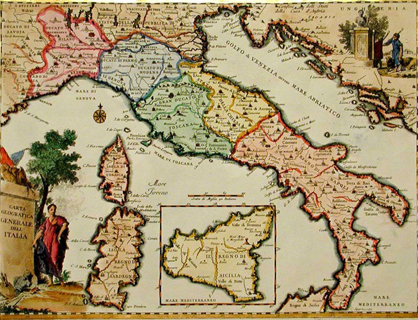
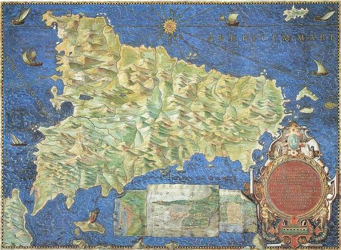
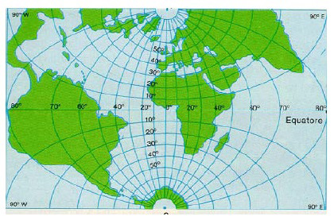

<!-- _class: cover -->
<!-- _paginate: skip -->

  <h1>8 •  Spatial Data and Geography</h1>
  <h2>Data Visualization and Visual Analytics</h2>
  <!-- 
A subtitle
 -->

  

    
teacher

    
Salvatore Rinzivillo

    
Daniele Fadda

     
    
tutor

    
Eleonora Cappuccio

  

  

    <strong>University of Pisa</strong> 
    Department of Computer Science 
    Course: Data Visualization & Visual Analytics 
    Academic Year: 2025    
  

<!-- This lecture covers charting taxonomy, building on our previous introduction to visual variables. We'll explore different chart types, their appropriate uses, and common pitfalls to avoid when visualizing data. -->

---

# OBJECTIVE

- To show spatial distribution of data
- To show relative positions of data components

- Thematic maps
  - Mapping to attribute data (quantitative and qualitative) on a map
  - Geometry linked to fixed geographical position

<!-- The main goal of geographic visualization is to show how data is distributed in space and the relative positions between data elements. Thematic maps allow us to link quantitative or qualitative attributes to specific geographic locations. -->

---

# MAP DESIGN

- Projection
  - Map curved 3D objects to a place
- Scale
  - Reduction of a map to the available space
- Symbolization and themes
  - Equivalent to encoding with Visual Variables

<!-- Creating a map requires addressing three fundamental issues: how to project a 3D world onto a 2D surface, what scale to use for representation, and how to symbolize information. These design decisions greatly impact the effectiveness and accuracy of the map. -->

---

# SCALE

<!-- Scale is a critical aspect of cartography. It defines the relationship between distances on the map and the actual distances on Earth. The choice of scale affects the level of detail that can be shown and the geographical area that can be covered. -->

---

# MAP SCALE

- Defines as the ratio between a distance on the map and the corresponding distance on the Earth
  - Usually expressed as verbal ratio
    - 1:100
    - Distance on the map is always expressed as one
  - The ratio is dimensionless
  - The larger the fraction, the greater the map's details

<!-- Map scale is expressed as a ratio where the first number always represents one unit on the map, and the second number represents the equivalent units on Earth. For example, a scale of 1:100,000 means that 1 centimeter on the map represents 100,000 centimeters (1 kilometer) in the real world. The larger the fraction (like 1:10,000 compared to 1:1,000,000), the more detailed the map is. -->

---

<!-- _class: all-image -->

# MAP SCALE (1:50,000,000)

<!-- At a scale of 1:50,000,000, we can see entire continents, but we lose most of the details. This scale is appropriate for displaying global patterns, continental boundaries, or very large regions. At this scale, cities appear as dots, and only major geographic features are visible. -->

---

<!-- _class: all-image -->

# MAP SCALE (1:6,500,000)

<!-- At a scale of 1:6,500,000, we can see large regions like parts of Europe. This scale allows for the visualization of countries, major cities, and primary geographical features like seas and mountain ranges. It's commonly used for continental or sub-continental maps. -->

---

<!-- _class: all-image -->

# MAP SCALE (1:1,500,000)

<!-- With a scale of 1:1,500,000, we can focus on a single country or a specific region. This scale shows more details like smaller cities, rivers, and main road networks. It's useful for national or regional maps where you need to show the relationship between major geographical features. -->

---

<!-- _class: all-image -->

# MAP SCALE (1:100,000)

<!-- At 1:100,000 scale, we're looking at a much more detailed view that might cover a metropolitan area or a small region. This scale allows for the visualization of neighborhoods, local roads, small streams, and detailed terrain features. It's suitable for regional planning or detailed navigation. -->

---

<!-- _class: all-image -->

# MAP SCALE (1:10,000)

<!-- The 1:10,000 scale provides a very detailed view of a small area, such as a city center or a neighborhood. At this scale, individual buildings, streets, parks, and small local features become clearly visible. This scale is often used for urban planning, detailed city maps, or specific area studies. -->

---

<!-- _class: all-image -->

# MAP SCALE (1:1,000)

<!-- At the very detailed scale of 1:1,000, we can see specific features like individual buildings, sports fields, parking lots, or garden layouts. This scale is used for site planning, property surveys, or detailed urban design. One centimeter on this map represents just 10 meters in the real world. -->

---

# PROJECTIONS

<!-- Projections are mathematical transformations used to represent the Earth's three-dimensional surface on a two-dimensional plane. Each projection involves some kind of distortion, whether it's of area, shape, distance, or direction. The choice of projection depends on the purpose of the map and the region being mapped. -->

---

# CARTOGRAPHY AS ART

<!-- Historically, cartography was not just a technical discipline but also an art form. Early maps were beautifully illustrated with decorative elements, showing not just geographical features but also cultural and historical aspects. These artistic maps combined technical precision with aesthetic considerations, making them both useful tools and cultural artifacts. 

The second map shows the historical map of Europe and showcases the artistic nature of early cartography. The precise geographical information is enhanced with decorative elements, illustrations, and elaborate typography. These maps were not just tools for navigation but also works of art that displayed the cartographer's skill and the cultural context of the time. -->

---

<!-- Another example of historical cartography showing a detailed map with vibrant colors and artistic elements. Historical maps often included decorative cartouches, sea monsters, and other embellishments that reflected both the knowledge and the imagination of their creators. These beautiful artifacts serve as important historical documents of how people understood their world. -->

---

<!-- This circular map projection provides a different perspective on geographical representation. Circular or polar projections are particularly useful for showing areas around the poles or for representing global relationships from a specific viewpoint. They demonstrate how the choice of projection can dramatically alter our perception of the world. -->

---

# THE NEW WORLD

- New challenges for geographers
- Since XVI century new methods to represent geography
- From plane to globe

<!-- The discovery of the "New World" in the 15th and 16th centuries presented enormous challenges for cartographers. The traditional flat representations of the world had to be reconsidered as explorers brought back information about vast new lands. This led to revolutionary changes in mapping techniques, with a shift from plane representations to more accurate spherical models of the Earth. -->

---

# BASIC COMPONENTS...

- A reference system
- A set of coordinates

<!-- All geographic information systems rely on two fundamental components: a reference system that defines the model of the Earth being used, and a coordinate system that allows for precise positioning of elements on that reference system. These components provide the framework for all spatial data representation. -->

---

# REFERENCE SYSTEM

- Univocally determine a position in 3D (2D+1D)
- Need for a simple model:
  - Mathematically tractable: surface
  - Link to physical world
- Typical surfaces:
  - Sphere
  - Ellipsoid (spheroid)
  - Geoid

<!-- A reference system allows us to precisely locate any point on Earth using coordinates. For mathematical simplicity, we represent the Earth's complex surface as a simpler model—either a sphere, an ellipsoid, or a geoid. Each offers different levels of accuracy and mathematical complexity. An ellipsoid approximates the Earth's shape reasonably well while remaining mathematically manageable. -->

---

# COORDINATE (2D+1D)

- Position relative to the reference system
- Angular coordinates
  - Longitude
  - Latitude
- Altitude as offset from the reference point

<!-- Coordinates specify a location relative to the reference system. Most commonly, we use the angular coordinates of latitude and longitude, which describe the angular distance from the equator and from the prime meridian, respectively. The third dimension, altitude, is measured as the distance from the reference surface (usually above or below sea level). -->

---

# LATITUDE AND LONGITUDE

- Latitude: angular distance from equator
- Longitude: angular distance from central meridian

<!-- Latitude measures the angular distance north or south from the equator, ranging from -90° (South Pole) to +90° (North Pole). Longitude measures the angular distance east or west from the Prime Meridian (usually through Greenwich, UK), ranging from -180° to +180°. Together, these coordinates can uniquely identify any location on the Earth's surface. -->

---

# WHICH REFERENCE SYSTEM?

- Earth present a complex surface, results of gravity, magnetical forces and different densities
- Mathematic representation is very complex

<!-- The Earth's actual shape is irregular and complex, influenced by variations in gravitational pull, magnetic fields, and the uneven distribution of mass. This complexity makes it impossible to create a perfect mathematical model of the Earth's surface. Different reference systems make different compromises in accuracy versus mathematical simplicity. -->

---

# GEOID

- Geoid: surface where gravity is constant in each point
- Average surface of seas

 

<!-- The geoid is a complex, irregular surface where the gravitational potential is constant at every point. It roughly corresponds to mean sea level extended through the continents. While the geoid is the most accurate representation of the Earth's true shape, its mathematical complexity makes it impractical for many mapping applications. -->

---

# WHICH REFERENCE SYSTEM?

- Ellipsoid: clear and easy mathematic definition
- Easy to define a position of a point in the space
- Low differences with the real geoid (~40m)

<!-- The ellipsoid, or spheroid, offers a good compromise between accuracy and mathematical simplicity. It's an ellipse rotated around its shorter axis, approximating the Earth's flattening at the poles. While it differs from the geoid by up to 40 meters in some places, this level of error is acceptable for most mapping purposes. The mathematical simplicity of the ellipsoid makes it the most commonly used reference system. -->

---

# DATUM

- An ellipsoid is univocally determined by 8 parameters (named Datum)
  - 2 shape parameted:
    - Equatorial radius
    - Polar radius
  - 6 parameters for position and orientation

<!-- A datum defines a specific ellipsoidal model of the Earth and its orientation in space. It requires eight parameters: two to define the shape (equatorial and polar radii) and six to define its position and orientation relative to the Earth. Different datums may use different values for these parameters, resulting in slightly different coordinate systems. -->

---

# WHICH DATUM?

- Diffusion of GPS systems: WGS84 (World Geodetic System 1984)
- Many local cartograph systems use local defined datum
  - In Europe, datum ED50 (European Datum 1950, Ellissoide di Hayford) is largely used
- All datum can be mapped/translated to WGS84

<!-- With the global adoption of GPS technology, WGS84 has become the most widely used datum worldwide. However, many countries and regions still use local datums that better fit their specific area of the Earth. For example, many European maps still use ED50. Conversion between different datums is possible but requires careful mathematical transformation to avoid positional errors. -->

---

# PROJECTIONS

- Cartographic projections maps coordinates from the ellipsoid to the plane
- A direct mapping is not feasible without introducing deformations
- Families of mapping that preserve:
  - Angles (conformal projection)
  - Surfaces (equal area projection)
  - Minimizing both

<!-- Map projections transform the three-dimensional ellipsoidal surface onto a two-dimensional plane. This transformation inevitably introduces some form of distortion. Different projections preserve different properties: conformal projections maintain accurate angles but distort areas; equal-area projections maintain correct size relationships but distort shapes; compromise projections try to minimize both types of distortion but preserve neither property perfectly. -->

---

# PROJECTIONS

- Each projection assume a precise datum
- For example, UTM projection uses datum WGS84 and ED50

<!-- Every map projection is designed to work with a specific datum. When working with spatial data, it's crucial to know both the projection and the underlying datum. Mixing data with different datums without proper transformation can lead to significant positional errors. Modern GIS systems often handle these transformations automatically, but understanding the concepts remains important. -->

---

# PROJECTIONS

Three different types
- Azimuthal: projection plane is tangent to a point on the earth
- Conic: points are projected on a cone
- Cylindrical: points are projected ona cylinder

<!-- Each projection type has its own characteristics and is suitable for different applications. Azimuthal projections are often used for polar regions, conic projections are good for mid-latitude areas, and cylindrical projections are useful for equatorial regions. The choice of projection depends on the geographic area being mapped and the specific requirements of the visualization. -->

---

# MERCATOR PROJECTION

- Cylindrical projections
- Cylinder tangent to equator
- Meridians are paralled
- Low distortion for tropical zones

<!-- A datum defines a specific ellipsoidal model of the Earth and its orientation in space. It requires eight parameters: two to define the shape (equatorial and polar radii) and six to define its position and orientation relative to the Earth. Different datums may use different values for these parameters, resulting in slightly different coordinate systems. -->

---

# UTM

(UNIVERSAL TRANSVERSE MERCATOR)

- Transverse Mercator Projection
- Cylinder tangent to one of the meridians
- Low deformation around the reference meridian

<!-- The Universal Transverse Mercator (UTM) system is a widely used projection for topographic mapping and GIS applications. It uses a transverse (sideways) orientation of the standard Mercator projection, with the cylinder tangent to a meridian rather than the equator. This arrangement minimizes distortion near the chosen meridian, making it suitable for mapping limited east-west areas. -->

---

# UTM PROJECTION

- Minimize distortion
  - Each projection is limited to a zone of 6 degrees
  - Central meridian is contracted by 0.9996
  - To ensure positive coordinates, each zone has a false easting origin at 500000 m on the east of central meridian
  - Projection is limited to latitudes between -80 N and +80 N

<!-- To maintain acceptable accuracy levels, the UTM system divides the world into 60 narrow zones, each covering 6 degrees of longitude. Each zone has its own central meridian, which is slightly contracted (scaled by 0.9996) to reduce overall distortion within the zone. To avoid negative coordinates, a false easting of 500,000 meters is added to all x-coordinates. The UTM system isn't used near the poles (beyond 80° latitude) because distortion becomes excessive. -->

---

# UTM ZONES

<!-- The UTM grid divides the world into 60 north-south zones, numbered 1 to 60 from west to east. Each zone is 6 degrees wide in longitude. Additionally, the system divides the world into 20 latitude bands, designated by letters C to X (omitting I and O). The combination of a zone number and band letter provides a grid reference that can identify any location on Earth between 80°S and 80°N. -->

---

# UTM ZONES IN ITALY

- Italy is covered by zones 32, 33 e 34

<!-- Italy spans three UTM zones: 32, 33, and 34. This means that for precise mapping of the entire country, coordinates must be transformed into a common system, or maps must be created separately for each zone. The need to work across multiple zones is a common challenge when mapping countries or regions that span significant east-west distances. -->