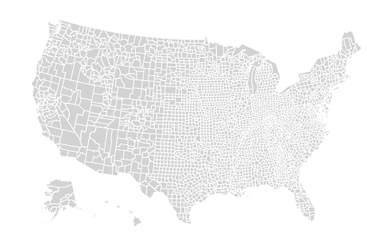
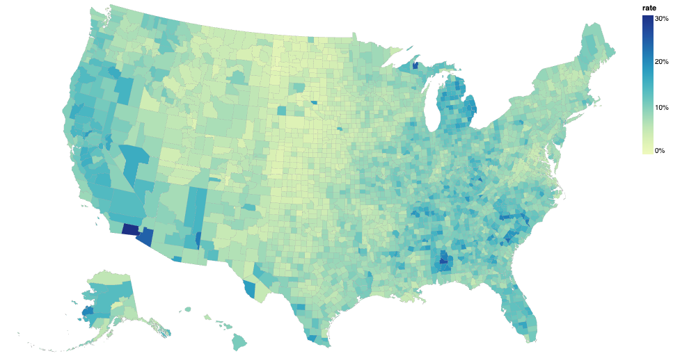

<!-- _class: cover -->
<!-- _paginate: skip -->

<div>
  <h1>9 • Cartography with Altair </h1>
  <h2>Data Visualization and Visual Analytics</h2>
  <!-- <div class="subtitle">A subtitle</div> -->

  <div class="authors">
    <div class="author-label">teacher</div>
    <div class="author-name">Salvatore Rinzivillo</div>
    <div class="author-name">Daniele Fadda</div>
    <br>
    <div class="author-label">tutor</div>
    <div class="author-name">Eleonora Cappuccio</div>
  </div>

  <div class="university">
    <strong>University of Pisa</strong><br>
    Department of Computer Science<br>
    Course: Data Visualization & Visual Analytics<br>
    Academic Year: 2025    
  </div>

</div>


<div class="cover-image">

</div>


<!-- Digital cartography has evolved from traditional mapmaking to incorporate computational methods, allowing for more dynamic and interactive map visualizations. It maintains cartographic principles while leveraging digital tools to create more accessible and customizable maps. -->

---

# Introduction to Digital Cartography

- Digital cartography is the process of creating and using maps through digital methods
- Combines principles of traditional cartography with computational techniques
<br>


<!-- Digital cartography has evolved from traditional mapmaking to incorporate computational methods, allowing for more dynamic and interactive map visualizations. It maintains cartographic principles while leveraging digital tools to create more accessible and customizable maps. -->

---

# Key components

- Geographic data representation
- Projection systems
- Visual encoding of spatial data
- Interactive functionalities


---

# Altair for Geographic Visualization

<div class="columns-2">

<div>

- Support for geographic data through:
  - GeoJSON and TopoJSON formats
  - Built-in projection methods
  - Layering capabilities

</div>

<div>

```python
import altair as alt
from vega_datasets import data

counties = alt.topo_feature(
    data.us_10m.url, 'counties')

alt.Chart(counties).mark_geoshape(
    fill='lightgray',
    stroke='white'
).project('albersUsa')
```

</div>

</div>

<!-- Altair provides a powerful yet accessible way to create map visualizations using Python. Its declarative approach allows users to focus on what they want to visualize rather than how to create the visualization. Built on Vega-Lite, it offers a concise syntax for creating complex geographic visualizations. -->

---

# Geographic Data Formats

<div class="columns-2">

<div>

- **GeoJSON**
  - JSON-based format for geographic features
  - Supports points, lines, polygons
  - Properties for attribute data
  - Web-friendly, human-readable

- **TopoJSON**
  - Extension of GeoJSON
  - Encodes topology (shared boundaries)
  - Smaller file sizes
  - Preferred for complex boundaries

</div>

<div>

```json
{
  "type": "Feature",
  "geometry": {
    "type": "Point",
    "coordinates": [125.6, 10.1]
  },
  "properties": {
    "name": "Example Point"
  }
}
```

</div>

</div>

<!-- Geographic data formats provide standardized ways to represent spatial information. GeoJSON is widely used for web mapping due to its simplicity, while TopoJSON offers advantages for complex boundaries by encoding topological relationships, resulting in more efficient file sizes and maintaining boundary integrity. -->
---

<!-- _class: columns-3 -->
<!-- _footer: '' -->
<!-- _paginate: false -->


```python
alt.topo_feature(
  data.us_10m.url, 
  feature='counties'
  )
```

```python
alt.topo_feature(
  data.us_10m.url, 
  feature='states'
  )
```

```python
alt.topo_feature(
  data.us_10m.url, 
  feature='land'
  )
```


---

# Map Projections

<div class="columns-2">

<div>

- Transform 3D Earth to 2D representation
- All projections distort some properties:
  - Area
  - Distance
  - Direction
  - Shape

- Common projections in Altair:
  - Mercator (`'mercator'`)
  - Albers USA (`'albersUsa'`)
  - Equirectangular (`'equirectangular'`)

</div>

<div>


</div>

</div>

<!-- Map projections are mathematical transformations that convert the spherical Earth to a flat representation. Each projection preserves certain properties while distorting others. The choice of projection should align with the visualization's purpose - whether preserving area, distance, or shape is most important for the data being displayed. -->

---

# Basic Map with Altair

<div class="columns-2">
<div>

```python
import altair as alt
from vega_datasets import data

# Load US counties from TopoJSON
counties = alt.topo_feature(data.us_10m.url, 'counties')

# Create base map
alt.Chart(counties).mark_geoshape(
    fill='lightgray',
    stroke='white'
).project(
    type='albersUsa'
).properties(
    width=900,
    height=500
)
```
</div>
<div>


</div>
</div>


<!-- Creating a basic map with Altair involves loading geographic data, specifying a mark type (typically geoshape), applying a projection, and setting properties like size and title. This example creates a simple map of US counties using the Albers USA projection, which is designed specifically for displaying the United States. -->

---
<!-- paginate: false -->
<!-- footer: '' -->

# Sphere and Graticule

Layering a sphere and graticule on a map provides context and reference points for geographic features. The sphere represents the Earth, while the graticule shows lines of latitude and longitude.

```python
alt.layer(
    # use the sphere of the Earth as the base layer
    alt.Chart({'sphere': True}).mark_geoshape(
        fill='#e6f3ff'
    ),
    # add a graticule for geographic reference lines
    alt.Chart({'graticule': True}).mark_geoshape(
        stroke='#ffffff', strokeWidth=1
    ),
    # and then the countries of the world
    alt.Chart(alt.topo_feature(world, 'countries')).mark_geoshape(
        fill='#2a1d0c', stroke='#706545', strokeWidth=0.5
    )
)


```

---

<!-- paginate: false -->
<!-- footer: 'Cartography with Altair <mark>DVVA<mark>' -->

```python
map.project(
    type='naturalEarth1', scale=110, translate=[-152, -15]
).configure_view(stroke=None)
```


[Vega-Lite Cartographic Projections](https://observablehq.com/@vega/vega-lite-cartographic-projections)

---

# Point Maps and Symbol Encoding

<div class="columns-2">

<div>

- Represent discrete locations with points
- Uses:
  - Event locations
  - Facility locations
  - Sample points
  
- Visual encodings:
  - Size (magnitude)
  - Color (category or value)
  - Shape (category)
  - Opacity (certainty)

</div>

<div>

```python
states = alt.topo_feature(data.us_10m.url, 'states')
airports = data.airports.url

# Base map
background = alt.Chart(states).mark_geoshape(
    fill='lightgray', stroke='white'
).project('albersUsa')

# Point layer
points = alt.Chart(airports).mark_circle(color='Red',size=5).encode(
    longitude='longitude:Q',
    latitude='latitude:Q',
    tooltip=['name:N', 'city:N', 'state:N']
).project('albersUsa')

(background + points).properties(
    width=450
)
```

</div>

</div>

<!-- Point maps visualize discrete locations, making them suitable for showing specific points of interest. Various visual properties can encode additional dimensions of the data - size for magnitude, color for categories or values, and shape for different types. This approach works well for visualizing events, facilities, or sample locations. -->
---
<!-- paginate: true -->
# Airports in the USA


---

# Choropleth Maps

<div class="columns-2">

<div>

- Maps where areas are colored based on data values
- Effective for showing:
  - Regional patterns
  - Spatial distribution of data
  - Comparative regional analysis

- Key considerations:
  - Color scale selection
  - Data classification
  - Normalization of values

</div>

<div>

```python
import altair as alt
from vega_datasets import data

counties = alt.topo_feature(data.us_10m.url, 'counties')
unemployment = data.unemployment.url

choropleth = alt.Chart(counties).mark_geoshape().encode(
    color=alt.Color('rate:Q', 
                    scale=alt.Scale(scheme='blueorange')),
    tooltip=['county:N', 'rate:Q']
).transform_lookup(
    lookup='id',
    from_=alt.LookupData(unemployment, 'id', ['rate'])
).project('albersUsa').properties(
    width=900, height=500,
    title='US Unemployment Rate by County'
)
```

</div>

</div>

<!-- Choropleth maps visualize statistical data through area coloring, making them valuable for showing how values vary across regions. The effectiveness of choropleth maps depends heavily on color scale choice, data classification method, and appropriate normalization to account for underlying population or area differences. -->

---

# Example: US Unemployment Rate

To integrate a data sources, we will  need to use the `lookup_transform`, augmenting  TopoJSON-based geoshape data with unemployment rates. 

We can then create a map that includes a color encoding for the looked-up rate field.

<div class="columns-2">
<div>


</div>
<div>

```python
{"type":"Polygon",
"arcs":[[-9509,9511,9512,-9464,-9350,-9366]],
"id":1001},
{"type":"Polygon",
"arcs":[[-9464,9512,-9511,-9509,-9495,-9480]],
"id":1002},
```
</div>
</div>

---


```python
alt.Chart(alt.topo_feature(usa, 'counties')).mark_geoshape(
    stroke='#aaa', strokeWidth=0.25
).transform_lookup(
    lookup='id', from_=alt.LookupData(data=unemp, key='id', fields=['rate'])
).encode(
    alt.Color('rate:Q',
              scale=alt.Scale(domain=[0, 0.3], clamp=True), 
              legend=alt.Legend(format='%')),
    alt.Tooltip('rate:Q', format='.0%')
).project(
    type='albersUsa'
).properties(
    width=900,
    height=500
).configure_view(
    stroke=None
)


```

---



---


# Best Practices for Digital Cartography

- **Choose appropriate projections** for your geographic area and analytical purpose
- **Normalize data** for choropleth maps to avoid misleading area-based interpretations
- **Select color scales** that are colorblind-friendly and match data characteristics
- **Include essential map elements**:
  - Legend
  - Scale indicator
  - Source attribution
- **Consider visual hierarchy** - make important information stand out
- **Balance detail and clarity** - avoid cluttering the map

<!-- Adhering to cartographic best practices ensures maps effectively communicate spatial information. Proper projection choice, data normalization, and color selection are foundational considerations. Including necessary map elements provides context for interpretation. Visual hierarchy guides attention to important features, while maintaining a balance between detail and clarity ensures the map remains readable. -->


---

# Bonus: Adding External GeoJSON Data

```python
import altair as alt
import json
import pandas as pd
import requests

# Load external GeoJSON (example with European countries)
url = "https://raw.githubusercontent.com/leakyMirror/map-of-europe/master/GeoJSON/europe.geojson"
europe_geojson = json.loads(requests.get(url).text)

# Convert to Altair format
europe_data = alt.InlineData(values=europe_geojson, format=alt.DataFormat(
    property='features',
    type='json'
))
```
---

<div class="columns-2">
<div>

```python
# Create a map with the external GeoJSON
europe_map = alt.Chart(europe_data).mark_geoshape(
    fill='lightgray',
    stroke='white'
).encode(
    tooltip='properties.NAME:N'
).project(
    type='mercator'
).properties(
    width=700,
    height=500,
    title='Map of Europe'
)

europe_map
```
</div>
<div>


</div>
</div>

---

# Additional Resources

- **Libraries and Tools:**
  - Altair Documentation: https://altair-viz.github.io/
  - Vega-Lite Documentation: https://vega.github.io/vega-lite/
  - GeoPandas: https://geopandas.org/
  
- **Data Sources:**
  - Natural Earth: https://www.naturalearthdata.com/
  - OpenStreetMap: https://www.openstreetmap.org/
  - GADM: https://gadm.org/
