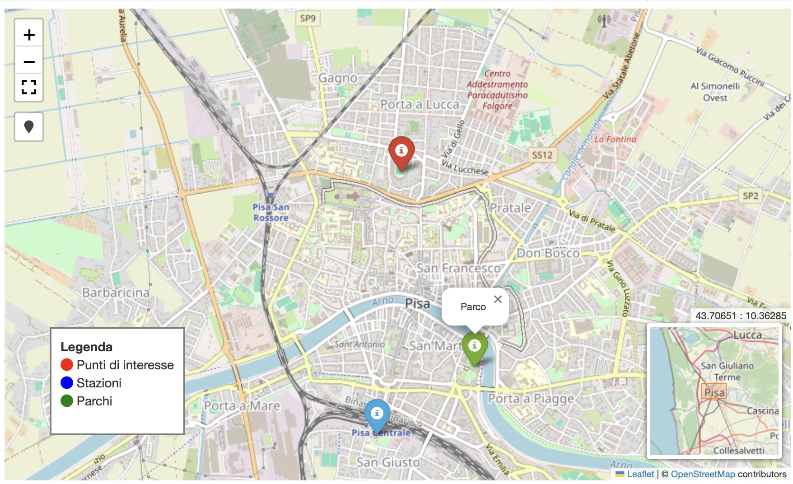

<!-- _class: cover -->
<!-- _paginate: skip -->

<div>
  <h1>10 •  Tiles and<br> Folium</h1>
  <h2>Data Visualization and Visual Analytics</h2>
  <!-- <div class="subtitle">A subtitle</div> -->

  <div class="authors">
    <div class="author-label">teacher</div>
    <div class="author-name">Salvatore Rinzivillo</div>
    <div class="author-name">Daniele Fadda</div>
    <br>
    <div class="author-label">tutor</div>
    <div class="author-name">Eleonora Cappuccio</div>
  </div>

  <div class="university">
    <strong>University of Pisa</strong><br>
    Department of Computer Science<br>
    Course: Data Visualization & Visual Analytics<br>
    Academic Year: 2025    
  </div>

</div>


<div class="cover-image">

</div>


<!-- This section introduces the concept of Tile Map Servers, which are essential for efficient delivery of geographic data for visualization -->

---

# Tile Map Server
- An efficient solution to publish maps on the web
- Complexity in space (rather than in time)
- Used by many providers:
  - Google Maps, Bing, Yahoo Maps, OpenStreetMaps
- Maps is generated once for all level of zoom and then sliced into tiles
- A map for a finite set of zoom levels

<!-- Tile Map Servers provide efficient map visualization by pre-rendering tiles at different scales. This allows for fast loading and smooth zooming in web-based maps. The pyramid structure organizes tiles by zoom level, with more detailed tiles at higher zoom levels. -->

---

# Tile Map Server (2)
- To simplify coordinate mapping: cylindrical projection
- Two main reference systems:
  - Sphere Mercator (53004)
  - World Mercator (54004)
- Mercator Cyndric projection
  - Meridians are parallels
  - Conformal (preserves shapes)
  - Preserves directions

<!-- The Mercator projection is widely used in web mapping due to its computational advantages. It preserves angles and shapes, making it useful for navigation, though it does distort areas near the poles. The choice of reference system is important for accurate geographic visualization. -->

---

# Tile Map Server (3): scale

<div class="columns-2">
<div>

- Hierarchy division of plane
- Every tile (any zoom) has a fixed 
dimension: 256x256
- Each zoom level increases 
(doubles) the number of tiles
- At level 1: only 4 tiles
</div>
<div>


</div>
</div>

<!-- The tiling scheme follows an exponential growth pattern with each zoom level. At zoom level 0, the entire world fits in a single 256×256 pixel tile, while each subsequent level doubles in both dimensions, creating a pyramid structure of increasingly detailed images. -->


---

# Tile Map Server (4): scale
<div class="columns-2">
<div>
- At each zoom level, the number 
of tiles increases
  - Every tile at level n generates 4 
  tiles at level n+1
- At level n tiles cover 256 * 2^n 
pixel
- For example, at level 3 map has 
a side 256 * 2^3 = 2048 pixel
</div>
<div>


</div>
</div>

<!-- The number of tiles at zoom level z is 2^z × 2^z, which means managing tremendous amounts of data at high zoom levels. This exponential growth pattern demonstrates why efficient systems are needed for geographic visualization, especially at detailed zoom levels. -->

---

# Tile Map Server (5): coordinates
<div class="columns-2">
<div>

- Given coordinate (lat,lon) and 
zoom level n, how to determine 
position on the image?
- Which tile correspond to 
coordinate?
pixelX = ((longitude + 180) / 360) * 256 * 2^level
pixelY = (1 – log(tan(Latitude)+ sinh(Latitude)) / pi))/2 * 256 * 2 ^ level
</div>
<div>


</div>
</div>

<!-- The formulas shown convert geographic coordinates (latitude/longitude) to pixel coordinates on the map at a specific zoom level. This mathematical transformation allows precise positioning of map elements. Understanding these conversions is essential for developing geographic applications. -->

---

# Tile Map Server (6): tile number
<div class="columns-2">
<div>

- Given pixelX e pixelY
- Which tile contains that pixel?
- URL to tile:
  - /zoom/tx/ty
  - quadkey
tileX = floor(pixelX / 256)
tileY = floor(pixelY / 256)
http://otile2.mqcdn.com/tiles/1.0.0/osm/1/0/0.png
</div>
<div>


</div>
</div>

<!-- The URL pattern for accessing tiles follows a standard structure with zoom level, column, and row coordinates. This allows any client to calculate precisely which tiles to request based on the current view. The example shows how to convert pixel coordinates to tile coordinates and the resulting URL format. -->

---

# Tile Map Server (7): quadkey

<div class="columns-2">
<div>

- Used by Bing
- Length of the key 
corresponds to the 
zoom level
tileX = 3 = 011
tileY = 5 = 101
quadkey = 100111 = 2134 = "213"

</div>
<div>


</div>
</div>

<!-- Bing Maps uses a different addressing scheme called "quadkeys" where a single string uniquely identifies a tile at a specific level. The length of the quadkey corresponds to the zoom level, and each digit identifies one of the four quadrants at each level of the hierarchy. -->

---

# Tile Map Server (8): zoom in

<div class="columns-2">
<div>

- Given a tile a zoom level n
- Successive tile at level n+1 are:
  - 2x,2y
  - 2x+1,2y
  - 2x,2y+1
  - 2x+1,2y+1
/3/4/2.png

</div>
<div>


</div>
</div>

<!-- When zooming in, each tile at level n splits into four tiles at level n+1. The mathematical relationship between parent and child tiles makes it easy to implement smooth zoom functionality. The hierarchical structure enables efficient storing and retrieval of map data. -->

---


<!-- This image illustrates the tile hierarchy across zoom levels. As you zoom in, each tile divides into four more detailed tiles. This pyramid structure is the foundation of the tile map server system, allowing for efficient storage and delivery of geographic data at varying levels of detail. -->

---

# Tile Viewer Example


<!-- This example shows a tile viewer interface where individual map tiles are visible. Tile viewers allow developers to inspect and debug tile-based maps by showing the grid structure and loading individual tiles. Understanding how tiles work together is crucial for optimizing map performance. -->

---

<!-- _class: chapter -->
<!-- _paginate: skip -->
<!-- _header: "" -->


# MAPPING USING <br>FOLIUM

<!-- This section explores the practical implementations of tile servers through various web mapping libraries and services, focusing on their features and use cases -->

---

# Introduction to Folium

<div class="columns-2">
<div>

- Python library for interactive maps
- Combines:
  - Data processing in Python
  - Visualization with Leaflet.js
- Saves maps as HTML files
- Perfect for Jupyter notebooks
- Install with `pip install folium`
</div>
<div>

```python
import folium

# Create a base map
m = folium.Map(
    location=[43.702, 10.396], 
    zoom_start=13
)

# Save as HTML
m.save("pisa_map.html")
```
</div>
</div>

<!-- Folium is a Python library that leverages the power of Leaflet.js to create interactive maps. It allows you to work with data in Python and then visualize it on a Leaflet map. The generated maps are interactive HTML files that can be easily shared and viewed in any browser. -->

---

# Creating a Base Map with Folium

```python
import folium

# Create a map centered on Pisa
m = folium.Map(
    location=[43.702, 10.396],  # [latitude, longitude]
    zoom_start=13,              # Initial zoom level
    tiles='OpenStreetMap',      # Tile provider
    control_scale=True          # Show map scale
)
```

<!-- Creating a base map with Folium requires just a few lines of code. You specify a central location, a zoom level, and a tile provider. The .save() method generates a standalone HTML file that can be opened in any browser. The map automatically includes controls for zoom and panning. -->

---

# Saving the Map as an HTML File

```python
m.save('pisa_map.html')
```
---

# Tile Providers in Folium

<div class="columns-2">
<div>

- Default providers:
  - `'OpenStreetMap'` (default)
  - `'CartoDB positron'`
  - `'CartoDB dark_matter'`
- Custom URLs:
  - `tiles='https://{s}.tile.openstreetmap.org/{z}/{x}/{y}.png'`
  - `attr='OpenStreetMap'` (attribution)

[Additional map styles](https://python-visualization.github.io/folium/latest/user_guide/raster_layers/tiles.html)
  -
</div>
<div>

```python
# Map with terrain style
m_terrain = folium.Map(
    location=[43.702, 10.396],
    zoom_start=13,
    tiles='CartoDB positron'
)
# Map with dark style
m_dark = folium.Map(
    location=[43.702, 10.396],
    zoom_start=13,
    tiles='CartoDB dark_matter'
)
```
</div>
</div>

<!-- Folium provides access to various tile providers, each with a unique visual style. Standard styles are ideal for navigation, while styles like 'dark_matter' are optimal for data visualization. You can also use custom URLs to access tile providers not included by default. -->

---

# Adding Multiple Tile Layers

```python
# Map with multiple tile layers
m = folium.Map(
    location=[43.702, 10.396],
    zoom_start=13
)

# Add different tile layers
folium.TileLayer('CartoDB dark_matter', name='Dark').add_to(m)
folium.TileLayer('CartoDB positron', name='Light').add_to(m)

# Add a layer control icon
folium.LayerControl().add_to(m)
```

<!-- Multiple tile layers can be added to a single map and toggled using the layer control. This allows users to switch between different map styles depending on the visualization needs. The LayerControl adds a widget to the map for easy layer switching. -->

---


---
<!-- paginate: false -->

# Markers and Geometries
<div class="columns-2">
<div>

```python
import folium

m = folium.Map(location=[43.702, 10.396],
 zoom_start=13)

# Add a marker
folium.Marker(
    location=[43.7186, 10.39],
    popup='<b>Pisa Tower</b>',
    tooltip='Click for more info',
    icon=folium.Icon(icon='info-sign', color='red')
).add_to(m)

# Add a circle
folium.Circle(
    location=[43.6890, 10.3977],
    radius=100,  # radius in meters
    color='blue',
    fill=True,
    fill_color='blue',
    fill_opacity=0.2,
    popup='Pisa Airport'
).add_to(m)

```

</div>
<div>


</div>
</div>

<!-- Folium makes it easy to add markers and geometries to the map. Markers represent discrete locations, with options for popups and informative tooltips. They can be customized with different colors and icons. You can also add circles, polygons, and other geometries to highlight areas or routes. -->

---

# Polygons and Lines

<div class="columns-2">
<div>

```python
m = folium.Map(location=[43.72, 10.40], zoom_start=14)

# Define a polygon
coordinates = [
    [43.7213, 10.3963],  # [lat, lon]
    [43.7225, 10.3995],
    [43.7196, 10.4007],
    [43.7186, 10.3973]
]
folium.Polygon(
    locations=coordinates,
    color='green',
    fill=True,
    fill_color='green',
    fill_opacity=0.4,
    popup='Historic center area'
).add_to(m)

# Add a line
folium.PolyLine(
    locations=[[43.7186, 10.3976], 
    [43.7223, 10.3970], [43.7210, 10.3995], [43.7186, 10.421]],
    color='red',
    weight=3,
    opacity=0.7,
    popup='Tourist route'
).add_to(m)

```

</div>
<div>


</div>
<div>


<!-- To represent areas and routes, Folium offers PolyLine and Polygon. Polygons are ideal for representing areas such as administrative boundaries or buildings, while polylines are perfect for routes or road networks. Both can be customized with colors, opacity, and informative popups. -->

---

# Marker Clustering

```python
import folium
from folium.plugins import MarkerCluster
import pandas as pd

# Example data
data = pd.DataFrame({
    'lat': [43.7186, 43.7210, 43.7225, 43.7190, 43.7185, 43.7195],
    'lon': [10.3976, 10.3980, 10.3995, 10.4005, 10.4010, 10.3990],
    'name': ['Point A', 'Point B', 'Point C', 'Point D', 'Point E', 'Point F']
})

# Create the map
m = folium.Map(location=[43.720, 10.399], tiles='CartoDB positron', zoom_start=15)

# Create a marker cluster
marker_cluster = MarkerCluster().add_to(m)

# Add all points to the cluster
for idx, row in data.iterrows():
    folium.Marker(
        location=[row['lat'], row['lon']],
        popup=row['name']
    ).add_to(marker_cluster)

m.save('marker_cluster.html')
```

<!-- To manage large quantities of points without overcrowding the map, MarkerCluster automatically groups nearby markers. As you zoom in, the clusters split to show individual markers. This technique is essential for visualizing datasets with numerous points while keeping the map responsive and readable. -->

---


---
<!-- _paginate: true -->
# Custom Icons and Tooltips

```python
import folium

m = folium.Map(location=[43.715765, 10.399895], zoom_start=13)

# Add a custom marker with FontAwesome icon
folium.Marker(
    location=[43.7186, 10.39],
    popup='<b>Bike Sharing Station</b>',
    tooltip='Click for details',
    icon=folium.Icon(color='darkred', icon='bicycle', prefix='fa')
).add_to(m)
```

More icons available at: https://fontawesome.com/icons
<!-- Folium supports custom icons through Font Awesome, allowing you to use specialized symbols for different point types. This makes maps more intuitive and informative. The icon, color, and prefix parameters allow for extensive customization options. -->

---

# Heat Map

<div class="columns-2">
<div>

```python
import folium
from folium.plugins import HeatMap
import pandas as pd
import numpy as np

# Generate random data around Pisa
np.random.seed(42)
num_points = 500
center = [43.72, 10.40]
data = pd.DataFrame({
    'lat': np.random.normal(center[0], 0.01, num_points),
    'lon': np.random.normal(center[1], 0.01, num_points),
    'weight': np.random.rand(num_points)  # intensity from 0 to 1
})

# Create base map
m = folium.Map(location=center, zoom_start=14, tiles='CartoDB dark_matter')

# Convert data to format for HeatMap
heat_data = [[row['lat'], row['lon'], row['weight']] for _, row in data.iterrows()]

# Add the heat map
HeatMap(
    heat_data,
    radius=15,  # radius in pixels
    blur=10,    # blur effect
    gradient={  # color customization
        0.2: 'blue',
        0.4: 'lime',
        0.6: 'yellow',
        1.0: 'red'
    }
).add_to(m)

```
</div>
<div>


</div>
</div>


<!-- Heat maps visualize point density, highlighting areas of concentration. They're ideal for identifying clusters in large spatial datasets. Folium.plugins.HeatMap offers options to customize radius, blur, and color gradient. The dark background enhances visibility of hot areas. -->

---

# GeoJSON in Folium

<div class="columns-2">
<div>

```python
import json

# Load GeoJSON data
with open('example_path.json', 'r') as f:
    geo_data = json.load(f)

# Create a map
m = folium.Map(location=[43.72, 10.40], zoom_start=14)

# Style function for GeoJSON features
style_function = lambda x: {
    'fillColor': '#ffaf00',
    'color': '#000000',
    'weight': 1,
    'fillOpacity': 0.5
}

# Function for mouse hover highlighting
highlight_function = lambda x: {
    'fillColor': '#000000',
    'color': '#000000',
    'weight': 3,
    'fillOpacity': 0.7
}

# Add GeoJSON layer
folium.GeoJson(
    geo_data,
    name='geojson',
    style_function=style_function,
    highlight_function=highlight_function,
    tooltip=folium.GeoJsonTooltip(
        fields=['name', 'type'],
        aliases=['Name', 'Type'],
        localize=True
    )
).add_to(m)

# Add layer control
folium.LayerControl().add_to(m)


```
</div>
<div>
</div>
</div>


<!-- GeoJSON is the standard format for representing geographic data on the web. Folium can directly visualize GeoJSON files with interactive controls. Style and highlight functions allow customization of feature appearance and behavior on mouse hover. Tooltips display information from GeoJSON property fields. -->


---
<!-- _paginate: true -->
# Coordinates in Folium

<div class="columns-2">
<div>

- Folium and Leaflet use [latitude, longitude]
- **Important**: This is the opposite of GeoJSON!
- GeoJSON uses [longitude, latitude]
- Coordinate conversion:

```python
# From GeoJSON to Folium
geojson_coord = [-73.96, 40.78]  # [lon, lat]
folium_coord = [geojson_coord[1], geojson_coord[0]]  # [lat, lon]

# From Folium to GeoJSON
folium_coord = [40.78, -73.96]  # [lat, lon]
geojson_coord = [folium_coord[1], folium_coord[0]]  # [lon, lat]
```
</div>
<div>

```python
# Example of a point in Folium
folium.Marker(
    location=[43.72, 10.40],  # [lat, lon]
    popup='Pisa'
).add_to(m)

# The same point in GeoJSON
point_geojson = {
    "type": "Feature",
    "geometry": {
        "type": "Point",
        "coordinates": [10.40, 43.72]  # [lon, lat]
    },
    "properties": {
        "name": "Pisa"
    }
}
```
</div>
</div>

<!-- An important point to note is the order of coordinates: Folium and Leaflet use [latitude, longitude], while GeoJSON uses [longitude, latitude]. This difference is a common source of error when working with geographic data. Standardizing coordinate order is crucial for correctly displaying data. -->

---
<!-- paginate: skip -->
# Custom Layouts and Plugins

```python
import folium
from folium.plugins import MiniMap, Fullscreen, LocateControl, MousePosition

# Create a base map
m = folium.Map(location=[43.72, 10.40], zoom_start=14)

# Add a minimap
MiniMap().add_to(m)

# Add fullscreen control
Fullscreen().add_to(m)

# Control for user geolocation
LocateControl().add_to(m)

# Show mouse coordinates
MousePosition().add_to(m)

# Add a custom legend
legend_html = '''
<div style="position: fixed; 
     bottom: 50px; left: 50px; width: 150px; height: 120px; 
     background-color: white; border:2px solid grey; z-index:9999; font-size:14px;
     padding: 10px;">
     <b>Legend</b><br>
     <i class="fa fa-circle" style="color:red"></i> Points of interest<br>
     <i class="fa fa-circle" style="color:blue"></i> Stations<br>
     <i class="fa fa-circle" style="color:green"></i> Parks
</div>
'''
m.get_root().html.add_child(folium.Element(legend_html))

m.save('complete_map.html')
```

<!-- Folium offers numerous plugins to enhance map interactivity and usability. The minimap provides broader context, fullscreen control allows expanding the map, LocateControl uses the device's GPS, and MousePosition shows real-time coordinates. You can also add custom HTML elements like legends or additional information. -->

---
<!-- _paginate: true -->



---

<!-- paginate: true -->
# Integration with Pandas and GeoPandas

```python
import folium
import pandas as pd
import geopandas as gpd
from shapely.geometry import Point

# Create a Pandas DataFrame
df = pd.DataFrame({
    'name': ['Point A', 'Point B', 'Point C'],
    'lat': [43.72, 43.73, 43.71],
    'lon': [10.40, 10.41, 10.39],
    'value': [100, 200, 50]
})
```

---

```python
# Convert to GeoDataFrame
geometry = [Point(xy) for xy in zip(df['lon'], df['lat'])]
gdf = gpd.GeoDataFrame(df, geometry=geometry, crs="EPSG:4326")

# Create a map
m = folium.Map(location=[43.72, 10.40], zoom_start=13)

# Add points from GeoDataFrame
for idx, row in gdf.iterrows():
    folium.CircleMarker(
        location=[row['lat'], row['lon']],
        radius=row['value'] / 20,  # size proportional to value
        popup=row['name'],
        color='blue',
        fill=True,
        fill_color='blue',
        fill_opacity=0.6
    ).add_to(m)


```

<!-- Folium's integration with Pandas and GeoPandas simplifies spatial data analysis and visualization. Pandas handles tabular data while GeoPandas adds the geographical component. This combination is powerful for spatial analysis, allowing filtering, aggregating, and transforming data before visualization. -->

---
<!-- paginate: skip -->
# Visualizing Data with PopUps and Charts

<div class="columns-2">
<div>

```python
import folium
import json
import altair as alt
import pandas as pd

# Example: Creating a chart in a popup
m = folium.Map(location=[43.715765, 10.399895], zoom_start=13)

# Example data for a station over time
station_data = pd.DataFrame({
    'month': ['Jan', 'Feb', 'Mar', 'Apr', 'May', 'Jun'],
    'rentals': [45, 62, 78, 93, 102, 88]
})

# Create an Altair chart
chart = alt.Chart(station_data).mark_line(
    interpolate='monotone'
).encode(
    y=alt.Y('rentals:Q'),
    x=alt.X('month:O').axis(labelAngle=0).title('Months')
).properties(width=400).to_dict()

# Add a marker with the chart in the popup
folium.CircleMarker(
    [43.72, 10.40],
    popup=folium.Popup(max_width=500).add_child(
        folium.VegaLite(json.dumps(chart), width=500, height=250)
    ),
    radius=10,
    color="darkred",
    fill=True,
    fill_color="#3186cc",
).add_to(m)

```
</div>
<div>


</div>
</div>

<!-- Folium can integrate with data visualization libraries like Altair to create rich interactive elements. By embedding charts in popups, you can provide detailed analysis of specific locations. This technique is particularly useful for temporal data or multi-variable analysis tied to geographic points. -->

---
<!-- paginate: true -->
# Publishing and Sharing

<div class="columns-2">
<div>

- Publication methods:
  - Standalone HTML file
  - Embed in websites
  - Jupyter Notebook and Google Colab
  - Streamlit, Django/Flask for web apps
  
- Advantages:
  - No additional dependencies
  - Works in any browser
  - Full interactivity
  - Easy to share
</div>
<div>

```python
# Save as HTML
m.save('final_map.html')

# Embed in iframe
iframe = m._repr_html_()

# Convert to HTML string
html_string = m.get_root().render()

# In Jupyter notebook
# The map is displayed directly
m
```
</div>
</div>

<!-- One of the most appreciated features of Folium is the ease of publication and sharing. Maps are saved as complete HTML files that include all necessary scripts. This makes them easily shareable via email or web hosting. In Jupyter notebooks, maps display directly in the output, making interactive analysis immediate. -->

---

# Tools for Geographic Visualization

<div class="columns-2">

<div>

**Python-based:**
- Folium
- GeoPandas + Matplotlib
- Plotly (plot_mapbox)
- Bokeh
- Altair

</div>

<div>

**Other solutions:**
- QGIS (desktop, open-source)
- ArcGIS (professional)
- Tableau (business intelligence)
- D3.js (web, customizable)
- Mapbox GL JS (web, advanced)
- Kepler.gl (geospatial analysis)

</div>

</div>

<!-- Geographic visualization tools range from Python libraries to professional desktop software. Folium is excellent for Python-web integration, while QGIS offers more advanced analysis capabilities. The choice of tool depends on specific needs: complex analysis, interactive visualizations, or integration with existing workflows. -->

---

# Exercise: Visualizing Bike Sharing Data

Create an interactive map visualization using Folium and GeoJSON data:
- **Objective:** Visualize bike sharing stations and rental patterns in Pisa.
- **Data:** Use a GeoJSON file with station geometries and a CSV with rental data.
- **Tasks:**
  - Create a base map centered on Pisa.
  - Add markers for bike sharing stations.
  - Create charts to visualize rental patterns over time.
  - Add a heat map to visualize areas of high usage.
- **Bonus:** Add custom icons and interactive elements to enhance user experience.

---
  
- **Online resources:**
  - Folium documentation: https://python-visualization.github.io/folium/
  - GeoPandas tutorial: https://geopandas.org/en/stable/getting_started.html
  
- **Data sources:**
  - Natural Earth: https://www.naturalearthdata.com/
  - OpenStreetMap: https://www.openstreetmap.org/

<!-- These resources provide paths to deepen learning about geographic visualization. Technical documentation helps with implementation, while academic texts offer a deeper understanding of cartographic principles. Free data sources allow students to practice with various geographic datasets. -->

---

<!-- _class: all-image -->

<h1>Thank You!</h1>


<!-- This concludes our exploration of Tile Map Servers and Geographic Data Visualization with Folium. The techniques covered provide a foundation for effectively communicating spatial information through interactive visual means using Python. -->
