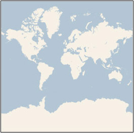
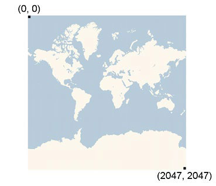
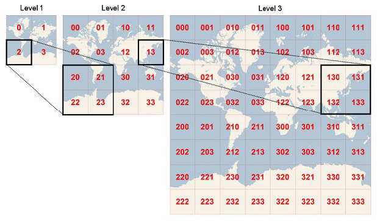
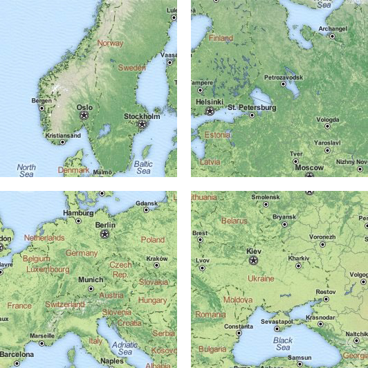

<!-- _class: cover -->
<!-- _paginate: skip -->

  <h1>10 •  Tiles and  tiles server</h1>
  <h2>Data Visualization and Visual Analytics</h2>
  <!-- 
A subtitle
 -->

  

    
teacher

    
Salvatore Rinzivillo

    
Daniele Fadda

     
    
tutor

    
Eleonora Cappuccio

  

  

    <strong>University of Pisa</strong> 
    Department of Computer Science 
    Course: Data Visualization & Visual Analytics 
    Academic Year: 2025    
  

<!-- This section introduces the concept of Tile Map Servers, which are essential for efficient delivery of geographic data for visualization -->

---

# Tile Map Server
- An efficient solution to publish maps on the web
- Complexity in space (rather than in time)
- Used by many providers:
  - Google Maps, Bing, Yahoo Maps, OpenStreetMaps
- Maps is generated once for all level of zoom and then sliced into tiles
- A map for a finite set of zoom levels

<!-- Tile Map Servers provide efficient map visualization by pre-rendering tiles at different scales. This allows for fast loading and smooth zooming in web-based maps. The pyramid structure organizes tiles by zoom level, with more detailed tiles at higher zoom levels. -->

---

# Tile Map Server (2)
- To simplify coordinate mapping: cylindrical projection
- Two main reference systems:
  - Sphere Mercator (53004)
  - World Mercator (54004)
- Mercator Cyndric projection
  - Meridians are parallels
  - Conformal (preserves shapes)
  - Preserves directions

<!-- The Mercator projection is widely used in web mapping due to its computational advantages. It preserves angles and shapes, making it useful for navigation, though it does distort areas near the poles. The choice of reference system is important for accurate geographic visualization. -->

---

# Tile Map Server (3): scale

- Hierarchy division of plane
- Every tile (any zoom) has a fixed 
dimension: 256x256
- Each zoom level increases 
(doubles) the number of tiles
- At level 1: only 4 tiles

<!-- The tiling scheme follows an exponential growth pattern with each zoom level. At zoom level 0, the entire world fits in a single 256×256 pixel tile, while each subsequent level doubles in both dimensions, creating a pyramid structure of increasingly detailed images. -->

---

# Tile Map Server (4): scale

- At each zoom level, the number 
of tiles increases
  - Every tile at level n generates 4 
  tiles at level n+1
- At level n tiles cover 256 * 2^n 
pixel
- For example, at level 3 map has 
a side 256 * 2^3 = 2048 pixel

<!-- The number of tiles at zoom level z is 2^z × 2^z, which means managing tremendous amounts of data at high zoom levels. This exponential growth pattern demonstrates why efficient systems are needed for geographic visualization, especially at detailed zoom levels. -->

---

# Tile Map Server (5): coordinates

- Given coordinate (lat,lon) and 
zoom level n, how to determine 
position on the image?
- Which tile correspond to 
coordinate?
pixelX = ((longitude + 180) / 360) * 256 * 2^level
pixelY = (1 – log(tan(Latitude)+ sinh(Latitude)) / pi))/2 * 256 * 2 ^ level

<!-- The formulas shown convert geographic coordinates (latitude/longitude) to pixel coordinates on the map at a specific zoom level. This mathematical transformation allows precise positioning of map elements. Understanding these conversions is essential for developing geographic applications. -->

---

# Tile Map Server (6): tile number

- Given pixelX e pixelY
- Which tile contains that pixel?
- URL to tile:
  - /zoom/tx/ty
  - quadkey
tileX = floor(pixelX / 256)
tileY = floor(pixelY / 256)
http://otile2.mqcdn.com/tiles/1.0.0/osm/1/0/0.png

<!-- The URL pattern for accessing tiles follows a standard structure with zoom level, column, and row coordinates. This allows any client to calculate precisely which tiles to request based on the current view. The example shows how to convert pixel coordinates to tile coordinates and the resulting URL format. -->

---

# Tile Map Server (7): quadkey

- Used by Bing
- Length of the key 
corresponds to the 
zoom level
tileX = 3 = 011
tileY = 5 = 101
quadkey = 100111 = 2134 = "213"

<!-- Bing Maps uses a different addressing scheme called "quadkeys" where a single string uniquely identifies a tile at a specific level. The length of the quadkey corresponds to the zoom level, and each digit identifies one of the four quadrants at each level of the hierarchy. -->

---

# Tile Map Server (8): zoom in

- Given a tile a zoom level n
- Successive tile at level n+1 are:
  - 2x,2y
  - 2x+1,2y
  - 2x,2y+1
  - 2x+1,2y+1
/3/4/2.png

<!-- When zooming in, each tile at level n splits into four tiles at level n+1. The mathematical relationship between parent and child tiles makes it easy to implement smooth zoom functionality. The hierarchical structure enables efficient storing and retrieval of map data. -->

---

<!-- This image illustrates the tile hierarchy across zoom levels. As you zoom in, each tile divides into four more detailed tiles. This pyramid structure is the foundation of the tile map server system, allowing for efficient storage and delivery of geographic data at varying levels of detail. -->

---

# Tile Viewer Example

<!-- This example shows a tile viewer interface where individual map tiles are visible. Tile viewers allow developers to inspect and debug tile-based maps by showing the grid structure and loading individual tiles. Understanding how tiles work together is crucial for optimizing map performance. -->

---

<!-- _class: chapter -->
<!-- _paginate: skip -->
<!-- _header: "" -->

# MAPPING USING  LEAFLET.JS

<!-- This section explores the practical implementations of tile servers through various web mapping libraries and services, focusing on their features and use cases -->

---

# LEAFLET.JS

<!-- Leaflet.js is a leading open-source JavaScript library for interactive maps. It's designed to be lightweight, simple to use, and extensible through plugins. The image shows a map created with Leaflet, demonstrating its clean interface and mapping capabilities. -->

---

# LEAFLET.JS - APIS

<!-- Leaflet's API is designed to be intuitive and easy to use. The library provides methods for creating maps, adding layers, markers, polygons, and handling user interactions. This screenshot shows some of the core functionality that makes Leaflet popular for web mapping applications. -->

---

# LEAFLET.JS
- A valid tool to provide tile-based maps
  - Open Source
  - Open Data (http://tools.geofabrik.de/mc/)
  - Free
- Easy to use API
- Lightweight lib (only 64k)
- Support mobile applications
- Alternative to Google Maps (http://flink.com.au/tips-tricks/27-reasons-not-to-use-google-maps)

<!-- Leaflet has become a popular alternative to Google Maps due to its open-source nature, lightweight size, and ease of use. Its small footprint (only 64KB) makes it ideal for mobile applications where bandwidth is limited. The library's flexibility allows it to work with various data sources and tile providers. -->

---

# FREE TILES PROVIDERS

- OpenStreetMap
  - Some issues for high traffic services
- MapQuest Open License
  - Free, by attribution
  - Special configuration for heavy usage
- MapBox
  - Free tier
  - Customizable design (see next slide)
  - Same family as Leaflet.js

<!-- Basemap providers supply the underlying map tiles that serve as the foundation for geographic visualizations. Free options like OpenStreetMap provide community-created map data, while services like MapBox offer free tiers with more customization options. The choice of provider depends on traffic requirements and customization needs. -->

---

# COMMERCIAL TILE PROVIDERS
- CloudMade
  - Mirror of OSM data till few years ago
  - Leaflet was born here
  - $30 per 1M tiles
- MapBox
  - Free for low traffic
  - $30 for 900k tiles

<!-- Commercial providers offer enhanced services, reliability, and customization options for more demanding applications. While they charge for higher usage, they typically provide better support and performance for production applications. MapBox has emerged as a leading provider with competitive pricing and advanced customization tools. -->

---

# EASY TO INSTALL/USE
- HTML (Setting the stage)
  - Link CSS (via CDN)
    `<link rel="stylesheet" href="http://cdnjs.cloudflare.com/ajax/libs/leaflet/0.7.3/leaflet.css" />`
  - Link JS (via CDN)
    ``
  - Create a div to contain the map
    `

`
  - Set height for the container
    `#map { height: 180px; }`

<!-- Integrating Leaflet into a web page is straightforward. It requires just a few lines of HTML to include the CSS and JavaScript files, create a container div, and set its dimensions. This simplicity is one of Leaflet's main advantages, making it accessible to developers of all skill levels. -->

---

# EASY TO INSTALL/USE
- Create an object to handle the map
  - var map = L.map('map').setView([51.505, -0.09], 13);

<!-- The Leaflet JavaScript API makes map initialization simple. With just one line of code, you can create a map centered at specific coordinates with a defined zoom level. This example shows how to initialize a map centered on London with zoom level 13. The map object provides methods for adding layers and handling interactions. -->

---

# Tile map providers
http://leaflet-extras.github.io/leaflet-providers/preview/
http://maps.stamen.com

<!-- Different map styles serve specific purposes. This slide shows various tile providers and their unique styles - from standard street maps to artistic interpretations like watercolor. The choice of style should complement the data being visualized. Resources like leaflet-providers make it easy to preview and select tile styles. -->

---

# MARKERS AND GEOMETRIES
- var marker = L.marker([51.5, -0.09]).addTo(map);
- var circle = L.circle([51.508, -0.11], 500, {
color: 'red',
fillColor: '#f03',
fillOpacity: 0.5
}).addTo(map);
- var polygon = L.polygon([
[51.509, -0.08],
[51.503, -0.06],
[51.51, -0.047]
]).addTo(map);

<!-- Leaflet provides simple methods to add various geometry types to maps. Markers represent discrete locations, circles can show areas of influence with a specific radius, and polygons can outline regions or boundaries. Each geometry type can be customized with properties like color, fill, and opacity. -->

---

# INTERACTIONS
- marker.bindPopup("<b>Hello world!</b> I am a popup.").openPopup();
- circle.bindPopup("I am a circle.");
- polygon.bindPopup("I am a polygon.");

<!-- Adding interactivity to maps is straightforward with Leaflet. The bindPopup method attaches HTML content to map elements that appears when clicked. This feature allows developers to create informative and interactive maps that respond to user actions and provide context for geographic features. -->

---

# EVENT HANDLING
- function onMapClick(e) {
alert("You clicked the map at " + e.latlng);
}
- map.on('click', onMapClick);
- var popup = L.popup();
- function onMapClick(e) {
popup
.setLatLng(e.latlng)
.setContent("You clicked the map at " + e.latlng.toString())
.openOn(map);
}
- map.on('click', onMapClick);

<!-- Leaflet's event handling system allows maps to respond to user interactions. This example shows how to listen for click events and display the coordinates of the clicked location in a popup. Event handling enables the creation of dynamic maps that adapt to user input and provide contextual information. -->

---

# OTHER EXAMPLES
- Mobile app
  - http://leafletjs.com/examples/mobile.html
- GeoJSON
  - http://leafletjs.com/examples/geojson.html
  - http://geojson.io/
- Tutorials
  - http://leafletjs.com/examples.html

<!-- Leaflet's flexibility extends to mobile applications, GeoJSON integration, and many other use cases. The provided resources offer examples and tutorials for different mapping scenarios. GeoJSON has become the standard format for web mapping due to its simplicity and compatibility with JavaScript, making it easy to represent geographic features. -->

