<!-- <script src="vega-loader.js"></script> -->
<script src="https://cdn.jsdelivr.net/npm/vega@5.30.0"></script>
<script src="https://cdn.jsdelivr.net/npm/vega-lite@5.21.0"></script>
<script src="https://cdn.jsdelivr.net/npm/vega-embed@6.26.0"></script>
<link rel="stylesheet" href="https://cdn.jsdelivr.net/npm/@fortawesome/fontawesome-free@6.5.2/css/all.min.css">
<script src="https://cdn.jsdelivr.net/gh/koaning/justcharts/justcharts.js"></script>
<script src="js/vega-chart.js"></script>


<!-- _class: cover -->
<!-- _paginate: skip -->

<div>
  <h1>11 • Interactive Visualization</h1>
  <h2>Data Visualization and Visual Analytics</h2>
  <!-- <div class="subtitle">A subtitle</div> -->

  <div class="authors">
    <div class="author-label">teacher</div>
    <div class="author-name">Salvatore Rinzivillo</div>
    <div class="author-name">Daniele Fadda</div>
    <br>
    <div class="author-label">tutor</div>
    <div class="author-name">Eleonora Cappuccio</div>
  </div>

  <div class="university">
    <strong>University of Pisa</strong><br>
    Department of Computer Science<br>
    Course: Data Visualization & Visual Analytics<br>
    Academic Year: {{ACADEMIC_YEAR}}    
  </div>

</div>


<div class="cover-image">

</div>


<!-- Slide di copertina. Introduce la lezione su Interactive Visualization. Benvenuti al modulo DVVA1: oggi parleremo dei principi fondamentali della visualizzazione interattiva e del perché l'interazione sia uno strumento irrinunciabile per l'analisi visiva. -->

---

# Why is Interaction Important?


- **Immagine Statica** → Insufficiente per fenomeni complessi
- **Analista** → Ha bisogno di esplorare prospettive diverse
- **Interazione** → Abilita operazioni analitiche


<pre>
  <i class="fa-solid fa-database"></i> Dati Complessi  →  <i class="fa-solid fa-magnifying-glass"></i> Esplorazione  →  <i class="fa-solid fa-chart-column"></i> Analisi Visiva 
</pre>


<!-- Partiamo da una domanda fondamentale: perché l'interazione è importante? Una singola immagine statica è quasi sempre insufficiente per comprendere fenomeni complessi. Un analista ha bisogno di esplorare i dati da prospettive diverse: l'interazione permette di selezionare sottoinsiemi, ottimizzare le tecniche visive, trasformare le viste ed eseguire vere operazioni analitiche. -->

---

<!-- _class: chapter -->
<!-- _paginate: skip -->

# I 5 Pilastri dell'Interazione

<!-- Slide separatore di sezione. Introduciamo i cinque tipi principali di interazione con le rappresentazioni grafiche. -->

---

# I 5 Pilastri dell'Interazione


1. <i class="fa-solid fa-rotate"></i> **Cambiamento Rappresentazione** | Osservare i dati da angolazioni diverse

2. <i class="fa-solid fa-magnifying-glass"></i> **Focus sui Dettagli** | Tooltip, zoom e contesto locale

3. <i class="fa-solid fa-gear"></i> **Trasformazione dei Dati** | Aggregazione, normalizzazione, smoothing

4. <i class="fa-solid fa-bullseye"></i> **Selezione o Filtraggio** | Isolare il sottoinsieme rilevante

5. <i class="fa-solid fa-link"></i> **Viste Multiple Coordinate** |  Trovare corrispondenze tra display


<!-- In questa lezione vedremo cinque tipi principali di interazione: il cambiamento della rappresentazione, il focus sui dettagli, la trasformazione dei dati, la selezione/filtraggio e le viste multiple coordinate. -->

---

<!-- _class: chapter -->
<!-- _paginate: skip -->

# 1. Cambio di Rappresentazione

---

# 1. Cambio Rappresentazione (View Change)

<div class="columns-1">

<div>

- Osservare gli stessi dati da **prospettive mirate**
- Supporta task analitici **molto diversi**

<br>

| Da | A | Perché |
|----|---|--------|
| Bar chart | Pie chart | Parte-Tutto |
| Linear time | Cyclic time | Stagionalità |
| Scala lineare | Scala log | Distribuzioni asimmetriche |

</div>

</div>

<!-- Cambiare la rappresentazione visiva è essenziale per osservare gli stessi dati da prospettive mirate, poiché supporta task analitici molto diversi. Possiamo passare da un grafico a barre a uno a torta, oppure cambiare una codifica basata sulla posizione a una basata sul colore. -->

---

# Caso d'Uso: Prospettive Temporali

<div class="columns-2">

<div>

### <i class="fa-solid fa-forward"></i> Tempo Lineare
- Mostra l'intera linea temporale
- Rivela **trend a lungo termine**
- Utile per confronti su decenni

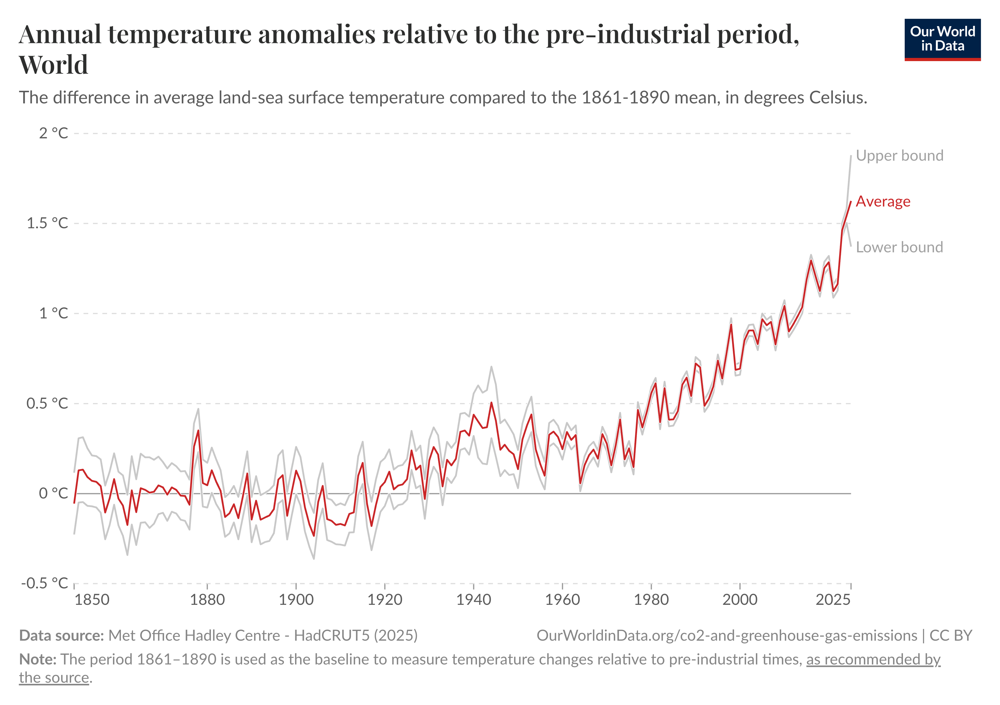

</div>

<div>

### <i class="fa-solid fa-repeat"></i> Tempo Ciclico
- Mostra cicli mensili/annuali
- Rivela **pattern stagionali**
- Facilita l'analisi periodica

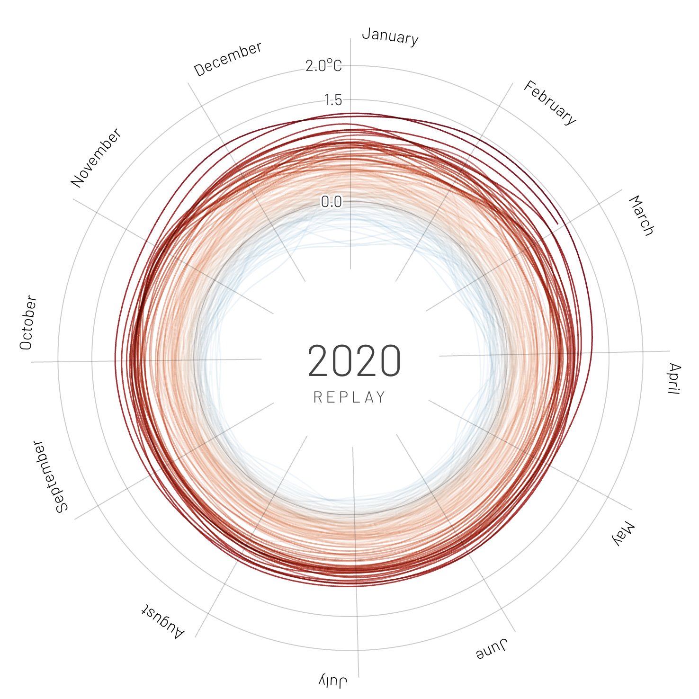

</div>

</div>


<!-- Un caso d'uso molto comune riguarda le prospettive temporali. La stessa serie storica — come le temperature di un aeroporto — letta in modo lineare svela i trend, mentre letta in modo ciclico (matrice mesi × anni) fa emergere immediatamente i pattern stagionali.

> **Esempio:** Temperature di Berlino-Tegel su 20 anni. Vista lineare → trend generale. Vista ciclica → variazioni stagionali mese per mese.

 -->

---

# Modifica del Display

<div class="columns-2">

<div>

Aggiustamenti interattivi che non cambiano il tipo di grafico ma **adattano la rappresentazione**:

<i class="fa-solid fa-ruler-combined"></i> Dimensione e proporzioni (Aspect Ratio)

<i class="fa-solid fa-ruler"></i> Scale degli assi

<i class="fa-solid fa-palette"></i> Schemi di colore

<i class="fa-solid fa-folder-open"></i> Intervalli di classe (binning)

</div>

<div>

```
┌────────────────────┐
│  Settings          │
│                    │
│  Scale:  [Log ▼]   │
│  Colors: [Div ▼]   │
│  Bins:   [──●──]   │
│                    │
└────────────────────┘
```

</div>

</div>

<!-- Oltre a cambiare tipologia di grafico, l'interazione permette di effettuare operazioni di modifica del display: aggiustare dimensione, proporzioni, scale, schemi di colore e intervalli di classe, adattando dinamicamente la visualizzazione ai bisogni dell'analista. -->

---

<!-- _class: chapter -->
<!-- _paginate: skip -->

# 2. Focus e Dettagli

---

# 2. Focalizzarsi e Ottenere Dettagli

<div class="columns-2">

<div>

### Tooltip e Pop-up

Strumento standard per accedere a valori esatti:

- Valori numerici precisi
- Informazioni di contesto
- Riferimenti esterni
- **Sub-visualizzazioni** embedded


</div>

<div>

  <div class="interactive-chart" id="tooltip">
  </div>

  <div class="img-chart">
  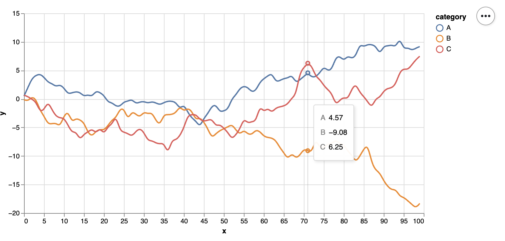
  </div>

  </div>
  <script>
  insertChart('tooltip', './chart/DVVA_11/tooltip.json', '100%', '450px');
  </script>

</div>

</div>

<!-- Nelle visualizzazioni moderne, per accedere ai valori esatti è standard usare tooltip e finestre di pop-up che si attivano passandoci sopra il cursore. Oltre ai valori, queste finestre possono includere contesto, riferimenti esterni, dettagli di calcolo o sub-visualizzazioni. -->

---

# Zooming e Panning

<div class="columns-2">

<div>

### <i class="fa-solid fa-magnifying-glass-plus"></i> Zoom Geometrico *(Magnification)*
- Ingrandisce l'**immagine**
- Gli elementi crescono di dimensione
- Le informazioni mostrate **restano le stesse**

</div>

<div>

### <i class="fa-solid fa-map"></i> Zoom Semantico
- Aumenta i **dettagli mostrati**
- Rivela elementi aggiuntivi
- Approccio **Focus + Context**

</div>

</div>

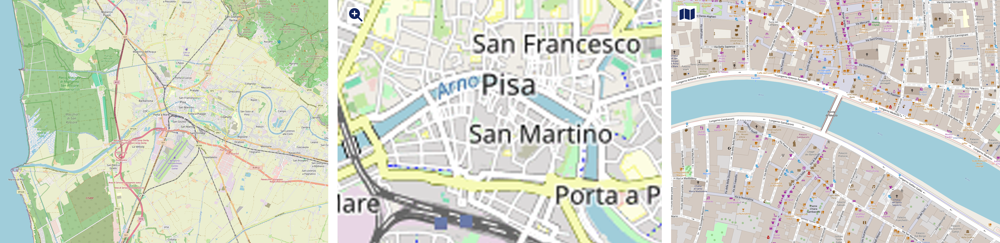  


<!-- > **Esempio Google Maps:** Zoom geometrico → confini più grandi ma uguali. Zoom semantico → compaiono nomi di regioni, province, autostrade, vie — man mano che la scala aumenta.

Zooming e Panning servono a ingrandire porzioni del display per aumentare la risoluzione visiva. Lo zoom geometrico è un semplice ingrandimento visivo: gli elementi crescono ma le informazioni restano le stesse. Lo zoom semantico invece rivela elementi aggiuntivi e scomposizioni prima invisibili. -->

---

# Color Re-scaling (Riscalatura Colori)

<div class="columns-2">

<div>


**Techniques:**
- Focus full color scale on a selected range
- Visual comparison with reference value
- Convert sequential to diverging scale
- Discretization (class intervals)

**Applications:**
- Increase discrimination in specific value ranges
- Highlight deviations from reference
- Emphasize important thresholds
- Simplify complex continuous distributions

</div>

<div>

<div class="interactive-chart" id="color-rescaling">
  </div>
  <div class="img-chart">
  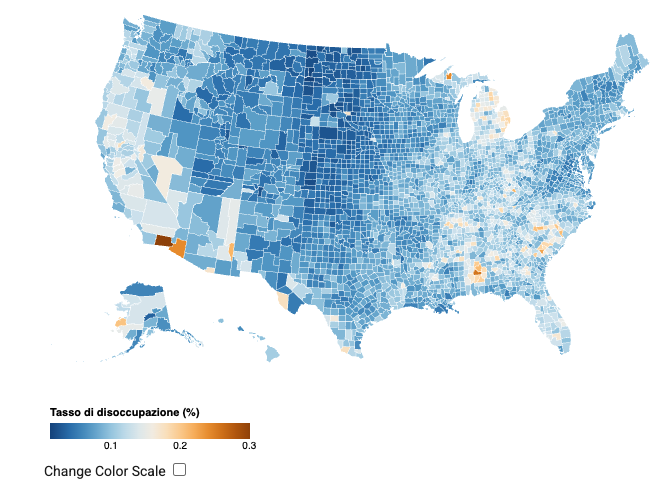
  </div>
  <script>
  insertChart('color-rescaling', './chart/DVVA_11/map_color_scales.json', '100%', '450px');
  </script>

</div>

</div>

<!-- Il Color Re-scaling serve ad aumentare la discriminazione in specifici range, evidenziare deviazioni e sottolineare soglie critiche. Esempio: tasso di disoccupazione USA — una scala divergente colora in rosso le contee sopra la media e in blu quelle sotto, rendendo immediatamente visibili gli scostamenti. -->

---

# Riordinamento (Reordering)

<div class="columns-2">

<div>

**Applicazioni:**
- Matrici e tabelle
- Assi in coordinate parallele
- Grafici a torta (ordine segmenti)

**Funzione:** rivelare relazioni e pattern nascosti

```
Prima (caotico):     Dopo (riordinato):
A █████              E ████████████
C ██                 C ████████
E ████████████       A █████
B ████               D ████
D ████               B ██
```

</div>

<div>

  <div class="interactive-chart" id="stacked_ordered">
  </div>

  <div class="img-chart">
  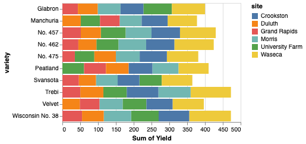
  </div>

  </div>
  <script>
  insertChart('stacked_ordered', './chart/DVVA_11/stacked_ordered.json', '100%', '450px');
  </script>

</div>

</div>


<!-- Il Riordinamento si applica a matrici, tabelle e grafici e rivela le relazioni nascoste tra attributi. Riordinando le righe per un singolo attributo, i pattern si allineano e diventano visibili anche in dataset molto complessi. 
> **Esempio:** Composizione etnica quartieri di Londra — riordinando per % popolazione asiatica, i cluster geografici emergono immediatamente.
-->


---

<!-- _class: chapter -->
<!-- _paginate: skip -->

# 3. Trasformazione dei Dati

---

# 3. Trasformazione dei Dati

<div class="columns-2">

<div>

**Motivazioni:**
- Ottenere una vista più **chiara**
- **Normalizzare** per il confronto
- Ridurre la mole di dati (**astrazione**)
- Eliminare dettagli eccessivi


**Tecniche principali:**

<div class="small-text">

| Tecnica | Uso |
|---------|-----|
| Discretizzazione | Range → categorie |
| Trasf. Logaritmica | Distribuzioni asimmetriche |
| Aggregazione | Conteggi, medie, somme |
| Integrazione attributi | Indicatori combinati |

</div>
</div>

<div>


  <div class="interactive-chart" id="interactive-aggregation">
  </div>

  <div class="img-chart">
  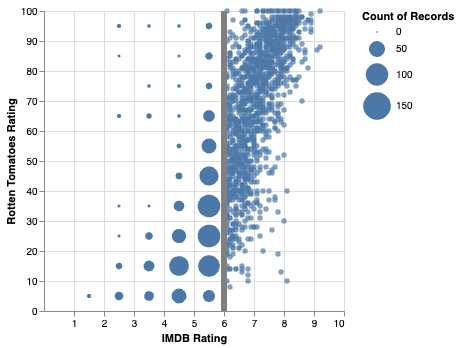
  </div>

  </div>
  <script>
  insertChart('interactive-aggregation', './chart/DVVA_11/interactive_aggregation.json', '45%', '450px');
  </script>


</div>

</div>

<!-- Arriviamo al terzo tipo: la trasformazione dei dati. I motivi per applicarla sono molti: ottenere viste più chiare, normalizzare i dati per il confronto, ridurre la mole e facilitare l'astrazione. Tra le tipologie: discretizzazione, trasformazione logaritmica, aggregazione e integrazione di attributi. -->

---

# Trasformazione su Serie Temporali

<div class="columns-2">

<div>

### Smoothing
Rimuove il **rumore** (fluttuazioni breve termine) per rivelare il **trend di fondo**

**Metodi:**
- Media mobile semplice (SMA)
- Smoothing esponenziale (EMA)
- Doppio e Triplo

</div>

<div>

### Variazioni
Calcolo di differenze per confronto diretto:

- Differenze **assolute** vs periodi precedenti
- **Rapporti** e variazioni percentuali
- Confronti con **stesso periodo ciclo precedente**

</div>

</div>

> **Esempio:** Contagi giornalieri — i dati grezzi mostrano sbalzi continui. La media mobile rivela la curva reale del trend.

<!-- Sulle serie temporali possiamo usare operazioni di smoothing per rivelare i trend. I metodi includono la media mobile semplice, lo smoothing esponenziale, doppio e triplo. È utile anche calcolare le variazioni: differenze assolute, rapporti rispetto ai valori precedenti, o confronti con lo stesso periodo del ciclo precedente. -->

---

<!-- _class: chapter -->
<!-- _paginate: skip -->

# 4. Selezione e Filtraggio

---

# 4. Selezione e Filtraggio

<div class="columns-2">

<div>

### <i class="fa-solid fa-hand-pointer"></i> Selezione
- **"Prende"** un sottoinsieme di dati
- Li visualizza in primo piano
- Richiede di specificare le **proprietà di interesse**

</div>

<div>

  <div class="interactive-chart" id="selection"></div>

  <div class="img-chart">
  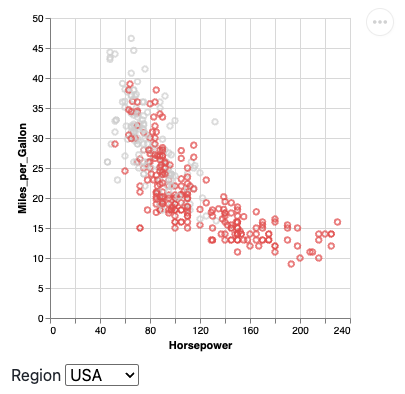
  </div>

  <script>
  insertChart('selection', './chart/DVVA_11/select.json', '100%', '450px');
  </script>

</div>

</div>


<!-- Quarto tipo: selezione e filtraggio. Entrambi richiedono di specificare le proprietà di interesse. Entrambi consentono l'**esplorazione dettagliata**, ma con approcci complementari.
 La selezione "prende" una porzione di dati per visualizzarla, il filtraggio rimuove temporaneamente i dati di minor interesse. -->

---

# 4. Selezione e Filtraggio

<div class="columns-2">

<div>

### <i class="fa-solid fa-filter"></i> Filtraggio
- **Rimuove temporaneamente** i dati di minor interesse
- Semplifica il display
- Mantiene il focus sul subset rilevante

</div>

<div>

  <div class="interactive-chart" id="filtering"></div>

  <div class="img-chart">
  
  </div>

  <script>
  insertChart('filtering', './chart/DVVA_11/filter.json', '100%', '450px');
  </script>

</div>

</div>


<!-- Quarto tipo: selezione e filtraggio. Entrambi richiedono di specificare le proprietà di interesse. Entrambi consentono l'**esplorazione dettagliata**, ma con approcci complementari.
 La selezione "prende" una porzione di dati per visualizzarla, il filtraggio rimuove temporaneamente i dati di minor interesse. -->

---

# Criteri Comuni per il Filtraggio

<div class="columns-2">

<div>

- <i class="fa-solid fa-chart-column"></i> **Attributi** — Slider o selettori di range numerici
- <i class="fa-solid fa-calendar-days"></i> **Temporali** — Range date, periodi ciclici
- <i class="fa-solid fa-map"></i> **Spaziali** — Strumenti di disegno libero su mappa (lazo)
- <i class="fa-solid fa-font"></i> **Entità** — Ricerca testuale o selezione da lista

</div>

<div>

- <i class="fa-solid fa-share-nodes"></i> **Relazione** — Navigazione di network e connessioni

> **Esempio:** Scatter plot automobili (HP vs MPG) — filtro `Regione = USA` rimuove temporaneamente i veicoli europei e asiatici, isolando il subset da analizzare.

</div>

</div>

<!-- Possiamo usare vari criteri: filtri sugli attributi con slider, filtri temporali, spaziali con strumenti di disegno, filtri per entità con ricerca testuale, e filtri di relazione che sfruttano la navigazione di network. -->

---

# Highlighting vs Filtraggio

<div class="columns-2">

<div>

### <i class="fa-solid fa-lightbulb"></i> Evidenziazione (Highlighting)
- Distingue un sottoinsieme
- **Mantiene il contesto** generale visibile
- Permette **comparazione** con il resto
- Gli altri dati restano in background

</div>

<div>

### <i class="fa-solid fa-filter"></i> Filtraggio
- **Rimuove** gli altri dati
- Offre chiarezza **sul solo sottoinsieme**
- Riduce la complessità visiva
- Contesto globale non disponibile

</div>

</div>

<!-- Attenzione alla differenza: l'evidenziazione distingue un sottoinsieme mantenendo visibile il contesto generale e abilitando la comparazione visiva. Il filtraggio rimuove gli altri dati, offrendo una visione più chiara del subset ma perdendo il contesto. -->

---

# Brushing (Evidenziazione Interattiva)

**Tecnica:** Trascinamento del mouse per selezionare un'area, oppure clic su marker singoli

<div class="columns-2">

<div>


**Modalità:**
- Singolo elemento
- Selezione multipla
- Temporanea o **persistente**

```
  ●  ●    ●  ●
●    ●  ┌────────┐
  ●     │● ● ●   │  ← area
●    ●  │  ● ●   │    di brush
  ●     └────────┘
```

</div>
  <div class="interactive-chart" id="brushing"></div>
  <div class="img-chart">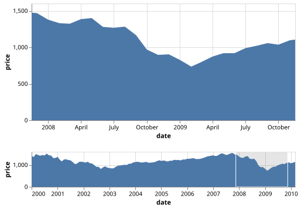</div>

  <script>
  insertChart('brushing', './chart/DVVA_11/brushing.json', '100%', '450px');
  </script>

<div>


</div>

</div>

<!-- Il Brushing è la tecnica d'elezione per evidenziare i dati: si esegue trascinando il mouse per creare un rettangolo di selezione. I punti fuori selezione perdono enfasi ma restano visibili per il contesto spaziale, mentre gli item selezionati vengono messi in risalto visivo. 
> **Esempio:** Su uno scatter plot automobili, brushing sulle auto con più HP → i punti selezionati vengono evidenziati, gli altri restano in grigio mantenendo il contesto.
-->

---

<!-- _class: chapter -->
<!-- _paginate: skip -->

# 5. Viste Multiple Coordinate

---

# 5. Viste Multiple Coordinate (CMV)

<div class="columns-2">

<div>

**Quando usarle:**
- Un unico grafico **non è sufficiente**
- Analisi di dati complessa e multi-dimensionale

</div>

<div>

**Obiettivo:**
- Trovare **informazioni corrispondenti** attraverso display multipli

</div>

  <div class="interactive-chart" id="multi_display">
  </div>

  <div class="img-chart">
  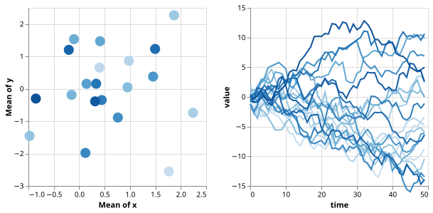
  </div>

  </div>
  <script>
  insertChart('multi_display', './chart/DVVA_11/multi_display.json', '100%', '450px');
  </script>

</div>

<!-- Giungiamo all'ultimo meccanismo: le Coordinated Multiple Views. Si utilizzano quando i dati non possono essere mostrati efficacemente in un unico grafico. Coordinare più viste supporta l'utente nel trovare informazioni corrispondenti, rendendo le CMV essenziali per analisi di dati complessa. -->

---

# Example: Color Propagation

- Colors assigned to data in one view are applied to same data in other views
- Applications examples:
  - From choropleth map to scatterplot
  - From scatterplot to scatterplot
  - From map to histogram

  <div class="interactive-chart" id="color-propagation">
  </div>
  <div class="img-chart">
  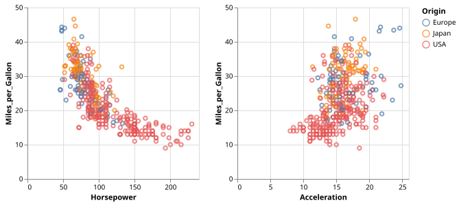
  </div>
  </div>
  <script>
  insertChart('color-propagation', './chart/DVVA_11/multi_color.json', '100%', '450px');
  </script>
<!-- La propagazione del colore è una tecnica molto usata per il collegamento visivo tra viste diverse, che permette agli utenti di seguire gli stessi elementi attraverso più visualizzazioni. 
[00:27:21:12 - 00:27:52:09]
In questo caso, il collegamento propaga la selezione o il filtraggio a tutti gli elementi, mentre la descrizione testuale fornisce la necessaria semantica aziendale o di ricerca. Si tratta di una forma di anticipazione di ciò che accadrà al momento del clic. Sebbene l'interattività sia uno strumento potente, comporta dei costi cognitivi elevati quando i cambiamenti simultanei sono troppi.

[00:28:28:12 - 00:29:02:15]
In questi casi è ottimale inserire una descrizione testuale dotata di un link diretto per evidenziare lo strumento. Possono emergere anche problemi di performance computazionale, come osservato ieri analizzando i limiti di rendering delle librerie grafiche (es. Altair) quando si gestisce una mole eccessiva di dati destinata a operazioni simultanee di filtraggio, selezione e brushing.

-->


---

# Meccanismi di Coordinamento

<div class="columns-2">

<div>

### <i class="fa-solid fa-link"></i> Brushing and Linking
Identificazione rapida delle relazioni tra viste

### <i class="fa-solid fa-filter"></i> Filtering Incrociato
Focus coerente tra tutte le prospettive

</div>

<div>

### <i class="fa-solid fa-palette"></i> Common Symbolization
Propaga proprietà visive (colori, forme, dimensioni)

### <i class="fa-solid fa-clipboard-list"></i> Conditioning
Crea istanze multiple basate sulle selezioni

</div>

</div>


<!-- 
Tra i meccanismi di coordinamento abbiamo il Brushing and Linking per l'identificazione rapida delle relazioni, il Filtering incrociato per un focus coerente, la Common Symbolization che propaga proprietà visive, e il Conditioning che crea istanze multiple del display basandosi sulle selezioni.

> **Esempio Londra:** Selezionando le barre con alta % femminile → sulla mappa si illuminano i quartieri corrispondenti → nel 3° grafico si evidenziano le fasce di età di quelle popolazioni.
 -->

---

# Attenzione al Coordinamento Eccessivo

<div class="columns-2">

<div>

**Rischi:**
- <i class="fa-solid fa-triangle-exclamation"></i> Risulta **distraente** per l'utente
- <i class="fa-solid fa-brain"></i> Può essere **opprimente** (overwhelming)
- <i class="fa-solid fa-laptop"></i> Richiede molte **risorse di calcolo**

</div>

<div>

**Soluzione:**
Dare all'utente il controllo su:

- **Cosa** collegare
- **Come** collegare
- **Quando** attivare il collegamento

</div>

</div>

<!-- Tuttavia, non tutto il coordinamento è sempre desiderabile. Troppe modifiche incrociate possono risultare distraenti, opprimenti e computazionalmente costose. Per questo i sistemi permettono all'utente di scegliere quali grafici collegare, che tipo di collegamento usare e quando attivarlo. -->

---

<!-- _class: chapter -->
<!-- _paginate: skip -->

# Limiti e Best Practices

---

# Limiti e Svantaggi dell'Interazione

<div class="columns-2">

<div>

### <i class="fa-solid fa-brain"></i> Costi Cognitivi e Temporali
- Apprendere le interazioni disponibili
- Attenzione spostata sulla UI
- Distrazione dal task analitico principale

### 🎲 Mancanza di Sistematicità
- Esplorazione **casuale e non tracciata**
- Difficile ricordare cosa si è già esplorato

</div>

<div>

### <i class="fa-solid fa-stopwatch"></i> Performance Lag
- Dataset enormi → calcoli lenti
- Il lag **spezza il flusso analitico**
- **Non riproducibilità** dei risultati

</div>

</div>

<!-- Limiti e svantaggi dell'interazione: elevati costi cognitivi e temporali, mancanza di approccio sistematico (esplorazione dipendente da scoperte casuali) e problemi di performance nei dataset enormi che causano lag e rendono quasi impossibile la riproducibilità. -->

---

# Bilanciare Interazione e Computazione

<div class="columns-2">

<div>

**Principio:** L'uso dell'interazione deve essere **giustificato**
poiché consuma il tempo dell'analista

**Sostituire con computazione automatica o proattiva:**

- <i class="fa-solid fa-magnifying-glass"></i> Rilevamento automatico dei pattern
- <i class="fa-solid fa-chart-column"></i> Viste pre-calcolate
- <i class="fa-solid fa-map"></i> Percorsi analitici guidati

</div>

<div>

```
             <i class="fa-solid fa-scale-balanced"></i>

          <i class="fa-solid fa-computer-mouse"></i>         <i class="fa-solid fa-robot"></i>
Interazione  Computazione
  (utente)   (automatica)

   Cercare l'equilibrio
   ottimale per il task
```

</div>

</div>

<!-- Dobbiamo bilanciare interazione e computazione. Poiché l'interazione consuma il tempo dell'analista, il suo uso dev'essere ben giustificato. Quando possibile va sostituita dalla computazione automatica: rilevamento automatico dei pattern, alternative pre-calcolate, veri percorsi analitici guidati. -->

---

# Best Practices

<div class="columns-2">

<div>

<i class="fa-solid fa-circle-check"></i> **Progettare per task specifici**
Ogni interazione deve supportare un obiettivo analitico definito

<i class="fa-solid fa-circle-check"></i> **Ridurre interazioni non necessarie**
Meno è più: ogni passo deve aggiungere valore

<i class="fa-solid fa-circle-check"></i> **Coerenza e Feedback immediato**
Modelli di interazione consistenti + risposta visiva istantanea

</div>

<div>

<i class="fa-solid fa-circle-check"></i> **Garantire una Cronologia**
Undo / Redo per documentare e ripercorrere il processo

<i class="fa-solid fa-circle-check"></i> **Equilibrare Flessibilità e Guida**
Libertà esplorativa + supporto proattivo all'analista

</div>

</div>

<!-- Best practices: progettare per specifici task analitici; ridurre le interazioni non necessarie; mantenere coerenza nei modelli e feedback visivo immediato; garantire una cronologia (undo/redo); equilibrare flessibilità e guida proattiva. -->

---

# Riepilogo: Interagire con la Visualizzazione

<div class="columns-2">

<div>

1. <i class="fa-solid fa-rotate"></i> **Cambiare Vista**
   Rappresentazione, display, prospettiva

2. <i class="fa-solid fa-magnifying-glass"></i> **Focalizzare i Dettagli**
   Tooltip, zoom geometrico/semantico, color re-scaling

3. <i class="fa-solid fa-gear"></i> **Trasformare i Dati**
   Discretizzazione, log, aggregazione, smoothing

</div>

<div>

4. <i class="fa-solid fa-bullseye"></i> **Filtrare i Dati**
   Selezione, filtraggio, brushing, highlighting

5. <i class="fa-solid fa-link"></i> **Coordinare Viste Multiple**
   Linking, filtering incrociato, symbolization, conditioning

</div>

</div>

<!-- In sintesi, abbiamo esplorato i cinque meccanismi fondamentali che rendono la visualizzazione dei dati uno strumento potente e dinamico. Questi cinque pilastri — cambiare la rappresentazione, focalizzarsi sui dettagli, trasformare i dati, filtrare e coordinare viste multiple — sono essenziali per supportare l'analista nella scoperta di fenomeni complessi. -->

---

# Conclusioni

<div class="columns-2">

<div>

### <i class="fa-solid fa-lightbulb"></i> Messaggio Chiave

> L'interazione è un **ponte tra i dati e l'intuizione**

La visualizzazione interattiva trasforma una massa statica di informazioni in un'**esperienza esplorativa dinamica**.

</div>

<div>

### <i class="fa-solid fa-circle-check"></i> Ricorda

- Progettare interazioni **intuitive e veloci**
- Supportare direttamente i **task analitici specifici**
- Bilanciare **flessibilità** con guida proattiva
- Ridurre i **costi cognitivi** e il lag computazionale

</div>

</div>

<!-- La visualizzazione interattiva non è solo un insieme di tecniche, ma un approccio filosofico all'analisi dei dati. L'efficacia dipende dall'implementazione: è cruciale progettare interazioni intuitive, veloci, che supportino direttamente i task analitici specifici, bilanciando sempre flessibilità e guida proattiva. -->

---

<!-- _class: all-image -->

<h1>Thank You!</h1>


<!-- Con questo concludiamo la nostra esplorazione delle tecniche di interazione per la visualizzazione. Queste tecniche, quando implementate correttamente, possono migliorare significativamente la capacità analitica delle visualizzazioni. -->
