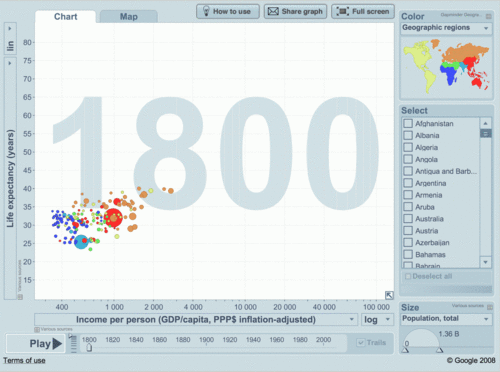
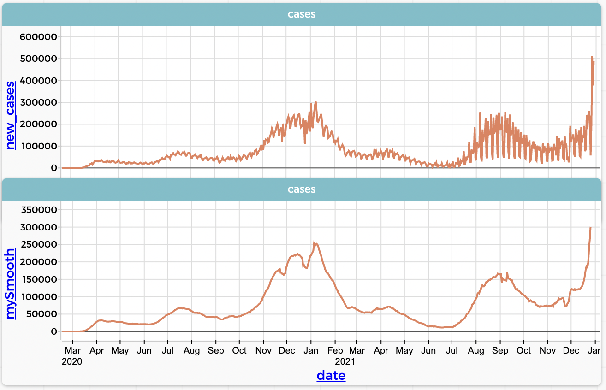
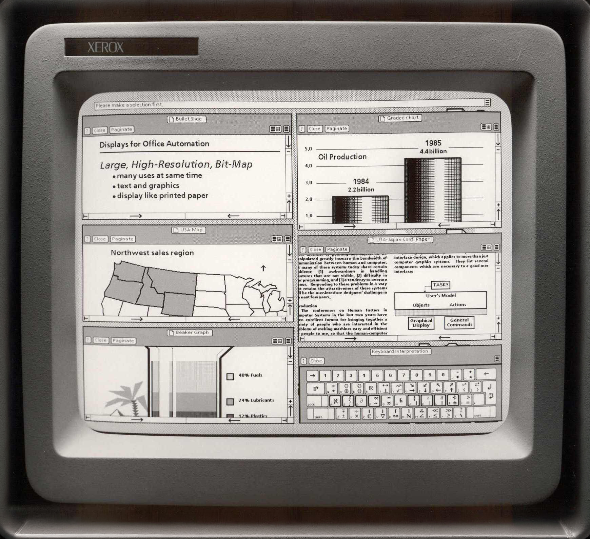

<!-- <script src="vega-loader.js"></script> -->
<script src="https://cdn.jsdelivr.net/npm/vega@5.30.0"></script>
<script src="https://cdn.jsdelivr.net/npm/vega-lite@5.21.0"></script>
<script src="https://cdn.jsdelivr.net/npm/vega-embed@6.26.0"></script>
<link rel="stylesheet" href="https://cdn.jsdelivr.net/npm/@fortawesome/fontawesome-free@6.5.2/css/all.min.css">
<script src="https://cdn.jsdelivr.net/gh/koaning/justcharts/justcharts.js"></script>
<script src="js/vega-chart.js"></script>


<!-- _class: cover -->
<!-- _paginate: skip -->

<div>
  <h1>11 • Interactive Visualization</h1>
  <h2>Data Visualization and Visual Analytics</h2>
  <!-- <div class="subtitle">A subtitle</div> -->

  <div class="authors">
    <div class="author-label">teacher</div>
    <div class="author-name">Salvatore Rinzivillo</div>
    <div class="author-name">Daniele Fadda</div>
    <br>
    <div class="author-label">tutor</div>
    <div class="author-name">Eleonora Cappuccio</div>
  </div>

  <div class="university">
    <strong>University of Pisa</strong><br>
    Department of Computer Science<br>
    Course: Data Visualization & Visual Analytics<br>
    Academic Year: {{ACADEMIC_YEAR}}    
  </div>

</div>


<div class="cover-image">

</div>


<!-- Benvenuti al modulo su Interactive Visualization: oggi parleremo dei principi fondamentali della visualizzazione interattiva e del perché l'interazione sia uno strumento irrinunciabile per l'analisi visiva complessa -->
---

<!-- _class: all-image -->

# An image is worth a thousand words, 

## but an interactive visualization is worth a million insights.



<!-- Partiamo da questa affermazione: un'immagine è meglio di mille parole, ma una visualizzazione interattiva è meglio di mille insights.
-->

---

# Why Is Interaction Important?


- **Static Image** → Insufficient for complex phenomena
- **Analyst** → Needs to explore different perspectives
- **Interaction** → Enables analytical operations


<pre>
  <i class="fa-solid fa-database"></i> Complex Data  →  <i class="fa-solid fa-magnifying-glass"></i> Exploration  →  <i class="fa-solid fa-chart-column"></i> Visual Analysis 
</pre>


<!-- Una singola immagine statica è quasi sempre insufficiente per comprendere fenomeni complessi. 

Un analista ha bisogno di esplorare i dati da prospettive diverse: l'interazione permette di selezionare sottoinsiemi, ottimizzare le tecniche visive, trasformare le viste ed eseguire vere operazioni analitiche. -->

---

<!-- _class: chapter -->
<!-- _paginate: skip -->

# The 5 Pillars of Interaction

<!-- Andiamo a vedere i cinque tipi principali di interazione che possiamo implementare. -->

---

# The 5 Pillars of Interaction


1. <i class="fa-solid fa-rotate"></i> **Representation Change** | Observe data from different angles

2. <i class="fa-solid fa-magnifying-glass"></i> **Focus on Details** | Tooltips, zoom, and local context

3. <i class="fa-solid fa-gear"></i> **Data Transformation** | Aggregation, normalization, smoothing

4. <i class="fa-solid fa-bullseye"></i> **Selection or Filtering** | Isolate the relevant subset

5. <i class="fa-solid fa-link"></i> **Coordinated Multiple Views** | Find correspondences across displays


<!-- 

Possiamo raggruppare le interazioni in cinque categorie principali, che costituiscono i pilastri fondamentali dell'interazione:

1- il cambiamento della rappresentazione, 

2- il focus sui dettagli, 

3- la trasformazione dei dati, 

4- la selezione/filtraggio e 

5- le viste multiple coordinate. -->

---

<!-- _class: chapter -->
<!-- _paginate: skip -->

# 1. Representation Change

<!-- Il primo tipo di interazione è il cambiamento della rappresentazione, che consente di osservare gli stessi dati da prospettive diverse, supportando task analitici molto differenti. 

Q:Vi ricordate quando l'abbiamo già incontrato?
(il caso d'uso delle prospettive temporali) -->

---

# 1. Representation Change

<div class="columns-1">

<div>

- Observe the same data from **targeted perspectives**
- Supports **very different** analytical tasks

<br>

| From | To | Why |
|------|----|-----|
| Bar chart | Pie chart | Part-to-whole |
| Linear time | Cyclic time | Seasonality |
| Linear scale | Log scale | Skewed distributions |

</div>

</div>

<!-- 
Incominciamo con la prima categoria delle interazioni visive: il cambiamento della rappresentazione (Representation Change). 

Il concetto chiave qui non è alterare i dati sottostanti, ma modificare il "visual encoding" per supportare task analitici radicalmente diversi sulla stessa porzione di informazioni. Guardando la tabella, possiamo analizzare tre casi d'uso classici:

1. Da Bar Chart a Pie Chart:
Cambiamo la prospettiva da un task di "comparison" di magnitudini assolute a un task "part-to-whole". È utile quando l'obiettivo analitico primario diventa la lettura delle proporzioni e il peso relativo di una categoria sul totale.

2. Da tempo lineare a tempo ciclico (es. timeline vs. spiral/radial plot): [prossima slide]

3. Da scala lineare a scala logaritmica:
Anche questo già incontrato (Q:quale grafico?), ma è un esempio classico.
Intervento strutturale per la gestione di distribuzioni fortemente asimmetriche (skewed data).

In sintesi, ogni cambio di rappresentazione è un'interazione intenzionale che ri-orienta il focus cognitivo dell'utente verso specifici insight.
-->

---

# Use Case: Time Perspectives

<div class="columns-2">

<div>

### <i class="fa-solid fa-forward"></i> Linear Time
- Shows the full timeline
- Reveals **long-term trends**
- Useful for comparisons across decades


</div>

<div>

### <i class="fa-solid fa-repeat"></i> Cyclic Time
- Shows monthly/yearly cycles
- Reveals **seasonal patterns**
- Facilitates periodic analysis


</div>

</div>


<!-- Questi shift sono fondamentali nelle'analisi temporali.

Discretizzazioni del tempo differenti supportano task analitici diversi. 
Da quelle più comuni come giorno, mese, anno si può passare a quelle più specifiche per il tipo di analisi: 
- trimestre fiscale per le aziende.
- weekday weekend per i dati di traffico.

Ogni prospettiva temporale mette in evidenza pattern e insight diversi.

Un caso d'uso molto comune riguarda le prospettive temporali. La stessa serie storica delle temperature, se letta in modo lineare svela i TREND, mentre letta in modo ciclico fa emergere i PATTERN STAGIONALI.

→ variazioni stagionali mese per mese
 -->

---

# Display Modification

<div class="columns-2">

<div>

Interactive adjustments that do not change the chart type but **adapt the representation**:

<i class="fa-solid fa-ruler-combined"></i> Size and proportions (aspect ratio)

<i class="fa-solid fa-ruler"></i> Axis scales

<i class="fa-solid fa-palette"></i> Color schemes

<i class="fa-solid fa-folder-open"></i> Class intervals (binning)

<hr>

<i class="fa-solid fa-ban"></i> <s>[DOMAIN]</s>
<i class="fa-solid fa-hand-point-right"></i> <strong>[RANGE]</strong>

</div>

<div>

```
┌────────────────────┐
│  Settings          │
│                    │
│  Scale:  [Log ▼]   │
│  Colors: [Div ▼]   │
│  Bins:   [──●──]   │
│                    │
└────────────────────┘
```

</div>

</div>

<!-- Molte volte si trovano queste alternative come sequenza di immagini statiche. Tuttavia proporre l'interazione per il cambiamento del display è un modo per rallentare l'utente nella lettura e farlo soffermare sul cambio di prospettiva.

Quale approccio preferite? (dipende dal contesto e da come veicolate il messaggio)

Oltre a cambiare tipologia di grafico, rientrano nella categoria - modifica del display:
- aggiustare dimensione
- aggiustare proporzioni e scale
- aggiustare schemi di colore e  
- il binning 

Sono modifiche che riguardano il range di valori rappresentati, non il dominio dei dati (il binning è un caso limite, dipende se viene fatto nei dati o nel grafico, a livello di visualizzazione).
-->
---

# Color Re-scaling

<div class="columns-2">

<div>


**Techniques:**
- Focus full color scale on a selected range
- Visual comparison with reference value
- Convert sequential scale to diverging scale
- Discretization (class intervals)

**Applications:**
- Increase discrimination in specific value ranges
- Highlight deviations from reference
- Emphasize important thresholds
- Simplify complex continuous distributions

</div>

<div>

<div class="interactive-chart" id="color-rescaling">
  </div>
  <div class="img-chart">
  
  </div>
  <script>
  insertChart('color-rescaling', './chart/DVVA_11/map_color_scales.json', '100%', '450px');
  </script>

</div>

</div>

<!-- Il Color Re-scaling serve ad aumentare la capacità di discriminazione all'interno di specifici range, evidenziare deviazioni e sottolineare soglie critiche. 

Nell'esempio: il tasso di disoccupazione USA.

Nella scala lineare i colori sono distribuiti su tutto l'intervallo, ma la maggior parte dei valori si concentra in un range ristretto, rendendo difficile distinguere le differenze tra contee.

Trasformiamo la scala lineare in una scala divergente: i valori vengono colorati in rosso nel caso di contee sopra la media e in blu quelle sotto, rendendo immediatamente visibili gli scostamenti. 

(Sarebbe più corretto parlare di "color remapping" piuttosto che di cambio di schema, perché in realtà stiamo modificando la mappatura dei colori, senza toccare i dati, operazione più efficace).
-->

---

# Reordering

<div class="columns-2">

<div>

**Applications:**
- Matrices and tables
- Axes in parallel coordinates
- Pie charts (segment order)

**Goal:** reveal hidden relationships and patterns

```
Before (chaotic):    After (reordered):
A █████              E ████████████
C ██                 C ████████
E ████████████       A █████
B ████               D ████
D ████               B ██
```

</div>

<div>

  <div class="interactive-chart" id="stacked_ordered">
  </div>

  <div class="img-chart">
  
  </div>

  </div>
  <script>
  insertChart('stacked_ordered', './chart/DVVA_11/stacked_ordered.json', '100%', '450px');
  </script>

</div>

</div>


<!-- Il Riordinamento si applica a matrici, tabelle e grafici e rivela le relazioni nascoste tra attributi. Riordinando le righe per un singolo attributo, i pattern si allineano e diventano visibili anche in dataset molto complessi. 

Nell'esempio i dati visualizzati corrispondono al celebre Minnesota Barley Yield Dataset (una raccolta di dati agricoli degli anni '30).

- Asse Y (Variabili nominali): Elenca specifiche varietà di colture.
- Asse X (Variabile quantitativa): Riporta la metrica Sum of Yield (Somma della resa/produttività agricola), con una scala numerica continua che va da 0 a 500.

- Colore: I diversi segmenti colorati all'interno di ogni barra raggruppano i dati per sito di coltivazione (site).

Riordinando le barre in base alla metrica Sum of Yield, i pattern di produttività emergono chiaramente, evidenziando quali varietà di colture performano meglio in specifici siti.
-->

---

<!-- _class: chapter -->
<!-- _paginate: skip -->

# 2. Focus and Details


<!-- Il secondo tipo di interazione che prenderemo in esame è il focusing per aumentare i dettagli. 
-->


---

# 2. Focusing and Getting Details

<div class="columns-2">

<div>

### Tooltips and Pop-ups

Standard tool for accessing exact values:

- Precise numeric values
- Contextual information
- External references
- Embedded **sub-visualizations**


</div>

<div>

  <div class="interactive-chart" id="tooltip">
  </div>

  <div class="img-chart">
  
  </div>

  </div>
  <script>
  insertChart('tooltip', './chart/DVVA_11/tooltip.json', '100%', '450px');
  </script>

</div>

</div>

<!-- Nelle visualizzazioni interattive, per accedere ai valori esatti è standard usare tooltip e finestre di pop-up che si attivano passandoci sopra con il cursore. Oltre ai valori, queste finestre possono includere:
- contesto, 
- riferimenti esterni, 
- dettagli di calcolo 
- sub-visualizzazioni (non è possibile con Altair). 
-->

---

# Zooming and Panning

<div class="columns-2">

<div>

### <i class="fa-solid fa-magnifying-glass-plus"></i> Geometric Zoom *(magnification)*
- Enlarges the **image**
- Elements increase in size
- Displayed information **stays the same**

</div>

<div>

### <i class="fa-solid fa-map"></i> Semantic Zoom
- Increases the **level of detail shown**
- Reveals additional elements
- **Focus + Context** approach

</div>

</div>

  


<!-- 
Zooming e Panning servono a ingrandire porzioni del display per aumentare la risoluzione visiva. (il panning serve a navigare un'area dove è stato applicato lo zoom)

Lo zoom geometrico è un semplice ingrandimento visivo: gli elementi crescono ma le informazioni restano le stesse. Lo zoom semantico invece rivela elementi aggiuntivi e informazioni prima invisibili. 

Nell'esempio Open streetmap centrato sul ponte di mezzo di Pisa

1. Zoom geometrico → i confini del centro sono meglio visibili, la scala è maggiore ma nonostante tutto, non ho aumento di informazione.

2. Zoom semantico → compaiono nomi di negozi, edifici, strade — man mano che la scala aumenta.

In google earth, allo zoom massimo, si attiva un ulteriore livello di dettaglio con la visualizzazione 3D degli edifici, che rappresenta un ulteriore esempio di zoom semantico.

Facendo zoom out invece si cambia il tipo di proiezione cartografica, da una proiezione locale a una globale, che è un esempio di cambiamento di rappresentazione.
-->


---

<!-- _class: chapter -->
<!-- _paginate: skip -->

# 3. Data Transformation

<!-- Il terzo tipo di interazione è la trasformazione dei dati.-->

---

# 3. Data Transformation

<div class="columns-2">

<div>

**Motivations:**
- Obtain a **clearer** view
- **Normalize** for comparison
- Reduce data volume (**abstraction**)
- Remove excessive details

<hr>

<i class="fa-solid fa-hand-point-right"></i> <strong>[DOMAIN]</strong>
<i class="fa-solid fa-ban"></i> <s>[RANGE]</s>

</div>
<div>
<strong>Main techniques:</strong>

<div class="small-text">

| Technique | Use |
|-----------|-----|
| Discretization | Range -> categories |
| Log transformation | Skewed distributions |
| Aggregation | Counts, means, sums |
| Attribute integration | Combined indicators |

</div>

</div>


<!-- I motivi per applicare òa trasformazione sono molti: ottenere viste più chiare, normalizzare i dati per il confronto, ridurre la mole e facilitare l'astrazione. Tra le tipologie: 
- discretizzazione, 
- trasformazione logaritmica, 
- aggregazione e integrazione di attributi.

Alcuni di questee trasformazioni ci suonano familiare (ne abbiamo parlato qualche slide fa). La differenza rispetto a prima è che ora stiamo parlando di trasformazioni dei dati e non di trasformazioni del display. 

In altre parole STIAMO MODIFICANDO il DOMINIO dei dati, non il range dei valori rappresentati.

[aggiungere nota domain range invertita rispetto la slide precedente]

-->

---

# 3. Data Transformation 

## Aggregation through Binning


  <div class="interactive-chart" id="interactive-aggregation">
  </div>

  <div class="img-chart">
  
  </div>

  </div>
  <script>
  insertChart('interactive-aggregation', './chart/DVVA_11/interactive_aggregation.json', '45%', '450px');
  </script>

<!-- L'aggregazione è una tecnica di trasformazione dei dati che riduce la complessità e facilita l'astrazione. Il binning è una forma comune di aggregazione che raggruppa i dati in intervalli discreti, semplificando la visualizzazione e rivelando pattern nascosti.

La trasformazione dei dati (discretizzazione) può essere applicata in modo interattivo per esplorare diverse granularità di analisi ed evitare l'effetto di cluttering nei dati continui.
Ad esempio, in un istogramma di età, il binning consente di raggruppare le età in intervalli (0-10, 11-20, ecc.), facilitando l'identificazione di pattern non visibili nei dati grezzi per motivi di cluttering.
-->

---

# Time Series Transformations

<div class="columns-2">

<div>

### Smoothing
Removes **noise** (short-term fluctuations) to reveal the **underlying trend**

**Methods:**
- Simple moving average (SMA)
- Exponential smoothing (EMA)
- Double and triple smoothing

</div>

<div>

### Changes
Difference calculations for direct comparison:

- **Absolute** differences vs previous periods
- **Ratios** and percentage changes
- Comparisons with the **same period in the previous cycle**

</div>

</div>


<!-- Sulle serie temporali possiamo usare operazioni di smoothing per rivelare i trend. Un esempio è la media mobile semplice o lo smoothing esponenziale. 

Può essere utile anche calcolare le variazioni: differenze assolute, rapporti rispetto ai valori precedenti, o confronti con lo stesso periodo del ciclo precedente. 

-->

---

# Time Series Transformations



<!-- 
Un esempio purtroppo molto noto sono i grafici delle serie temporali legate all'andamento dell'epidemia di covid-19. I dati giornalieri mostrano oscillazioni elevate, ma lo smoothing consente di rivelare il trend sottostante. 

Esempio di smoothing: la serie temporale originale (linea in alto) è molto rumorosa, con molte fluttuazioni a breve termine che rendono difficile identificare il trend generale. Applicando una media mobile semplice (SMA) con una finestra di 7 giorni, otteniamo una linea più morbida (linea in basso) che evidenzia meglio il trend sottostante, eliminando il rumore e facilitando l'analisi visiva. -->
---

<!-- _class: chapter -->
<!-- _paginate: skip -->

# 4. Selection and Filtering

<!-- Il quarto tipo di interazione è la selezione e il filtraggio, che consentono di isolare subset di dati per un'analisi più dettagliata.-->

---

# 4. Selection and Filtering

<div class="columns-2">

<div>

### <i class="fa-solid fa-hand-pointer"></i> Selection
- **"Takes"** a subset of data
- Displays it in the foreground
- Requires specifying **properties of interest**

</div>

<div>

  <div class="interactive-chart" id="selection"></div>

  <div class="img-chart">
  
  </div>

  <script>
  insertChart('selection', './chart/DVVA_11/select.json', '100%', '450px');
  </script>

</div>

</div>


<!-- Selezione e filtraggio consentono l'ESPLORAZIONE DETTAGLIATA, ma con approcci complementari.

- La selezione "prende" una porzione di dati per visualizzarla, metterla in evidenza.

Nell'esempio dello scatter plot delle automobili, selezionando la regione USA, i punti non interessati vengono messi in grigio, mentre quelli selezionati vengono evidenziati, mantenendo il contesto visivo.
 -->

---

# 4. Selection and Filtering

<div class="columns-2">

<div>

### <i class="fa-solid fa-filter"></i> Filtering
- **Temporarily removes** less relevant data
- Simplifies the display
- Maintains focus on the relevant subset

</div>

<div>

  <div class="interactive-chart" id="filtering"></div>

  <div class="img-chart">
  
  </div>

  <script>
  insertChart('filtering', './chart/DVVA_11/filter.json', '100%', '450px');
  </script>

</div>

</div>

<!-- Selezione e filtraggio consentono l'ESPLORAZIONE DETTAGLIATA, ma con approcci complementari.

- Il filtro "prende" una porzione di dati per visualizzarla, NASCONDENDO i dati non interessati.

Nell'esempio dello scatter plot delle automobili, selezionando la regione USA, i punti non interessati vengono temporaneamente rimossi, semplificando la visualizzazione e mantenendo il focus solo sui dati rilevanti. 
 -->

---

# Common Filtering Criteria

<div class="columns-1">

<div>

<i class="fa-solid fa-chart-column"></i> **Attributes** - Sliders or numeric range selectors

<i class="fa-solid fa-calendar-days"></i> **Temporal** - Date ranges, cyclic periods

<i class="fa-solid fa-map"></i> **Spatial** - Freehand drawing tools on map (lasso)

<i class="fa-solid fa-font"></i> **Entities** - Text search or list selection

<i class="fa-solid fa-share-nodes"></i> **Relationships** - Network and connection navigation


<!-- Possiamo usare vari criteri: filtri sugli attributi con slider, filtri temporali, spaziali con strumenti di disegno, filtri per entità con ricerca testuale, e filtri di relazione che sfruttano la navigazione di network. 
-->

---

# Highlighting vs Filtering

<div class="columns-2">

<div>

### <i class="fa-solid fa-lightbulb"></i> Highlighting
- Distinguishes a subset
- **Keeps global context** visible
- Enables **comparison** with the rest
- Other data remains in the background

</div>

<div>

### <i class="fa-solid fa-filter"></i> Filtering
- **Removes** other data
- Provides clarity **on the subset only**
- Reduces visual complexity
- Global context is not available

</div>

</div>

<!-- Come appena detto bisogna fare Attenzione alla differenza: l'highlighting distingue un sottoinsieme mantenendo visibile il contesto generale e abilitando la comparazione visiva. Il filtraggio rimuove gli altri dati, offrendo una visione più chiara del subset ma perdendo il contesto. -->

---

# Brushing (Interactive Highlighting)

**Technique:** Drag with mouse to select an area, or click on individual marks

<div class="columns-2">

<div>


**Modes:**
- Single item
- Multiple selection
- Temporary or **persistent**

```
  ●  ●    ●  ●
●    ●  ┌────────┐
  ●     │● ● ●   │  ← area
●    ●  │  ● ●   │    brush
  ●     └────────┘
```

</div>
  <div class="interactive-chart" id="brushing"></div>
  <div class="img-chart"></div>

  <script>
  insertChart('brushing', './chart/DVVA_11/brushing.json', '100%', '450px');
  </script>

<div>


</div>

</div>

<!-- Una particolare tecnica di filtraggio (o highlighting) è il Brushing: si esegue trascinando il mouse per creare un rettangolo di selezione. I punti fuori selezione perdono enfasi ma restano visibili per il contesto spaziale, mentre gli item selezionati vengono messi in risalto visivo. 
> **Esempio:** Su uno scatter plot automobili, brushing sulle auto con più HP → i punti selezionati vengono evidenziati, gli altri restano in grigio mantenendo il contesto.

Per riprendere un esempio visto a lezione, consideriamo il chart con la firma di Donald Trump: probabilmente è stato creato con un software che permetteva di fare brushing sull'ultima sezione del grafico, evidenziando così il picco finale in una situazione in cui l'intera timeseries raccontava una storia diametralmente opposta.

-->

---

<!-- _class: chapter -->
<!-- _paginate: skip -->

# 5. Coordinated Multiple Views

<!-- Il quinto e ultimo tipo di interazione è quello delle viste multiple coordinate, che consentono di trovare informazioni corrispondenti attraverso più display. -->

---

# 5. Coordinated Multiple Views (CMV)

<div class="columns-2">

<div>

**When to use them:**
- A single chart is **not enough**
- Complex, multidimensional data analysis

</div>

<div>

**Goal:**
- Find **corresponding information** across multiple displays

</div>

  <div class="interactive-chart" id="multi_display">
  </div>

  <div class="img-chart">
  
  </div>

  </div>
  <script>
  insertChart('multi_display', './chart/DVVA_11/multi_display.json', '100%', '450px');
  </script>

</div>

<!-- le Coordinated Multiple Views si utilizzano quando i dati non possono essere mostrati efficacemente in un unico grafico. Coordinare più viste supporta l'utente nel trovare informazioni corrispondenti.
Queste sono tecniche di interazione molto potenti.
Permettono infatti di 
1. dare viste differenti dello stesso dato, con encoding diversi, per supportare task analitici più complessi.
2. collegare più grafici in modo che le interazioni su uno si riflettano sugli altri, facendo dei focus + context dinamici.

In questo esempio abbiamo uno scatter plot interattivo che al clic su un punto evidenzia una line  all'interno di un grafico a linee.
 -->

---

# Example: Color Propagation

- Colors assigned to data in one view are applied to the same data in other views
- Application examples:
  - From choropleth map to scatter plot
  - From scatter plot to scatter plot
  - From map to histogram

  <div class="interactive-chart" id="color-propagation">
  </div>
  <div class="img-chart">
  
  </div>
  </div>
  <script>
  insertChart('color-propagation', './chart/DVVA_11/multi_color.json', '100%', '450px');
  </script>
<!-- La propagazione del colore è una tecnica molto usata per il collegamento visivo tra viste diverse, che permette agli utenti di seguire gli stessi elementi attraverso più visualizzazioni. 

In questo caso, il collegamento propaga la selezione o il filtraggio a tutti gli elementi.

Mai come in questo esempio è evidente come l'attenzione al mantenimento del mapping visivo tra chart sia fondamentale per la comprensione e l'efficacia della visualizzazione.

-->


---

# Coordination Mechanisms

<div class="columns-2">

<div>

### <i class="fa-solid fa-link"></i> Brushing and Linking
Quick identification of relationships across views

### <i class="fa-solid fa-filter"></i> Cross-filtering
Consistent focus across all perspectives

</div>

<div>

### <i class="fa-solid fa-palette"></i> Common Symbolization
Propagates visual properties (colors, shapes, sizes)

### <i class="fa-solid fa-clipboard-list"></i> Conditioning
Creates multiple instances based on selections

</div>

</div>


<!-- 
Tra i meccanismi di coordinamento delle viste (dei chart) abbiamo:
il Brushing and Linking per l'identificazione rapida delle relazioni, 
il Filtering incrociato per un focus coerente, 
l'uso di simboli comuni (Common Symbolization) che propaga proprietà visive analogamente a quanto visto per i colori nel caso precedente
e il Conditioning che crea istanze multiple del display basandosi sulle selezioni.

L'esempio più interessante di questa applicazione l'abbiamo visto una delle prime lezioni sulla dashboard della metropolitana di Boston.
 -->

---

# Beware of Excessive Coordination

<div class="columns-2">

<div>

**Risks:**
- <i class="fa-solid fa-triangle-exclamation"></i> Can be **distracting** for users
- <i class="fa-solid fa-brain"></i> Can be **overwhelming**
- <i class="fa-solid fa-laptop"></i> Requires significant **computational resources**

</div>

<div>

**Solution:**
Give users control over:

- **What** to link
- **How** to link
- **When** to activate links

</div>

</div>

<!-- Tuttavia, questa tecnica non è sempre desiderabile. Troppe modifiche incrociate possono risultare distraenti, opprimenti e computazionalmente costose. 

Da grandi poteri derivano grandi responsabilità -->

---

<!-- _class: chapter -->
<!-- _paginate: skip -->

# Limitations and Best Practices

<!-- Passiamo ora all'altro lato della medaglia: i limiti e gli svantaggi dell'interazione. 
-->

---

# Cognitive and Performance Costs of Interaction

**Cognitive Load**: In HCI, it's the mental effort of working memory. In interactive UIs, we risk consuming it to understand "how the tool works" instead of using it to "understand the data".

<!-- 

Iniziamo definendo il concetto di "carico cognitivo" (cognitive load). In ambito HCI, rappresenta la quantità totale di sforzo mentale richiesto alla memoria di lavoro dell'utente. 

Il nostro obiettivo in visual analytics è massimizzare il carico dedicato alla comprensione dei dati e minimizzare quello "estraneo", ovvero lo sforzo richiesto per capire come usare lo strumento. 


-->

---

# Limitations and Disadvantages of Interaction

<div class="columns-2">

<div>

### <i class="fa-solid fa-brain"></i> Cognitive and Time Costs
- Learning available interactions
- Attention shifted to UI operations
- Distraction from the main analytical task

### <i class="fa-solid fa-dice"></i> Lack of Systematicity
- **Random and untracked** exploration
- Difficult to remember what has already been explored

</div>

<div>

### <i class="fa-solid fa-stopwatch"></i> Performance Lag
- Huge datasets -> slow computations
- Lag **breaks analytical flow**
- **Limited reproducibility** of results

</div>

</div>

<!-- 
Sulla base di questo, possiamo raggruppare i limiti dell'interazione in tre macro-categorie:

1. Costi Cognitivi e Temporali:
Un'interfaccia altamente interattiva richiede di imparare nuove meccaniche (come si filtra? come si fa drill-down?). Questo sposta l'attenzione e le risorse mentali dell'utente dall'analisi del dato (il vero obiettivo) all'operatività della UI. Se l'interazione è troppo complessa, la distrazione interrompe il processo di comprensione del significato.

2. Mancanza di Sistematicità (Analytic Provenance):
L'esplorazione visiva interattiva tende a essere "randomica". Senza un sistema di tracciamento visibile delle azioni compiute (history o breadcrumbs), l'utente è costretto a ricordare a memoria quali percorsi esplorativi ha già tentato e quali no. Questo porta a esplorazioni incomplete e all'impossibilità di ricostruire come si è giunti a un determinato insight.

3. Latenza e Riproducibilità:
Su dataset enormi, l'interazione in tempo reale costa cara a livello computazionale. Tempi di risposta superiori a 0.5/1 secondo rompono l'"analytical flow", ovvero la fluidità di pensiero dell'analista. Inoltre, a differenza di uno script o di una query SQL, una sequenza di 50 click su una dashboard è difficilissima da documentare e riprodurre fedelmente (problema della riproducibilità scientifica).
 -->

---

# Balancing Interaction and Computation

<div class="columns-2">

<div>

Interaction use must be **justified**
because it consumes analyst time

**Replace with automatic or proactive computation when possible:**

- <i class="fa-solid fa-magnifying-glass"></i> Automatic pattern detection
- <i class="fa-solid fa-chart-column"></i> Pre-computed views
- <i class="fa-solid fa-map"></i> Guided analytical pathways

</div>

<div>

<pre>
                   <i class="fa-solid fa-scale-balanced"></i>
           ------------------
         <i class="fa-solid fa-computer-mouse"></i>                 <i class="fa-solid fa-robot"></i>
     Interaction       Computation
      (user)            (automatic)

</pre>

<div class="small-text">
<em>Seek the best balance for the task</em>
</div>
</div>

</div>

<!-- 
Il messaggio chiave qui è l'ottimizzazione del "costo umano" rispetto al "costo macchina". L'interazione visiva è uno strumento potente, ma è "costosa": consuma tempo, attenzione e memoria di lavoro dell'analista. Pertanto, non deve essere la soluzione di default per supplire a una mancanza di elaborazione dei dati.

Dobbiamo bilanciare esplorazione manuale (Interaction) ed elaborazione algoritmica (Computation), riservando l'interazione ai task ad alto livello semantico (come il sensemaking e la validazione di ipotesi). Quando possibile, il lavoro sporco va delegato alla macchina attraverso:

- Rilevamento automatico: Invece di costringere l'utente a filtrare manualmente migliaia di data point per trovare un'anomalia, possiamo usare algoritmi statistici per evidenziare a priori cluster, outlier o trend significativi.
- Alternative pre-calcolate: Calcolare aggregazioni o viste alternative in fase di preprocessing per evitare latenza.
- Percorsi guidati (Guided Analytics): Sostituire la "tela bianca" esplorativa (che spesso disorienta) con workflow strutturati che accompagnano l'utente verso gli insight più rilevanti, restringendo lo spazio di ricerca e riducendo la fatica decisionale.
-->

---

# Best Practices

<div class="columns-2">

<div>

<i class="fa-solid fa-circle-check"></i> **Design for specific tasks**
Each interaction should support a defined analytical goal

<i class="fa-solid fa-circle-check"></i> **Reduce unnecessary interactions**
Less is more: every step should add value

<i class="fa-solid fa-circle-check"></i> **Consistency and Immediate Feedback**
Consistent interaction patterns + instant visual response

</div>

<div>

<i class="fa-solid fa-circle-check"></i> **Ensure History Support**
Undo / Redo to document and retrace the process

<i class="fa-solid fa-circle-check"></i> **Balance Flexibility and Guidance**
Exploratory freedom + proactive analyst support

</div>

</div>

<!-- 
Per concludere, vediamo le best practice per progettare interazioni efficaci.

Tutto parte dal "task-driven design": non dobbiamo inserire interazioni solo perché la libreria grafica lo permette. Ogni filtro o zoom deve servire a un chiaro obiettivo analitico, seguendo la regola del "less is more" per ridurre al minimo il carico cognitivo.

A livello di interfaccia, sono fondamentali la coerenza (comportamenti prevedibili e standardizzati) e un feedback visivo immediato per non spezzare il flusso di pensiero dell'analista.

Infine, l'esperienza esplorativa: implementare una cronologia (undo/redo) è utile per due motivi. Da un lato permette di tracciare le scoperte (provenance), dall'altro offre "sicurezza psicologica", incoraggiando l'analista a esplorare senza paura di rompere nulla o perdersi. 
(chiaramente in altair non si può fare).

Tutto questo si traduce nel bilanciamento ideale: offrire libertà di esplorazione, ma inserire meccanismi di guida proattiva (guided analytics) per supportare l'utente nei passaggi più complessi.
-->

---

# Summary: Interacting with Visualization

<div class="columns-2">

<div>

1. <i class="fa-solid fa-rotate"></i> **Change View**
  Representation, display, perspective

2. <i class="fa-solid fa-magnifying-glass"></i> **Focus on Details**
  Tooltips, geometric/semantic zoom, color re-scaling

3. <i class="fa-solid fa-gear"></i> **Transform Data**
  Discretization, log transform, aggregation, smoothing

</div>

<div>

4. <i class="fa-solid fa-bullseye"></i> **Filter Data**
  Selection, filtering, brushing, highlighting

5. <i class="fa-solid fa-link"></i> **Coordinate Multiple Views**
  Linking, cross-filtering, symbolization, conditioning

</div>

</div>

<!-- In sintesi, abbiamo esplorato i cinque meccanismi fondamentali che rendono la visualizzazione dei dati uno strumento potente e dinamico. Questi cinque pilastri — cambiare la rappresentazione, focalizzarsi sui dettagli, trasformare i dati, filtrare e coordinare viste multiple — sono essenziali per supportare l'analista nella scoperta di fenomeni complessi. -->

---

# Conclusions

<div class="columns-2">

<div>

### <i class="fa-solid fa-lightbulb"></i> Key Message

> Interaction is a **bridge between data and insight**

Interactive visualization transforms a static mass of information into a **dynamic exploratory experience**.

</div>

<div>

### <i class="fa-solid fa-circle-check"></i> Remember

- Design interactions that are **intuitive and fast**
- Directly support **specific analytical tasks**
- Balance **flexibility** with proactive guidance
- Reduce **cognitive costs** and computational lag

</div>

</div>

<!-- La visualizzazione interattiva non è solo un insieme di tecniche, ma un approccio filosofico all'analisi dei dati. L'efficacia dipende dall'implementazione: è cruciale progettare interazioni intuitive, veloci, che supportino direttamente i task analitici specifici, bilanciando sempre flessibilità e guida proattiva per ridurre il carico cognitivo. -->

---

<!-- _class: all-image -->

<h1>Thank You!</h1>



<!-- Con questo concludiamo la nostra esplorazione delle tecniche di interazione per la visualizzazione. Queste tecniche, quando implementate correttamente, possono migliorare significativamente la capacità analitica delle visualizzazioni. -->
