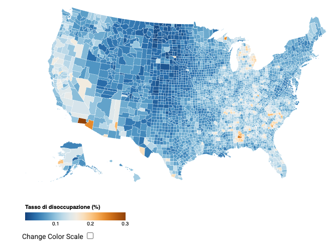

<!--  -->

<!-- _class: cover -->
<!-- _paginate: skip -->

  <h1>11 • Visual Storytelling</h1>
  <h2>Data Visualization and Visual Analytics</h2>
  <!-- 
A subtitle
 -->

  

    
teacher

    
Salvatore Rinzivillo

    
Daniele Fadda

     
    
tutor

    
Eleonora Cappuccio

  

  

    <strong>University of Pisa</strong> 
    Department of Computer Science 
    Course: Data Visualization & Visual Analytics 
    Academic Year: 2025    
  

---

# Why is Interaction Important?

- A single static picture is insufficient for understanding complex subjects
- Analyst needs to see different aspects and perspectives of data
- Interaction allows users to:
  - Select data components and subsets for viewing
  - Select and tune visualization techniques
  - Transform views and transform data
  - Perform analytical operations

---

# Types of Interaction with Visualizations

1. Changing data representation
2. Focusing and getting details
3. Data transformation
4. Data selection and filtering
5. Finding corresponding information in multiple views

<!-- These five categories represent the main ways users interact with visualizations. Each serves different analytical purposes and enables different types of insights. -->

---

<!-- _class: chapter -->
<!-- _paginate: skip -->

# 1. Interaction for Changing Data Representation

<!-- This section focuses on how users can change how data is represented visually -->

---

# Changing Visual Representation

- Allows viewing same data from different perspectives
- Supports different analytical tasks
- Examples:
  - From time plot to 2D time chart (linear vs. cyclic time)
  - From bar graph to pie chart (comparison vs. part-to-whole)
  - From position-based encoding to color-based encoding

<!-- Changing visual representation helps users see data from different task-specific perspectives. Different visualizations reveal different patterns and relationships in the data. -->

---

# Example: Different Time Perspectives

**Linear time view**
- Shows complete timeline
- Reveals overall trends
- Good for long-term patterns

**Cyclic time view**
- Shows monthly/yearly cycles
- Reveals seasonal patterns
- Good for periodic analysis

<!-- These examples show how the same data can be represented differently - as a continuous timeline or as a cyclical pattern - revealing different aspects of temporal data. -->

---

# Display Modification Operations

- Change display size and aspect ratio
- Adjust scales and color schemes
- Modify class intervals
- Change other visualization parameters
- Switch between different chart types

<!-- These operations help adjust visual representations to better suit properties of the data, display medium capabilities, and specific analysis tasks. -->

---

<!-- _class: chapter -->
<!-- _paginate: skip -->

# 2. Interaction for Focusing and Getting Details

<!-- This section covers interaction techniques that allow users to focus on specific data and reveal more detailed information -->

---

# Accessing Exact Data Values

- Standard tooltip functionality
- Popup windows activated by pointing/hovering
- Can include:
  - Data values
  - Additional contextual information
  - References
  - Calculation details
  - Sub-visualizations

  

  

  

  
  

  

  

<!-- Access to exact values is a fundamental interaction feature that bridges the gap between visual representation and precise numeric information. -->

---

# Zooming and Panning

- Enlarge contiguous parts of the display
- Increase visual resolution of selected data
- Types:
  - Geometric zoom (simple magnification)
  - Semantic zoom (shows more detail at higher zoom levels)
  - Focus+context techniques (distortion-based approaches)

<!-- Zooming and panning allow users to navigate large datasets by focusing on areas of interest while maintaining awareness of the overall context. -->

---

# Example: Zooming and Panning

---

# Color Re-scaling

**Techniques:**
- Focus full color scale on a selected range
- Visual comparison with reference value
- Convert sequential to diverging scale
- Discretization (class intervals)

**Applications:**
- Increase discrimination in specific value ranges
- Highlight deviations from reference
- Emphasize important thresholds
- Simplify complex continuous distributions

  

  

  

  
  

  

<!-- Color re-scaling techniques help users better perceive and analyze value differences in specific ranges or in relation to reference values. -->

---

# Reordering

- Applied to matrices, tables, and charts
- Reveals relationships between attributes
- Examples:
  - Sorting table rows/columns
  - Reordering parallel coordinates axes
  - Arranging scatterplot matrix components
  - Ordering segments in pie charts

  

  

  

  
  

  

  

<!-- Reordering helps reveal patterns and relationships by arranging visual elements in ways that highlight similarities, differences, or trends. -->

---

<!-- _class: chapter -->
<!-- _paginate: skip -->

# 3. Interaction  for Data Transformation

<!-- This section discusses how interaction enables users to transform the underlying data to gain different analytical perspectives -->

---

# Motives for Data Transformation

- Get clearer view of data
- Simplify display or data
- Reduce data amount
- Disregard excessive details
- Facilitate abstraction
- Normalize data for comparison

  

  

  

  
  

  

  

<!-- Data transformation operations enable users to adjust data to better suit their analytical needs and reveal patterns that might otherwise be obscured. -->

---

# Types of Data Transformation

- **Discretization**
  - Convert continuous to categorical
  - Create class intervals

- **Logarithmic transformation**
  - Handle skewed distributions
  - Compare across orders of magnitude

- **Aggregation**
  - Group by categories, time, location
  - Calculate statistical summaries

- **Attribute integration**
  - Merge related attributes
  - Calculate combined indicators

- **Smoothing**
  - Decrease small fluctuations
  - Reveal general trends

- **Change calculation**
  - Differences, ratios
  - Deviations from references

<!-- Various data transformation techniques serve different analytical purposes and help reveal different aspects of the data. -->

---

# Time Series Transformations

- **Smoothing methods:**
  - Simple moving average
  - Exponential smoothing (higher weights to recent values)
  - Double exponential (for trend patterns)
  - Triple exponential (for periodic series)

- **Change calculations:**
  - Differences to previous values
  - Ratios to previous values
  - Comparisons to same period in previous cycle

<!-- These specialized transformation techniques help analyze temporal patterns by highlighting trends and changes that might otherwise be difficult to perceive. -->

---

<!-- _class: chapter -->
<!-- _paginate: skip -->

# 4. Interaction for Data Selection and Filtering

<!-- This section covers techniques for selecting and filtering data to focus on relevant subsets -->

---

# Selection and Filtering

- **Selection:** Taking a portion of data to visualize it
- **Filtering:** Temporarily removing data of lesser interest

- Both require specifying properties of data interest
- Both enable detailed exploration of particular portions of data

  

  

  

  
  

  

  
<!-- Selection and filtering are fundamental interaction techniques that help users focus on relevant data subsets while reducing complexity. -->

---

# Selection/Filtering Criteria

- **Attribute-based filter**
  - Select based on attribute values
  - Often uses sliders or range selectors

- **Temporal filter**
  - Position along timeline
  - Position in temporal cycle

- **Spatial filter**
  - Location on map or in space
  - Often uses drawing tools

- **Entity-based filter**
  - References to particular entities
  - Often uses search or lists

- **Relationship filter**
  - Connections to other data
  - Often uses network navigation

<!-- Multiple criteria can be used to select or filter data, allowing users to define precisely which data subset they want to focus on. -->

---

# Highlighting vs. Filtering

**Highlighting:**
- Data subset visually distinguished
- Remaining data still visible
- Shows selected items in context
- Enables pattern comparison

**Filtering:**
- Only shows data meeting criteria
- Removes other data from view
- Provides clearer view of subset
- Reduces visual complexity

<!-- Highlighting and filtering serve different analytical purposes: highlighting emphasizes selected data while maintaining context, while filtering focuses exclusively on the selected subset. -->

---

# Brushing

- Interactive technique for selecting/highlighting data
- Typically done by dragging mouse over display area
- Can also be done by clicking on visual marks
- Multiple highlighting modes:
  - Single item highlighting
  - Multiple selection highlighting
  - Temporary vs. persistent highlighting

  

<!-- Brushing is a common interaction technique that allows users to select and highlight data items directly through the visualization interface. -->

---

<!-- _class: chapter -->
<!-- _paginate: skip -->

# 5. Relating Multiple Views

<!-- This section discusses techniques for coordinating multiple views to provide complementary perspectives -->

---

# Coordinated Multiple Views (CMV)

- Used when data components can't be effectively shown in a single display
- Allows looking at same data from different perspectives
- Coordinated views support finding corresponding information across displays
- Essential for complex data analysis

  

  

  

  
  

  

  

<!-- Coordinated multiple views allow users to see different aspects or representations of the same data simultaneously, with interactions in one view affecting others. -->

---

# Coordination Mechanisms

**Brushing and Linking:**
- Selection in one view highlights corresponding items in others
- Visual connection between related data across displays
- Supports identifying relationships

**Filtering:**
- Selection in one view filters data in all views
- Provides consistent focus across perspectives

**Common Symbolization:**
- Visual properties propagated between views
- E.g., colors, shapes, sizes
- Maintains consistent visual encoding

**Conditioning:**
- Creating multiple instances showing different data subsets
- Based on selections/categories from another view

<!-- These coordination mechanisms enable users to maintain connections between different visual representations of the same data. -->

---

# Example: Color Propagation

- Colors assigned to data in one view are applied to same data in other views
- Applications examples:
  - From choropleth map to scatterplot
  - From scatterplot to scatterplot
  - From map to histogram

  

  

  

  
  

  

  
<!-- Color propagation is a common technique for visual linking between different views, allowing users to track the same data items across multiple visualizations. -->

---

# Controlling Coordination

- Not all coordination is always desirable
- Too many linked changes can be:
  - Distracting
  - Resource-intensive
  - Overwhelming
- Systems may allow users to control:
  - Which displays are linked
  - What types of links exist
  - When coordination happens

<!-- User control over coordination is important for managing complexity and maintaining focus in multi-view analytical environments. -->

---

<!-- _class: chapter -->
<!-- _paginate: skip -->

# Limitations of Interaction

<!-- This section discusses drawbacks and limitations of interactive visualization -->

---

# Limitations and Disadvantages

- **Cognitive and time costs:**
  - Requires learning interactions
  - Diverts attention to UI operations
  - Consumes analyst time

- **Lack of systematic approach:**
  - Hard to ensure comprehensive analysis
  - May rely too much on serendipity
  - Difficult to track explored elements

- **Performance issues:**
  - Slow updates with large datasets
  - Lag reduces analytical flow
  - Computational demands

- **Limited traceability:**
  - Difficult to record analysis process
  - Challenges in reproducing findings
  - Harder to explain to others

<!-- While interaction provides many benefits, it also has costs and limitations that should be considered when designing visualizations and analytical workflows. -->

---

# Balancing Interaction and Computation

- Interaction consumes the analyst's time (valuable resource)
- Use should be well justified
- When possible, replace interaction with computation:
  - Automatic pattern detection
  - Pre-computed alternatives
  - Proactive preparation of likely views
  - Guided analytical pathways

<!-- The most effective approaches often combine interactive visualization with computational methods to minimize routine interactions while preserving exploratory freedom. -->

---

# Best Practices for Interactive Visualization

- Design for specific analytical tasks
- Minimize necessary interactions
- Maintain consistency in interaction patterns
- Provide visual feedback for interactions
- Support undo/redo and history
- Document the analytical process
- Balance flexibility with guidance

<!-- These best practices help maximize the benefits of interaction while minimizing its costs and limitations. -->

---

<!-- _class: all-image -->

<h1>Thank You!</h1>

<!-- This concludes our exploration of interaction techniques for visualization. These techniques, when properly implemented, can significantly enhance the analytical power of visualizations. -->
