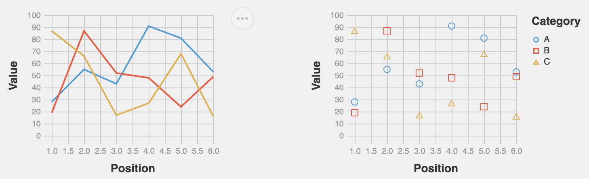

<!-- _class: cover -->
<!-- _paginate: skip -->

<div>
  <h1>12 •  Custom Altair Charts</h1>
  <h2>Data Visualization and Visual Analytics</h2>
  <!-- <div class="subtitle">A subtitle</div> -->

  <div class="authors">
    <div class="author-label">teacher</div>
    <div class="author-name">Salvatore Rinzivillo</div>
    <div class="author-name">Daniele Fadda</div>
    <br>
    <div class="author-label">tutor</div>
    <div class="author-name">Eleonora Cappuccio</div>
  </div>

  <div class="university">
    <strong>University of Pisa</strong><br>
    Department of Computer Science<br>
    Course: Data Visualization & Visual Analytics<br>
    Academic Year: 2025    
  </div>

</div>


<div class="cover-image">

</div>


<!-- This section introduces the concept of Tile Map Servers, which are essential for efficient delivery of geographic data for visualization -->

---

# Altair Customization

## Multiple levels of customization

- Top-level configuration (affects all charts - used to set attributes for current theme)
- Global configuration (affects the general Chart() object)
- Local configuration (affects each mark inside chart)
- Encoding (element-specific attributes binded to data)


---

# Customization Approaches in Altair
<br>
<br>
<div class="columns-2">
<div>

**1. Top-Level Configuration**
  - Affects all charts in the session
  - Set via `alt.config`
<br>

**3. Local Configuration**
  - Applied to specific chart instance
  - Set via `the mark_*` method

</div>
<div>

**2. Global Configuration**
  - Applied to main chart object
  - Set via `chart.configure_*()` methods
<br>

**4. Encoding Properties**
  - Applied to specific visual elements
  - Set within `encode()` method
  - Most specific level of control
  

</div>

<div>


</div>
</div>

<!-- Altair provides three distinct approaches to customization, each with different scopes and use cases. Global configs apply to all charts, local configs to specific charts, and encodings to specific visual elements. -->

---

<!-- _class: chapter -->
<!-- _paginate: skip -->

# Top Level Configuration

<!-- Global configuration allows you to set default properties for all charts in your session, providing a consistent visual language across multiple visualizations. -->

---
<!-- footer: '' -->
<!-- _paginate: false -->

# Top-level Configuration
<div class="columns-2">
<div>

- Applied to all subsequently created charts
- Set using `alt.config`
- Useful for establishing consistent styling across multiple charts
- Can be overridden by local configuration or encoding

</div>
<div>

```python
import altair as alt

# Set global configuration
alt.config.title = {
    'fontSize': 20,
    'font': 'Helvetica',
    'anchor': 'start',
    'color': '#3a3a3a'
}
```

```python
# All subsequent charts will use this 
chart1 = alt.Chart(data).mark_bar().encode(...)
chart2 = alt.Chart(data).mark_line().encode(...)
```
</div>
</div>

<!-- Global configuration is useful when creating dashboards or reports with multiple charts that should share the same visual style. It reduces repetitive code and ensures consistency. -->

---
<!-- footer: '' -->
<!-- _paginate: false -->
# Common Top-level configuration Options

<div class="columns-2">

<div>

- **View**: sizes, padding, background
```python
alt.config.view = {
    'strokeWidth': 0,
    'height': 300,
    'width': 400
}
```

- **Axis**: grid, ticks, labels
```python
alt.config.axis = {
    'gridColor': '#efefef',
    'labelFont': 'Helvetica',
    'titleFont': 'Helvetica'
}
```

</div>

<div>

- **Legend**: positioning, styling
```python
alt.config.legend = {
    'orient': 'bottom',
    'titleFontSize': 14
}
```

- **Mark**: default colors, styles
```python
alt.config.mark = {
    'filled': True,
    'color': 'steelblue'
}
```

</div>

</div>

<!-- Global configuration can be applied to various components of the visualization, from view properties to axis styling, legends, and default mark properties. This allows for comprehensive control over the default appearance of all charts. -->

---

<!-- _class: chapter -->
<!-- _paginate: skip -->

# Global Configuration

<!-- Local configuration provides chart-specific styling, allowing customization of individual visualizations without affecting others. -->

---
<!-- _paginate: false -->
# Global Configuration

- Applied to a specific chart instance
- Uses chainable `configure_*()` methods
- Overrides top-level configuration
- More specific control than global settings

```python
chart = alt.Chart(data).mark_bar().encode(
    x='category:N',
    y='value:Q'
).configure_axis(
    grid=False,
    labelAngle=45
).configure_view(
    strokeWidth=0
)
```

<!-- Local configuration allows for customizing individual charts without affecting others. This is useful when you need specific charts to stand out or have unique styling requirements within a collection of visualizations. -->

---
<!-- footer: '' -->
# Common Global Configuration Methods

<div class="columns-2">

<div>

**`configure_view()`**
 - Chart dimensions, borders

**`configure_axis()`**
  - Formatting for all axes

**`configure_axisX()`** 
**`configure_axisY()`**
  - Specific axis formatting

**`configure_legend()`**
  - Legend appearance and position

</div>

<div>

**`configure_title()`**
  - Chart title styling

**`configure_mark()`**
  - Default mark properties

**`configure_range()`**
  - Color schemes, scales

**`configure_scale()`**
  - Scale behaviors

</div>

</div>

<!-- Altair provides numerous configuration methods for different chart components. Each method targets specific visual elements, allowing for granular control over the chart's appearance. -->

---
<!-- paginate: false -->

# View Configuration

- Controls the overall chart container
- Affects padding, dimensions, background
- Applied with `configure_view()`

```python
chart = alt.Chart(data).mark_line().encode(
    x='date:T',
    y='value:Q'
).configure_view(
    strokeWidth=0,  # Remove border
    fill='#f9f9f9',  # Background color
    height=300,
    width=500,
    cornerRadius=5,  # Rounded corners
    clip=True  # Clip marks at view boundary)


```


<!-- View configuration allows you to control the visual container of your chart, including its borders, background, and dimensions. This is useful for integrating charts into different UI contexts or achieving specific design effects. -->

---


<!-- _paginate: false -->
<!-- footer: '' -->

# Example: Global Configuration

```python
chart = alt.Chart(source).mark_circle(size=60).encode(
  ...
).properties(
    title='Horsepower vs. Fuel Efficiency'
).configure_title(
    fontSize=20,
    font='Helvetica',
    anchor='start',
    color='#3a3a3a'
).configure_axis(
    labelFontSize=12,
    titleFontSize=14,
    grid=True,
    gridColor='#eeeeee'
).configure_legend(
    orient='bottom',
    titleFontSize=14
)


```

<!-- This example demonstrates how multiple configuration methods can be chained together to fully customize a chart. Each method targets a specific component, creating a cohesive and well-styled visualization. -->

---

<!-- _class: chapter -->
<!-- _paginate: skip -->

# Local Properties

<!-- Local properties provide the most specific level of customization, allowing for detailed control over individual visual elements. -->

---
<!-- footer: 'Customization in Altair <mark>DVVA<mark>' -->
<!-- _paginate: false -->

# Local Properties

- Applied to specific visual elements
- Set within the `mark_*` method
- Overrides both top and global configurations

The **mark** property is what specifies how exactly those attributes should be represented on the plot.


```python
chart = alt.Chart(data).mark_bar(
    color='steelblue',
    size=20,
    opacity=0.8
).encode(
    x='category:N',
    y='value:Q'
)
```

---

| Mark | Method | Description |
|------|--------|-------------|
| Arc | `mark_arc()` | A pie chart. |
| Area | `mark_area()` | A filled area plot. |
| Bar | `mark_bar()` | A bar plot. |
| Circle | `mark_circle()` | A scatter plot with filled circles. |
| Geoshape | `mark_geoshape()` | Visualization containing spatial data |
| Image | `mark_image()` | A scatter plot with image markers. |
| Line | `mark_line()` | A line plot. |
| Point | `mark_point()` | A scatter plot with configurable point shapes. |
| Rect | `mark_rect()` | A filled rectangle, used for heatmaps |

---

| Mark | Method | Description |
|------|--------|-------------|
| Rule | `mark_rule()` | A vertical or horizontal line spanning the axis. |
| Square | `mark_square()` | A scatter plot with filled squares. |
| Text | `mark_text()` | A scatter plot with points represented by text. |
| Tick | `mark_tick()` | A vertical or horizontal tick mark. |
| Trail | `mark_trail()` | A line plot with a trail effect. |
| Boxplot | `mark_boxplot()` | A box plot. |
| Errorband | `mark_errorband()` | A band representing uncertainty. |
| Errorbar | `mark_errorbar()` | A line with error bars. |

<br>

Properties for primitive mark types, like position, color, and stroke are listed in the [documentation](https://altair-viz.github.io/user_guide/marks/index.html)


---
<!-- _class: chapter -->
<!-- _paginate: skip -->

# Encoding Properties

<!-- Encoding properties provide the most specific level of customization, allowing for detailed control over  visual elements encoded by data -->

---
<!-- footer: 'Customization in Altair <mark>DVVA<mark>' -->

# Encoding Properties

- Most specific level of customization
- Applied to individual visual channels (x, y, color, etc.)
- Set within the `encode()` method
- Overrides both global and local configurations

```python
chart = alt.Chart(data).mark_bar().encode(
    x=alt.X('category:N', axis=alt.Axis(labelAngle=45, grid=False)),
    y=alt.Y('value:Q', scale=alt.Scale(domain=[0, 100])),
    color=alt.Color('group:N', legend=alt.Legend(orient='bottom'))
)
```

<!-- Encoding properties provide the most granular control, allowing you to customize specific visual channels independently. This is useful for emphasizing particular aspects of the data or accommodating specific data properties. -->

---
<!-- footer: '' -->
<!-- _paginate: false -->

# Common Encoding Properties

<div class="columns-2">

<div>

- **Axis customization**
```python
x=alt.X('date:T', 
        axis=alt.Axis(
            format='%b %Y',
            labelAngle=45,
            title='Date'))
```

- **Scale definition**
```python
y=alt.Y('temperature:Q',scale=alt.Scale(
            domain=[-10, 40],
            type='linear'))

```

</div>

<div>

- **Legend configuration**
```python
color=alt.Color('category:N',
                legend=alt.Legend(
                    orient='bottom',
                    title='Categories'))
```

- **Title and format**
```python
size=alt.Size('population:Q',
              title='Population',
              legend=alt.Legend(
                  format=',.0f'))
```

</div>

</div>

<!-- Encoding properties allow for detailed customization of specific channels like position, color, size, and shape. Each channel can have its own axis, scale, and legend properties, providing precise control over how data is visually represented. -->

---
<!-- _paginate: false -->
# Which Approach to Use?

<div class="columns-2">

<div>

### Use Top Level config when:
- Creating dashboards with consistent styling
- Setting company-wide standards
- Establishing default behaviors

### Use Global config when:
- Customizing all charts in a session
- Setting default properties for all charts
- Setting styling for layered charts 

</div>

<div>

### Use Local config when:
- Customizing a specific chart
- Overriding global settings for a single visualization

### Use Encoding when:
- Customizing specific data dimensions
- Different axes need different settings
- Making targeted adjustments to visual elements
- Working with specific data properties
</div>

</div>
<br>

**N.B.** Combine approaches as needed. Most specific settings take precedence over more general ones.

<!-- Choosing the right approach depends on your specific needs. Global configs are best for consistency across charts, local configs for individual charts, and encodings for specific visual elements. A combination of approaches is often the most effective strategy. -->

---

<!-- _class: chapter -->
<!-- _paginate: skip -->

# Chart Themes

<!-- Themes provide a quick way to apply consistent styling across visualizations, offering predefined configurations for different design needs. -->

---

# Chart Themes in Altair - Top Level Configuration

- Predefined sets of style configurations
- Apply with `alt.themes.enable('theme_name')`
- Built-in themes:
  - `'default'` - Default Vega-Lite style
  - `'dark'` - Dark background with light text
  - `'latimes'` - LA Times visualization style
  - `'fivethirtyeight'` - FiveThirtyEight style
  - `'vox'` - Vox publication style
  - `'urbaninstitute'` - Urban Institute style

```python
alt.themes.enable('dark')  # Enable dark theme for all subsequent charts
```

<!-- Themes in Altair offer a quick way to apply consistent, professionally designed styles to your visualizations. They're useful for matching your charts to specific publication styles or creating visually cohesive dashboards. -->

---
<!-- footer: '' -->
<!-- _paginate: false -->
# Creating Custom Themes

```python
def my_custom_theme():
    return {
        'config': {
            'view': {
                'height': 300,
                'width': 400,
                'strokeWidth': 0,
            },
            'title': {
                'font': 'Helvetica',
                'fontSize': 18,
                'anchor': 'start',
                'color': '#3a3a3a'
            },
            'axis': {
                'gridColor': '#efefef',
                'labelFont': 'Helvetica',
                'labelFontSize': 12,
                'titleFont': 'Helvetica',
                'titleFontSize': 14,
                'titlePadding': 10
            },
            'range': {
                'category': ['#1f77b4', '#ff7f0e', '#2ca02c', '#d62728', '#9467bd']
            }
        }
    }

# Register and enable the theme
alt.themes.register('my_theme', my_custom_theme)
alt.themes.enable('my_theme')
```

<!-- Custom themes allow you to define your own set of styling rules, which can incorporate your organization's brand guidelines or personal preferences. Once registered, they can be easily applied to all your visualizations. -->

---
<!-- _paginate: false -->
# Theme Examples

**Fivethirtyeight theme**



**Urbaninstitute theme**


<!-- Different themes can dramatically change the appearance of the same visualization, affecting everything from colors to fonts and grid lines. Choosing the right theme can enhance the readability and impact of your data visualization. -->

---

# Saving and Exporting Charts


<div class="columns-2">
<div>

```python
# Save as HTML (interactive)
chart.save('visualization.html')
```

```python
# Save as PNG (static)
chart.save('visualization.png')
```

```python
# With specific settings
chart.save(
  'custom.png',
   scale_factor=2.0 #resolution
   )  

```
</div>
<div>

```python
# Save as SVG (vector)
chart.save('visualization.svg')
```

```python
# Save as JSON (Vega-Lite specification)
chart.save('specification.json')
```

Multiple export formats available. 
Save locally or embed in documents

</div>
<div>
</div>

<!-- Altair provides flexible options for saving and sharing your visualizations, whether you need interactive web versions, publication-quality images, or editable vector graphics. Different formats serve different purposes, from web embedding to print publication. -->

---

# Practical Example: Complete Customization

```python
# Enable a theme
alt.themes.enable('fivethirtyeight')
# Load data
source = data.stocks()
# Create and customize chart
chart = alt.Chart(source).mark_line().encode(
    x=alt.X('date:T', axis=alt.Axis(format='%Y', title='Year')),
    y=alt.Y('price:Q', axis=alt.Axis(title='Stock Price')),
    color=alt.Color('symbol:N', legend=alt.Legend(title='Company'))
).properties(
    width=600,
    height=400,
    title='Stock Prices Over Time'
).configure_view(
    strokeWidth=0
).configure_axis(
    grid=True,
    gridColor='#dedede'
).configure_legend(
    orient='bottom'
).configure_title(
    fontSize=20,
    anchor='start'
)

```

<!-- This comprehensive example demonstrates how to combine themes, properties, and configurations to create a fully customized visualization. It shows the power of Altair's layered customization approach, from theme selection to specific encoding properties. -->

---

<!-- _class: all-image -->

<h1>Thank You!</h1>


<!-- This presentation covered the various approaches to customizing visualizations in Altair, from global configurations to specific encodings, along with themes and export options. These tools provide powerful ways to create effective, visually appealing data visualizations. -->
