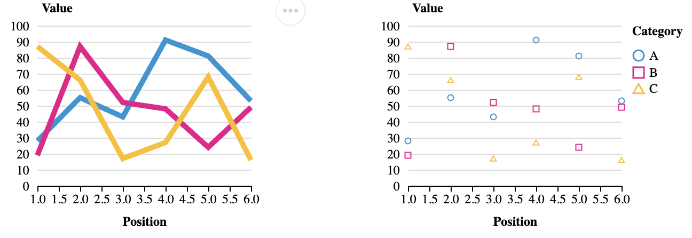

<!-- _class: cover -->
<!-- _paginate: skip -->

<div>
  <h1>12 •  Custom Altair Charts</h1>
  <h2>Data Visualization and Visual Analytics</h2>
  <!-- <div class="subtitle">A subtitle</div> -->

  <div class="authors">
    <div class="author-label">teacher</div>
    <div class="author-name">Salvatore Rinzivillo</div>
    <div class="author-name">Daniele Fadda</div>
    <br>
    <div class="author-label">tutor</div>
    <div class="author-name">Eleonora Cappuccio</div>
  </div>

  <div class="university">
    <strong>University of Pisa</strong><br>
    Department of Computer Science<br>
    Course: Data Visualization & Visual Analytics<br>
    Academic Year: 2025    
  </div>

</div>


<div class="cover-image">

</div>


<!-- This lecture introduces Altair's customization capabilities, covering its hierarchical approach to visualization styling. Altair is a declarative statistical visualization library for Python built on Vega-Lite, offering multiple levels of control from global themes to data-specific encodings. -->

---

# Altair Customization

## Multiple levels of customization

- Top-level configuration (affects all charts - used to set attributes for current theme)
- Global configuration (affects the general Chart() object)
- Local configuration (affects each mark inside chart)
- Encoding (element-specific attributes binded to data)

<!-- Altair implements a hierarchical customization system with four distinct levels, from broadest to most specific scope. This layered approach allows for both consistent styling across multiple visualizations and precise control over individual visual elements, with more specific settings overriding more general ones when conflicts occur. -->

---

# Customization Approaches in Altair
<br>
<br>
<div class="columns-2">
<div>

**1. Top-Level Configuration**
  - Affects all charts in the session
  - Set via `alt.config`
<br>

**3. Local Configuration**
  - Applied to specific chart instance
  - Set via `the mark_*` method

</div>
<div>

**2. Global Configuration**
  - Applied to main chart object
  - Set via `chart.configure_*()` methods
<br>

**4. Encoding Properties**
  - Applied to specific visual elements
  - Set within `encode()` method
  - Most specific level of control
  

</div>

<div>


</div>
</div>

<!-- The customization hierarchy in Altair follows a principle of increasing specificity: top-level configurations establish session-wide defaults, global configurations customize entire chart objects, local configurations affect specific marks like bars or points, and encoding properties bind visual attributes directly to data fields. Understanding this hierarchy is key to efficiently styling visualizations. -->

---

<!-- _class: chapter -->
<!-- _paginate: skip -->

# Top Level Configuration

<!-- Top-level configuration provides the broadest scope of customization in Altair, affecting all charts created within the current session. This approach is particularly valuable for maintaining visual consistency across dashboards or reports with multiple visualizations. -->

---
<!-- footer: '' -->
<!-- _paginate: false -->

# Top-level Configuration
<div class="columns-2">
<div>

- Applied to all subsequently created charts
- Set using `alt.config`
- Useful for establishing consistent styling across multiple charts
- Can be overridden by local configuration or encoding

</div>
<div>

```python
import altair as alt

# Set global configuration
alt.config.title = {
    'fontSize': 20,
    'font': 'Helvetica',
    'anchor': 'start',
    'color': '#3a3a3a'
}
```

```python
# All subsequent charts will use this 
chart1 = alt.Chart(data).mark_bar().encode(...)
chart2 = alt.Chart(data).mark_line().encode(...)
```
</div>
</div>

<!-- Top-level configuration modifies the alt.config object to establish default styles for all charts created afterward in the session. This approach is ideal for implementing brand guidelines or ensuring visual consistency across a collection of visualizations. While these settings serve as defaults, they can be overridden by more specific configurations when needed. -->

---
<!-- footer: '' -->
<!-- _paginate: false -->
# Common Top-level configuration Options

<div class="columns-2">

<div>

- **View**: sizes, padding, background
```python
alt.config.view = {
    'strokeWidth': 0,
    'height': 300,
    'width': 400
}
```

- **Axis**: grid, ticks, labels
```python
alt.config.axis = {
    'gridColor': '#efefef',
    'labelFont': 'Helvetica',
    'titleFont': 'Helvetica'
}
```

</div>

<div>

- **Legend**: positioning, styling
```python
alt.config.legend = {
    'orient': 'bottom',
    'titleFontSize': 14
}
```

- **Mark**: default colors, styles
```python
alt.config.mark = {
    'filled': True,
    'color': 'steelblue'
}
```

</div>

</div>

<!-- The alt.config object provides comprehensive control over all aspects of chart appearance. From view dimensions and backgrounds to axis styling, legends, and default mark properties, top-level configuration establishes a consistent foundation for all visualizations. This approach minimizes repetitive styling code while maintaining visual cohesion across multiple charts. -->

---

<!-- _class: chapter -->
<!-- _paginate: skip -->

# Global Configuration

<!-- Global configuration narrows the customization scope to specific chart instances. Using chainable configure_*() methods, this level allows you to override top-level settings for individual charts, creating distinct visual treatments while maintaining the overall design system. -->

---
<!-- _paginate: false -->
# Global Configuration

- Applied to a specific chart instance
- Uses chainable `configure_*()` methods
- Overrides top-level configuration
- More specific control than global settings

```python
chart = alt.Chart(data).mark_bar().encode(
    x='category:N',
    y='value:Q'
).configure_axis(
    grid=False,
    labelAngle=45
).configure_view(
    strokeWidth=0
)
```

<!-- Global configuration applies specifically to a chart instance through chainable configure_*() methods. This level lets you override top-level defaults for individual charts, making them stand out within a collection or adapting them to specific data characteristics. The methods can be chained together to create comprehensive chart-specific styling. -->

---
<!-- footer: '' -->
# Common Global Configuration Methods

<div class="columns-2">

<div>

**`configure_view()`**
 - Chart dimensions, borders

**`configure_axis()`**
  - Formatting for all axes

**`configure_axisX()`** 
**`configure_axisY()`**
  - Specific axis formatting

**`configure_legend()`**
  - Legend appearance and position

</div>

<div>

**`configure_title()`**
  - Chart title styling

**`configure_mark()`**
  - Default mark properties

**`configure_range()`**
  - Color schemes, scales

**`configure_scale()`**
  - Scale behaviors

</div>

</div>

<!-- Altair provides a rich set of global configuration methods for customizing every aspect of a chart. Each method focuses on a specific chart component, from the overall view to axes, legends, titles, and marks. These methods give you fine-grained control over the chart's appearance while keeping the code clean and readable through method chaining. -->

---
<!-- paginate: false -->

# View Configuration

- Controls the overall chart container
- Affects padding, dimensions, background
- Applied with `configure_view()`

```python
chart = alt.Chart(data).mark_line().encode(
    x='date:T',
    y='value:Q'
).configure_view(
    strokeWidth=0,  # Remove border
    fill='#f9f9f9',  # Background color
    height=300,
    width=500,
    cornerRadius=5,  # Rounded corners
    clip=True  # Clip marks at view boundary)


```


<!-- The configure_view() method controls the chart's container appearance, including borders, background color, dimensions, and other visual properties. This method is particularly important for integrating charts into applications or dashboards, as it determines how the chart fits within its surrounding context. Properties like cornerRadius and strokeWidth add subtle design refinements. -->

---


<!-- _paginate: false -->
<!-- footer: '' -->

# Example: Global Configuration

```python
chart = alt.Chart(source).mark_circle(size=60).encode(
  ...
).properties(
    title='Horsepower vs. Fuel Efficiency'
).configure_title(
    fontSize=20,
    font='Helvetica',
    anchor='start',
    color='#3a3a3a'
).configure_axis(
    labelFontSize=12,
    titleFontSize=14,
    grid=True,
    gridColor='#eeeeee'
).configure_legend(
    orient='bottom',
    titleFontSize=14
)


```

<!-- This example demonstrates the power of combining multiple global configuration methods to create a cohesive and professional chart design. By chaining methods for title, axis, and legend styling, you can create a comprehensive visual treatment that enhances data communication while maintaining a clean, elegant appearance. The method chaining syntax keeps the code readable despite complex customization. -->

---

<!-- _class: chapter -->
<!-- _paginate: skip -->

# Local Properties

<!-- Local properties focus on customizing specific marks within a chart, such as bars, points, or lines. These settings allow you to control the appearance of visual elements independently of the data they represent, providing an intermediate level of specificity between global chart settings and data-driven encodings. -->

---
<!-- footer: 'Customization in Altair <mark>DVVA<mark>' -->
<!-- _paginate: false -->

# Local Properties

- Applied to specific visual elements
- Set within the `mark_*` method
- Overrides both top and global configurations

The **mark** property is what specifies how exactly those attributes should be represented on the plot.


```python
chart = alt.Chart(data).mark_bar(
    color='steelblue',
    size=20,
    opacity=0.8
).encode(
    x='category:N',
    y='value:Q'
)
```

<!-- Local properties apply to specific mark types through the mark_*() methods, controlling the appearance of the visual elements independent of the data they represent. These properties override both top-level and global configurations, providing an intermediate level of customization. The mark type determines how data points are visually encoded (bars, lines, points), while mark properties control their visual attributes. -->

---

| Mark | Method | Description |
|------|--------|-------------|
| Arc | `mark_arc()` | A pie chart. |
| Area | `mark_area()` | A filled area plot. |
| Bar | `mark_bar()` | A bar plot. |
| Circle | `mark_circle()` | A scatter plot with filled circles. |
| Geoshape | `mark_geoshape()` | Visualization containing spatial data |
| Image | `mark_image()` | A scatter plot with image markers. |
| Line | `mark_line()` | A line plot. |
| Point | `mark_point()` | A scatter plot with configurable point shapes. |
| Rect | `mark_rect()` | A filled rectangle, used for heatmaps |

<!-- Altair provides a diverse set of mark types for visualizing different data relationships. Each mark type is optimized for specific data patterns: bars for comparisons across categories, lines for trends over time, points for examining relationships between variables, and specialized marks like geoshapes for spatial data. The choice of mark type is fundamental to effective data visualization. -->

---

| Mark | Method | Description |
|------|--------|-------------|
| Rule | `mark_rule()` | A vertical or horizontal line spanning the axis. |
| Square | `mark_square()` | A scatter plot with filled squares. |
| Text | `mark_text()` | A scatter plot with points represented by text. |
| Tick | `mark_tick()` | A vertical or horizontal tick mark. |
| Trail | `mark_trail()` | A line plot with a trail effect. |
| Boxplot | `mark_boxplot()` | A box plot. |
| Errorband | `mark_errorband()` | A band representing uncertainty. |
| Errorbar | `mark_errorbar()` | A line with error bars. |

<br>

Properties for primitive mark types, like position, color, and stroke are listed in the [documentation](https://altair-viz.github.io/user_guide/marks/index.html)

<!-- Beyond the basic mark types, Altair offers specialized marks for specific analytical needs: rules for reference lines, text for adding labels, and composite marks like boxplots and errorbars for statistical summaries. Each mark type supports specific properties that control its appearance, from colors and sizes to strokes and opacities. The comprehensive documentation provides the full list of available properties for each mark type. -->

---
<!-- _class: chapter -->
<!-- _paginate: skip -->

# Encoding Properties

<!-- Encoding properties represent the most specific level of customization in Altair, binding visual attributes directly to data fields. This approach provides the finest control over how data values are mapped to visual properties, allowing for data-driven styling that adapts to the underlying information. -->

---
<!-- footer: 'Customization in Altair <mark>DVVA<mark>' -->

# Encoding Properties

- Most specific level of customization
- Applied to individual visual channels (x, y, color, etc.)
- Set within the `encode()` method
- Overrides both global and local configurations

```python
chart = alt.Chart(data).mark_bar().encode(
    x=alt.X('category:N', axis=alt.Axis(labelAngle=45, grid=False)),
    y=alt.Y('value:Q', scale=alt.Scale(domain=[0, 100])),
    color=alt.Color('group:N', legend=alt.Legend(orient='bottom'))
)
```

<!-- Encoding properties provide the most granular level of customization by binding visual attributes directly to data fields. This approach enables data-driven styling that adapts to the underlying information. By using the encode() method with specific channel objects like alt.X or alt.Color, you can precisely control how each data dimension is visually represented, including its axis, scale, and legend properties. -->

---
<!-- footer: '' -->
<!-- _paginate: false -->

# Common Encoding Properties

<div class="columns-2">

<div>

- **Axis customization**
```python
x=alt.X('date:T', 
        axis=alt.Axis(
            format='%b %Y',
            labelAngle=45,
            title='Date'))
```

- **Scale definition**
```python
y=alt.Y('temperature:Q',scale=alt.Scale(
            domain=[-10, 40],
            type='linear'))

```

</div>

<div>

- **Legend configuration**
```python
color=alt.Color('category:N',
                legend=alt.Legend(
                    orient='bottom',
                    title='Categories'))
```

- **Title and format**
```python
size=alt.Size('population:Q',
              title='Population',
              legend=alt.Legend(
                  format=',.0f'))
```

</div>

</div>

<!-- Each encoding channel in Altair (position, color, size, etc.) can be customized with its own properties. Axis customization controls how axis labels and gridlines appear, scale definitions determine how data values map to visual properties, and legend configurations control the appearance and position of legends. These specific settings allow for precise control over how each data dimension is represented visually. -->

---
<!-- _paginate: false -->
# Which Approach to Use?

<div class="columns-2">

<div>

### Use Top Level config when:
- Creating dashboards with consistent styling
- Setting company-wide standards
- Establishing default behaviors

### Use Global config when:
- Customizing all charts in a session
- Setting default properties for all charts
- Setting styling for layered charts 

</div>

<div>

### Use Local config when:
- Customizing a specific chart
- Overriding global settings for a single visualization

### Use Encoding when:
- Customizing specific data dimensions
- Different axes need different settings
- Making targeted adjustments to visual elements
- Working with specific data properties
</div>

</div>
<br>

**N.B.** Combine approaches as needed. Most specific settings take precedence over more general ones.

<!-- Choosing the right customization approach depends on your specific needs and the scope of your visualization project. Top-level settings are ideal for establishing consistent defaults, global configurations for customizing specific charts, local properties for targeting mark types, and encodings for data-specific styling. The layered nature of Altair's customization system allows you to combine approaches effectively, with more specific settings overriding more general ones when conflicts occur. -->

---

<!-- _class: chapter -->
<!-- _paginate: skip -->

# Chart Themes

<!-- Chart themes provide predefined style configurations that can be applied across all visualizations in a session. They offer a quick way to achieve a consistent visual identity, whether following established publication styles or implementing custom brand guidelines. -->

---

# Chart Themes in Altair - Top Level Configuration

- Predefined sets of style configurations
- Apply with `alt.themes.enable('theme_name')`
- Built-in themes:
  - `'default'` - Default Vega-Lite style
  - `'dark'` - Dark background with light text
  - `'latimes'` - LA Times visualization style
  - `'fivethirtyeight'` - FiveThirtyEight style
  - `'vox'` - Vox publication style
  - `'urbaninstitute'` - Urban Institute style

```python
alt.themes.enable('dark')  # Enable dark theme for all subsequent charts
```

<!-- Themes in Altair provide a comprehensive way to apply predefined style configurations to all charts in a session. Built-in themes emulate the visual styles of well-known publications like FiveThirtyEight or the LA Times, offering professional-looking visualizations with minimal effort. Enabling a theme affects all subsequently created charts, establishing a consistent visual identity throughout your analysis or presentation. -->

---
<!-- footer: '' -->
<!-- _paginate: false -->
# Creating Custom Themes

```python
def my_custom_theme():
    return {
        'config': {
            'view': {
                'height': 300,
                'width': 400,
                'strokeWidth': 0,
            },
            'title': {
                'font': 'Helvetica',
                'fontSize': 18,
                'anchor': 'start',
                'color': '#3a3a3a'
            },
            'axis': {
                'gridColor': '#efefef',
                'labelFont': 'Helvetica',
                'labelFontSize': 12,
                'titleFont': 'Helvetica',
                'titleFontSize': 14,
                'titlePadding': 10
            },
            'range': {
                'category': ['#1f77b4', '#ff7f0e', '#2ca02c', '#d62728', '#9467bd']
            }
        }
    }

# Register and enable the theme
alt.themes.register('my_theme', my_custom_theme)
alt.themes.enable('my_theme')
```

<!-- Creating custom themes allows you to define comprehensive style configurations that match your organization's brand guidelines or personal preferences. The theme function returns a configuration object that sets defaults for all aspects of chart appearance, from view dimensions to typography, colors, and axis styling. Once registered, custom themes can be applied just like built-in themes, providing a consistent visual identity for all your visualizations. -->

---
<!-- _paginate: false -->
# Theme Examples

**Fivethirtyeight theme**


**Urbaninstitute theme**




<!-- Different themes dramatically transform the visual appearance of charts while maintaining the same underlying data representation. The FiveThirtyEight theme features a distinctive style with bold colors and minimal gridlines, optimized for clear data communication in digital media. The Urban Institute theme uses a more formal approach with a restrained color palette suitable for policy-oriented reports and presentations. -->

---

# Saving and Exporting Charts


<div class="columns-2">
<div>

```python
# Save as HTML (interactive)
chart.save('visualization.html')
```

```python
# Save as PNG (static)
chart.save('visualization.png')
```

```python
# With specific settings
chart.save(
  'custom.png',
   scale_factor=2.0 #resolution
   )  

```
</div>
<div>

```python
# Save as SVG (vector)
chart.save('visualization.svg')
```

```python
# Save as JSON (Vega-Lite specification)
chart.save('specification.json')
```

Multiple export formats available. 
Save locally or embed in documents

</div>
<div>
</div>

<!-- Altair provides flexible options for saving and sharing visualizations in various formats, each serving different purposes. HTML preserves interactivity for web embedding, PNG offers universal compatibility for presentations, SVG provides high-quality vector graphics for publications, and JSON exports the Vega-Lite specification for further customization or integration with other tools. Additional parameters like scale_factor can be used to fine-tune output quality. -->

---

# Practical Example: Complete Customization

```python
# Enable a theme
alt.themes.enable('fivethirtyeight')
# Load data
source = data.stocks()
# Create and customize chart
chart = alt.Chart(source).mark_line().encode(
    x=alt.X('date:T', axis=alt.Axis(format='%Y', title='Year')),
    y=alt.Y('price:Q', axis=alt.Axis(title='Stock Price')),
    color=alt.Color('symbol:N', legend=alt.Legend(title='Company'))
).properties(
    width=600,
    height=400,
    title='Stock Prices Over Time'
).configure_view(
    strokeWidth=0
).configure_axis(
    grid=True,
    gridColor='#dedede'
).configure_legend(
    orient='bottom'
).configure_title(
    fontSize=20,
    anchor='start'
)

```

<!-- This comprehensive example demonstrates how to combine multiple levels of customization for a polished visualization. It begins with a theme for baseline styling, uses encoding properties for data-specific customization of axes and colors, sets chart properties for dimensions and title, and applies global configurations for fine-tuning. This layered approach creates a professional-quality visualization that effectively communicates the data while maintaining visual appeal. -->

---

<!-- _class: all-image -->

<h1>Thank You!</h1>


<!-- This presentation covered Altair's hierarchical customization system, from top-level themes to data-specific encodings. Understanding these different levels of customization—and when to use each—enables you to create visually consistent, professional-quality visualizations that effectively communicate your data. By combining these approaches strategically, you can develop your own distinctive visualization style while maintaining the flexibility to adapt to specific data requirements. -->
