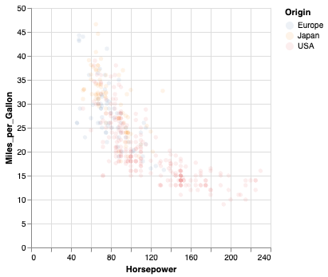
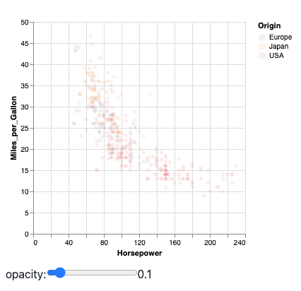
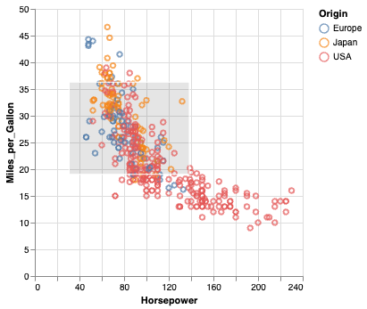
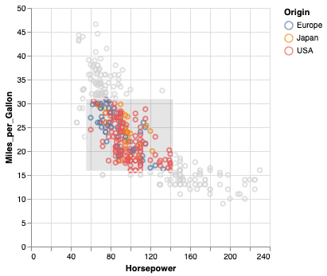
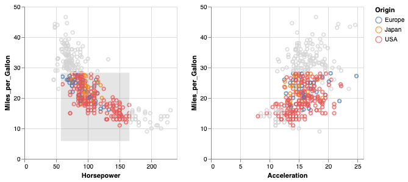
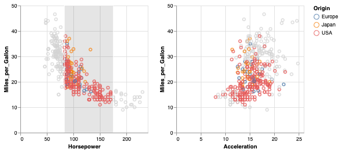
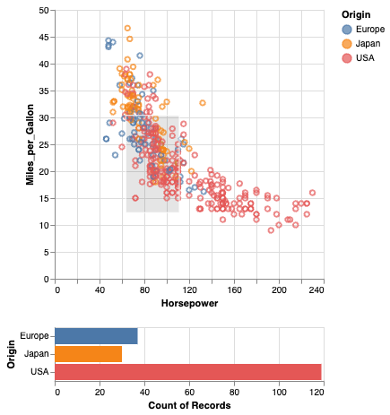
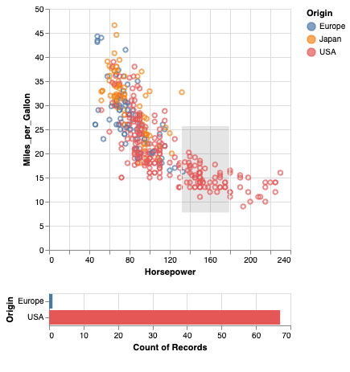

<!-- <script src="vega-loader.js"></script> -->
<script src="https://cdn.jsdelivr.net/npm/vega@5.30.0"></script>
<script src="https://cdn.jsdelivr.net/npm/vega-lite@5.21.0"></script>
<script src="https://cdn.jsdelivr.net/npm/vega-embed@6.26.0"></script>
<script src="https://cdn.jsdelivr.net/gh/koaning/justcharts/justcharts.js"></script>
<script src="js/vega-chart.js"></script>


<!-- _class: cover -->
<!-- _paginate: skip -->

<div>
  <h1>12 • Interactions<br> in Altair</h1>
  <h2>Data Visualization and Visual Analytics</h2>
  <!-- <div class="subtitle">A subtitle</div> -->

  <div class="authors">
    <div class="author-label">teacher</div>
    <div class="author-name">Salvatore Rinzivillo</div>
    <div class="author-name">Daniele Fadda</div>
    <br>
    <div class="author-label">tutor</div>
    <div class="author-name">Eleonora Cappuccio</div>
  </div>

  <div class="university">
    <strong>University of Pisa</strong><br>
    Department of Computer Science<br>
    Course: Data Visualization & Visual Analytics<br>
    Academic Year: 2025    
  </div>

</div>


<div class="cover-image">

</div>


---
# Interaction

Altair provides a declarative grammar for specifying interactive visualizations. Interaction is based on three key concepts:
- **Parameters** are the basic building blocks in the grammar of interaction. They can either be simple variables or more complex selections that map user input (e.g., mouse clicks and drags) to data queries.

- **Conditions and filters** can respond to changes in parameter values and update chart elements based on that input.

- **Widgets** and other **chart input elements** can bind to parameters so that charts can be manipulated via drop-down menus, radio buttons, sliders, legends, etc.    

<!--


-->

---

# Parameters - Variables

Variable parameters allow for a value to be defined once and then reused throughout the rest of the chart. This is useful for defining a value that is used in multiple places in the chart, such as a color or size.

<div class="columns-2">
<div>

```python
op_var = alt.param(value=0.1)

alt.Chart(cars).mark_circle(opacity=op_var).encode(
    x='Horsepower:Q',
    y='Miles_per_Gallon:Q',
    color='Origin:N'
).add_params(
    op_var
)
```
</div>
<div>

</div>
</div>

<!--
Variable parameters are created using the param() function. Here, we create a parameter with a default value of 0.1 using the value property:

In order to use this variable in the chart specification, we explicitly add it to the chart using the add_params() method, and we can then reference the variable within the chart specification. Here we set the opacity using our op_var parameter.


It’s reasonable to ask whether all this effort is necessary. Here is a more natural way to accomplish the same thing that avoids the use of both param() and add_params.

The benefit of using param() doesn’t become apparent until we incorporate an additional component. In the following example we use the bind property of the parameter, so that the parameter becomes bound to an input element. In this example, that input element is a slider widget.

-->

---
# Parameters - Widgets

Widgets are interactive elements that allow users to manipulate the chart. Widgets can be bound to parameters, so that the chart updates in response to user input.

<div class="columns-2">
<div>

```python
slider = alt.binding_range(min=0, max=1, step=0.05, name='opacity:')
op_var = alt.param(value=0.1, bind=slider)

alt.Chart(cars).mark_circle(opacity=op_var).encode(
    x='Horsepower:Q',
    y='Miles_per_Gallon:Q',
    color='Origin:N'
).add_params(
    op_var
)
```
</div>
<div>

</div>
</div>

<!--
Now we can dynamically change the opacity of the points in our chart using the slider. You will learn much more about binding parameters to input elements such as widgets in the section Bindings & Widgets.

-->

---

# Selection and Charts Interaction

Selection parameters define data queries that are driven by interactive manipulation of the chart by the user (e.g., via mouse clicks or drags). 

There are two types of selections: ```selection_interval()``` and ```selection_point()```.

<div class="columns-2">
<div>

```python
brush = alt.selection_interval()

alt.Chart(cars).mark_point().encode(
    x='Horsepower:Q',
    y='Miles_per_Gallon:Q',
    color='Origin:N'
).add_params(
    brush
)
```
</div>
<div>

</div>
</div>

<!--
Here we will create a simple chart and then add an selection interval to it. We could create a selection interval via param(select="interval"), but it is more convenient to use the shorter selection_interval.

Here is a simple scatter-plot created from the cars dataset:

First we’ll create an interval selection using the selection_interval() function (an interval selection is also referred to as a “brush”):

The result above is a chart that allows you to click and drag to create a selection region, and to move this region once the region is created.

So far this example is very similar to what we did in the variable example: we created a selection parameter using brush = alt.selection_interval(), and we attached that parameter to the chart using add_params. One difference is that here we have not defined how the chart should respond to the selection; you will learn this in the next section.
-->

---
# Conditions

Conditions are used to update the chart based on the value of a parameter. Conditions can be used to change the appearance of the chart, filter the data, or update the chart in other ways.

<div class="columns-2">
<div>

```python
conditional = alt.when(brush).then("Origin:N").otherwise(alt.value("lightgray"))

alt.Chart(cars).mark_point().encode(
    x="Horsepower:Q",
    y="Miles_per_Gallon:Q",
    color=conditional,
).add_params(
    brush
)
```
</div>
<div>

</div>
</div>

<!--
The example above is neat, but the selection interval doesn’t actually do anything yet. To make the chart respond to this selection, we need to reference brush within the chart specification. Here, we will use the when() function to create a conditional color encoding:

As you can see, the color of the points now changes depending on whether they are inside or outside the selection. Above we are using the selection parameter brush as a predicate (something that evaluates as True or False).

This is controlled by our definition conditional: if the brush is active, the color of the points is set to the Origin field; otherwise, it is set to lightgray.

Data points which fall within the selection evaluate as True, and data points which fall outside the selection evaluate to False. The "Origin:N" specifies how to color the points which fall within the selection, and the alt.value('lightgray') specifies that the outside points should be given a constant color value.

-->

---
# Linked Conditions (1)

Conditions can be linked together to create more complex interactions among charts. This allows for more sophisticated interactions between different parts of the visualization.




<!--
Conditional encodings become even more powerful when the selection behavior is tied across multiple views of the data within a compound chart. For example, here we create a Chart using the same code as above, and horizontally concatenate two versions of this chart: one with the x-encoding tied to "Horsepower", and one with the x-encoding tied to "Acceleration"

Because both copies of the chart reference the same selection object, the renderer ties the selections together across panels, leading to a dynamic display that helps you gain insight into the relationships within the dataset.
-->

---
# Linked Conditions (2)

```python
chart = alt.Chart(cars).mark_point().encode(
    x='Horsepower:Q',
    y='Miles_per_Gallon:Q',
    color=alt.when(brush).then("Origin:N").otherwise(alt.value("lightgray")),
).properties(
    width=250,
    height=250
).add_params(
    brush
)

chart | chart.encode(x='Acceleration:Q')
```

---
# Selection Types

Each selection type can be customized with additional properties to control its behavior. 

<div class="columns-2">
<div>

```python
brush = alt.selection_interval(encodings=['x'])

chart = alt.Chart(cars).mark_point().encode(
    x='Horsepower:Q',
    y='Miles_per_Gallon:Q',
    color=alt.when(brush).then("Origin:N").otherwise(alt.value("lightgray")),
).properties(
    width=250,
    height=250
).add_params(
    brush
)

chart | chart.encode(x='Acceleration:Q')
```
</div>
<div>

</div>
</div>


<!--
Each selection type has attributes through which its behavior can be customized; for example we might wish for our brush to be tied only to the "x" encoding to emphasize that feature in the data. We can modify the brush definition, and leave the rest of the code unchanged:


-->

---
<!-- _paginate: skip -->
# Filters

A selection parameter can be used to filter the data in the chart. This allows for interactive filtering of the data based on user input.

<div class="columns-2">
<div>

```python
brush = alt.selection_interval()

points = alt.Chart(cars).mark_point(
).encode(
    x='Horsepower:Q',
    y='Miles_per_Gallon:Q',
    color='Origin:N'
).add_params(
    brush
)

bars = alt.Chart(cars).mark_bar().encode(
    x='count()',
    y='Origin:N',
    color='Origin:N'
).transform_filter(
    brush
)

points & bars


```
</div>
<div>  


</div>
</div>


<!--
Using a selection parameter to filter data works in much the same way as using it within when(). For example, in transform_filter(brush), we are again using the selection parameter brush as a predicate. Data points which evaluate to True (i.e., data points which lie within the selection) are kept, and data points which evaluate to False are filtered out.

It is not possible to both select and filter in the same chart, so typically this functionality will be used when at least two sub-charts are present. In the following example, we attach the selection parameter to the upper chart, and then filter data in the lower chart based on the selection in the upper chart. You can explore how the counts change in the bar chart depending on the size and position of the selection in the scatter plot.
-->

---
# Takeaways

- **Data**: Altair uses tabular data as its basic data model. The data to be visualized is passed to the Chart object as a Pandas DataFrame.

- **Encodings and Marks**: The visual appearance of the data is specified using encodings and marks. Encodings map data fields to visual properties, such as position, color, size, and shape. Marks are the basic building blocks of a visualization, such as points, lines, bars, and areas.

- **Data Transformation**: Altair provides a number of methods for transforming the data before it is visualized. These methods can be used to filter, aggregate, and sort the data.

- **Interaction**: Altair provides a number of methods for adding interactivity to the visualization. These methods can be used to add tooltips, zooming, panning, and other interactive features to the visualization.
