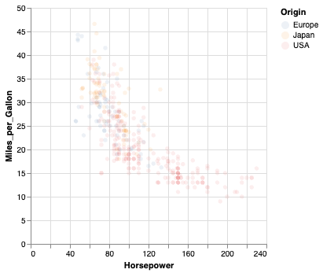
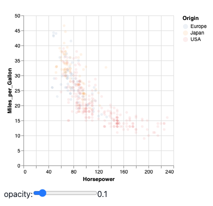
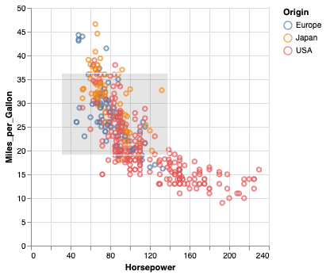
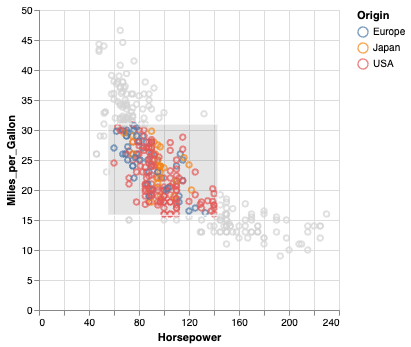
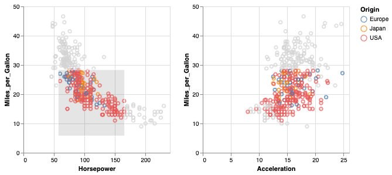
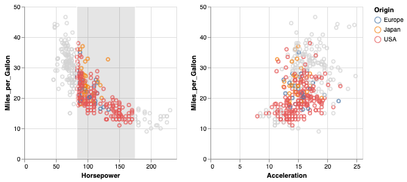
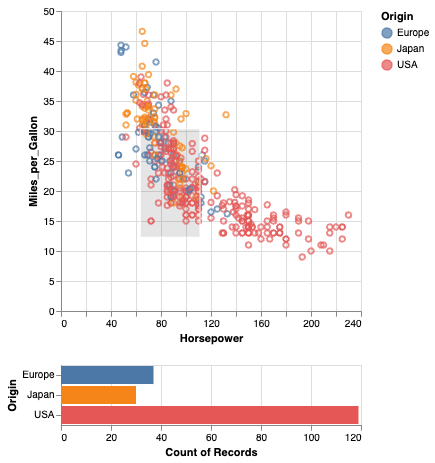
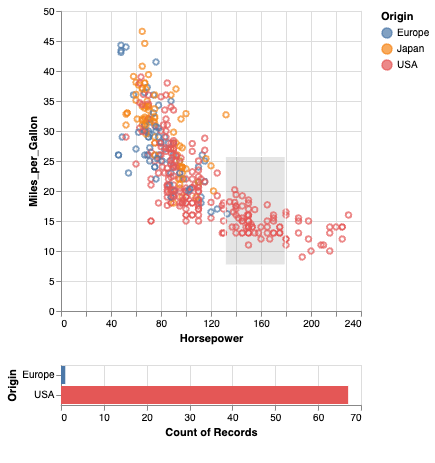

<!-- <script src="vega-loader.js"></script> -->
<script src="https://cdn.jsdelivr.net/npm/vega@5.30.0"></script>
<script src="https://cdn.jsdelivr.net/npm/vega-lite@5.21.0"></script>
<script src="https://cdn.jsdelivr.net/npm/vega-embed@6.26.0"></script>
<script src="https://cdn.jsdelivr.net/gh/koaning/justcharts/justcharts.js"></script>
<script src="js/vega-chart.js"></script>


<!-- _class: cover -->
<!-- _paginate: skip -->

<div>
  <h1>12 • Interactions<br> in Altair</h1>
  <h2>Data Visualization and Visual Analytics</h2>
  <!-- <div class="subtitle">A subtitle</div> -->

  <div class="authors">
    <div class="author-label">teacher</div>
    <div class="author-name">Salvatore Rinzivillo</div>
    <div class="author-name">Daniele Fadda</div>
    <br>
    <div class="author-label">tutor</div>
    <div class="author-name">Eleonora Cappuccio</div>
  </div>

  <div class="university">
    <strong>University of Pisa</strong><br>
    Department of Computer Science<br>
    Course: Data Visualization & Visual Analytics<br>
    Academic Year: {{ACADEMIC_YEAR}}    
  </div>

</div>


<div class="cover-image">

</div>

<!-- 

L'obiettivo di oggi è capire l'architettura logica e i concetti base per trasformare i nostri grafici statici in strumenti interattivi.
-->

---

# Interaction

Altair provides a declarative grammar for specifying interactive visualizations. Interaction is based on three key concepts:
- **Parameters** are the basic building blocks in the grammar of interaction. They can either be simple variables or more complex selections that map user input (e.g., mouse clicks and drags) to data queries.

- **Conditions and filters** can respond to changes in parameter values and update chart elements based on that input.

- **Widgets** and other **chart input elements** can bind to parameters so that charts can be manipulated via drop-down menus, radio buttons, sliders, legends, etc.    

<!--
Per gestire l'interazione, la grammatica di Altair si poggia su tre pilastri.

- Il primo è costituito dai PARAMETRI: pensateli come l'elemento di base per l'interattività. 
* Possono essere semplici variabili
* selezioni più complesse, guidate da eventi, che intercettano gli input dell'utente come i click o il trascinamento del mouse.

Il secondo pilastro riguarda le CONDIZIONI e i FILTRI: rappresentano la logica applicata. 
* Ci permettono di modificare le codifiche visive o di eseguire ulteriori operazioni sui dati in risposta ai cambiamenti di stato dei nostri parametri.

Infine abbiamo i WIDGET: componenti UI nativi.
* Possono essere slider o menu a tendina, che possiamo legare direttamente ai parametri per offrire all'utente un controllo esplicito sui valori, senza che debba interagire direttamente con il grafico.

-->

---

# Parameters - Variables

Variable parameters allow for a value to be defined once and then reused throughout the rest of the chart. This is useful for defining a value that is used in multiple places in the chart, such as a color or size.

<div class="columns-2">
<div>

```python
op_var = alt.param(value=0.1)

alt.Chart(cars).mark_circle(opacity=op_var).encode(
    x='Horsepower:Q',
    y='Miles_per_Gallon:Q',
    color='Origin:N'
).add_params(
    op_var
)
```
</div>
<div>

</div>
</div>

<!--

Partiamo dai parametri di tipo variabile. 

Nel blocco di codice potete notare come istanziamo una variabile usando alt.param(), fornendo in questo caso un valore di default di 0.1. 

Per far sì che il nostro chart riconosca questa variabile e la integri nella sua logica, dobbiamo fare un injection esplicitamente richiamando il metodo add_params() sull'oggetto chart. 
Quindi add_params(op_var) è ciò che collega la nostra variabile al chart.

A questo punto, possiamo usare la nostra op_var passandola come reference per un attributo visivo 
— qui stiamo definendo l'opacità dei mark. 

Questo approccio centralizza un valore e lo rende riutilizzabile, ma, cosa ancora più importante, prepara l'intero grafico per il data-binding dinamico.

-->

---
# Parameters - Widgets

Widgets are interactive elements that allow users to manipulate the chart. Widgets can be bound to parameters, so that the chart updates in response to user input.

<div class="columns-2">
<div>

```python
slider = alt.binding_range(min=0, max=1, step=0.05, name='opacity:')
op_var = alt.param(value=0.1, bind=slider)

alt.Chart(cars).mark_circle(opacity=op_var).encode(
    x='Horsepower:Q',
    y='Miles_per_Gallon:Q',
    color='Origin:N'
).add_params(
    op_var
)
```
</div>
<div>

</div>
</div>

<!--
Il vantaggio di usare param() diventa evidente solo quando introduciamo un componente aggiuntivo. 
Nell'esempio seguente usiamo la proprietà bind del parametro, così il parametro diventa collegato a un input element. In questo esempio, l'input element è uno slider widget.

Ed ecco dove questo setup mostra la sua utilità: il data-binding tra parametri e interfacce utente. 

Vogliamo associare il nostro parametro a un widget. 

Utilizzando alt.binding_range() andiamo a istanziare un classico slider HTML, definendo min, max e step. 

Il collegamento avviene assegnando questo slider all'argomento bind del nostro alt.param(). 

Il risultato in output è immediato: l'utente ora può modulare dinamicamente l'opacità dei punti sul grafico agendo sullo slider. 

Il tutto avviene in tempo reale, senza che l'engine debba ricalcolare l'intera specifica di rendering.

-->

---

# Selection and Charts Interaction

Selection parameters define data queries that are driven by interactive manipulation of the chart by the user (e.g., via mouse clicks or drags). 

There are two types of selections: ```selection_interval()``` and ```selection_point()```.

<div class="columns-2">
<div>

```python
brush = alt.selection_interval()

alt.Chart(cars).mark_point().encode(
    x='Horsepower:Q',
    y='Miles_per_Gallon:Q',
    color='Origin:N'
).add_params(
    brush
)
```
</div>
<div>

</div>
</div>

<!--
Passiamo ora a parametri più sofisticati: le selezioni spaziali guidate dagli eventi del mouse. 

In Altair, il metodo selection_interval() crea quello che in visual analytics chiamiamo brush, ovvero un'area rettangolare interattiva tracciabile sul grafico. 

Se avessimo bisogno di selezioni discrete, useremmo selection_point(). Se eseguite questo codice, noterete che potete già disegnare il rettangolo di selezione sul grafico. 

Lo stato interno sta registrando le coordinate, ma non ricevete alcun feedback visivo. 

Questo perché non abbiamo ancora definito una regola di mappatura: il grafico non sa ancora cosa 'fare' con questa selezione.

Qui creeremo un chart semplice e poi vi aggiungeremo una interval selection. Potremmo creare una interval selection tramite param(select="interval"), ma è più comodo usare la scorciatoia selection_interval.

-->

---
# Conditions

Conditions are used to update the chart based on the value of a parameter. Conditions can be used to change the appearance of the chart, filter the data, or update the chart in other ways.

<div class="columns-2">
<div>

```python
conditional = alt.when(brush).then("Origin:N").otherwise(alt.value("lightgray"))

alt.Chart(cars).mark_point().encode(
    x="Horsepower:Q",
    y="Miles_per_Gallon:Q",
    color=conditional,
).add_params(
    brush
)
```
</div>
<div>

</div>
</div>

<!--

Per attivare il feedback visivo, dobbiamo implementare un costrutto condizionale. Osservate la sintassi alt.when(brush).then(...).otherwise(...). Stiamo usando il parametro brush come un predicato booleano direttamente all'interno dell'encoding del colore.

Funziona così: i mark che, a livello di coordinate, ricadono all'interno dell'area del brush valutano True e acquisiscono la mappatura cromatica associata alla colonna Origin. 

I mark che restano fuori valutano False, cadono nel blocco otherwise e vengono forzati su un valore esadecimale statico, in questo caso un grigio chiaro. 

In questo modo otteniamo un feedback interattivo elegante e computazionalmente leggero.

-->

---
# Linked Conditions (1)

Conditions can be linked together to create more complex interactions among charts. This allows for more sophisticated interactions between different parts of the visualization.




<!--

Il vero potenziale analitico di queste selezioni si manifesta però quando lavoriamo con viste multiple, i cosiddetti Compound Charts. 

Condividendo la referenza dello stesso identico oggetto di selezione su più view concatenate, Altair si occupa automaticamente di instradare l'interazione. S

tiamo implementando la tecnica del brushing and linking: interagendo con un singolo grafico, l'evidenziazione e il filtraggio si propagano in modo sincrono sulle altre proiezioni dello stesso dataset. 

In scenari di produzione, questo è il pattern fondamentale per supportare la scoperta di correlazioni multivariate nei dati.

-->

---
# Linked Conditions (2)

```python
chart = alt.Chart(cars).mark_point().encode(
    x='Horsepower:Q',
    y='Miles_per_Gallon:Q',
    color=alt.when(brush).then("Origin:N").otherwise(alt.value("lightgray")),
).properties(
    width=250,
    height=250
).add_params(
    brush
)

chart | chart.encode(x='Acceleration:Q')
```

<!-- 
A livello sintattico, costruire viste coordinate è estremamente conciso. Prima istanziamo il nostro grafico base chart, che include già la definizione del brush e la relativa logica condizionale sul colore. 

Dopodiché, utilizziamo l'operatore pipe | per affiancare questo grafico originale a una sua variante. Generiamo la variante on-the-fly tramite il metodo encode, andando semplicemente a sovrascrivere l'asse X con la feature Acceleration. 

Poiché la seconda vista deriva dall'oggetto base, eredita la referenza al parametro: il linking dell'interazione avviene gratis, garantendo assoluta coerenza tra i layer visivi.

-->

---
# Selection Types

Each selection type can be customized with additional properties to control its behavior. 

<div class="columns-2">
<div>

```python
brush = alt.selection_interval(encodings=['x'])

chart = alt.Chart(cars).mark_point().encode(
    x='Horsepower:Q',
    y='Miles_per_Gallon:Q',
    color=alt.when(brush).then("Origin:N").otherwise(alt.value("lightgray")),
).properties(
    width=250,
    height=250
).add_params(
    brush
)

chart | chart.encode(x='Acceleration:Q')
```
</div>
<div>

</div>
</div>


<!--
Spesso le nostre dashboard richiedono interazioni più specifiche, e Altair ci permette di vincolare il comportamento spaziale del brush. 

Aggiungendo encodings=['x'] alla definizione del nostro selection_interval, stiamo forzando l'engine a valutare solo l'asse orizzontale. 

Come vedete nell'esempio, il nostro selettore si trasforma in un vertical brush monodimensionale. Questa configurazione è un classico quando dobbiamo selezionare intervalli continui su serie storiche o quando vogliamo fare slicing su specifiche sezioni di una distribuzione univariata, ignorando le variazioni sull'asse Y.


-->

---
<!-- _paginate: skip -->
# Filters

A selection parameter can be used to filter the data in the chart. This allows for interactive filtering of the data based on user input.

<div class="columns-2">
<div>

```python
brush = alt.selection_interval()

points = alt.Chart(cars).mark_point(
).encode(
    x='Horsepower:Q',
    y='Miles_per_Gallon:Q',
    color='Origin:N'
).add_params(
    brush
)

bars = alt.Chart(cars).mark_bar().encode(
    x='count()',
    y='Origin:N',
    color='Origin:N'
).transform_filter(
    brush
)

points & bars


```
</div>
<div>  


</div>
</div>


<!--
Finora abbiamo usato l'interazione per modificare attributi visivi come il colore, ma le selezioni possono agire direttamente sulla pipeline di trasformazione dei dati, abilitando il cross-filtering.

Qui abbiamo uno scatter plot superiore che fa da controller e un bar chart inferiore che funge da vista aggregata. Guardate il blocco del bar chart: stiamo applicando il metodo transform_filter(brush). In questo modo la selezione agisce come operatore logico di filtraggio prima che avvenga l'aggregazione. 

I record fuori dal brush vengono esclusi dalla pipeline in tempo reale, innescando il ricalcolo istantaneo del conteggio count() nelle barre inferiori. È una pipeline complessa gestita con una manciata di righe di Python.
-->

---
# Takeaways

- **Data**: Altair uses tabular data as its basic data model. The data to be visualized is passed to the Chart object as a Pandas DataFrame.

- **Encodings and Marks**: The visual appearance of the data is specified using encodings and marks. Encodings map data fields to visual properties, such as position, color, size, and shape. Marks are the basic building blocks of a visualization, such as points, lines, bars, and areas.

- **Data Transformation**: Altair provides a number of methods for transforming the data before it is visualized. These methods can be used to filter, aggregate, and sort the data.

- **Interaction**: Altair provides a number of methods for adding interactivity to the visualization. These methods can be used to add tooltips, zooming, panning, and other interactive features to the visualization.


<!-- Per riassumere l'Interaction.

La grammatica di Parametri, Condizioni e Filtri ci fornisce un'astrazione di altissimo livello per produrre dashboard di visual analytics complesse, pronte per la produzione, delegando tutto il lavoro sporco sui trigger e sugli eventi javascript al motore sottostante.

 -->