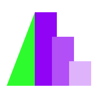
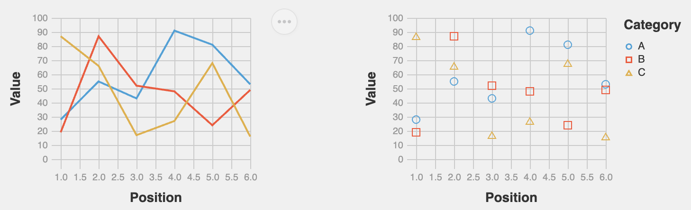
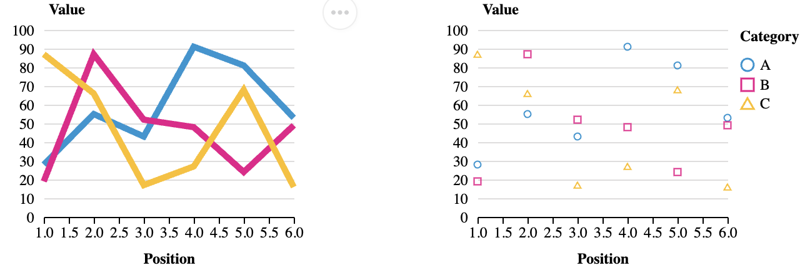

<!-- _class: cover -->
<!-- _paginate: skip -->

<div>
  <h1>13 •  Custom Altair Charts</h1>
  <h2>Data Visualization and Visual Analytics</h2>
  <!-- <div class="subtitle">A subtitle</div> -->

  <div class="authors">
    <div class="author-label">teacher</div>
    <div class="author-name">Salvatore Rinzivillo</div>
    <div class="author-name">Daniele Fadda</div>
    <br>
    <div class="author-label">tutor</div>
    <div class="author-name">Eleonora Cappuccio</div>
  </div>

  <div class="university">
    <strong>University of Pisa</strong><br>
    Department of Computer Science<br>
    Course: Data Visualization & Visual Analytics<br>
    Academic Year: {{ACADEMIC_YEAR}}    
  </div>

</div>


<div class="cover-image">



</div>


<!-- Questa lezione introduce le funzionalità di personalizzazione di Altair. Vorrei mostrarvi il suo approccio gerarchico allo styling delle visualizzazioni. 

Altair è una libreria Python dichiarativa per la visualizzazione statistica, che offre molteplici livelli di controllo: dai temi globali agli encoding specifici per i dati. -->

---

# Altair Customization

## Multiple levels of customization

- Top-level configuration (affects all charts - used to set attributes for current theme)
- Global configuration (affects the general Chart() object)
- Local configuration (affects each mark inside chart)
- Encoding (element-specific attributes binded to data)

<!-- La gerarchia di personalizzazione in Altair segue un principio di specificità crescente: 

- le configurazioni top-level stabiliscono i default a livello di sessione, 
- le configurazioni globali personalizzano interi oggetti chart, 
- le configurazioni locali influenzano mark specifici come barre o punti, 
- e le proprietà di encoding legano gli attributi visivi direttamente ai campi dati. 

Comprendere questa gerarchia è fondamentale per formattare e personalizzare le visualizzazioni in modo efficiente. -->

---

# Customization Approaches in Altair
<br>
<br>
<div class="columns-2">
<div>

**1. Top-Level Configuration**
  - Affects all charts in the session
  - Set via `alt.config`
<br>

**3. Local Configuration**
  - Applied to specific chart instance
  - Set via `the mark_*` method

</div>
<div>

**2. Global Configuration**
  - Applied to main chart object
  - Set via `chart.configure_*()` methods
<br>

**4. Encoding Properties**
  - Applied to specific visual elements
  - Set within `encode()` method
  - Most specific level of control
  

</div>

<div>


</div>
</div>

<!-- La configurazione top-level offre l'ambito di personalizzazione più ampio in Altair,

influenzano tutti i grafici creati all'interno della sessione corrente. 

Questo approccio è particolarmente utile per mantenere coerenza visiva su dashboard o report con molteplici visualizzazioni. -->

---

<!-- _class: chapter -->
<!-- _paginate: skip -->

# Top Level Configuration

<!-- La configurazione top-level offre l'ambito di personalizzazione più ampio in Altair, influenzando tutti i grafici creati all'interno della sessione corrente. 

Questo approccio è particolarmente utile per mantenere coerenza visiva su dashboard o report con molteplici visualizzazioni. -->

---
<!-- footer: '' -->
<!-- _paginate: false -->

# Top-level Configuration
<div class="columns-2">
<div>

- Applied to all subsequently created charts
- Set using `alt.config`
- Useful for establishing consistent styling across multiple charts
- Can be overridden by local configuration or encoding

</div>
<div>

```python
import altair as alt

# Set global configuration
alt.config.title = {
    'fontSize': 20,
    'font': 'Helvetica',
    'anchor': 'start',
    'color': '#3a3a3a'
}
```

```python
# All subsequent charts will use this 
chart1 = alt.Chart(data).mark_bar().encode(...)
chart2 = alt.Chart(data).mark_line().encode(...)
```
</div>
</div>

<!-- La configurazione top-level modifica l'oggetto alt.config per stabilire stili di default per tutti i grafici creati successivamente nella sessione. 

Questo approccio è ideale per implementare le linee guida di un brand o garantire coerenza visiva su una collezione di visualizzazioni. 

Sebbene queste impostazioni fungano da default, POSSONO ESSERE SOVRASCRITTE da configurazioni più specifiche quando necessario. -->


---
<!-- footer: '' -->
<!-- _paginate: false -->
# Common Top-level configuration Options

<div class="columns-2">

<div>

- **View**: sizes, padding, background
```python
alt.config.view = {
    'strokeWidth': 0,
    'height': 300,
    'width': 400
}
```

- **Axis**: grid, ticks, labels
```python
alt.config.axis = {
    'gridColor': '#efefef',
    'labelFont': 'Helvetica',
    'titleFont': 'Helvetica'
}
```

</div>

<div>

- **Legend**: positioning, styling
```python
alt.config.legend = {
    'orient': 'bottom',
    'titleFontSize': 14
}
```

- **Mark**: default colors, styles
```python
alt.config.mark = {
    'filled': True,
    'color': 'steelblue'
}
```

</div>

</div>

<!-- L'oggetto alt.config fornisce un controllo completo su tutti gli aspetti grafici.

Dalle dimensioni della vista e dagli sfondi, allo styling degli assi, alle legende e alle proprietà di default dei mark, la configurazione top-level stabilisce una base coerente per tutte le visualizzazioni. 

Questo approccio minimizza il codice di styling ripetitivo mantenendo coesione visiva su grafici multipli. -->


---

<!-- _class: chapter -->
<!-- _paginate: skip -->

# Global Configuration

<!-- La configurazione globale restringe l'ambito di personalizzazione a istanze specifiche del grafico. Utilizzando i metodi concatenabili configure_*(), questo livello permette di sovrascrivere le impostazioni top-level per i singoli grafici, creando trattamenti visivi distinti pur mantenendo l'integrità del design system complessivo. -->

<!-- Global configuration narrows the customization scope to specific chart instances. Using chainable configure_*() methods, this level allows you to override top-level settings for individual charts, creating distinct visual treatments while maintaining the overall design system. -->

---
<!-- _paginate: false -->
# Global Configuration

- Applied to a specific chart instance
- Uses chainable `configure_*()` methods
- Overrides top-level configuration
- More specific control than global settings

```python
chart = alt.Chart(data).mark_bar().encode(
    x='category:N',
    y='value:Q'
).configure_axis(
    grid=False,
    labelAngle=45
).configure_view(
    strokeWidth=0
)
```

<!-- La configurazione globale si applica specificamente a un'istanza del grafico tramite metodi configure_*() concatenabili. 

Questo livello permette di sovrascrivere i default top-level per grafici individuali, facendoli risaltare all'interno di una collezione o adattandoli a specifiche caratteristiche dei dati.

I metodi possono essere concatenati (method chaining) per creare un design completo e specifico per il grafico. -->


---
<!-- footer: '' -->
# Common Global Configuration Methods

<div class="columns-2">

<div>

**`configure_view()`**
 - Chart dimensions, borders

**`configure_axis()`**
  - Formatting for all axes

**`configure_axisX()`** 
**`configure_axisY()`**
  - Specific axis formatting

**`configure_legend()`**
  - Legend appearance and position

</div>

<div>

**`configure_title()`**
  - Chart title styling

**`configure_mark()`**
  - Default mark properties

**`configure_range()`**
  - Color schemes, scales

**`configure_scale()`**
  - Scale behaviors

</div>

</div>

<!-- Altair fornisce un ricco set di metodi di configurazione globale per personalizzare ogni aspetto di un grafico. 

Ogni metodo si concentra su uno specifico componente, dalla vista complessiva ad assi, legende, titoli e mark. 

Questi metodi offrono un controllo granulare sull'aspetto della visualizzazione mantenendo il codice pulito e leggibile. -->


---
<!-- paginate: false -->

# View Configuration

- Controls the overall chart container
- Affects padding, dimensions, background
- Applied with `configure_view()`

```python
chart = alt.Chart(data).mark_line().encode(
    x='date:T',
    y='value:Q'
).configure_view(
    strokeWidth=0,  # Remove border
    fill='#f9f9f9',  # Background color
    height=300,
    width=500,
    cornerRadius=5,  # Rounded corners
    clip=True  # Clip marks at view boundary)


```


<!-- Il metodo configure_view() controlla l'aspetto del contenitore del grafico. 

Sono inclusi bordi, colore di sfondo, dimensioni e altre proprietà visive. 

Questo metodo è particolarmente importante per integrare i grafici all'interno di applicazioni o dashboard, poiché determina come il grafico si inserisce nel contesto circostante. 

Proprietà come cornerRadius e strokeWidth aggiungono customizzazioni più fini ma globali. -->

---


<!-- _paginate: false -->
<!-- footer: '' -->

# Example: Global Configuration

```python
chart = alt.Chart(source).mark_circle(size=60).encode(
  ...
).properties(
    title='Horsepower vs. Fuel Efficiency'
).configure_title(
    fontSize=20,
    font='Helvetica',
    anchor='start',
    color='#3a3a3a'
).configure_axis(
    labelFontSize=12,
    titleFontSize=14,
    grid=True,
    gridColor='#eeeeee'
).configure_legend(
    orient='bottom',
    titleFontSize=14
)


```

<!-- Questo esempio dimostra la potenza della combinazione di molteplici metodi di configurazione globale per creare un design coeso e professionale. 

Concatenando i metodi per lo styling del titolo, degli assi e della legenda, è possibile creare un trattamento visivo completo che migliora la comunicazione dei dati mantenendo un aspetto coerente.

La sintassi del method chaining mantiene il codice leggibile nonostante la complessità della personalizzazione. -->

---

<!-- _class: chapter -->
<!-- _paginate: skip -->

# Local Properties

<!-- Le proprietà locali si concentrano sulla personalizzazione di mark specifici all'interno di un grafico, come barre, punti o linee. 

Queste impostazioni permettono di controllare l'aspetto degli elementi visivi in modo indipendente dai dati che rappresentano, fornendo un livello intermedio di specificità tra le impostazioni globali del grafico e gli encoding guidati dai dati. -->


---
<!-- footer: 'Customization in Altair <mark>DVVA<mark>' -->
<!-- _paginate: false -->

# Local Properties

- Applied to specific visual elements
- Set within the `mark_*` method
- Overrides both top and global configurations

The **mark** property is what specifies how exactly those attributes should be represented on the plot.


```python
chart = alt.Chart(data).mark_bar(
    color='steelblue',
    size=20,
    opacity=0.8
).encode(
    x='category:N',
    y='value:Q'
)
```

<!-- Le proprietà locali si applicano a tipi specifici di mark tramite i metodi mark_*(), controllando l'aspetto degli elementi visivi indipendentemente dai dati rappresentati. 

Queste proprietà sovrascrivono sia le configurazioni top-level che quelle globali, fornendo un livello di personalizzazione intermedio. 

Il tipo di mark determina come i data point vengono codificati visivamente (barre, linee, punti), mentre le proprietà del mark ne controllano gli attributi visivi. -->

---

| Mark | Method | Description |
|------|--------|-------------|
| Arc | `mark_arc()` | A pie chart. |
| Area | `mark_area()` | A filled area plot. |
| Bar | `mark_bar()` | A bar plot. |
| Circle | `mark_circle()` | A scatter plot with filled circles. |
| Geoshape | `mark_geoshape()` | Visualization containing spatial data |
| Image | `mark_image()` | A scatter plot with image markers. |
| Line | `mark_line()` | A line plot. |
| Point | `mark_point()` | A scatter plot with configurable point shapes. |
| Rect | `mark_rect()` | A filled rectangle, used for heatmaps |

<!-- Altair fornisce un set diversificato di tipi di mark per visualizzare diverse relazioni nei dati. 

Ogni tipo di mark è ottimizzato per pattern di dati specifici: barre per confronti tra categorie, linee per trend nel tempo, punti per esaminare relazioni tra variabili, e mark specializzati come i geoshape per i dati spaziali. 

Come abbiamo ormai visto, la scelta del tipo di mark è fondamentale per un'efficace visualizzazione dei dati. -->

---

| Mark | Method | Description |
|------|--------|-------------|
| Rule | `mark_rule()` | A vertical or horizontal line spanning the axis. |
| Square | `mark_square()` | A scatter plot with filled squares. |
| Text | `mark_text()` | A scatter plot with points represented by text. |
| Tick | `mark_tick()` | A vertical or horizontal tick mark. |
| Trail | `mark_trail()` | A line plot with a trail effect. |
| Boxplot | `mark_boxplot()` | A box plot. |
| Errorband | `mark_errorband()` | A band representing uncertainty. |
| Errorbar | `mark_errorbar()` | A line with error bars. |

<br>

Properties for primitive mark types, like position, color, and stroke are listed in the [documentation](https://altair-viz.github.io/user_guide/marks/index.html)

<!-- Oltre ai tipi di mark di base, Altair offre mark specializzati per specifiche esigenze analitiche: rule per linee di riferimento, text per aggiungere etichette e mark compositi come boxplot ed errorbar per sintesi statistiche. 

Ogni tipo di mark supporta proprietà specifiche che ne controllano l'aspetto, da colori e dimensioni a bordi e opacità. 

La documentazione completa fornisce la lista esauriente delle proprietà disponibili per ogni tipologia. -->

---
<!-- _class: chapter -->
<!-- _paginate: skip -->

# Encoding Properties

<!-- Le proprietà di encoding rappresentano il livello più specifico di personalizzazione in Altair, vincolando gli attributi visivi direttamente ai campi dati. 

Questo approccio fornisce il controllo più preciso su come i valori dei dati vengono mappati sulle proprietà visive, consentendo uno styling data-driven che si adatta alle informazioni sottostanti. -->

---
<!-- footer: 'Customization in Altair <mark>DVVA<mark>' -->

# Encoding Properties

- Most specific level of customization
- Applied to individual visual channels (x, y, color, etc.)
- Set within the `encode()` method
- Overrides both global and local configurations

```python
chart = alt.Chart(data).mark_bar().encode(
    x=alt.X('category:N', axis=alt.Axis(labelAngle=45, grid=False)),
    y=alt.Y('value:Q', scale=alt.Scale(domain=[0, 100])),
    color=alt.Color('group:N', legend=alt.Legend(orient='bottom'))
)
```

<!-- Le proprietà di encoding forniscono il livello più granulare di personalizzazione vincolando gli attributi visivi direttamente ai campi dati. 

Questo approccio abilita uno styling data-driven che si adatta all'informazione sottostante. 

Utilizzando il metodo encode() con oggetti channel specifici come alt.X o alt.Color, è possibile controllare con precisione come ogni dimensione del dato viene rappresentata visivamente, includendo le sue configurazioni per assi, scale e legende. -->


---
<!-- footer: '' -->
<!-- _paginate: false -->

# Common Encoding Properties

<div class="columns-2">

<div>

- **Axis customization**
```python
x=alt.X('date:T', 
        axis=alt.Axis(
            format='%b %Y',
            labelAngle=45,
            title='Date'))
```

- **Scale definition**
```python
y=alt.Y('temperature:Q',scale=alt.Scale(
            domain=[-10, 40],
            type='linear'))

```

</div>

<div>

- **Legend configuration**
```python
color=alt.Color('category:N',
                legend=alt.Legend(
                    orient='bottom',
                    title='Categories'))
```

- **Title and format**
```python
size=alt.Size('population:Q',
              title='Population',
              legend=alt.Legend(
                  format=',.0f'))
```

</div>

</div>

<!-- Ogni canale di encoding in Altair (posizione, colore, dimensione, ecc.) può essere personalizzato con le proprie proprietà. 

La personalizzazione degli assi controlla come appaiono le label e le linee della griglia, le definizioni delle scale determinano come i valori dei dati vengono mappati sulle proprietà visive, e le configurazioni della legenda controllano l'aspetto e la posizione delle legende stesse. 

Queste impostazioni specifiche permettono un controllo preciso su come ogni dimensione dei dati viene resa visivamente. -->

---
<!-- _paginate: false -->
# Which Approach to Use?

<div class="columns-2">

<div>

### Use Top Level config when:
- Creating dashboards with consistent styling
- Setting company-wide standards
- Establishing default behaviors

### Use Global config when:
- Customizing all charts in a session
- Setting default properties for all charts
- Setting styling for layered charts 

</div>

<div>

### Use Local config when:
- Customizing a specific chart
- Overriding global settings for a single visualization

### Use Encoding when:
- Customizing specific data dimensions
- Different axes need different settings
- Making targeted adjustments to visual elements
- Working with specific data properties
</div>

</div>
<br>

**N.B.** Combine approaches as needed. Most specific settings take precedence over more general ones.

<!-- Scegliere il giusto approccio di personalizzazione dipende dalle esigenze specifiche e dallo scope del progetto di visualizzazione. 

Le impostazioni top-level sono ideali per stabilire default coerenti, le configurazioni globali per personalizzare grafici specifici, le proprietà locali per targettizzare determinati mark, e gli encoding per uno styling specifico sui dati. 

La natura a livelli del sistema di personalizzazione di Altair permette di combinare gli approcci in modo efficace, 
con le impostazioni più specifiche che sovrascrivono quelle più generali in caso di conflitto. 

L'idea è mutuata dai principi di specificità del CSS, dove le regole più specifiche prevalgono su quelle più generali.
-->

---

<!-- _class: chapter -->
<!-- _paginate: skip -->

# Chart Themes

<!-- I chart themes forniscono configurazioni di stile predefinite applicabili a tutte le visualizzazioni in una sessione. 

Offrono un modo rapido per ottenere un'identità visiva coerente, sia che si seguano stili di pubblicazione consolidati, sia che si implementino linee guida customizzate per il brand. 

-->

---

# Chart Themes in Altair - Top Level Configuration

- Predefined sets of style configurations
- Apply with `alt.themes.enable('theme_name')`
- Built-in themes:
  - `'default'` - Default Vega-Lite style
  - `'dark'` - Dark background with light text
  - `'latimes'` - LA Times visualization style
  - `'fivethirtyeight'` - FiveThirtyEight style
  - `'vox'` - Vox publication style
  - `'urbaninstitute'` - Urban Institute style

```python
alt.themes.enable('dark')  # Enable dark theme for all subsequent charts
```

<!-- I temi in Altair offrono un approccio completo per applicare configurazioni di stile predefinite a tutti i grafici di una sessione. 

I temi built-in emulano gli stili visivi di testate note come FiveThirtyEight o LA Times, permettendo di ottenere visualizzazioni dall'aspetto professionale con il minimo sforzo. 

Abilitare un tema influenza tutti i grafici creati successivamente, stabilendo un'identità visiva coerente per l'intera analisi o presentazione. -->

---
<!-- footer: '' -->
<!-- _paginate: false -->
# Creating Custom Themes

```python
def my_custom_theme():
    return {
        'config': {
            'view': {
                'height': 300,
                'width': 400,
                'strokeWidth': 0,
            },
            'title': {
                'font': 'Helvetica',
                'fontSize': 18,
                'anchor': 'start',
                'color': '#3a3a3a'
            },
            'axis': {
                'gridColor': '#efefef',
                'labelFont': 'Helvetica',
                'labelFontSize': 12,
                'titleFont': 'Helvetica',
                'titleFontSize': 14,
                'titlePadding': 10
            },
            'range': {
                'category': ['#1f77b4', '#ff7f0e', '#2ca02c', '#d62728', '#9467bd']
            }
        }
    }

# Register and enable the theme
alt.themes.register('my_theme', my_custom_theme)
alt.themes.enable('my_theme')
```

<!-- La creazione di temi custom permette di definire configurazioni di stile complete e allineate alle linee guida del brand aziendale o alle preferenze personali.

La funzione del tema restituisce un oggetto di configurazione che stabilisce i default per tutti gli aspetti del grafico, dalle dimensioni della vista alla tipografia, ai colori e allo styling degli assi. 

Una volta registrati, i temi custom possono essere applicati come quelli built-in, garantendo un'identità visiva coerente per tutte le visualizzazioni. -->

---
<!-- _paginate: false -->
# Theme Examples

**Fivethirtyeight theme**



**Urbaninstitute theme**




<!-- Diversi temi trasformano radicalmente l'aspetto visivo dei grafici mantenendo invariata la rappresentazione dei dati sottostante. 

Il tema FiveThirtyEight presenta uno stile distintivo con colori netti e linee di griglia minime, ottimizzato per una chiara comunicazione dei dati sui media digitali. 

Il tema Urban Institute utilizza un approccio più formale con una palette di colori contenuta, adatta a report e presentazioni di natura istituzionale o orientate alle policy. -->

---

# Saving and Exporting Charts


<div class="columns-2">
<div>

```python
# Save as HTML (interactive)
chart.save('visualization.html')
```

```python
# Save as PNG (static)
chart.save('visualization.png')
```

```python
# With specific settings
chart.save(
  'custom.png',
   scale_factor=2.0 #resolution
   )  

```
</div>
<div>

```python
# Save as SVG (vector)
chart.save('visualization.svg')
```

```python
# Save as JSON (Vega-Lite specification)
chart.save('specification.json')
```

Multiple export formats available. 
Save locally or embed in documents

</div>
<div>
</div>

<!-- Altair fornisce opzioni flessibili per salvare e condividere visualizzazioni in vari formati, ciascuno con finalità diverse. HTML preserva l'interattività per l'embedding web, PNG offre compatibilità universale per le presentazioni, SVG fornisce grafica vettoriale di alta qualità per le pubblicazioni e JSON esporta le specifiche Vega-Lite per ulteriori personalizzazioni o integrazioni con altri tool. 

Parametri aggiuntivi come scale_factor possono essere utilizzati per scalare la risoluzione dell'output. -->

---

# Practical Example: Complete Customization

```python
# Enable a theme
alt.themes.enable('fivethirtyeight')
# Load data
source = data.stocks()
# Create and customize chart
chart = alt.Chart(source).mark_line().encode(
    x=alt.X('date:T', axis=alt.Axis(format='%Y', title='Year')),
    y=alt.Y('price:Q', axis=alt.Axis(title='Stock Price')),
    color=alt.Color('symbol:N', legend=alt.Legend(title='Company'))
).properties(
    width=600,
    height=400,
    title='Stock Prices Over Time'
).configure_view(
    strokeWidth=0
).configure_axis(
    grid=True,
    gridColor='#dedede'
).configure_legend(
    orient='bottom'
).configure_title(
    fontSize=20,
    anchor='start'
)

```

<!-- Questo esempio completo dimostra come combinare più livelli di personalizzazione per ottenere una visualizzazione molto personalizzata.

Inizia con un tema per lo styling di base, utilizza le proprietà di encoding per la personalizzazione data-driven degli assi e dei colori, imposta le proprietà del grafico per dimensioni e titolo, e applica le configurazioni globali per il fine-tuning. 

Questo approccio stratificato crea una visualizzazione di qualità professionale che comunica efficacemente i dati mantenendo l'appeal visivo. -->

---

<!-- _class: all-image -->

<h1>Thank You!</h1>


<!-- Questa presentazione ha trattato il sistema gerarchico di personalizzazione di Altair, dai temi top-level agli encoding basati sui dati. 

Comprendere questi diversi livelli di personalizzazione e quando utilizzare ciascuno—consente di creare visualizzazioni visivamente coerenti e di qualità professionale per comunicare efficacemente i dati. 

Combinando questi approcci in modo strategico, è possibile sviluppare un proprio design system distintivo per le visualizzazioni, mantenendo la flessibilità per adattarsi ai requisiti specifici di ogni dataset. -->